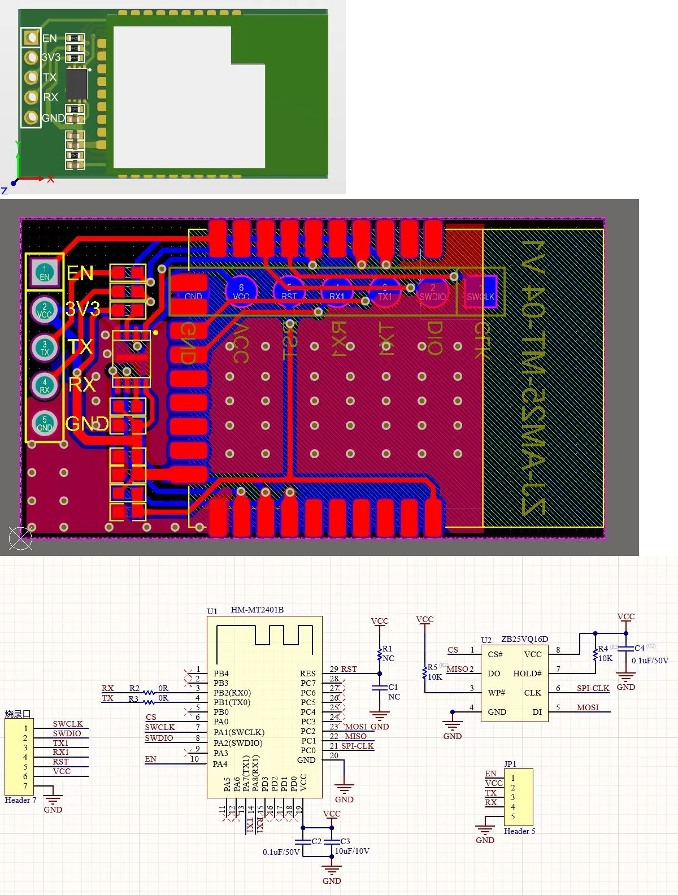
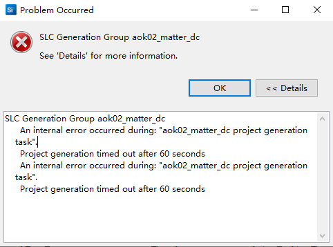

[hrf](hrf.md)  
[vcom-log](./files/aok/vcom-log.md)  
[aok-ota](./files/aok/aok-ota.md)  
[aok-ac](./files/aok/aok-ac.md)  
[aok-ryl](./files/aok/aok-ryl.md)  
[side-channel](./files/aok/side-channel.md)  

# FW Release
## File Signature
```c
cd aok02_matter_dc
python3 gen_ota.py
```
## FW version
```c
.\config\sl_matter_config.h
#define CHIP_DEVICE_CONFIG_DEVICE_SOFTWARE_VERSION 17
#define CHIP_DEVICE_CONFIG_DEVICE_SOFTWARE_VERSION_STRING "0.1.7"
.\config\app_properties_config.h
#define SL_APPLICATION_VERSION                 17
```
## Product Type
```c
static ble_product_type_t _ble_dev_type = kBLEProduct_A;
typedef enum
{
    kBLEProduct_A = 0, /* Product A-OK */
    kBLEProduct_P = 1, /* Product Pergolux */
} ble_product_type_t;
```

# HW
<div align="center">
  
</div>

# Serial Port
```c
//VCom,PA7-TX,PA8-RX
Baudrate:961200
//Custom,PB1-TX,PB2-RX
Baudrate:9600
```

# Code
## Matter
```c
// aok02_matter_dc
$ git clone git@hoperf-matter:matter/customerproject/aok02_matter_dc.git
$ cd aok02_matter_dc
//--------
//If use SDK24.12.2, checkout it
$ git checkout 54f2b4f9137f70b5a5d974ce01114024395ca290
//--------
$ git submodule init
$ git submodule update
```
### New branch
```c
$ git clone git@hoperf-matter:matter/customerproject/aok02_matter_dc.git
$ cd aok02_matter_dc
$ git branch feature-multi-adv-config 54f2b4f9137f70b5a5d974ce01114024395ca290
$ git checkout feature-multi-adv-config
$ git submodule init
$ git submodule update
```
### commit
```c
cd common
git add app/app_ble_mgr.cpp 
git commit -m "[BUG][BLE disconnect issue]ADV parameter optimize"
git push
```
```c
cd ..
git add config/sl_802154_radio_priority_config.h include/CHIPProjectConfig.h
git add common
git commit -m "[BUG][BLE disconnect issue]ADV parameter optimize"
git push
git push --set-upstream origin feature-multi-adv-config
```

## Bootloader
```c
// aok02_bootloader
$ git clone git@hoperf-matter:matter/customerproject/aok02_bootloader.git
```

## SDK Patch
```c
Administrator@USER-20251222OC MINGW64 /c/Si/SDKs/simplicity_sdk_v2025.6.2 (branch_tag)
$ grep -rin "AOK02_MATTER_PROJECT"
extension/matter_extension/third_party/matter_sdk/src/app/SpecificationDefinedRevisions.h:34:#if defined(AOK02_MATTER_PROJECT)
extension/matter_extension/third_party/matter_sdk/src/app/SpecificationDefinedRevisions.h:48:#if defined(AOK02_MATTER_PROJECT)
extension/matter_extension/third_party/matter_sdk/src/app/SpecificationDefinedRevisions.h:61:#if defined(AOK02_MATTER_PROJECT)
extension/matter_extension/third_party/matter_sdk/src/app/util/attribute-storage.cpp:82:#if defined(AOK02_MATTER_PROJECT)
extension/matter_extension/third_party/matter_sdk/src/app/util/attribute-storage.cpp:229:#if defined(AOK02_MATTER_PROJECT)
extension/matter_extension/third_party/matter_sdk/src/platform/silabs/efr32/BLEManagerImpl.cpp:65:#if defined(AOK02_MATTER_PROJECT)
extension/matter_extension/third_party/matter_sdk/src/platform/silabs/efr32/BLEManagerImpl.cpp:550:#if defined(AOK02_MATTER_PROJECT)
extension/matter_extension/third_party/matter_sdk/src/platform/silabs/efr32/BLEManagerImpl.cpp:564:#if defined(AOK02_MATTER_PROJECT)
extension/matter_extension/third_party/matter_sdk/src/platform/silabs/efr32/BLEManagerImpl.cpp:588:#if defined(AOK02_MATTER_PROJECT)
extension/matter_extension/third_party/matter_sdk/src/platform/silabs/efr32/BLEManagerImpl.cpp:704:#if defined(AOK02_MATTER_PROJECT)
extension/matter_extension/third_party/matter_sdk/src/platform/silabs/efr32/BLEManagerImpl.cpp:1333:#if defined(AOK02_MATTER_PROJECT)
extension/matter_extension/third_party/matter_sdk/src/platform/silabs/efr32/BLEManagerImpl.cpp:1340:#if defined(AOK02_MATTER_PROJECT)
extension/matter_extension/third_party/matter_sdk/src/platform/silabs/efr32/BLEManagerImpl.cpp:1368:#if defined(AOK02_MATTER_PROJECT)
extension/matter_extension/third_party/matter_sdk/src/platform/silabs/efr32/BLEManagerImpl.cpp:1409:#if defined(AOK02_MATTER_PROJECT)
extension/matter_extension/third_party/matter_sdk/src/platform/silabs/efr32/BLEManagerImpl.cpp:1416:#if defined(AOK02_MATTER_PROJECT)
extension/matter_extension/third_party/matter_sdk/src/platform/silabs/efr32/BLEManagerImpl.cpp:1422:#if defined(AOK02_MATTER_PROJECT)
extension/matter_extension/third_party/matter_sdk/src/platform/silabs/efr32/BLEManagerImpl.cpp:1458:#if defined(AOK02_MATTER_PROJECT)
```

# Matter BLE
| Service     | UUID                                 | characteristic  | UUID                                 |
| ----------- | ------------------------------------ | --------------- | ------------------------------------ |
| CHIPoBLE    | fff6                                 |                 |                                      |
|             |                                      | CHIPoBLEChar_Rx | 18EE2EF5-263D-4559-959F-4F9C429F9D11 |
|             |                                      | CHIPoBLEChar_Tx | 18EE2EF5-263D-4559-959F-4F9C429F9D12 |
|             |                                      | CHIPoBLEChar_C3 | 64630238-8772-45F2-B87D-748A83218F04 |
| AOK Service | 6e40ff01-b5a3-f393-e0a9-e50e24dcca9e |                 |                                      |
|             |                                      | app2host        | 6e40ff04-b5a3-f393-e0a9-e50e24dcca9e |
|             |                                      | remotectl_rx    | 8e8ed52f-bd01-49c2-90e4-c875387b6fa3 |
|             |                                      | remotectl_tx    | 7f6abf15-03ce-49bc-b751-59ccdd8706fb |
|             |                                      | host2app        | 6e40ff03-b5a3-f393-e0a9-e50e24dcca9e |

## MATTER-3840
```c
GenericAttribute
UUID: 00001801-0000-1000-8000-00805F9B34FB
GenericAccess
UUID: 00001800-0000-1000-8000-00805F9B34FB
Device Information
UUID: 0000180A-0000-1000-8000-00805F9B34FB
Unknown Service
UUID: 6E40FF01-B5A3-F393-E0A9-E50E24DCCA9E
Unknown Service
UUID: 0000FFF6-0000-1000-8000-00805F9B34FB
Battery Service
UUID: 0000180F-0000-1000-8000-00805F9B34FB
Unknown Service
UUID: 00000000-0000-1000-8000-C0FFEE000001
```

|Length	|AD Type	|Data|
| ----------- | ----------- | ----------- | 
|2	|Flags(0x01)	|0x06|
|11	|Service Data - 16-bit UUID(0x16)	|0xF6FF00000FF1FF108000|

|Length	|AD Type	|Data|
| ----------- | ----------- | ----------- | 
|3	|Complete List of 16-bit Service Class UUIDs(0x03)	|0xF6FF|
|12	|Complete Local Name(0x09)	|0x4D41545445522D33383430(MATTER-3840)|


## roller RC
```c
GenericAttribute
UUID: 00001801-0000-1000-8000-00805F9B34FB
GenericAccess
UUID: 00001800-0000-1000-8000-00805F9B34FB
Device Information
UUID: 0000180A-0000-1000-8000-00805F9B34FB
Unknown Service
UUID: 6E40FF01-B5A3-F393-E0A9-E50E24DCCA9E
Unknown Service
UUID: 0000FFF6-0000-1000-8000-00805F9B34FB
Battery Service
UUID: 0000180F-0000-1000-8000-00805F9B34FB
Unknown Service
UUID: 00000000-0000-1000-8000-C0FFEE000001
```
|Length	|AD Type	|Data|
| ----------- | ----------- | ----------- | 
|2	|Flags(0x01)	|0x06|
|10	|Complete Local Name(0x09)	|0x726F6C6C6572205243(roller RC)|
|3	|Manufacturer Specific Data(0xFF)	|0x8976|

|Length	|AD Type	|Data|
| ----------- | ----------- | ----------- | 
|7	|Manufacturer Specific Data(0xFF)	|0x38398F520BF5|

# Issue
## PartNo.
```c
EFR32MG24A410F1536IM40
```

## 1
No such linker script file.


## 2

<div align="center">
  
</div>

.projectlinkstore  
To solve it, copy ".projectlinkstore" file from other project(same SDK version)  

```c
.projectlinkstore
```

# Test
## ADV
```c
FIRST_A
Pergolux Contronller
```
```c
MATTER-3840
roller blind
```
## App Log
```c
Error 147(0x93):GATT CONN TIMEOUT
Error 8(0x08):GATT CONN TIMEOUT
```

# WSTK
```c
C:\Users\Administrator\SimplicityStudio\v5_workspace\MatterWindowCoverBRD4186C\matter_2.5.2\third_party\matter_sdk\src\platform\silabs\efr32
```
```c
SiLabs-Window
(C1:79:7D:FD:E8:BC)
(C5:BD:18:E2:40:98)
Second Adv
(08:6B:D7:D9:84:88)
targetAddress=0x086BD7D98488
```

- Crystal calibration have done?

- SiLabs-Window Adv interval:20ms/30"  150ms/4'30", 
- Second Adv interval:200ms
- Second connection interval:30ms
- EFR RX packet:630ms

# Track
```c
C:\simplicity_sdk\simplicity_sdk_v2024.12.2\extension\matter_extension\third_party\matter_sdk\src\platform\silabs\efr32\BLEManagerImpl.cpp
    case sl_bt_evt_connection_opened_id: {
#if defined(AOK02_MATTER_PROJECT)
        if (!ble_manager_gatt_server_connection_opened(evt)) {
            chip::DeviceLayer::Internal::BLEMgrImpl().HandleConnectEvent(evt);
        }
#else
        if (!ble_manager_gatt_server_connection_opened(evt)) {
            chip::DeviceLayer::Internal::BLEMgrImpl().HandleConnectEvent(evt);
        }
#endif
    }
    break;
    case sl_bt_evt_connection_closed_id: {
        chip::DeviceLayer::Internal::BLEMgrImpl().HandleConnectionCloseEvent(evt);
#if defined(AOK02_MATTER_PROJECT)
        ble_manager_gatt_server_connection_closed(evt);
#else
        ble_manager_gatt_server_connection_closed(evt);        
#endif
    }
    break;    
```

```c
C:\Users\Administrator\SimplicityStudio\v5_workspace\aok02_matter_dc\common\app\app_ble_mgr.cpp

void ble_manager_gatt_server_connection_closed(volatile sl_bt_msg_t * evt)
{
    //sl_bt_evt_connection_closed_t * conn_evt = (sl_bt_evt_connection_closed_t *) &(evt->data);

    //ble_connection_close(conn_evt->connection);
        // 开启广播
    //_start_custom_adv();
    _create_second_adv();
}
```
```c
C:\Users\Administrator\SimplicityStudio\v5_workspace\MatterWindowCoverBRD4186C\src\AppTask.cpp
bool ble_manager_gatt_server_connection_opened(volatile sl_bt_msg_t * evt)
{
    sl_bt_evt_connection_opened_t * conn_evt = (sl_bt_evt_connection_opened_t *) &(evt->data);

    uint8_t conn_id = conn_evt->connection;
    SILABS_LOG("connection open (connection: %d) custom_adv %u", conn_id, conn_evt->advertiser == custom_adv_handle);

    //_start_custom_adv();

    return (conn_evt->advertiser == custom_adv_handle);
}

void ble_manager_gatt_server_connection_closed(volatile sl_bt_msg_t * evt)
{
    //sl_bt_evt_connection_closed_t * conn_evt = (sl_bt_evt_connection_closed_t *) &(evt->data);

    //ble_connection_close(conn_evt->connection);
        // 开启广播
    _start_custom_adv();
    //_create_second_adv();
}
```
# Ref
[Bluetooth Radio Task Priorities](https://docs.silabs.com/bluetooth/9.1.0/bluetooth-system-performance/radio-task-priorities)   
[The Radio Scheduler](https://docs.silabs.com/multiprotocol/latest/multiprotocol-dynamic-ug/02-the-radio-scheduler)   
[Implementing Multiprotocol with Bluetooth](https://docs.silabs.com/bluetooth/latest/multiprotocol-dynamic-ug/06-implementing-multiprotocol-with-bluetooth)  
When using the default settings, Bluetooth LE radio operations are almost always higher priority than Zigbee operations.

The priorities are as follows, from highest to lowest:
- Bluetooth LE Scheduled Transmit
- Bluetooth LE Scheduled Receive
- Other protocol Scheduled Transmit
- Other protocol Background Receive

Priorities
Priority

| Task Type       | Min. Priority | Max. Priority |
| --------------- | ------------- | ------------- |
| Scanning        | 191           | 143           |
| Advertising     | 175           | 127           |
| Connection init | 55            | 15            |
| Connection      | 135           | 0             |

```c
//Not use this one!!!
C:\simplicity_sdk\simplicity_sdk_v2024.12.2\protocol\bluetooth\bgstack\ll\inc\sl_bt_ll_config.h
```
```c
C:\simplicity_sdk\simplicity_sdk_v2024.12.2\protocol\bluetooth\inc\sl_bt_ll_config.h
sl_bt_bluetooth_ll_priorities ll_priorities = { 191, 143,  //scan_min, scan_max
                                             175, 127,  //adv_min,  adv_max
                                             135,   0,  //conn_min, conn_max
                                             55,  15,   //init_min, init_max
                                             16,        //rail_mapping_offset
                                             16,        //rail_mapping_range
                                             0,         //afh_scan_interval
                                             4,4        //adv_step, scan_step
                                           };
//Default priority configuration
#define SL_BT_BLUETOOTH_PRIORITIES_DEFAULT { 191, 143, 175, 127, 135, 0, 55, 15, 16, 16, 0, 4, 4, 15, 5, 20, 10 }
 |
 V
//Default priority configuration
#define SL_BT_BLUETOOTH_PRIORITIES_DEFAULT { 191, 143, 175, 127, 50, 0, 55, 15, 16, 16, 0, 4, 4, 15, 5, 20, 10 }
//WSTK
C:\Users\Administrator\SimplicityStudio\v5_workspace\MatterWindowCoverBRD4186C\config\sl_802154_radio_priority_config.h
//Custom Board
C:\Users\Administrator\SimplicityStudio\v5_workspace\aok02_matter_dc\config\sl_802154_radio_priority_config.h
#define SL_802154_RADIO_PRIO_TX_MIN 200
#define SL_802154_RADIO_PRIO_TX_MAX 145
```

```c
C:\simplicity_sdk\simplicity_sdk_v2024.12.2\extension\matter_extension\third_party\matter_sdk\src\include\platform\CHIPDeviceConfig.h
#ifndef CHIP_DEVICE_CONFIG_CHIPOBLE_ENABLE_ADVERTISING_AUTOSTART
#define CHIP_DEVICE_CONFIG_CHIPOBLE_ENABLE_ADVERTISING_AUTOSTART 1
#endif
#ifndef CHIP_DEVICE_CONFIG_ENABLE_PAIRING_AUTOSTART
#define CHIP_DEVICE_CONFIG_ENABLE_PAIRING_AUTOSTART 1
#endif
```

# Connection interval
```c
C:\simplicity_sdk\simplicity_sdk_v2024.12.2\protocol\bluetooth\inc\sl_bt_api.h
sl_status_t sl_bt_connection_set_default_parameters(uint16_t min_interval,
                                                    uint16_t max_interval,
                                                    uint16_t latency,
                                                    uint16_t timeout,
                                                    uint16_t min_ce_length,
                                                    uint16_t max_ce_length);
```                                                    
```c
        sl_bt_connection_set_parameters(
            conn_evt->connection,
            120,            // min. con. interval (milliseconds * 1.25)
            120,            // max. con. interval (milliseconds * 1.25)
            4,             // latency
            2500,           // timeout (milliseconds * 10)
            0x0,           // min. connection event length (milliseconds * 0.625)
            0xffff);       // max. connection event length (milliseconds * 0.625)
```
```c
//Set connection parameter by stack
void BLEManagerImpl::HandleConnectParams(volatile sl_bt_msg_t * evt)
{
    sl_bt_evt_connection_parameters_t * con_param_evt = (sl_bt_evt_connection_parameters_t *) &(evt->data);

    // If the connection belongs to the CHIPoBLE service
    ChipLogProgress(DeviceLayer, "Connection Parameters Event for handle : %d", con_param_evt->connection);
    ChipLogProgress(DeviceLayer, "Interval: %d, Latency: %d, Timeout: %d", con_param_evt->interval, con_param_evt->latency,
                    con_param_evt->timeout);

    uint16_t desiredTimeout = con_param_evt->timeout < BLE_CONFIG_TIMEOUT ? BLE_CONFIG_TIMEOUT : con_param_evt->timeout;

    // For better stability, renegotiate the connection parameters if the received ones from the central are outside
    // of our defined constraints
    if (desiredTimeout != con_param_evt->timeout || con_param_evt->interval < BLE_CONFIG_MIN_INTERVAL ||
        con_param_evt->interval > BLE_CONFIG_MAX_INTERVAL)
    {
        ChipLogProgress(DeviceLayer, "Renegotiate BLE connection parameters to minInterval:%d, maxInterval:%d, timeout:%d",
                        BLE_CONFIG_MIN_INTERVAL, BLE_CONFIG_MAX_INTERVAL, desiredTimeout);
        sl_bt_connection_set_parameters(con_param_evt->connection, BLE_CONFIG_MIN_INTERVAL, BLE_CONFIG_MAX_INTERVAL,
                                        BLE_CONFIG_LATENCY, desiredTimeout, BLE_CONFIG_MIN_CE_LENGTH, BLE_CONFIG_MAX_CE_LENGTH);
    }
    //...
}
```

```c
    case sl_bt_evt_connection_opened_id:
    case sl_bt_evt_connection_parameters_id: 
```

### Matter ADV ON/OFF
```c
#define CHIP_DEVICE_CONFIG_CHIPOBLE_ENABLE_ADVERTISING_AUTOSTART  0
#define CHIP_DEVICE_CONFIG_ENABLE_PAIRING_AUTOSTART               0
```
```c
#if !CHIP_DEVICE_CONFIG_ENABLE_PAIRING_AUTOSTART
        app_nwk_open_basic_commissioning_window();
#endif
```

# Remove RC adv on Matter ADV

```c
void app_ble_mgr_set_advertising(bool enable)
{
    if (enable) {
        PlatformMgr().ScheduleWork([](intptr_t) {
            LOG_MSG_INFO(TAG_BLE, "start BLE Advertising");
            ConnectivityMgr().SetBLEAdvertisingEnabled(true);
            ConnectivityMgr().SetBLEAdvertisingMode(ConnectivityMgr().kSlowAdvertising);
        });
    } else {
        PlatformMgr().ScheduleWork([](intptr_t) {
            ConnectivityMgr().SetBLEAdvertisingEnabled(false);
            LOG_MSG_INFO(TAG_BLE, "stop BLE Advertising");
        });
    }
}
```
```c
AOK02_MATTER_PROJECT

extern uint32_t ble_manager_fill_scan_response_data(uint8_t *responseData, uint32_t max_data_len, uint32_t index);

/**
 * @brief Fill the BLE Advertising data
 *
 * @param advData
 * @param max_data_len The max len responseData
 * @param index The offset of responseData
 * @return The Offset of responseData buffer
 */
extern uint32_t ble_manager_fill_advertising_data(uint8_t *advData, uint32_t max_data_len, uint32_t index);


#if defined(AOK02_MATTER_PROJECT)
    //index = ble_manager_fill_advertising_data(advData, MAX_ADV_DATA_LEN, index);
#endif

#if defined(AOK02_MATTER_PROJECT)
    //index = ble_manager_fill_scan_response_data(responseData, MAX_RESPONSE_DATA_LEN, index);
#endif
```
## Timer
```c
ev_set_delay_ms
#define WATCHDOG_TIMEOUT_MS (60 * 1000) /* 喂狗时间 */
```
##　Commissioning window
```c
/**
 * CHIP_DEVICE_CONFIG_DISCOVERY_TIMEOUT_SECS
 *
 * Time in seconds that a factory new device will advertise commissionable node discovery.
 */
#define CHIP_DEVICE_CONFIG_DISCOVERY_TIMEOUT_SECS (5 * 60)

if (!app_nwk_mgr_is_open_commission_window()) {
            // 当Matter配网窗口未打开时，不要广播Matter信息
}
```
```c
main()-main.c
    app_init()-main.cpp
        SilabsMatterConfig::AppInit()-MatterConfig.cpp
            ApplicationStart()-MatterConfig.cpp
                AppTask::AppInit()-AppTask.cpp
                    app_ble_mgr_init()-app_ble_mgr.cpp
                        _create_second_adv()
                        _create_rc_adv()
                    app_nwk_mgr_init()-app_nwk_mgr.cpp
                        app_ble_mgr_open_rc_join() //need to remove,since it not use Matter BLE handle
                        app_nwk_open_basic_commissioning_window()
                            chip::Server::GetInstance().GetCommissioningWindowManager().OpenBasicCommissioningWindow()
```

# Matter log
```c
C:\Si\ws\aok02_matter_dc\config\sl_matter_config.h
#define SL_MATTER_LOG_LEVEL SL_MATTER_LOG_DETAIL
```

# QR code
[MT:SAGA442C00KA0648G00](https://project-chip.github.io/connectedhomeip/qrcode.html?data=MT%3ASAGA442C00KA0648G00)
