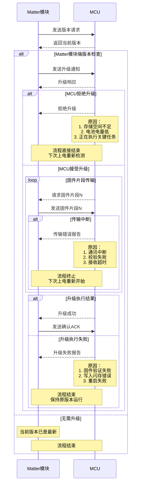
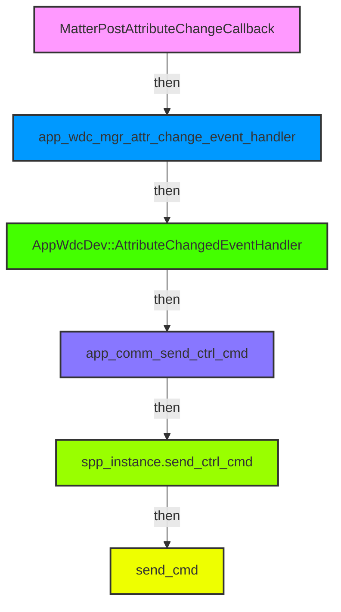
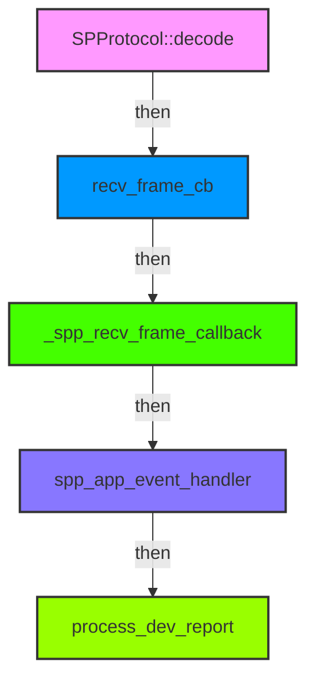

[hrf](hrf.md)  
[reset](./files/bk/reset.md)  

## Info
```c
@日志Richy 我们产品软件的外包商李总。
@蔡工 我们公司内部软件工程师蔡工
@从此醉 我们公司内部硬件工程师李工
@石韧 华普微Matter孙总
```
```c
广东省东莞市樟木头镇文裕路8号，东莞保康电子科技有限公司，吴长春，13620049295
```
### PartNo.
```c
HM-MT2401B-HPBK01
EFR32MG24A410F1536IM40
```
### Ones
[保康Matter窗帘电机](https://ones.cn/wiki/#/team/VocipTXV/space/7jKfDSiJ/page/UAgVbQvf)  

<div align="left">
  
</div>

## MCU DFU

## ZAP
### Covering app iOS bug
```c
config\common\window-app.zap
            {
              "name": "TargetPositionLiftPercent100ths",
              "code": 11,
              "mfgCode": null,
              "side": "server",
              "type": "percent100ths",
              "included": 1,
              "storageOption": "RAM",
              "singleton": 0,
              "bounded": 0,
              "defaultValue": null,
              "reportable": 1,
              "minInterval": 0,
              "maxInterval": 65344,
              "reportableChange": 0
            },
```        
```c
"defaultValue": null,
    |
    V
"defaultValue": 0,
```
<div align="left">
  
</div>

### Battery indicate on App
```c
        {
          "name": "Power Source",
          "code": 47,
          "mfgCode": null,
          "define": "POWER_SOURCE_CLUSTER",
          "side": "server",
          "enabled": 1,
          "attributes": [
            ...
                        {
              "name": "FeatureMap",
              "code": 65532,
              "mfgCode": null,
              "side": "server",
              "type": "bitmap32",
              "included": 1,
              "storageOption": "RAM",
              "singleton": 0,
              "bounded": 0,
              "defaultValue": "0",
              "reportable": 1,
              "minInterval": 1,
              "maxInterval": 65534,
              "reportableChange": 0
            },
            ...

```
```c
"defaultValue": "0",
    |
    V
"defaultValue": "6",
```
#### Reference
```c
23-27349-009_Matter-1.5-Core-Specification.pdf
    11.7. Power Source Cluster
        11.7.4. Features
```
|Bit |Code |Feature |Conformance |Summary|
| ---- | ---- | ---- | ---- | ---- |
|0 |WIRED |Wired |O.a |A wired power source|
|1 |BAT |Battery |O.a |A battery power source|
|2 |RECHG |Rechargeable |[BAT] |A rechargeable battery power source|
|3 |REPLC |Replaceable |[BAT] |A replaceable bat­tery power source|

### Battery Percent Remaining 
```c
        uint8_t dev_battery = fdata[0] * 2;

        LOG_MSG_INFO(TAG_PWR, "report battery percent %u\n", fdata[0]);

        PlatformMgr().LockChipStack();
        matter_attr_lock();
        PowerSource::Attributes::BatPercentRemaining::Set(0, dev_battery);
        matter_attr_unlock();
        PlatformMgr().UnlockChipStack();
```        
#### Reference
```c
23-27349-009_Matter-1.5-Core-Specification.pdf
    11.7. Power Source Cluster
        11.7.7. Attributes
            11.7.7.13. BatPercentRemaining Attribute
                This attribute SHALL indicate the estimated percentage of battery charge remaining until the bat­
                qtery will no longer be able to provide power to the Node. Values are expressed in half percent units,
                ranging from 0 to 200. E.g. a value of 48 is equivalent to 24%. A value of NULL SHALL indicate the
                Node is currently unable to assess the value.
```
### Battery Charge Level
```c
        uint8_t dev_battery_Charge_Level = fdata[0];

        LOG_MSG_INFO(TAG_PWR, "report battery Charge Level %u\n", fdata[0]);

        PlatformMgr().LockChipStack();
        matter_attr_lock();
        PowerSource::Attributes::BatChargeLevel::Set(0, dev_battery_Charge_Level);
        matter_attr_unlock();
        PlatformMgr().UnlockChipStack();
```
#### Reference
```c
23-27349-009_Matter-1.5-Core-Specification.pdf
    11.7. Power Source Cluster
        11.7.6. Data Types
            11.7.6.6. BatChargeLevelEnum Type
        11.7.7. Attributes
            ID: 0x000E Name: BatCharge Level
```
|Value |Name |Summary |Conformance|
| ---- | ---- | ---- | ---- |
|0 |OK |Charge level is nominal |M|
|1 |Warning |Charge level is low,intervention may soon be required.|M|
|2 |Critical |Charge level is critical,immediate intervention is required|M|

### Battery Charge Status
```c
        uint8_t dev_battery_Charge_Status = fdata[0];

        LOG_MSG_INFO(TAG_PWR, "report battery Charge Status %u\n", fdata[0]);

        PlatformMgr().LockChipStack();
        matter_attr_lock();
        PowerSource::Attributes::BatChargeState::Set(0, dev_battery_Charge_Status);
        matter_attr_unlock();
        PlatformMgr().UnlockChipStack();
```
#### Reference
```c
23-27349-009_Matter-1.5-Core-Specification.pdf
    11.7. Power Source Cluster
        11.7.6. Data Types
            11.7.6.10. BatChargeStateEnum Type
        11.7.7. Attributes
            ID: 0x001A Name: BatCharge State
```
|Value |Name |Summary |Conformance|
| ---- | ---- | ---- | ---- |
|0 |Unknown |Unable to determine the charging state|M|
|1 |IsCharging |The battery is charging |M|
|2 |IsAtFullCharge |The battery is at full charge|M|
|3 |IsNotCharging |The battery is not charging|M|

## Code
```c
main()-main.c
    app_init()-main.cpp
        SilabsMatterConfig::AppInit()-MatterConfig.cpp
            ApplicationStart()-MatterConfig.cpp
                AppTask::GetAppTask().StartAppTask()
                    BaseApplication::StartAppTask(AppTaskMain)
                        AppTask::AppTaskMain(void * pvParameter)
                            AppTask::AppInit()-AppTask.cpp
                                app_nwk_mgr_init()-app_nwk_mgr.cpp
                                    app_nwk_open_basic_commissioning_window()
                                        chip::Server::GetInstance().GetCommissioningWindowManager().OpenBasicCommissioningWindow()
```
### Boot Log
```c
[11:44:47.239]  [00:00:00.067][info  ][DL] Starting scheduler
[11:44:47.239]  [00:00:00.067][info  ][DL] ==================================================
[11:44:47.240]  [00:00:00.067][info  ][DL] SL-Window starting
[11:44:47.240]  [00:00:00.068][info  ][DL] ==================================================
[11:44:47.241]  [00:00:00.068][info  ][DL] Init CHIP Stack
[11:44:47.241]  [00:00:00.069][info  ][DL] Setting device name to : "SL-Window"
[11:44:47.242]  [00:00:00.070][info  ][DL] Provision mode disabled
[11:44:47.242]  [00:00:00.070][info  ][DL] Initializing OpenThread stack
[11:44:47.244]  [00:00:00.070][info  ][DL] OpenThread started: OK
[11:44:47.246]  [00:00:00.112][info  ][DL] Bluetooth stack booted: v11.0.0-b0
[11:44:47.246]  [00:00:00.112][info  ][DL] RAIL version:, v3.0.0-b0
[11:44:47.247]  [00:00:00.113][info  ][DL] Starting advertising with interval_min=32, intverval_max=96 (units of 625us)
[11:44:47.249]  [00:00:00.115][info  ][DL] _OnPlatformEvent default:  event->Type = 32781
[11:44:47.250]  [00:00:00.115][info  ][DL] _OnPlatformEvent default:  event->Type = 32779
[11:44:47.251]  [00:00:00.116][info  ][SVR] Current Software Version String: 0.0.1
[11:44:47.251]  [00:00:00.116][info  ][SVR] Current Software Version: 1
[11:44:47.252]  [00:00:00.117][info  ][DL] Device Configuration:
[11:44:47.252]  [00:00:00.117][info  ][DL]   Serial Number: 38398FFFFE520BF5
[11:44:47.253]  [00:00:00.118][info  ][DL]   Vendor Id: 65521 (0xFFF1)
[11:44:47.253]  [00:00:00.118][info  ][DL]   Product Id: 32784 (0x8010)
[11:44:47.254]  [00:00:00.118][info  ][DL]   Product Name: SL_Sample
[11:44:47.254]  [00:00:00.118][info  ][DL]   Hardware Version: 1
[11:44:47.255]  [00:00:00.118][info  ][DL]   Setup Pin Code (0 for UNKNOWN/ERROR): 0
[11:44:47.256]  [00:00:00.119][info  ][DL]   Setup Discriminator (0xFFFF for UNKNOWN/ERROR): 3840 (0xF00)
[11:44:47.257]  [00:00:00.119][info  ][DL]   Manufacturing Date: (not set)
[11:44:47.257]  [00:00:00.119][info  ][DL]   Device Type: 65535 (0xFFFF)
[11:44:47.258]  [00:00:00.120][info  ][SVR] SetupQRCode: [MT:SAGA442C00KA0648G00]
[11:44:47.259]  [00:00:00.120][info  ][SVR] Copy/paste the below URL in a browser to see the QR Code:
[11:44:47.260]  [00:00:00.120][info  ][SVR] https://project-chip.github.io/connectedhomeip/qrcode.html?data=MT%3ASAGA442C00KA0648G00
[11:44:47.264]  [00:00:00.130][silabs ]App Task started
[11:44:47.264]  [00:00:00.130][info  ][ZCL] ConfigStatus 0x7B Operational=1 OnlineReserved=1
[11:44:47.266]  [00:00:00.130][info  ][ZCL] Lift(PA=1 Encoder=1 Reversed=0) Tilt(PA=1 Encoder=1)
[11:44:47.267]  [00:00:00.131][info  ][ZCL] ConfigStatus 0x7B Operational=1 OnlineReserved=1
[11:44:47.268]  [00:00:00.131][info  ][ZCL] Lift(PA=1 Encoder=1 Reversed=0) Tilt(PA=1 Encoder=1)
[11:44:47.269]  [00:00:00.131][info  ][ZCL] Mode 0x08 MotorDirReversed=0 LedFeedback=1 Maintenance=0 Calibration=0
[11:44:47.270]  [00:00:00.132][info  ][ZCL] ConfigStatus 0x7B Operational=1 OnlineReserved=1
[11:44:47.271]  [00:00:00.132][info  ][ZCL] Lift(PA=1 Encoder=1 Reversed=0) Tilt(PA=1 Encoder=1)
[11:44:47.271]  [00:00:00.132][info  ][ZCL] ConfigStatus 0x7B Operational=1 OnlineReserved=1
[11:44:47.272]  [00:00:00.132][info  ][ZCL] Lift(PA=1 Encoder=1 Reversed=0) Tilt(PA=1 Encoder=1)
[11:44:47.274]  [00:00:00.133][info  ][ZCL] Mode 0x08 MotorDirReversed=0 LedFeedback=1 Maintenance=0 Calibration=0
[11:44:47.274]  matterCli> [00:00:30.114][info  ][DL] Starting advertising with interval_min=240, intverval_max=1920 (units of 625us)
[11:59:47.262]  [00:15:00.099][info  ][SVR] Closing pairing window
[11:59:47.262]  [00:15:00.099][info  ][DIS] Updating services using commissioning mode 0
[11:59:47.262]  [00:15:00.099][error ][DIS] Failed to remove advertised services: 3
[11:59:47.264]  [00:15:00.099][error ][DIS] Failed to finalize service update: 3
[11:59:47.264]  [00:15:00.100][error ][DL] Failed to stop BledAdv timeout timer
[11:59:47.266]  [00:15:00.100][info  ][DL] _OnPlatformEvent default:  event->Type = 32781

```
## Serial
### TX

### RX
