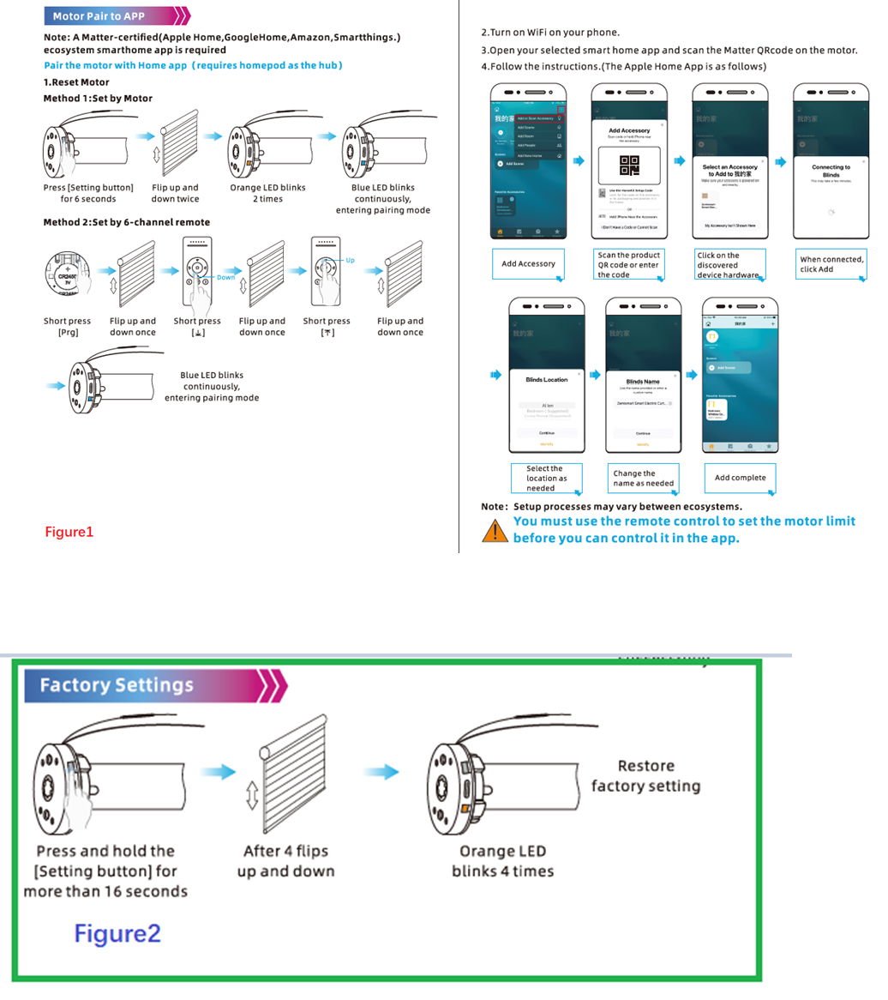
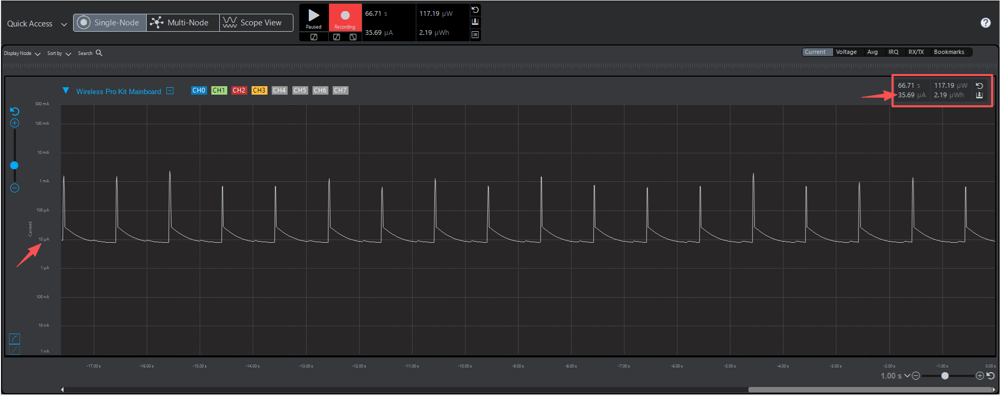
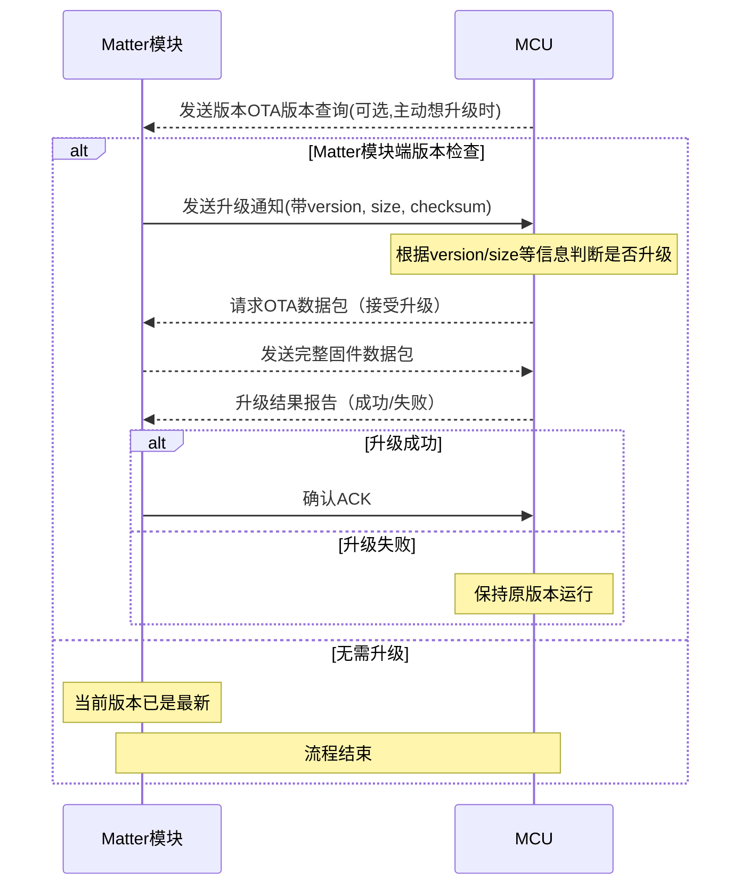
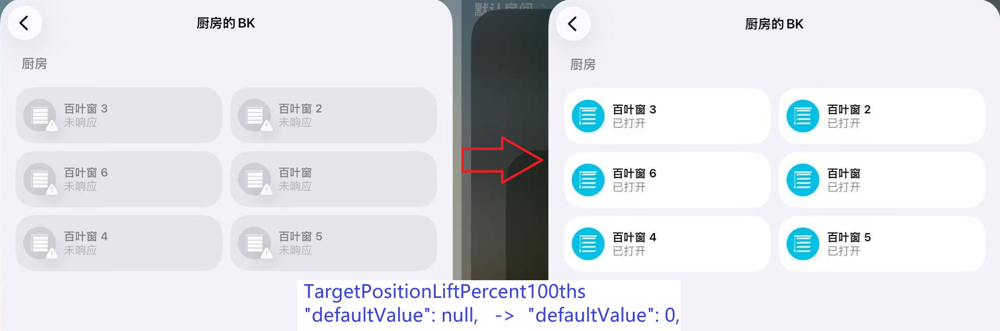
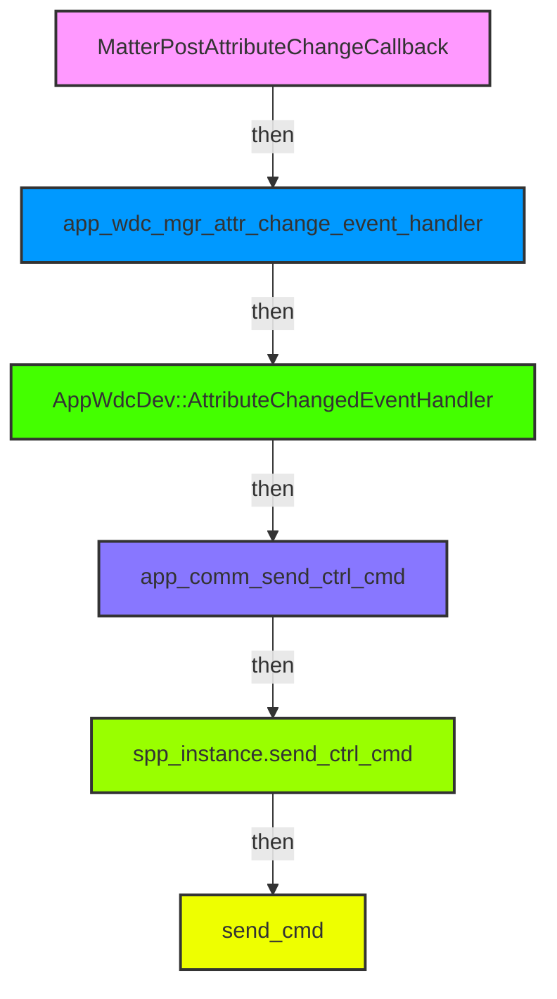
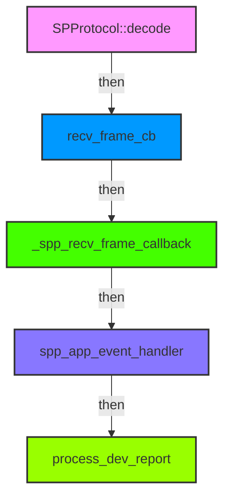

[hrf](hrf.md)  
[reset](./files/bk/reset.md)  
[requirement](./files/bk/requirement.md)  
[sn](./files/bk/sn.md)  

## Info
```c
//保康,
@吴北瓜(CCWu) 主管
@蔡工 软件工程师蔡工
@从此醉 硬件工程师李工
@Edward Chan 市场部负责人
//保康外包(AiWT/爱物通)
@日志Richy 软件外包商李总。
//华普微
@石韧 华普微Matter孙总
@lin
@flight
```
```c
地址：广东省东莞市樟木头镇文裕路8号，东莞保康电子科技有限公司
联系人：吴长春
电话：13620049295
```
```c
地址：深圳市宝安区西乡街道共乐社区铁仔路60号奋成智谷大厦A座1303C 
联系人：李日志 
电话：18938674968
```
### PartNo.
```c
HM-MT2401B-HPBK01
EFR32MG24A410F1536IM40
```
### Ones
[保康Matter窗帘电机](https://ones.cn/wiki/#/team/VocipTXV/space/7jKfDSiJ/page/UAgVbQvf)  

<div align="left">
  
</div>

## Secure Boot Module
[MT:K2CA0Q181498OE18B10](https://project-chip.github.io/connectedhomeip/qrcode.html?data=MT%3AK2CA0Q181498OE18B10)  
[MT:K2CA0WSC00YM3X7D910](https://project-chip.github.io/connectedhomeip/qrcode.html?data=MT%3AK2CA0WSC00YM3X7D910)  

## Power Consumption
<div align="left">
  
</div>

## MCU DFU

### Log
```c
COM: Boot OTA check - MCU: 0.0.1, Metadata: 3.0.0
COM: Notify MCU OTA upgrade: cmd=0xE1, PID=0x0001, Ver=3.0.0, size=45676, checksum=0x25
MATTER TX: 55 AA 01 03 0E E1 0A 00 01 33 2E 30 2E 30 B2 6C 25 2F
```
### 解析
```c
55 AA 01 03 0E  //header&SN
E1              //cmd=0xE1
0A              //len
00 01           //PID=0x0001
33 2E 30 2E 30  //Ver=3.0.0
B2 6C           //size=45676
25              //MCU FW checksum=0x25
2F              //checksum=0x25
```

## ZAP
### Covering app iOS bug
```c
config\common\window-app.zap
            {
              "name": "TargetPositionLiftPercent100ths",
              "code": 11,
              "mfgCode": null,
              "side": "server",
              "type": "percent100ths",
              "included": 1,
              "storageOption": "RAM",
              "singleton": 0,
              "bounded": 0,
              "defaultValue": null,
              "reportable": 1,
              "minInterval": 0,
              "maxInterval": 65344,
              "reportableChange": 0
            },
```        
```c
"defaultValue": null,
    |
    V
"defaultValue": 0,
```
<div align="left">
  
</div>

### Battery indicate on App
```c
        {
          "name": "Power Source",
          "code": 47,
          "mfgCode": null,
          "define": "POWER_SOURCE_CLUSTER",
          "side": "server",
          "enabled": 1,
          "attributes": [
            ...
                        {
              "name": "FeatureMap",
              "code": 65532,
              "mfgCode": null,
              "side": "server",
              "type": "bitmap32",
              "included": 1,
              "storageOption": "RAM",
              "singleton": 0,
              "bounded": 0,
              "defaultValue": "0",
              "reportable": 1,
              "minInterval": 1,
              "maxInterval": 65534,
              "reportableChange": 0
            },
            ...

```
```c
"defaultValue": "0",
    |
    V
"defaultValue": "6",
```
#### Reference
```c
23-27349-009_Matter-1.5-Core-Specification.pdf
    11.7. Power Source Cluster
        11.7.4. Features
```
|Bit |Code |Feature |Conformance |Summary|
| ---- | ---- | ---- | ---- | ---- |
|0 |WIRED |Wired |O.a |A wired power source|
|1 |BAT |Battery |O.a |A battery power source|
|2 |RECHG |Rechargeable |[BAT] |A rechargeable battery power source|
|3 |REPLC |Replaceable |[BAT] |A replaceable bat­tery power source|

### Battery Percent Remaining 
```c
        uint8_t dev_battery = fdata[0] * 2;

        LOG_MSG_INFO(TAG_PWR, "report battery percent %u\n", fdata[0]);

        PlatformMgr().LockChipStack();
        matter_attr_lock();
        PowerSource::Attributes::BatPercentRemaining::Set(0, dev_battery);
        matter_attr_unlock();
        PlatformMgr().UnlockChipStack();
```        
#### Reference
```c
23-27349-009_Matter-1.5-Core-Specification.pdf
    11.7. Power Source Cluster
        11.7.7. Attributes
            11.7.7.13. BatPercentRemaining Attribute
                This attribute SHALL indicate the estimated percentage of battery charge remaining until the bat­
                qtery will no longer be able to provide power to the Node. Values are expressed in half percent units,
                ranging from 0 to 200. E.g. a value of 48 is equivalent to 24%. A value of NULL SHALL indicate the
                Node is currently unable to assess the value.
```
### Battery Charge Level
```c
        uint8_t dev_battery_Charge_Level = fdata[0];

        LOG_MSG_INFO(TAG_PWR, "report battery Charge Level %u\n", fdata[0]);

        PlatformMgr().LockChipStack();
        matter_attr_lock();
        PowerSource::Attributes::BatChargeLevel::Set(0, dev_battery_Charge_Level);
        matter_attr_unlock();
        PlatformMgr().UnlockChipStack();
```
#### Reference
```c
23-27349-009_Matter-1.5-Core-Specification.pdf
    11.7. Power Source Cluster
        11.7.6. Data Types
            11.7.6.6. BatChargeLevelEnum Type
        11.7.7. Attributes
            ID: 0x000E Name: BatCharge Level
```
|Value |Name |Summary |Conformance|
| ---- | ---- | ---- | ---- |
|0 |OK |Charge level is nominal |M|
|1 |Warning |Charge level is low,intervention may soon be required.|M|
|2 |Critical |Charge level is critical,immediate intervention is required|M|

### Battery Charge Status
```c
        uint8_t dev_battery_Charge_Status = fdata[0];

        LOG_MSG_INFO(TAG_PWR, "report battery Charge Status %u\n", fdata[0]);

        PlatformMgr().LockChipStack();
        matter_attr_lock();
        PowerSource::Attributes::BatChargeState::Set(0, dev_battery_Charge_Status);
        matter_attr_unlock();
        PlatformMgr().UnlockChipStack();
```
#### Reference
```c
23-27349-009_Matter-1.5-Core-Specification.pdf
    11.7. Power Source Cluster
        11.7.6. Data Types
            11.7.6.10. BatChargeStateEnum Type
        11.7.7. Attributes
            ID: 0x001A Name: BatCharge State
```
|Value |Name |Summary |Conformance|
| ---- | ---- | ---- | ---- |
|0 |Unknown |Unable to determine the charging state|M|
|1 |IsCharging |The battery is charging |M|
|2 |IsAtFullCharge |The battery is at full charge|M|
|3 |IsNotCharging |The battery is not charging|M|

## Code
```c
main()-main.c
    app_init()-main.cpp
        SilabsMatterConfig::AppInit()-MatterConfig.cpp
            ApplicationStart()-MatterConfig.cpp
                AppTask::GetAppTask().StartAppTask()
                    BaseApplication::StartAppTask(AppTaskMain)
                        AppTask::AppTaskMain(void * pvParameter)
                            AppTask::AppInit()-AppTask.cpp
                                app_nwk_mgr_init()-app_nwk_mgr.cpp
                                    app_nwk_open_basic_commissioning_window()
                                        chip::Server::GetInstance().GetCommissioningWindowManager().OpenBasicCommissioningWindow()
```
### Boot Log
```c
[11:44:47.239]  [00:00:00.067][info  ][DL] Starting scheduler
[11:44:47.239]  [00:00:00.067][info  ][DL] ==================================================
[11:44:47.240]  [00:00:00.067][info  ][DL] SL-Window starting
[11:44:47.240]  [00:00:00.068][info  ][DL] ==================================================
[11:44:47.241]  [00:00:00.068][info  ][DL] Init CHIP Stack
[11:44:47.241]  [00:00:00.069][info  ][DL] Setting device name to : "SL-Window"
[11:44:47.242]  [00:00:00.070][info  ][DL] Provision mode disabled
[11:44:47.242]  [00:00:00.070][info  ][DL] Initializing OpenThread stack
[11:44:47.244]  [00:00:00.070][info  ][DL] OpenThread started: OK
[11:44:47.246]  [00:00:00.112][info  ][DL] Bluetooth stack booted: v11.0.0-b0
[11:44:47.246]  [00:00:00.112][info  ][DL] RAIL version:, v3.0.0-b0
[11:44:47.247]  [00:00:00.113][info  ][DL] Starting advertising with interval_min=32, intverval_max=96 (units of 625us)
[11:44:47.249]  [00:00:00.115][info  ][DL] _OnPlatformEvent default:  event->Type = 32781
[11:44:47.250]  [00:00:00.115][info  ][DL] _OnPlatformEvent default:  event->Type = 32779
[11:44:47.251]  [00:00:00.116][info  ][SVR] Current Software Version String: 0.0.1
[11:44:47.251]  [00:00:00.116][info  ][SVR] Current Software Version: 1
[11:44:47.252]  [00:00:00.117][info  ][DL] Device Configuration:
[11:44:47.252]  [00:00:00.117][info  ][DL]   Serial Number: 38398FFFFE520BF5
[11:44:47.253]  [00:00:00.118][info  ][DL]   Vendor Id: 65521 (0xFFF1)
[11:44:47.253]  [00:00:00.118][info  ][DL]   Product Id: 32784 (0x8010)
[11:44:47.254]  [00:00:00.118][info  ][DL]   Product Name: SL_Sample
[11:44:47.254]  [00:00:00.118][info  ][DL]   Hardware Version: 1
[11:44:47.255]  [00:00:00.118][info  ][DL]   Setup Pin Code (0 for UNKNOWN/ERROR): 0
[11:44:47.256]  [00:00:00.119][info  ][DL]   Setup Discriminator (0xFFFF for UNKNOWN/ERROR): 3840 (0xF00)
[11:44:47.257]  [00:00:00.119][info  ][DL]   Manufacturing Date: (not set)
[11:44:47.257]  [00:00:00.119][info  ][DL]   Device Type: 65535 (0xFFFF)
[11:44:47.258]  [00:00:00.120][info  ][SVR] SetupQRCode: [MT:SAGA442C00KA0648G00]
[11:44:47.259]  [00:00:00.120][info  ][SVR] Copy/paste the below URL in a browser to see the QR Code:
[11:44:47.260]  [00:00:00.120][info  ][SVR] https://project-chip.github.io/connectedhomeip/qrcode.html?data=MT%3ASAGA442C00KA0648G00
[11:44:47.264]  [00:00:00.130][silabs ]App Task started
[11:44:47.264]  [00:00:00.130][info  ][ZCL] ConfigStatus 0x7B Operational=1 OnlineReserved=1
[11:44:47.266]  [00:00:00.130][info  ][ZCL] Lift(PA=1 Encoder=1 Reversed=0) Tilt(PA=1 Encoder=1)
[11:44:47.267]  [00:00:00.131][info  ][ZCL] ConfigStatus 0x7B Operational=1 OnlineReserved=1
[11:44:47.268]  [00:00:00.131][info  ][ZCL] Lift(PA=1 Encoder=1 Reversed=0) Tilt(PA=1 Encoder=1)
[11:44:47.269]  [00:00:00.131][info  ][ZCL] Mode 0x08 MotorDirReversed=0 LedFeedback=1 Maintenance=0 Calibration=0
[11:44:47.270]  [00:00:00.132][info  ][ZCL] ConfigStatus 0x7B Operational=1 OnlineReserved=1
[11:44:47.271]  [00:00:00.132][info  ][ZCL] Lift(PA=1 Encoder=1 Reversed=0) Tilt(PA=1 Encoder=1)
[11:44:47.271]  [00:00:00.132][info  ][ZCL] ConfigStatus 0x7B Operational=1 OnlineReserved=1
[11:44:47.272]  [00:00:00.132][info  ][ZCL] Lift(PA=1 Encoder=1 Reversed=0) Tilt(PA=1 Encoder=1)
[11:44:47.274]  [00:00:00.133][info  ][ZCL] Mode 0x08 MotorDirReversed=0 LedFeedback=1 Maintenance=0 Calibration=0
[11:44:47.274]  matterCli> [00:00:30.114][info  ][DL] Starting advertising with interval_min=240, intverval_max=1920 (units of 625us)
[11:59:47.262]  [00:15:00.099][info  ][SVR] Closing pairing window
[11:59:47.262]  [00:15:00.099][info  ][DIS] Updating services using commissioning mode 0
[11:59:47.262]  [00:15:00.099][error ][DIS] Failed to remove advertised services: 3
[11:59:47.264]  [00:15:00.099][error ][DIS] Failed to finalize service update: 3
[11:59:47.264]  [00:15:00.100][error ][DL] Failed to stop BledAdv timeout timer
[11:59:47.266]  [00:15:00.100][info  ][DL] _OnPlatformEvent default:  event->Type = 32781

```
## Serial
### TX

### RX



## OTA
### bootloader
#### Bootloader Config
```c
//config/btl_interface_cfg_s2c4.h
#define BOOTLOADER_DISABLE_OLD_BOOTLOADER_MITIGATION 0
// |
// V
#define BOOTLOADER_DISABLE_OLD_BOOTLOADER_MITIGATION 1
```
#### Invoke track
```c
bootloader_verifyImage(0,NULL/metadataCallback)
    bootloader_initVerifyImage()
    bootloader_continueVerifyImage()
```
#### Metadata Callback
```c
//third_party/matter_sdk/src/platform/silabs/efr32/OTAImageProcessorImpl.cpp
#ifndef MIN
#define MIN(x, y) (((x) < (y)) ? (x) : (y))
#endif
#define MAX_METADATA_LENGTH   512
uint8_t metadata[MAX_METADATA_LENGTH];

void metadataCallback(uint32_t address, uint8_t *data, size_t length, void *context)
{
    uint8_t i;
    ChipLogError(SoftwareUpdate, "%s", __func__);
    for (i = 0; i < MIN(length , MAX_METADATA_LENGTH - address); i++)
    {
        metadata[address + i] = data[i];
        ChipLogError(SoftwareUpdate, "[%ld]:%d", (address + i), metadata[address + i]);
    }
}
void OTAImageProcessorImpl::HandleApply(intptr_t context)
{
    uint32_t err = SL_BOOTLOADER_OK;

    ChipLogProgress(SoftwareUpdate, "HandleApply: verifying image");
    SILABS_TRACE_BEGIN(TimeTraceOperation::kImageVerification);

    // Force KVS to store pending keys such as data from StoreCurrentUpdateInfo()
    PersistedStorage::KeyValueStoreMgrImpl().ForceKeyMapSave();
#if SL_BTLCTRL_MUX
    err = sl_wfx_host_pre_bootloader_spi_transfer();
    if (err != SL_STATUS_OK)
    {
        ChipLogError(SoftwareUpdate, "sl_wfx_host_pre_bootloader_spi_transfer() error: %ld", err);
        SILABS_TRACE_END_ERROR(TimeTraceOperation::kImageVerification, CHIP_ERROR_INTERNAL);
        return;
    }
#endif // SL_BTLCTRL_MUX

#if defined(_SILICON_LABS_32B_SERIES_3) && CHIP_PROGRESS_LOGGING
    osDelay(100); // sl-temp: delay for uart print before verifyImage
#endif            // _SILICON_LABS_32B_SERIES_3 && CHIP_PROGRESS_LOGGING
    LockRadioProcessing();
#if defined(SL_TRUSTZONE_NONSECURE)
    WRAP_BL_DFU_CALL(err = bootloader_verifyImage(mSlotId))
#else
    WRAP_BL_DFU_CALL(err = bootloader_verifyImage(mSlotId, metadataCallback)) //NULL
#endif
    UnlockRadioProcessing();
```
```c
#define BOOTLOADER_ERROR_PARSER_UNKNOWN_TAG \
  (BOOTLOADER_ERROR_PARSER_BASE | 0x08L)

//Silabe bootloader_verifyImage
[silabs ]bootloader_verifyImage() error: 4104 ->0x1008-> BOOTLOADER_ERROR_PARSER_UNKNOWN_TAG
```  

```c
// src\app\AppTask.cpp
#define MIN(a, b) ((a) < (b) ? (a) : (b))
#define MAX_METADATA_LENGTH   512
uint8_t metadata[MAX_METADATA_LENGTH];

void metadataCallback(uint32_t address, uint8_t *data, size_t length, void *context)
{
    uint8_t i;
    LOG_API_HEX("metadata", data, length);
    return;
    for (i = 0; i < MIN(length , MAX_METADATA_LENGTH - address); i++)
    {
        metadata[address + i] = data[i];
    }
}

CHIP_ERROR AppTask::AppInit()
{
    //...
    DeviceLayer::ThreadStackMgr().LockThreadStack();
    wdg_api_disable();
    CORE_ATOMIC_SECTION(
    uint32_t bootloader_err  = bootloader_init();
    if (bootloader_err != 0){
        SILABS_LOG("bootloader_init() error: %ld", bootloader_err);
    }
    bootloader_err = bootloader_verifyImage(0, metadataCallback);
    if (bootloader_err != 0){
        SILABS_LOG("bootloader_verifyImage() error: %ld", bootloader_err);
    }
    );
    wdg_api_enable();
    DeviceLayer::ThreadStackMgr().UnlockThreadStack();
    //...
}
```

### DFU cause reboot
```c
continueVerifyImage 解析非法数据
  → 访问非法地址 / 非法内存操作
    → HardFault / BusFault
      → fault handler → NVIC_SystemReset()
        → EMU_RSTCAUSE_SYSREQ (0x40)
```

## TODO @20260604
|No|ToDo|Remark|
|-|-|-|
|1|BK key|bootloader,app, OTA|
|2|MCU uart communicate during OTA Image Verifing||
|3|Inter Flash vrersion||
|4|Ringbuffer version||
|5|||
|6|||
|7|||
|8|||


### Debug
```c
void vListInsert(List_t * const pxList,
                 ListItem_t * const pxNewListItem)
{
  ListItem_t * pxIterator;
  const TickType_t xValueOfInsertion = pxNewListItem->xItemValue;

  traceENTER_vListInsert(pxList, pxNewListItem);

  /* Only effective when configASSERT() is also defined, these tests may catch
   * the list data structures being overwritten in memory.  They will not catch
   * data errors caused by incorrect configuration or use of FreeRTOS. */
  listTEST_LIST_INTEGRITY(pxList);
  listTEST_LIST_ITEM_INTEGRITY(pxNewListItem);

  /* Insert the new list item into the list, sorted in xItemValue order.
   *
   * If the list already contains a list item with the same item value then the
   * new list item should be placed after it.  This ensures that TCBs which are
   * stored in ready lists (all of which have the same xItemValue value) get a
   * share of the CPU.  However, if the xItemValue is the same as the back marker
   * the iteration loop below will not end.  Therefore the value is checked
   * first, and the algorithm slightly modified if necessary. */
  if ( xValueOfInsertion == portMAX_DELAY ) {
    pxIterator = pxList->xListEnd.pxPrevious;
  } else {
    /* *** NOTE ***********************************************************
    *  If you find your application is crashing here then likely causes are
    *  listed below.  In addition see https://www.FreeRTOS.org/FAQHelp.html for
    *  more tips, and ensure configASSERT() is defined!
    *  https://www.FreeRTOS.org/a00110.html#configASSERT
    *
    *   1) Stack overflow -
    *      see https://www.FreeRTOS.org/Stacks-and-stack-overflow-checking.html
    *   2) Incorrect interrupt priority assignment, especially on Cortex-M
    *      parts where numerically high priority values denote low actual
    *      interrupt priorities, which can seem counter intuitive.  See
    *      https://www.FreeRTOS.org/RTOS-Cortex-M3-M4.html and the definition
    *      of configMAX_SYSCALL_INTERRUPT_PRIORITY on
    *      https://www.FreeRTOS.org/a00110.html
    *   3) Calling an API function from within a critical section or when
    *      the scheduler is suspended, or calling an API function that does
    *      not end in "FromISR" from an interrupt.
    *   4) Using a queue or semaphore before it has been initialised or
    *      before the scheduler has been started (are interrupts firing
    *      before vTaskStartScheduler() has been called?).
    *   5) If the FreeRTOS port supports interrupt nesting then ensure that
    *      the priority of the tick interrupt is at or below
    *      configMAX_SYSCALL_INTERRUPT_PRIORITY.
    **********************************************************************/

    for ( pxIterator = ( ListItem_t * ) &(pxList->xListEnd); pxIterator->pxNext->xItemValue <= xValueOfInsertion; pxIterator = pxIterator->pxNext ) {
      /* There is nothing to do here, just iterating to the wanted
       * insertion position. */
    }
  }

  pxNewListItem->pxNext = pxIterator->pxNext;
  pxNewListItem->pxNext->pxPrevious = pxNewListItem;
  pxNewListItem->pxPrevious = pxIterator;
  pxIterator->pxNext = pxNewListItem;

  /* Remember which list the item is in.  This allows fast removal of the
   * item later. */
  pxNewListItem->pxContainer = pxList;

  (pxList->uxNumberOfItems) = ( UBaseType_t ) (pxList->uxNumberOfItems + 1U);

  traceRETURN_vListInsert();
}
```

```c
AppTaskMain (4KB stack)
  └─ AppInit()
       └─ app_mcu_dfu_init()
            └─ cache_entire_metadata()
                 ├─ SILABS_LOG(...)            ← 消耗栈
                 ├─ bootloader_initVerifyImage  ← 消耗栈
                 └─ bootloader_continueVerifyImage loop  ← 消耗栈
                      └─ cache_append_callback  ← 消耗栈
                           └─ memcpy()          ← 消耗栈
```                           

```c
??@0x08003b44 (Unknown Source:0)
bootloader_continueVerifyImage@0x08034454 (c:\Users\huide\.silabs\slt\installs\conan\p\simpl35774a752829c\p\bootloader_interface\platform\bootloader\api\btl_interface_storage.c:473)
bootloader_continueVerifyImage@0x08034454 (c:\Users\huide\.silabs\slt\installs\conan\p\simpl35774a752829c\p\bootloader_interface\platform\bootloader\api\btl_interface_storage.c:461)
cache_entire_metadata@0x08057fbe (c:\Si\v6\bk01_matter\src\app\app_mcu_dfu.cpp:196)
app_mcu_dfu_init@0x0805815c (c:\Si\v6\bk01_matter\src\app\app_mcu_dfu.cpp:315)
AppTask::AppInit@0x080597a0 (c:\Si\v6\bk01_matter\src\app\AppTask.cpp:104)
BaseApplication::Init@0x08007910 (c:\Users\huide\.silabs\slt\installs\conan\p\matte8bada656e9e76\p\third_party\matter_sdk\examples\platform\silabs\BaseApplication.cpp:311)
AppTask::AppTaskMain@0x080595de (c:\Si\v6\bk01_matter\src\app\AppTask.cpp:137)
SystemHFXOClockSet@0x08034734 (c:\Users\huide\.silabs\slt\installs\conan\p\simpl35774a752829c\p\devices\platform\Device\SiliconLabs\EFR32MG24\Source\system_efr32mg24.c:506)
```
### Fixed
```c
#define BOOTLOADER_DISABLE_NVM3_FAULT_HANDLING 0
|
V
#define BOOTLOADER_DISABLE_NVM3_FAULT_HANDLING 1
```

## OS Thread

### 当前运行的线程 (共 12 个)
|#	|线程名	|创建方式	|优先级	|栈大小	|创建位置|
|----|----|----|----|----|----|
|1	|Start Task	|osKernelStart() → SDK	|Normal (24)	|4096	|main.c:36 sl_main_second_stage_init()|
|2	|main (临时)	|osThreadNew	|Realtime7 (55)	|5120	|MatterConfig.cpp:239 → 初始化完自删|
|3	|App Task	|osThreadNew	|Normal (24)	|4096	|BaseApplication.cpp:292|
|4	|UART Task	|xTaskCreateStatic	|30	|UART_TASK_SIZE	|hal_uart.cpp:395|
|5	|BT Link Layer	|SDK sli_bt_rtos_adaptation_kernel_start	|52	|1000	|sl_bt_rtos_config_s2.h|
|6	|BT Host Stack	|SDK	|51	|2000	|sl_bt_rtos_config_s2.h|
|7	|BT Event Handler	|SDK	|50	|1536	|sl_bt_rtos_config_s2.h|
|8	|OT Stack Task	|SDK sl_ot_rtos_stack_init	|24	|4608	|sl_openthread_rtos_config.h|
|9	|OT App Task	|SDK sl_ot_rtos_app_init	|23	|4608	|sl_openthread_rtos_config.h|
|10	|OT Serial Task	|SDK	|16	|3840	|sl_openthread_rtos_config.h|
|11	|IDLE	|FreeRTOS 自动	|0 (最低)	|configMINIMAL_STACK_SIZE	|FreeRTOS 内核|
|12	|Timer Service	|FreeRTOS 自动	|55 (最高)	|1280	|FreeRTOSConfig.h:219|
### 启动流程
```c
main()
  └─ sl_main_second_stage_init()    // SDK 硬件/协议栈初始化
       ├─ osKernelStart()           // FreeRTOS 内核启动 (Start Task 诞生)
       ├─ sl_bt_* 线程创建           // 3个蓝牙线程
       ├─ sl_ot_* 线程创建           // 3个 OpenThread 线程
       └─ app_init()                // 用户初始化
            └─ SilabsMatterConfig::AppInit()
                 └─ osThreadNew(ApplicationStart)  // main 线程 (临时, 优先级最高)
                      ├─ InitMatter()              // Matter 协议栈初始化
                      └─ StartAppTask()            // App Task 创建
                           └─ osThreadNew(AppTaskMain)
                 └─ osThreadTerminate()            // main 线程自删
  └─ while(app_process_action())    // Start Task 进入事件循环
```

