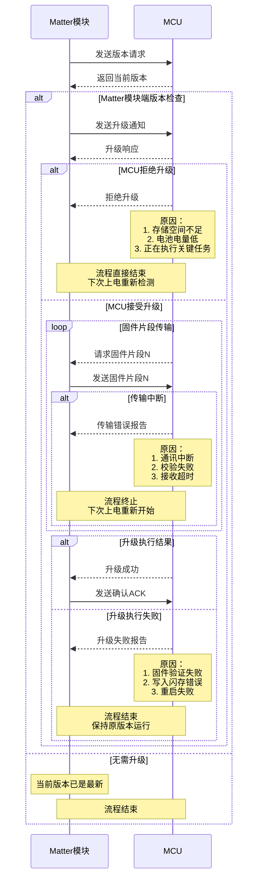

[hrf](hrf.md)  
[reset](./files/bk/reset.md)  

## Info
```c
@日志Richy 我们产品软件的外包商李总。
@蔡工 我们公司内部软件工程师蔡工
@从此醉 我们公司内部硬件工程师李工
@石韧 华普微Matter孙总
```
```c
广东省东莞市樟木头镇文裕路8号，东莞保康电子科技有限公司，吴长春，13620049295
```
### PartNo.
```c
HM-MT2401B-HPBK01
EFR32MG24A410F1536IM40
```
### Ones
[保康Matter窗帘电机](https://ones.cn/wiki/#/team/VocipTXV/space/7jKfDSiJ/page/UAgVbQvf)  

<div align="left">
  
</div>

## MCU DFU
