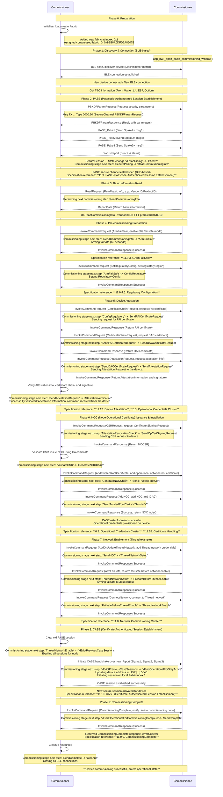

```mermaid
sequenceDiagram
    participant Commissioner
    participant Commissionee

    Note over Commissioner, Commissionee: Phase 0: Preparation
    Commissioner->>Commissioner: Initialize, load/create Fabric
    Note right of Commissioner: Added new fabric at index: 0x1<br/>Assigned compressed fabric ID: 0x9BB8A0DFD2A8507B

    Note over Commissioner, Commissionee: Phase 1: Discovery & Connection (BLE-based)
    Note over Commissionee: app_nwk_open_basic_commissioning_window()
    Commissioner->>+Commissionee: BLE scan, discover device (Discriminator match)
    Commissionee-->>Commissioner: BLE connection established
    Note over Commissioner, Commissionee: New device connected / New BLE connection
    
    Note over Commissioner, Commissionee: Get T&C information (From Matter 1.4, ESF, Option)

    Note over Commissioner, Commissionee: Phase 2: PASE (Passcode-Authenticated Session Establishment)
    Commissioner->>Commissionee: PBKDFParamRequest (Request security parameters)
    Note right of Commissioner: Msg TX ... Type 0000:20 (SecureChannel:PBKDFParamRequest)
    Commissionee-->>Commissioner: PBKDFParamResponse (Reply with parameters)
    Commissioner->>Commissionee: PASE_Pake1 (Send Spake2+ msg1)
    Commissionee-->>Commissioner: PASE_Pake2 (Send Spake2+ msg2)
    Commissioner->>Commissionee: PASE_Pake3 (Send Spake2+ msg3)
    Commissionee-->>Commissioner: StatusReport (Success status)
    Note over Commissioner, Commissionee: SecureSession ... State change 'kEstablishing' --> 'kActive'<br/>Commissioning stage next step: 'SecurePairing' -> 'ReadCommissioningInfo'
    Note over Commissioner, Commissionee: PASE secure channel established (BLE-based)<br/>Specification reference: **11.9. PASE (Passcode-Authenticated Session Establishment)**

    Note over Commissioner, Commissionee: Phase 3: Basic Information Read
    Commissioner->>+Commissionee: ReadRequest (Read basic info, e.g., VendorID/ProductID)
    Note right of Commissioner: Performing next commissioning step 'ReadCommissioningInfo'
    Commissionee-->>Commissioner: ReportData (Return basic information)
    Note over Commissioner, Commissionee: OnReadCommissioningInfo - vendorId=0xFFF1 productId=0x8010

    Note over Commissioner, Commissionee: Phase 4: Pre-commissioning Preparation
    Commissioner->>+Commissionee: InvokeCommandRequest (ArmFailSafe, enable 60s fail-safe mode)
    Note right of Commissioner: Commissioning stage next step: 'ReadCommissioningInfo' -> 'ArmFailSafe'<br/>Arming failsafe (60 seconds)
    Commissionee-->>Commissioner: InvokeCommandResponse (Success)
    Note over Commissioner, Commissionee: Specification reference: **11.9.3.7. ArmFailSafe**
    
    Commissioner->>+Commissionee: InvokeCommandRequest (SetRegulatoryConfig, set regulatory region)
    Note right of Commissioner: Commissioning stage next step: 'ArmFailSafe' -> 'ConfigRegulatory'<br/>Setting Regulatory Config
    Commissionee-->>Commissioner: InvokeCommandResponse (Success)
    Note over Commissioner, Commissionee: Specification reference: **11.9.4.5. Regulatory Configuration**

    Note over Commissioner, Commissionee: Phase 5: Device Attestation
    Commissioner->>+Commissionee: InvokeCommandRequest (CertificateChainRequest, request PAI certificate)
    Note right of Commissioner: Commissioning stage next step: 'ConfigRegulatory' -> 'SendPAICertificateRequest'<br/>Sending request for PAI certificate
    Commissionee-->>Commissioner: InvokeCommandResponse (Return PAI certificate)
    
    Commissioner->>+Commissionee: InvokeCommandRequest (CertificateChainRequest, request DAC certificate)
    Note right of Commissioner: Commissioning stage next step: 'SendPAICertificateRequest' -> 'SendDACCertificateRequest'
    Commissionee-->>Commissioner: InvokeCommandResponse (Return DAC certificate)
    
    Commissioner->>+Commissionee: InvokeCommandRequest (AttestationRequest, request attestation info)
    Note right of Commissioner: Commissioning stage next step: 'SendDACCertificateRequest' -> 'SendAttestationRequest'<br/>Sending Attestation Request to the device.
    Commissionee-->>Commissioner: InvokeCommandResponse (Return Attestation information and signature)
    
    Commissioner->>Commissioner: Verify Attestation info, certificate chain, and signature
    Note over Commissioner: Commissioning stage next step: 'SendAttestationRequest' -> 'AttestationVerification'<br/>Successfully validated 'Attestation Information' command received from the device.
    Note over Commissioner, Commissionee: Specification reference: **11.17. Device Attestation**, **6.3. Operational Credentials Cluster**

    Note over Commissioner, Commissionee: Phase 6: NOC (Node Operational Certificate) Issuance & Installation
    Commissioner->>+Commissionee: InvokeCommandRequest (CSRRequest, request Certificate Signing Request)
    Note right of Commissioner: Commissioning stage next step: 'AttestationRevocationCheck' -> 'SendOpCertSigningRequest'<br/>Sending CSR request to device
    Commissionee-->>Commissioner: InvokeCommandResponse (Return NOCSR)
    
    Commissioner->>Commissioner: Validate CSR, issue NOC using CA certificate
    Note over Commissioner: Commissioning stage next step: 'ValidateCSR' -> 'GenerateNOCChain'
    
    Commissioner->>+Commissionee: InvokeCommandRequest (AddTrustedRootCertificate, add operational network root certificate)
    Note right of Commissioner: Commissioning stage next step: 'GenerateNOCChain' -> 'SendTrustedRootCert'
    Commissionee-->>Commissioner: InvokeCommandResponse (Success)
    
    Commissioner->>+Commissionee: InvokeCommandRequest (AddNOC, add NOC and ICAC)
    Note right of Commissioner: Commissioning stage next step: 'SendTrustedRootCert' -> 'SendNOC'
    Commissionee-->>Commissioner: InvokeCommandResponse (Success, return NOC index)
    Note over Commissioner, Commissionee: CASE establishment successful<br/>Operational credentials provisioned on device
    Note over Commissioner, Commissionee: Specification reference: **6.3. Operational Credentials Cluster**, **11.18. Certificate Handling**

    Note over Commissioner, Commissionee: Phase 7: Network Enablement (Thread example)
    Commissioner->>+Commissionee: InvokeCommandRequest (AddOrUpdateThreadNetwork, add Thread network credentials)
    Note right of Commissioner: Commissioning stage next step: 'SendNOC' -> 'ThreadNetworkSetup'
    Commissionee-->>Commissioner: InvokeCommandResponse (Success)
    
    Commissioner->>+Commissionee: InvokeCommandRequest (ArmFailSafe, re-arm fail-safe before network enable)
    Note right of Commissioner: Commissioning stage next step: 'ThreadNetworkSetup' -> 'FailsafeBeforeThreadEnable'<br/>Arming failsafe (108 seconds)
    Commissionee-->>Commissioner: InvokeCommandResponse (Success)
    
    Commissioner->>+Commissionee: InvokeCommandRequest (ConnectNetwork, connect to Thread network)
    Note right of Commissioner: Commissioning stage next step: 'FailsafeBeforeThreadEnable' -> 'ThreadNetworkEnable'
    Commissionee-->>Commissioner: InvokeCommandResponse (Success)
    Note over Commissioner, Commissionee: Specification reference: **11.8. Network Commissioning Cluster**

    Note over Commissioner, Commissionee: Phase 8: CASE (Certificate-Authenticated Session Establishment)
    Commissioner->>Commissioner: Clear old PASE session
    Note over Commissioner: Commissioning stage next step: 'ThreadNetworkEnable' -> 'kEvictPreviousCaseSessions'<br/>Expiring all sessions for node
    Commissioner->>+Commissionee: Initiate CASE handshake over new IP/port (Sigma1, Sigma2, Sigma3)
    Note right of Commissioner: Commissioning stage next step: 'kEvictPreviousCaseSessions' -> 'kFindOperationalForStayActive'<br/>Updating device address to UDP:[...]:5540<br/>Initiating session on local FabricIndex 1
    Commissionee-->>Commissioner: CASE session established successfully
    Note over Commissioner, Commissionee: New secure session activated for device<br/>Specification reference: **11.10. CASE (Certificate-Authenticated Session Establishment)**

    Note over Commissioner, Commissionee: Phase 9: Commissioning Complete
    Commissioner->>+Commissionee: InvokeCommandRequest (CommissioningComplete, notify device commissioning done)
    Note right of Commissioner: Commissioning stage next step: 'kFindOperationalForCommissioningComplete' -> 'SendComplete'
    Commissionee-->>Commissioner: InvokeCommandResponse (Success)
    Note over Commissioner, Commissionee: Received CommissioningComplete response, errorCode=0<br/>Specification reference: **11.9.9. CommissioningComplete**
    
    Commissioner->>Commissioner: Cleanup resources
    Note over Commissioner: Commissioning stage next step: 'SendComplete' -> 'Cleanup'<br/>Closing all BLE connections

    Note over Commissioner, Commissionee: **Device commissioning successful, enters operational state**
```