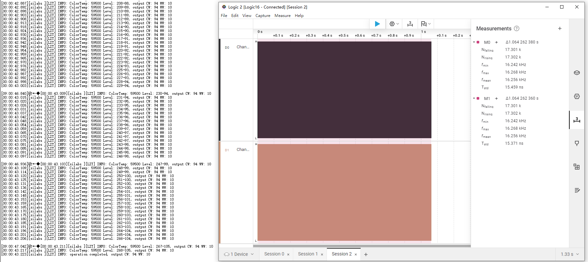
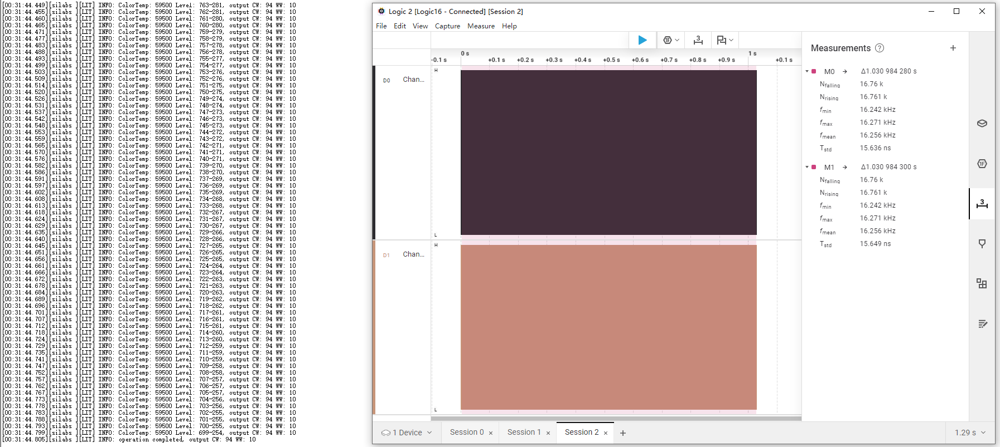
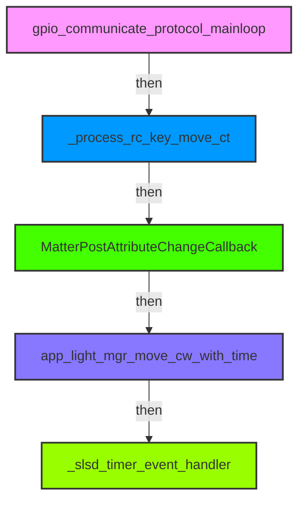

<!-- vscode-markdown-toc -->
* 1. [Code](#Code)
* 2. [Sign](#Sign)
* 3. [Flash](#Flash)
* 4. [Debug](#Debug)
* 5. [Track](#Track)
	* 5.1. [ Init](#Init)
	* 5.2. [ Switch](#Switch)

<!-- vscode-markdown-toc-config
	numbering=true
	autoSave=true
	/vscode-markdown-toc-config -->
<!-- /vscode-markdown-toc -->

[hrf](hrf.md)  
[reset](./files/ez/reset.md)  
[blink-test-code](./files/ez/blink-test-code.md)  
[Module-QRcode-20260526](./files/ez/Module-20260526.md)  

## 0. Serial Port
```c
//VCom,PA7-TX,PA8-RX
Baudrate:961200
```

##  1. <a name='Code'></a>Code
```c
git clone git@hoperf-matter:matter/customerproject/ez01_matter.git
```

##  2. <a name='Sign'></a>Sign
```c
cd C:\Si\ws\ez01_matter
python gen_ota.py
```
```c
PS C:\Si\ws\ez01_matter> cd "GNU ARM v12.2.1 - Default"
PS C:\Si\ws\ez01_matter\GNU ARM v12.2.1 - Default> ls
-a----          2026/1/4     16:11        2765722 ez01_matter-46b1d014.s37
-a----          2026/1/4     16:19        2765924 ez01_matter-signed-4c94a90f.s37
-a----          2026/1/4     16:19         568008 ez01_matter-signed.gbl
-a----          2026/1/4     16:19         568090 ez01_matter_0x1470_0xFF01-v0.0.12-signed-7457cdcb.ota
-a----          2026/1/4     16:08          16392 makefile
-a----          2026/1/4     16:08           2108 objects.mk
-a----          2026/1/4     16:08          10642 sources.mk
```
##  3. <a name='Flash'></a>Flash
```c
cd C:\Si\ws\ez01_matter\se_key\
```
Run unlock_se.bat first then do the programming.  
Flash the signed .s37
```c
ez01_matter-signed-4c94a90f.s37
```

##  4. <a name='Debug'></a>Debug
```c
LOG_MSG_INFO(TAG_LIT, "operation completed, output CW: %u WW: %u", c_temp, w_temp);
```
##  5. <a name='Track'></a>Track
###  5.1. <a name='Init'></a> Init
```c
CHIP_ERROR AppTask::Init()-AppTask.cpp
    app_light_mgr_init()-app_light_mgr.cpp
```
###  5.2. <a name='Switch'></a> Switch
```c
//C:\Si\ws\ez01_matter\src\app\AppTask.cpp
void AppTask::PdEventHandler(AppEvent * aEvent)
{
     static uint32_t low_count = 0;
     static uint32_t event_count = 0;
     static uint32_t high_count = 0;
     static uint8_t release_flag = 0;
     static uint8_t timeout_flag = 0;
     uint8_t cur_onoff = 0;
     event_count++;
     if(event_count >= 320 && release_flag == 1 && 0 == timeout_flag) {
         event_count = 0;
         timeout_flag = 1;
         _light_onoff_event_handler();//大于4s状态翻转
     }
}
```

## GPIO(PWM)
```c
#include "sl_gpio.h"
sl_gpio_t gpio;
gpio.port = SL_GPIO_PORT_A;
gpio.pin  = 5;
sl_gpio_set_pin_mode(&gpio, SL_GPIO_MODE_PUSH_PULL, 0);
gpio.port = SL_GPIO_PORT_A;
gpio.pin  = 6;
sl_gpio_set_pin_mode(&gpio, SL_GPIO_MODE_PUSH_PULL, 0);
```
```c
//Use TIMER0 for PWM
static sl_led_pwm_t cold_light = {
    .port     = gpioPortA,
    .pin      = 6,
    .level    = SL_SIMPLE_RGB_PWM_LED_LIGHT_RESOLUTION - 1,
    .polarity = 1,
    .channel  = 1,
#if defined(SL_SIMPLE_RGB_PWM_LED_LIGHT_GREEN_LOC)
    .location = SL_SIMPLE_RGB_PWM_LED_LIGHT_GREEN_LOC,
#endif
    .timer      = TIMER0,
    .frequency  = SL_SIMPLE_RGB_PWM_LED_LIGHT_FREQUENCY * 2,
    .resolution = SL_SIMPLE_RGB_PWM_LED_LIGHT_RESOLUTION,
};

static sl_led_pwm_t warm_light = {
    .port     = gpioPortA,
    .pin      = 5,
    .level    = 0,
    .polarity = 0,
    .channel  = 0,
#if defined(SL_SIMPLE_RGB_PWM_LED_LIGHT_BLUE_LOC)
    .location = SL_SIMPLE_RGB_PWM_LED_LIGHT_BLUE_LOC,
#endif
    .timer      = TIMER0,
    .frequency  = SL_SIMPLE_RGB_PWM_LED_LIGHT_FREQUENCY * 2,
    .resolution = SL_SIMPLE_RGB_PWM_LED_LIGHT_RESOLUTION,
};
```
## Part No.
```c
HPTSB01
```
```c
EFR32MG24A420F1536IM40
```
## HW
Hi7011 VDD 5.8V(-0.3~7.0V)
Hi7011 Pin2 PWM in
Hi7011 Pin5&6 LED Control -

R10 -> Hi7011 pin2  
R16 -> Hi7011 pin2  

## QR
[Default:MT:6FCJ142C00KA0648G00](https://project-chip.github.io/connectedhomeip/qrcode.html?data=MT%3A6FCJ142C00KA0648G00)  
[1号:MT:K2CA0WSC00UOGZ72M10](https://project-chip.github.io/connectedhomeip/qrcode.html?data=MT%3AK2CA0WSC00UOGZ72M10)  
[2号:MT:K2CA0YDG150LSN6MC10](https://project-chip.github.io/connectedhomeip/qrcode.html?data=MT%3AK2CA0YDG150LSN6MC10)  
[3号:MT:K2CA0AFT02KQ194RJ10](https://project-chip.github.io/connectedhomeip/qrcode.html?data=MT%3AK2CA0AFT02KQ194RJ10)  
[4号:MT:K2CA04QO161KD754L10](https://project-chip.github.io/connectedhomeip/qrcode.html?data=MT%3AK2CA04QO161KD754L10)  
[5号:MT:K2CA0C0X17IIIZ3MY10](https://project-chip.github.io/connectedhomeip/qrcode.html?data=MT%3AK2CA0C0X17IIIZ3MY10)  

## Customer Report Issue
1、PWM信号频率改为16KHZ  
2、最低占空比1%分辨率降低一半  
3、断电时来电记忆亮灯爆闪  
4、最小亮度时APP开灯和关断没有缓冲  

## Fade in&out
```c
static app_event_t slsd_timer_event;           // 缓起缓灭定时器
_slsd_timer_event_handler
ev_set_delay_ms(ev, SLSD_STEP_TIME_MS); // next
```
```c
void fade_cold_on(void) {
      cold_onoff = 1;
      ev_set_delay_ms(&test_run_event, 50);
}

void fade_cold_off(void) {
      cold_onoff = 0;
      ev_set_delay_ms(&test_run_event, 50);
}
```
## Remote
### Funcution Location
```c
C:\Si\ws\ez01_matter\src\app\app_rc_mgr.cpp
app_rc_mgr_init()
_process_rc_key_onoff()
_rc_data_notify_app_handler()
C:\Si\ws\ez01_matter\src\app\rc_protocol.cpp
rc_protocol_init()
_rc_protocol_data_decode()
```
### Relationship
```c
AppTask::Init()
    app_rc_mgr_init()
        rc_protocol_init(_rc_data_notify_callback)
            _rc_data_notify_app_handler()
                _process_rc_key_onoff()
                    cluster_api_onoff_server_set_onoff_value()

```
```c
rc_protocol_init()
    hal_rc_init(_rc_protocol_data_decode)
        _rc_protocol_data_decode()
    gpio_communicate_protocol_mainloop()
        _rc_notify_cb(remote_control_id, code)
            _rc_data_notify_callback()
                _rc_data_notify_app_handler()
```


## Bug
[Remote-turn-off](files/ez/Remote-turn-off.md)  
[blink](files/ez/blink.md)  
[blink2](files/ez/blink2.md)  

Blink at 
```c
[00:00:00.453][silabs ][LIT] INFO: target_brightness: 33, step_brightness:1
[00:00:00.453][silabs ][LIT] INFO: ColorTemp: 48500 Level: 33-28, output CW: 19 WW: 8
[00:00:00.458][silabs ][LIT] INFO: operation completed, output CW: 19 WW: 8
```
```c
typedef struct {
    uint32_t brightness;
    uint32_t pwm;

} slsd_model_entry_t;
```
```c
_slsd_timer_event_handler
    curve_brightness = calculate_curve_pwm(cur_brightness, slsd_entry_5s, sizeof(slsd_entry_5s) / sizeof(slsd_model_entry_t));

开始
  ↓
进入原子操作区（关中断）
  ↓
更新亮度/色温状态
  ↓
计算PWM输出值
  ↓
退出原子操作区（开中断）
  ↓
是否需要快速切换？ → 是 → 跳回next_sw（重新计算）
  ↓ 否
设置PWM输出
  ↓
检查是否完成渐变
  ↓
  是 → 执行完成回调/关闭灯光
  ↓
  否 → 设置下一次定时器触发
```    
```c
calulate_exp_table()
calulate_exp_table_warm()
calulate_exp_table_cold()
```
### 2KHz FW
```c
ez01_matter/release-fw/signfw/v0.0.12/ez01_matter-signed--V0.0.12-2-4e9ec2c3.s37
```
This FW, brightness < 20%, it also blink. Compare with the 16KHz FW(<50%), it shoud be better.  

## Reference
### Jiabo Info
需求可以总结为:
 - 双色温灯(CW+WW)，现在PWM查表递增，CW和WW都是指数分布,但从0到最小亮度(wW=8,CW=19)在视觉上不是同步渐变，而是存在WW先亮、CW随后才亮的先后感-体验不好
 - 希望代码"优化"，让视觉上Ww和CW渐变感觉更平滑，更"同步"
一、为什么会有渐变不同步的现象
1. 查表步数、起点不同
    - WW和CW分别用自己的查表，不等长/跨度不同(wW8步到8，CW20步到19)，且每步PWM增量不一致  
    - 程序for循环同步递增时，WW一下就到最小亮度，CW还在低级游荡-人眼感受到Ww先亮，Cw后亮  
2. "先后渐变"根本原因:
    - 没有做到在同一总渐变步长上，"两路曲线数值输出都同步走完整条渐变表"
    - 每次输出都是(cw_table[i],ww_table[i])，但i的终点不同，导致有一路提前到最大，后一路还在爬坡  
二、核心优化原理
办法A:拉步数&对输出(强烈推荐)
- 让Ww和CW的查表表长相同(长度取两者最大，例如20)
    - 短表用线性插值、末值补齐等方式补全
- 循环次数和i统一，每步都能输出CW/WW一个成对的PWM
- 效果:从0到亮，两个灯珠从头到尾共进退一视觉渐亮同步


## Timer Priority
```c
C:\Si\SDKs\simplicity_sdk_v2025.6.2\extension\matter_extension\third_party\matter_sdk\examples\platform\silabs\BaseApplication.cpp
constexpr osThreadAttr_t appTaskAttr = { .name       = APP_TASK_NAME,
                                         .attr_bits  = osThreadDetached,
                                         .cb_mem     = &appTaskControlBlock,
                                         .cb_size    = osThreadCbSize,
                                         .stack_mem  = appStack,
                                         .stack_size = APP_TASK_STACK_SIZE,
                                         .priority   = osPriorityNormal };

```

## Curve
```c
static uint32_t calculate_curve_pwm(uint32_t brightness, const slsd_model_entry_t * model, uint8_t model_entry_count)
{
    uint32_t res = 0;

    if (brightness >= model[0].brightness) {
        // Return with max pwm if brightness is greater than the max brightness in the model.
        res = model[0].pwm;
    } else if (brightness <= model[model_entry_count - 1].brightness) {
        // Return with min pwm if brightness is smaller than the min brightness in the model.
        res = model[model_entry_count - 1].pwm;
    } else {
        uint8_t i;
        // Otherwise find the 2 points in the model where the brightness level fits in between,
        // and do linear interpolation to get the estimated pwm value.
        for (i = 0; i < (model_entry_count - 1); i++) {
            if ((brightness < model[i].brightness) && (brightness >= model[i + 1].brightness)) {
                res = (brightness - model[i + 1].brightness) * (model[i].pwm - model[i + 1].pwm) /
                    (model[i].brightness - model[i + 1].brightness);
                res += model[i + 1].pwm;
                break;
            }
        }
    }

    return res;
}
//model[i+1].brightness（区间下限亮度）
//model[i].brightness（区间上限亮度）
//model[i+1].pwm（区间下限PWM）
//model[i].pwm（区间上限PWM）
```
```c
    curve_brightness = calculate_curve_pwm(cur_brightness, slsd_entry_5s, sizeof(slsd_entry_5s) / sizeof(slsd_model_entry_t));
    c_temp = static_cast<uint16_t>((curve_brightness * (cur_colortemp - min_colortemp)) / (max_colortemp - min_colortemp));
    w_temp = static_cast<uint16_t>((curve_brightness * (max_colortemp - min_colortemp - (cur_colortemp - min_colortemp))) /
                                   (max_colortemp - min_colortemp));
//总亮度 = 冷光亮度 + 暖光亮度 = c_temp + w_temp = curve_brightness
//色温比例计算
cold_ratio = (cur_colortemp - min_colortemp) / (max_colortemp - min_colortemp)
warm_ratio = 1 - cold_ratio
```   
```c
//直接对应两个PWM通道
_light_ll_set_level(c_temp, w_temp);
```                                

## PWM
### Adjust
```c
app_light_mgr_move_cw_with_time()
```
### Not in Matter Net
It does not blink.

<div align="center">
  
</div>

Control by app or press RC, it do blink.

<div align="center">
  
</div>

### CW
```c
//gpio_communicate_protocol_mainloop()
[11:05:59.411]  [00:07:38.811][silabs ][RCT] INFO: GC_RCV_DATA: RemoteControlID=00000 CODE=07
//_process_rc_key_move_ct()
[11:05:59.412]  [00:07:38.811][silabs ][RCT] INFO: CT 430, STEP 55
//MatterPostAttributeChangeCallback()
[11:05:59.413]  [00:07:38.812][silabs ][CLS] INFO: Callback: ColorControl ColorTemperature=430 current_level=77
//app_light_mgr_move_cw_with_time()
[11:05:59.414]  [00:07:38.812][silabs ][LIT] INFO: CT 23126->43000(100) BR 746->746(2)
//_slsd_timer_event_handler()
[11:06:00.519]  [00:07:39.919][silabs ][LIT] INFO: operation completed, output CW: 163 WW: 109

[11:06:24.149]  [00:08:03.547][silabs ][RCT] INFO: GC_RCV_DATA: RemoteControlID=00000 CODE=07
[11:06:24.150]  [00:08:03.547][silabs ][RCT] INFO: CT 485, STEP 55
[11:06:24.150]  [00:08:03.548][silabs ][CLS] INFO: Callback: ColorControl ColorTemperature=485 current_level=77
[11:06:24.151]  [00:08:03.548][silabs ][LIT] INFO: CT 43000->48500(28) BR 746->746(2)
[11:06:25.252]  [00:08:04.652][silabs ][LIT] INFO: operation completed, output CW: 191 WW: 81
```


## New Request @20260625
### 需求
PWM频率从16kHz降到5kHz，APP=1%时实际占空比从~0.6%提升到1.5%。  
背景：新硬件方案没有通讯干扰，低频PWM可行；暗端0.6%占空比灯光抖动，提高到1.5%后加电容滤波，最暗亮度依然够低。

### 最终改动（3处）

| 文件 | 改动 | 说明 |
|------|------|------|
| `src/hal/hal_light.h:13` | `SL_SIMPLE_RGB_PWM_LED_LIGHT_FREQUENCY` 16000→5000 | PWM频率5.4kHz |
| `src/app/app_light_mgr.cpp:19` | `SLSD_MIN_PWM_ADJ` = 36（原为公式算出的24） | 映射起点 |
| `src/app/app_light_mgr.cpp:60` | 曲线表插入 `{45, SLSD_MIN_PWM_ADJ}` | 最低亮度锚点 |

`SLSD_MIN_PWM` 保持为 1 不动——关灯 fade-out 路径依赖 `{1,1}` 作为渐变终点。

### PWM硬件配置
- TIMER0, Up/Down 模式（中心对齐PWM）
- 冷光 PA6 (CC1), polarity=1（反相）
- 暖光 PA5 (CC0), polarity=0
- 时钟源: EM01GRPACLK → HFRCODPLL → **78MHz**

### 频率与分辨率的关系
`_pwm_led_init()` (`hal_light.c:207-225`)：

```
top = 78MHz / (FREQ×2) - 1           // 频率→TOP，×2是Up/Down补偿
top = (top / (R-1)) × (R-1)          // 对齐到分辨率的整数倍
若 TOP < R-1 → TOP = R-1             // 分辨率优先
```

| 参数 | 旧 (16kHz) | 新 (5kHz) |
|------|-----------|----------|
| led->frequency | 32000 | 10000 |
| 计算 top | 2436 | 7799 |
| 对齐后 TOP | 2399 (1×2399) | 7197 (3×2399) |
| 实际频率 | 16.25kHz | **5.42kHz** |
| level_increments | 1 | 3 |

### TOP / Resolution / 占空比 三层结构
```
78MHz 时钟
  │
  ▼  TOP = 7197                 ← 硬件寄存器上限（频率决定）
  │
  ▼  level_increments = 7197/2399 = 3    ← 每软件步 = 3个硬件计数
  │
  ▼  Resolution = 2400          ← 软件刻度 0~2399
  │
  ▼  PWM比较值 = software_level × 3      ← hal_light_set_cw():258-261
  │
  ▼  占空比 ≈ software_level / 2400
```

- TOP 由频率决定（5kHz → 7197），是寄存器实际能到的最大值
- Resolution = 2400 是在 TOP 范围内的软件刻度，够用即可
- 代码位置：`hal_light.c:258` `level_increments = TIMER_TopGet() / (RESOLUTION-1)`
- 分辨率不改为 7000+ 的原因：2400 档已超肉眼极限，改大需全部宏和曲线表等比例重算，零实际收益

### 亮度映射链路
```
Matter Level(1~254) → target_brightness → 曲线查表(slsd_entry_5s) → c_temp+w_temp → hal_light_set_cw() → TIMER_CompareBufSet()
```

关键宏（`app_light_mgr.cpp`）：
```c
SLSD_MIN_PWM_ADJ = 36   // 映射起点，原公式 MIN_PWM_PERCENT*R/100=24，改为硬编码36
SLSD_MAX_PWM_ADJ = 2399 // 映射终点（不改）
SLSD_MIN_PWM      = 1   // 最低 clamp 值（不改，关灯路径需要）
```

映射公式：
```c
target_brightness = brightness × (2399-36) / 253 + 36
// Matter level 1→45, 127→1222, 254→2399
// clamp: if < SLSD_MIN_PWM(1) → = 1
```

### 曲线表 slsd_entry_5s[]（13段）
| # | brightness | pwm | 占空比 | 等效γ | Matter Level | 亮度% | 说明 |
|---|-----------|-----|--------|-------|-------------|-------|------|
| 0 | 2399 | 2399 | 100% | — | 253 | 99.6% | 最亮 |
| 1 | 2250 | 1900 | 79.2% | 3.64 | 237 | 93.3% | |
| 2 | 2000 | 1350 | 56.3% | 3.15 | 210 | 82.7% | |
| 3 | 1750 | 1000 | 41.7% | 2.78 | 183 | 72.0% | |
| 4 | 1500 | 750 | 31.3% | 2.47 | 156 | 61.4% | |
| 5 | 1250 | 550 | 22.9% | 2.26 | 130 | 51.2% | |
| 6 | 1000 | 400 | 16.7% | 2.05 | 103 | 40.6% | |
| 7 | 750 | 275 | 11.5% | 1.86 | 76 | 29.9% | |
| 8 | 500 | 175 | 7.3% | 1.67 | 50 | 19.7% | |
| 9 | 250 | 100 | 4.2% | 1.40 | 23 | 9.1% | |
| 10 | 100 | 60 | 2.5% | 1.16 | 7 | 2.8% | |
| 11 | **45** | **36** | **1.5%** | — | 1 | 0.4% | **新增**：level=1锚点 |
| 12 | 1 | 1 | 0.04% | — | 0 | 0% | fade-out终点（保留） |

Matter Level 与 brightness 的转换：`Level = (brightness - 36) × 253 / 2363`
亮度% = Level / 254 × 100

- 整体以 γ≈2.4 为主，亮端高γ压缩，暗端低γ抬尾防抖动
- `{45,36}` 中的 45 是 level=1 时的 target_brightness 值（1×2363/253+36=45）
- `{1,1}` 保留不动——关灯 fade-out 需要经此段平滑降到接近零，再由 `_light_ll_set_onoff(0)` 彻底关闭
- 色温拆分：`cold = curve × ratio`, `warm = curve × (1-ratio)`, 两路之和 = curve

### 曲线表 slsd_entry_5s[]（24段）
顶部 5 阶等距扩展为 16 阶（步长≈60），下部 8 阶保持不变。

| # | brightness | pwm | 占空比 | 等效γ | Matter Level | 亮度% | 说明 |
|---|-----------|-----|--------|-------|-------------|-------|------|
| 0 | 2399 | 2399 | 100% | — | 253 | 99.6% | 最亮 |
| 1 | 2340 | 2201 | 91.7% | 3.95 | 247 | 97.2% | 扩展 |
| 2 | 2280 | 2000 | 83.3% | 3.80 | 240 | 94.5% | 扩展 |
| 3 | 2220 | 1834 | 76.4% | 3.49 | 234 | 92.1% | 扩展 |
| 4 | 2160 | 1702 | 70.9% | 3.17 | 227 | 89.4% | 扩展 |
| 5 | 2100 | 1570 | 65.4% | 2.95 | 221 | 87.0% | 扩展 |
| 6 | 2040 | 1438 | 59.9% | 2.82 | 215 | 84.6% | 扩展 |
| 7 | 1980 | 1322 | 55.1% | 2.68 | 208 | 81.9% | 扩展 |
| 8 | 1920 | 1238 | 51.6% | 2.49 | 201 | 79.1% | 扩展 |
| 9 | 1860 | 1154 | 48.1% | 2.34 | 195 | 76.8% | 扩展 |
| 10 | 1800 | 1070 | 44.6% | 2.21 | 189 | 74.4% | 扩展 |
| 11 | 1740 | 990 | 41.2% | 2.08 | 182 | 71.7% | 扩展 |
| 12 | 1680 | 930 | 38.8% | 1.93 | 176 | 69.3% | 扩展 |
| 13 | 1620 | 870 | 36.2% | 1.81 | 170 | 66.9% | 扩展 |
| 14 | 1560 | 810 | 33.8% | 1.71 | 163 | 64.2% | 扩展 |
| 15 | 1500 | 750 | 31.3% | 1.62 | 157 | 61.8% | 扩展 |
| 16 | 1250 | 550 | 22.9% | 2.26 | 130 | 51.2% | |
| 17 | 1000 | 400 | 16.7% | 2.05 | 103 | 40.6% | |
| 18 | 750 | 275 | 11.5% | 1.86 | 76 | 29.9% | |
| 19 | 500 | 175 | 7.3% | 1.67 | 50 | 19.7% | |
| 20 | 250 | 100 | 4.2% | 1.40 | 23 | 9.1% | |
| 21 | 100 | 60 | 2.5% | 1.16 | 7 | 2.8% | |
| 22 | **45** | **36** | **1.5%** | — | 1 | 0.4% | level=1锚点 |
| 23 | 1 | 1 | 0.04% | — | 0 | 0% | fade-out终点 |

### 曲线表 slsd_entry_5s[]（用户定义，24段）
由用户提供的 254 级 PWM 数据抽取 24 个关键点生成。

| # | brightness | pwm | 占空比 | Matter Level | 亮度% | 说明 |
|---|-----------|-----|--------|-------------|-------|------|
| 0 | 2399 | 2399 | 100% | 253 | 99.6% | 最亮 |
| 1 | 2290 | 1969 | 82.0% | 241 | 94.9% | |
| 2 | 2181 | 1640 | 68.3% | 230 | 90.6% | |
| 3 | 2072 | 1343 | 56.0% | 218 | 85.8% | |
| 4 | 1963 | 1100 | 45.8% | 206 | 81.1% | |
| 5 | 1854 | 916 | 38.2% | 195 | 76.8% | |
| 6 | 1744 | 750 | 31.3% | 183 | 72.0% | |
| 7 | 1635 | 615 | 25.6% | 171 | 67.3% | |
| 8 | 1526 | 512 | 21.3% | 160 | 63.0% | |
| 9 | 1417 | 420 | 17.5% | 148 | 58.3% | |
| 10 | 1308 | 344 | 14.3% | 136 | 53.5% | |
| 11 | 1198 | 282 | 11.8% | 124 | 48.8% | |
| 12 | 1089 | 234 | 9.8% | 113 | 44.5% | |
| 13 | 980 | 192 | 8.0% | 101 | 39.8% | |
| 14 | 871 | 157 | 6.5% | 89 | 35.0% | |
| 15 | 762 | 131 | 5.5% | 78 | 30.7% | |
| 16 | 652 | 107 | 4.5% | 66 | 26.0% | |
| 17 | 543 | 87 | 3.6% | 54 | 21.3% | |
| 18 | 434 | 73 | 3.0% | 43 | 16.9% | |
| 19 | 325 | 59 | 2.5% | 31 | 12.2% | |
| 20 | 216 | 48 | 2.0% | 19 | 7.5% | |
| 21 | 106 | 39 | 1.6% | 7 | 2.8% | |
| 22 | **45** | **36** | **1.5%** | 1 | 0.4% | level=1锚点 |
| 23 | 1 | 1 | 0.04% | 0 | 0% | fade-out终点 |

### level=1 最终结果
```
target_brightness = 1 × 2363/253 + 36 = 45
curve_pwm(45): 45 落在 {100,60} 和 {45,36} 之间 → = 36
占空比 = 36/2400 = 1.50% ✓
```

### 夜灯（LIGHT_LEVEL_MIN_VALUE=1）PWM值
- 改前：target=33 → curve=20 → 占空比 0.83%（抖动）
- 改后：target=45 → curve=36 → 占空比 **1.50%**

---

# 凌动开关检测深度分析

## 代码位置速查

| 文件 | 行号 | 内容 |
|------|------|------|
| `src/app/AppTask.h:80-84` | 80-84 | PdEventHandler、PdTimerEventHandler、PdTimerInit 声明 |
| `src/app/AppTask.cpp:220-221` | 220-221 | 定时器周期 12ms（`gPdTimerPeriod = pdMS_TO_TICKS(12)`） |
| `src/app/AppTask.cpp:223-271` | 223-271 | **PdEventHandler 核心检测状态机** |
| `src/app/AppTask.cpp:273-280` | 273-280 | PdTimerEventHandler 定时器回调 |
| `src/app/AppTask.cpp:282-288` | 282-288 | PdTimerInit 定时器初始化 |
| `src/app/app_btn_mgr.cpp:91-102` | 91-102 | `_light_onoff_event_handler()` 翻转逻辑 |
| `src/app/app_light_mgr.cpp:194-247` | 194-247 | `app_light_mgr_onoff()` 开关灯执行 |
| `src/app/app_light_mgr.cpp:404-418` | 404-418 | `app_light_mgr_direct_off()` 直接关灯（仅改 RAM） |
| `src/app/app_light_mgr.cpp:140-183` | 140-183 | `_startup_timer_event_handler()` 上电启动恢复状态 |
| `src/hal/cluster_api.cpp:29-40` | 29-40 | `cluster_api_on_off_onoff_set()` 写 OnOff 属性（带锁） |
| `src/hal/cluster_api.cpp:104-113` | 104-113 | `cluster_api_onoff_server_set_onoff_value()` 写 OnOff（不带锁） |
| `src/hal/cluster_api.cpp:68-102` | 68-102 | `cluster_api_on_off_startup_onoff_get()` 上电启动策略 |
| `src/app/ZclCallbacks.cpp:41-78` | 41-78 | `_attr_lock` 重入锁 + `MatterPostAttributeChangeCallback` |

---

## 一、检测原理

### 1.1 硬件原理

凌动开关是一种**自复位（瞬动）墙壁开关**——按下时瞬间切断灯具的交流供电，松手后自动恢复。灯具硬件上有一颗**储能电容**，在交流断电的短暂时间内继续给 MCU 供电，使 MCU 能检测到断电事件。

`app_btn_mgr_btn_is_pressed()` 读取的 GPIO 本质上是**交流电源状态检测脚**：
- **返回 false（LOW）** → 交流断电，开关被按下
- **返回 true（HIGH）** → 交流有电，开关松开

### 1.2 定时器与状态变量

每 **12ms** 定时器触发一次 `PdEventHandler()`：

```cpp
// AppTask.cpp:220-221
osTimerId_t gPdTimer;
constexpr uint32_t gPdTimerPeriod = static_cast<uint32_t>(pdMS_TO_TICKS(12));    // 12 ms
```

| 变量 | 含义 |
|------|------|
| `low_count` | 连续低电平（断电）的采样次数 |
| `high_count` | 连续高电平（有电）的采样次数 |
| `event_count` | 进入"按下"确认后的持续计时 |
| `release_flag` | `0`=空闲，`1`=灯开→关已执行，`2`=灯关→开等待中 |
| `timeout_flag` | `1`=已执行超时翻转，防止重复翻转 |

### 1.3 正常操作流程（凌动开关短按）

```
t=0        用户按下 → GPIO LOW
t=144ms    low_count >= 12（12×12ms），确认按下有效
           → cluster_api_on_off_onoff_get(1, &cur_onoff)  // 读 NVM3 OnOff
           → _light_onoff_event_handler()                 // 翻转
             → app_light_mgr_onoff(new_value, LIGHT_ACTION_BUTTON)
               → 写 OnOff 属性到 NVM3 + 执行 PWM 开关
t≈300ms    用户松手 → GPIO HIGH
           → high_count >= 3（3×12ms=36ms），复位所有计数器
```

### 1.4 为什么通过 Matter 属性读写

**OnOff 状态以 NVM3 中的 Matter 属性为唯一数据源**。RC 遥控、Matter 控制器、物理按键、凌动检测、上电启动恢复全部共享同一份 NVM3 持久化状态，不存在独立的内存影子变量。

```cpp
// AppTask.cpp:247 — PD 检测读的是 NVM3 持久化的 Matter OnOff 属性
cluster_api_on_off_onoff_get(1, &cur_onoff);

// app_btn_mgr.cpp:96-99 — 翻转后通过 Matter SDK 写回 NVM3
cluster_api_on_off_onoff_get(1, &onoff);
new_value = !onoff;
app_light_mgr_onoff(new_value, LIGHT_ACTION_BUTTON);
```

读写 Matter 属性的 SDK 调用会自动触发：
1. NVM3 持久化写入
2. 属性变更回调 `MatterPostAttributeChangeCallback`（受 `_attr_lock` 保护，防止重入）
3. Matter 订阅者网络上报

---

## 二、电网断电误触发分析

### 2.1 核心问题

凌动开关（短时断电 ~300ms）和电网真实断电在 GPIO 上**完全不可区分**——两者都表现为 LOW。唯一的区别是**持续时间**：

| 事件 | GPIO LOW 持续时间 |
|------|:---:|
| 凌动开关正常操作 | ~200~500ms（用户松手即恢复） |
| 电网真实断电 | 无限长（直到来电） |

### 2.2 1.8s 超时自校正机制（核心设计）

代码注释直接揭示了设计意图（`AppTask.cpp:232-233`）：

```cpp
//Change to 240 from 320,due to minimum decharge time is 3 sencond(250), add some margin.
//Some device need to change to 150(1.8S) for keep the status,it discharge too fast.
```

**"decharge"（电容放电）** 是关键词。阈值演变历史：**320→240→150**（3.84s→2.88s→1.8s），完全根据实际设备的电容放电时间校准。

自校正逻辑（`AppTask.cpp:234-238`）：

```cpp
if(event_count >= 150 && release_flag == 1 && 0 == timeout_flag) {
    event_count = 0;
    timeout_flag = 1;
    _light_onoff_event_handler();  // 状态翻转回去！
}
```

触发条件：`release_flag == 1`（灯开→关后）且持续断电超过 1.8s。这意味着一开始误判为凌动开关、关了灯写了 NVM3，但 1.8s 后电还没来 → 意识到"这不是凌动开关，是电网断电"→ 翻转回去。

---

### 2.3 场景一：灯开着 → 电网断电 → 电容撑过 1.8s（正常恢复）✅

```
时间轴:

t=0ms      电网断电，OnOff=1（NVM3），灯实际亮着
           ↓
t=144ms    low_count>=12，误判为凌动"按下"
           cluster_api_on_off_onoff_get() → 读到 OnOff=1
           cur_onoff=1 → release_flag=1（on→off）
           _light_onoff_event_handler():
             onoff=1 → new_value=0
             app_light_mgr_onoff(0, BUTTON):
               cluster_api_on_off_onoff_set(1, 0)  → NVM3: OnOff=0 ⚠️ 误写
               app_light_mgr_direct_off()            → 仅改 RAM cur_brightness=0
           event_count=0，开始计时
           ↓
t=1800ms   event_count>=150 && release_flag==1 && timeout_flag==0
           _light_onoff_event_handler():
             cluster_api_on_off_onoff_get() → 读到 OnOff=0
             new_value=1
             app_light_mgr_onoff(1, BUTTON):
               cluster_api_onoff_server_set_onoff_value(1, 1, false)
                 → NVM3: OnOff=1 ✓ 恢复！
               _light_ll_set_onoff(1)  → 无实际效果（没电）
           timeout_flag=1，防止再次翻转
           ↓
数秒后     电容放光，MCU 掉电
           NVM3 状态: OnOff=1, CurrentLevel=原值, ColorTemperatureMireds=原值
           ↓
来电后     _startup_timer_event_handler() 触发（200ms 延迟）
           cluster_api_on_off_startup_onoff_get():
             StartUpOnOff == null → 读 OnOff 属性 = 1
           app_light_mgr_onoff(1, BUTTON) → 开灯
           app_light_mgr_move_cw_with_time(cur_ct, current_level, 3000ms) → 3s 渐变恢复

结果: ✅ 全部恢复正确（开关状态、色温、亮度）
```

**关键证据：**

**(a) StartUpOnOff=null 时直接用 NVM3 持久化的 OnOff 值：**

```cpp
// cluster_api.cpp:68-96
cluster_api_on_off_startup_onoff_get(uint8_t endpoint, uint8_t * value)
{
    DataModel::Nullable<OnOff::StartUpOnOffEnum> startUpOnOff;
    OnOff::Attributes::StartUpOnOff::Get(endpoint, startUpOnOff);
    
    bool updatedOnOff = false;
    OnOff::Attributes::OnOff::Get(endpoint, &updatedOnOff);  // 读 NVM3 OnOff
    
    if (!startUpOnOff.IsNull()) {
        // StartUpOnOff 有值时按策略覆盖
        switch (startUpOnOff.Value()) {
        case kOff:    updatedOnOff = false; break;
        case kOn:     updatedOnOff = true;  break;
        case kToggle: updatedOnOff = !updatedOnOff; break;
        }
    }
    // StartUpOnOff 为 null → updatedOnOff 保持 NVM3 中的原始值不变
    *value = static_cast<uint8_t>(updatedOnOff);
}
```

**(b) 上电恢复色温和亮度：**

```cpp
// app_light_mgr.cpp:166-169
if (startup_onoff_value) {
    app_light_mgr_onoff(1, LIGHT_ACTION_BUTTON);
    app_light_mgr_move_cw_with_time(cur_ct, current_level, SLSD_ONOFF_TRANSITION_TIME_MS);
    // cur_ct 和 current_level 都从 NVM3 持久化属性读出
}
```

**(c) `app_light_mgr_direct_off()` 不改 NVM3：**

```cpp
// app_light_mgr.cpp:404-418
void app_light_mgr_direct_off(void)
{
    CORE_DECLARE_IRQ_STATE;
    ev_set_inactive(&slsd_timer_event);
    CORE_ENTER_ATOMIC();
    cur_brightness   = 0;                // ← RAM 变量
    target_colortemp = cur_colortemp;    // ← RAM 变量
    _light_ll_set_onoff(0);              // ← PWM 硬件，非 NVM3
    CORE_EXIT_ATOMIC();
}
```

**(d) timeout 只在 `release_flag == 1` 时触发：**

```cpp
// AppTask.cpp:234
if(event_count >= 150 && release_flag == 1 && 0 == timeout_flag) {
    // 只在"灯开→关"后触发，用于把误关的灯重新翻回去
    _light_onoff_event_handler();
}
```

---

### 2.4 场景二：灯开着 → 电网断电 → 电容在 144ms~1.8s 间死掉（最坏情况）❌

```
时间轴:

t=0ms      电网断电，OnOff=1（NVM3）
           ↓
t=144ms    low_count>=12，误判为凌动"按下"
           → OnOff 被翻转为 0，写入 NVM3 ⚠️
           → event_count 从 0 开始计数
           ↓
t≈500ms    电容提前放光！MCU 掉电
           timeout 还没来得及触发（需要 1.8s）
           NVM3 状态: OnOff=0 ⚠️ 错误！
                      CurrentLevel=原值（未被修改过）
                      ColorTemperatureMireds=原值（未被修改过）
           ↓
来电后     _startup_timer_event_handler()
           StartUpOnOff=null → 读 OnOff=0
           app_light_mgr_onoff(0, BUTTON) → 灯不亮！
           
结果: ❌ 灯本来是开的，来电后不亮（OnOff 状态错乱）
         但如果用户手动开灯（APP/遥控/按键），色温和亮度仍能恢复原值
```

**这是设计上已知的风险窗口**，也正是 timeout 从 320→240→150 不断缩短的原因。注释"it discharge too fast"说明：不同设备的电容放电速度差异大，电容放得太快的设备存在这个窗口期风险。

**风险窗口量化：**

| 电容放光时间 t | OnOff 状态 | 结论 |
|:---:|:---:|:---:|
| t < 144ms | 未被修改 | ✅ 安全（检测未触发） |
| 144ms < t < 1.8s | 被错误覆盖为 0 | ❌ 最坏情况 |
| t > 1.8s | timeout 恢复为 1 | ✅ 安全（自校正成功） |

---

### 2.5 场景三：灯关着 → 电网断电（完全无损）✅

```
时间轴:

t=0ms      电网断电，OnOff=0（NVM3）
           ↓
t=144ms    low_count>=12，确认"按下"
           cluster_api_on_off_onoff_get() → 读到 OnOff=0
           cur_onoff=0 → release_flag=2（off→on，等待上电）
           ⚠️ 不调用 _light_onoff_event_handler()！
           ⚠️ 不写 NVM3！OnOff 保持 0
           ↓
持续断电    event_count 增长，但 timeout 条件要求 release_flag==1，不满足
           电容放光，MCU 掉电
           NVM3: OnOff=0（从未被修改）
                 CurrentLevel=原值（从未被修改）
                 ColorTemperatureMireds=原值（从未被修改）
           ↓
来电后     StartUpOnOff=null → 读 OnOff=0 → 灯保持关

结果: ✅ 完全正确，无任何影响
```

**关键保护逻辑：**

```cpp
// AppTask.cpp:248-253
if(cur_onoff) {                   // 灯当前开
    release_flag = 1;             // on→off，立即关灯
    _light_onoff_event_handler();
} else {                          // 灯当前关
    release_flag = 2;             // off→on，等待松手（GPIO HIGH）
    // 不写 NVM3！不操作灯！
}
```

当 `cur_onoff=0`（灯原本关着），PD 设 `release_flag=2` 并**等待 GPIO 恢复 HIGH 才执行开灯**。电网断电时 GPIO 永远不会恢复 HIGH，所以 NVM3 从未被写入。这是设计的第二重保护。

```cpp
// AppTask.cpp:259 — 只有 GPIO 恢复 HIGH 时才执行
if(release_flag==2 && high_count >= 3) {
    _light_onoff_event_handler();  // 开灯
}
```

---

## 三、色温和亮度影响分析

### 3.1 结论：色温和亮度不受电网断电影响

**PD 检测链路只修改 OnOff 属性，不触碰 LevelControl 和 ColorControl。**

| 操作 | 写 NVM3 OnOff | 写 NVM3 CurrentLevel | 写 NVM3 ColorTemperatureMireds |
|------|:---:|:---:|:---:|
| `_light_onoff_event_handler()` | ✅ | ❌ | ❌ |
| `app_light_mgr_onoff(new_value, BUTTON)` — ON | ✅ | ❌ | ❌ |
| `app_light_mgr_onoff(new_value, BUTTON)` — OFF | ✅ (`cluster_api_on_off_onoff_set`) | ❌ | ❌ |
| `app_light_mgr_direct_off()` | ❌ | ❌（仅改 RAM `cur_brightness`） | ❌（仅改 RAM `target_colortemp`） |
| `cluster_api_on_off_onoff_set(1, 0)` | ✅ | ❌ | ❌ |
| `cluster_api_onoff_server_set_onoff_value(1, 1, false)` | ✅ | ❌ | ❌ |

CurrentLevel 和 ColorTemperatureMireds 只由以下途径修改：
- Matter 控制器下发指令（APP 调亮度/色温）
- RC 遥控操作（`_process_rc_key_move_lvl` / `_process_rc_key_move_ct`）
- 物理按键长按调光/调色温

它们标记了 `"storageOption": "NVM"`（ZAP 配置），自动被 Matter SDK 持久化到 NVM3，并在上电时恢复。

### 3.2 上电恢复链路

```cpp
// app_light_mgr.cpp:140-183
static void _startup_timer_event_handler(app_event_t * ev)
{
    // 从 NVM3 读取色温
    cluster_api_color_control_color_temperature_mireds_get(1, &cur_ct);
    // 从 NVM3 读取亮度
    cluster_api_level_control_curent_level_get(1, &current_level);

    cluster_api_on_off_startup_onoff_get(APP_ENDPOINT_LIGHT, &startup_onoff_value);

    if (startup_onoff_value) {
        app_light_mgr_onoff(1, LIGHT_ACTION_BUTTON);
        app_light_mgr_move_cw_with_time(cur_ct, current_level, SLSD_ONOFF_TRANSITION_TIME_MS);
    } else {
        app_light_mgr_onoff(0, LIGHT_ACTION_BUTTON);
        if (_frst_factory_reset_read_status()) {
            _frst_factory_reset_clear();
            app_light_mgr_onoff(1, LIGHT_ACTION_BUTTON);
            app_light_mgr_move_cw_with_time(cur_ct, current_level, SLSD_ONOFF_TRANSITION_TIME_MS);
        }
    }
}
```

---

## 四、`_attr_lock` 重入保护机制

为防止写属性时触发 `MatterPostAttributeChangeCallback` 造成递归调用，项目使用了属性锁：

```cpp
// ZclCallbacks.cpp:41-63
static uint32_t _attr_lock = 0;

void zcl_cb_attr_lock(void) {
    CORE_ATOMIC_SECTION(_attr_lock++;)
}

void zcl_cb_attr_unlock(void) {
    CORE_ATOMIC_SECTION(if (_attr_lock) { _attr_lock--; })
}

void MatterPostAttributeChangeCallback(...) {
    // 本地更改的属性，跳过回调
    if (_attr_lock) {
        return;
    }
    // 处理回调时重新加锁，防止嵌套
    zcl_cb_attr_lock();
    // ... 分发到各 cluster 处理 ...
    zcl_cb_attr_unlock();
}
```

**不同操作路径的锁策略：**

| 操作 | 是否加锁 | 说明 |
|------|:---:|------|
| `cluster_api_on_off_onoff_set(1, 0)` — BUTTON OFF | ✅ 加锁 | `zcl_cb_attr_lock()` → `Set()` → `zcl_cb_attr_unlock()` |
| `cluster_api_onoff_server_set_onoff_value(1, 1, false)` — BUTTON ON | ❌ 不加锁 | 直接调用 SDK `setOnOffValue` |
| RC 遥控操作 | ❌ 不加锁 | 依赖回调链来执行 PWM 渐变 |
| Matter 控制器 | ❌ 不加锁 | 依赖回调链来执行 PWM 渐变 |

**BUTTON ON 不加锁的原因：** `OnOffServer::setOnOffValue` 触发 `MatterPostAttributeChangeCallback` → 50ms 延迟 → `app_light_mgr_onoff(1, LIGHT_ACTION_ATTRIBUTE)` → 读取 CurrentLevel 和 ColorTemperatureMireds → 执行 `app_light_mgr_move_cw_with_time()` 恢复渐变。这个延迟回调路径是实现 BUTTON ON 后自动恢复色温和亮度的机制。

**BUTTON OFF 加锁的原因：** 关灯通过 `app_light_mgr_direct_off()` 直接切断 PWM，不需要走回调渐变路径。加锁防止回调节外生枝。

---

## 五、状态切换总览表

| 断电前灯状态 | 电容存活时间 | 来电后 OnOff | 来电后色温 | 来电后亮度 | 结论 |
|:---:|:---:|:---:|:---:|:---:|:---:|
| 开 | >1.8s | 开 ✅ | 正确 ✅ | 正确 ✅ | timeout 翻转回去 |
| 开 | 144ms~1.8s | 关 ❌ | 正确 ✅（灯不亮不可见） | 正确 ✅（灯不亮不可见） | NVM3 被误覆盖 |
| 开 | <144ms | 开 ✅ | 正确 ✅ | 正确 ✅ | 检测未触发 |
| 关 | 任意 | 关 ✅ | 正确 ✅ | 正确 ✅ | release_flag=2 不写 NVM3 |

---

## 六、设计要点总结

1. **NVM3 为唯一数据源**：OnOff、CurrentLevel、ColorTemperatureMireds 全部持久化在 Matter 属性中（`"storageOption": "NVM"`），不存在内存影子变量。RC 遥控、Matter 控制器、按键、PD 检测、上电启动全部共享同一份状态。

2. **144ms 防抖**（`low_count >= 12 × 12ms`）：滤除电网杂波和瞬时扰动（电容撑不过 144ms 的极短断电不触发任何检测）。

3. **1.8s 超时自校正**（`event_count >= 150 × 12ms`）：这是区分凌动开关和电网断电的核心。少于 1.8s 恢复 = 凌动开关，超过 1.8s 仍断电 = 电网断电 → 自动翻转回去。阈值由电容放电实验决定，从 320→240→150 逐步缩短。

4. **`timeout_flag` 单次触发**：防止电容苟延残喘期间反复翻转状态。

5. **灯关时不写 NVM3**（`release_flag=2` 等待 GPIO HIGH）：即使电网断电，关灯状态永不损坏，不需要 timeout 保护。这是代码的**非对称保护**——只保护"灯开"场景。

6. **色温和亮度零风险**：PD 检测链路只操作 OnOff 属性，不触碰 LevelControl 和 ColorControl 属性。

7. **电容放电时间是硬约束**：144ms~1.8s 是风险窗口。电容必须在 1.8s 以上才能保证 100% 不掉状态。所有低于此电容的设备都存在小概率状态丢失风险（概率 = 电网断电恰好发生在灯开时 × 电容撑不到 1.8s）。

## 凌动开关检测

凌动开关检测位于 `src/app/AppTask.cpp:223-271`（`AppTask::PdEventHandler`），通过 12ms 周期定时器轮询交流电源检测 GPIO。这是一个**带自校正能力的断电检测状态机**，核心机制分为三层：

**第一层 — 144ms 防抖确认**（`low_count >= 12`）：连续 12 次读到 LOW（交流断电）才确认"按键有效"，滤除电网杂波和瞬时扰动。电容撑不过 144ms 的极短断电不触发任何检测，NVM3 完全不受影响。

**第二层 — 即时状态切换**：确认按键后，从 NVM3 持久化的 Matter OnOff 属性读取当前灯状态，翻转后写回 NVM3 并执行 PWM 开关。选择读/写 Matter 属性而非内存变量的原因是：OnOff 状态是 Matter cluster 的 NVM3 持久化属性，作为全系统唯一数据源——RC 遥控、Matter 控制器、物理按键、PD 检测、上电启动恢复全部共享同一份状态（`"storageOption": "NVM"`），不存在独立内存影子变量。写属性经 Matter SDK 自动触发 NVM3 持久化 + 属性变更回调 + 订阅者网络上报。

**第三层 — 1.8s 超时自校正**：这是区分凌动开关和电网真实断电的关键。两者在 GPIO 上都表现为 LOW，唯一区别是持续时间——凌动开关通常 <1s，电网断电无限长。PD 确认后立即翻转状态并写 NVM3（假设是凌动开关），但如果 1.8s 后 GPIO 仍未恢复 HIGH（说明是电网断电），则再次翻转回去，将 NVM3 恢复为原始值。这样来电后 `_startup_timer_event_handler()` 通过 `cluster_api_on_off_startup_onoff_get()`（StartUpOnOff=null → 直接用持久化值）读到的 OnOff 属性仍是断电前的正确状态，随后 `app_light_mgr_move_cw_with_time(cur_ct, current_level, 3000)` 恢复色温和亮度。

**1.8s 阈值由电容放电时间决定**（代码注释 `AppTask.cpp:232-233`）：阈值从最初的 320（3.84s）降至 240（2.88s）再降至 150（1.8s），原因是一些设备的储能电容放电较快，必须缩短 timeout 才能赶在电容死掉之前完成 NVM3 回写。如果在 144ms~1.8s 窗口内电容就放光了（场景二），NVM3 中的 OnOff 可能被错误覆盖为"关"，导致来电后灯不亮——这是设计上已知且无法完全消除的风险窗口，概率 = 电网断电恰好发生在灯开时 × 电容撑不到 1.8s。灯原本关着时完全不受影响（场景三），因为 PD 设 `release_flag=2` 等待 GPIO 恢复 HIGH 才执行开灯，电网断电时 GPIO 永远不会恢复 HIGH，NVM3 从未被写入——这是代码的非对称保护设计。色温和亮度在**所有场景**下均不受任何影响——PD 检测链路只操作 OnOff 属性（通过 `cluster_api_on_off_onoff_set` 或 `cluster_api_onoff_server_set_onoff_value`），不触碰 LevelControl 和 ColorControl 属性，`app_light_mgr_direct_off()` 也只修改 RAM 变量（`cur_brightness`、`target_colortemp`）和 PWM 硬件寄存器。
