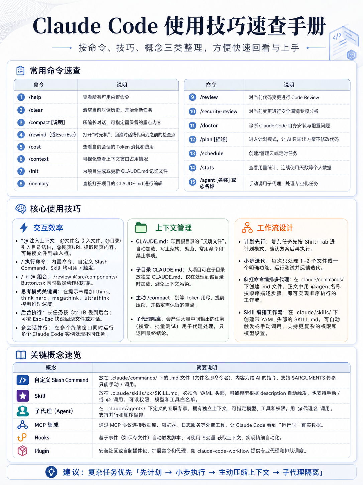

# Qwen Code
## Website
https://help.aliyun.com/zh/model-studio/qwen-code  
## Installation
```c
npm install -g @qwen-code/qwen-code@latest
qwen --version
```
```c
curl -fsSL -o %TEMP%\install-qwen.bat https://qwen-code-assets.oss-cn-hangzhou.aliyuncs.com/installation/install-qwen.bat && %TEMP%\install-qwen.bat --source bailian
```
## config
[settings-ali-qwen](./qwen/settings-ali-qwen.md)  
[settings-ds](./qwen/settings-ds.md)  


# Claude Code(GLM)
## Website
https://bigmodel.cn/glm-coding  
https://z.ai/manage-apikey/subscription  
https://docs.bigmodel.cn/cn/guide/develop/claude/introduction  
https://z.ai/subscribe?utm_source=zai&utm_medium=index&utm_term=glm-coding-plan&utm_campaign=Platform_Ops&_channel_track_key=6lShUDnv  

## Installation
```c
npm install -g @anthropic-ai/claude-code
```
## config
[settings-glm](./claude/settings-glm.md)  
[settings-ali-glm](./claude/settings-ali-glm.md)  
[settings-ali-qwen](./claude/settings-ali-qwen.md)  
[settings-ali-ds](./claude/settings-ali-ds.md)  
[settings-ds](./claude/settings-ds.md)   

## Skill

```c
/plugin marketplace add forrestchang/andrej-karpathy-skills
/plugin install andrej-karpathy-skills@karpathy-skills
/plugin install document-skills@anthropic-agent-skills
/plugins list --marketplace fullstack-dev-skills
```

```c
curl -o CLAUDE.md https://raw.githubusercontent.com/forrestchang/andrej-karpathy-skills/main/CLAUDE.md
```

## Tips
<div align="center">
  
</div>

## CMD
```c
claude mcp list

Checking MCP server health…

codegraph: codegraph serve --mcp - ✓ Connected
You have 1 MCP server configured and running:

Server	Status
codegraph	Connected
```
```c
claude mcp remove zai-mcp-server
```

# Codex
## Website
https://help.aliyun.com/zh/model-studio/qwen-code  
## Installation
```c
npm install -g @openai/codex@0.80.0
codex --version
```
## config
[config-ds](./codex/config-ds.md)  