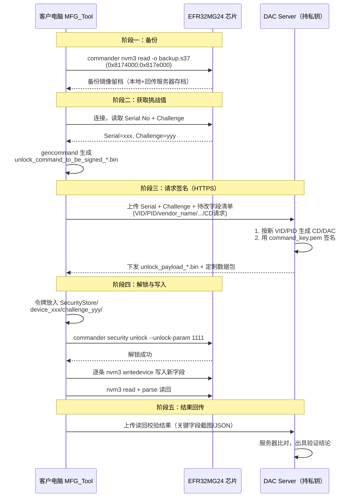

# 模块客户化定制（CD/产品信息）

## 1. 概述
### 1.1 背景
奥科的产品涉及**转 CD（Certification Declaration / 认证声明）给其客户**。  
模块在我司完成生产（烧录固件、CD、DAC、产品信息）后，交付到客户手中时，客户需要有能力修改以下出厂定制数据：
- <font color="#dd00dd">**Vendor ID**（厂商ID）</font>
- <font color="#dd00dd">**Product ID**（产品ID）</font>
- <font color="#dd00dd">**Vendor name**（厂商名称）</font>
- <font color="#dd00dd">**Product name**（产品名称/型号名称）</font>
- **Product label**（产品标签）
- **Product url**（产品URL）
- <font color="#dd00dd">**CD**（认证声明）</font>

<div align="left">
  
</div>

### 1.2 目的
设计一套**安全、私钥不泄露**的客户化定制接口方案, **MFG_Tool 更新（JSON 配置）** 以支持 JSON 配置方式定义待修改字段，自动完成 NVM3 读写 
### 1.3 核心安全原则
1. **签名私钥（command_key.pem）永不泄露**——客户电脑只持有一次性令牌（unlock_payload_*.bin）；
2. **Challenge-Response 解锁**——每次解锁必须由服务器对芯片当前 Challenge 签名，令牌与芯片序列号 + Challenge 绑定；
3. **NVM3 修改前先备份**——任何写入操作前读取完整 NVM3 镜像留档；
4. **写后清除一次性令牌**——写入后清除令牌，保证常态下不可访问敏感区域。

## 2. 术语定义
| 术语 | 全称 / 解释 |
|---|---|
| NVM3 | Non-Volatile Memory #3，Silicon Labs 非易失性键值存储区 |
| CD | Certification Declaration / DAC（Device Attestation Certificate）|
| VID / PID | Matter Vendor ID / Product ID（uint16） |
| Challenge | 芯片安全解锁的随机挑战值，用于生成一次性签名请求 |
| SecurityStore | Commander 在客户电脑查找令牌的本地目录 |
| MFG_Tool | 我司生产/定制上位机工具（本次需更新 JSON 配置支持） |
| DAC Server | 我司持有签名密钥、负责生成证书与签名的服务器 |

## 4. NVM3 数据布局与字段映射
### 4.1 NVM3 区域
- 地址范围：`0x08174000 - 0x0817E000`（40960 B）
- **CD 等证书数据存放在最后一个 page(NVM3 之后)**
- Security mode: none（解锁后可直接读写）
### 4.2 关键 Key 映射表
| NVM3 Key | 类型 | 长度(Byte) | 实测内容（ASCII 解析） | 推断字段 | 客户可否修改 |
|---|---|---|---|---|---|
| `0x87200` | Data | 16 | `0ECB29B3...` | 模块序列号 / Serial | 不可改 |
| `0x87204` | Data | 8 | `20260907` | 生产日期 | 不可改 |
| `0x87205` | Data | 11 | `D0 A4 28 80 41 E0 81 FF ...` | SetupPayloadBitSet | 不可改 |
| `0x87207` | Data | 2 | `0F 0C` | SetupDiscriminator | 不可改 |
| `0x8720b` | Data | 2 | `05 30` | **VID**（小端 0x3005） | 可改  |
| `0x8720c` | Data | 2 | `9A 14` | **PID**（小端 0x149A） | 可改  |
| `0x8720d` | Data | 4 | `A-OK` | **vendor name** | 可改  |
| `0x8720e` | Data | 15 | `Window C...` | **product name** | 可改  |
| `0x8720f` | Data | 4 | `V1.0` | 软件版本 | 不可改 |
| `0x87210` | Data | 15 | `Window C...` | **product label** | 可改  |
| `0x87211` | Data | 22 | `https://...` | **product url** | 可改  |
| `0x87212` | Data | 15 | `Window C...` | **part number** | 不可改  |
| `0x87218` | Data | 2 | `01 00` | HardwareVersion | 不可改 |
| `0x87226` | Data | 4 | `00 14 00 00` | **CD 证书数据块 offset** | 可改 |
### 4.3 修改约束
- 字符串类字段（vendor_name 等）：写入字节长度 **不得大于** 原 NVM3 对象长度，超长需重新分配对象（工具需做长度预校验）；
- VID/PID 为 2 字节小端 uint16；
- 修改动作必须按 Key 粒度执行 `commander nvm3 writedevice`，**禁止整区擦除重写**（保留其他出厂数据）。

## 5. 客户端修改流程（MFG_Tool）
### 5.1 总体流程


#### 5.2.3 关键命令参考
```c
C:\Users\huide>commander nvm3 read -o nvm3.s37 --device efr32mg24 --range 0x8174000:0x817e000
Reconfiguring debug connection with detected device part number: EFR32MG24A410F1536IM40
Found NVM3 range: 0x08174000 - 0x0817e000. Security mode: none
Reading 40960 bytes from 0x08174000...
Writing to nvm3.s37...
DONE

C:\Users\huide>commander nvm3 parse nvm3.s37 --key 0x08720D
Parsing file nvm3.s37...
Found NVM3 range: 0x08174000 - 0x0817E000
Using 4096 B as maximum object size, based on given size of NVM3 area.
Matching NVM3 objects:
Key   : 0x8720d (553485)
Type  : Data
Length: 4 B
Data  :
{address:  0  1  2  3  4  5  6  7  8  9  A  B  C  D  E  F}
00000000: 41 2D 4F 4B -- -- -- -- -- -- -- -- -- -- -- --
NVM3 erase count: 1
DONE

C:\Users\huide>commander nvm3 writedevice --object 0x08720D:424B --device EFR32MG24B210F1536IM48
Setting NVM3 object: 0x8720d = 424B
Found NVM3 range: 0x08170000 - 0x0817e000. Security mode: none
Using 4096 B as maximum object size, based on given size of NVM3 area.
Flashing modified NVM3 (57344 bytes) to 0x08170000...
DONE

C:\Users\huide>commander nvm3 read -o nvm3-bk.s37 --device efr32mg24 --range 0x8174000:0x817e000
Reconfiguring debug connection with detected device part number: EFR32MG24A410F1536IM40
Found NVM3 range: 0x08174000 - 0x0817e000. Security mode: none
Reading 40960 bytes from 0x08174000...
Writing to nvm3-bk.s37...
DONE

C:\Users\huide>commander nvm3 parse nvm3-bk.s37 --key 0x08720D
Parsing file nvm3-bk.s37...
Found NVM3 range: 0x08174000 - 0x0817E000
Using 4096 B as maximum object size, based on given size of NVM3 area.
Matching NVM3 objects:
Key   : 0x8720d (553485)
Type  : Data
Length: 2 B
Data  :
{address:  0  1  2  3  4  5  6  7  8  9  A  B  C  D  E  F}
00000000: 42 4B -- -- -- -- -- -- -- -- -- -- -- -- -- --
NVM3 erase count: 1
DONE
```
> 实测记录：`0x8720d` 原值 `41 2D 4F 4B`("A-OK") → 写入 `424B`("BK") → 读回确认 `42 4B`，流程闭环验证通过。


## 8. 安全注意事项
1. **私钥零下发**：`command_key.pem`、`cert_key.pem` 只存在于 DAC Server，任何下发包中严禁携带；
2. **HTTPS 传输**：客户端↔服务器所有交互（Challenge 上行、令牌下行）必须加密，防止令牌被中间人截获；
3. **令牌绑定**：令牌仅对「该 Serial + 该 Challenge」有效；如需作废，服务器端执行 challenge 滚动（rollchallenge）；
4. **审计留痕**：服务器保留每次签发的完整日志与备份镜像（至少保存 12 个月）；
5. **客户权限收敛**：客户只能改 JSON 中 `editable:true` 的字段，序列号、生产日期、CD 由服务器侧控制；
6. **文档密级**：本文档为工程内部文档，含 NVM3 布局细节，禁止外发给客户时保留第 4 节内容（对外版本需裁剪）。

## 9. 异常处理与回滚
| 异常现象 | 排查步骤 | 回滚手段 |
|---|---|---|
| unlock 找不到令牌 | 检查 SecurityStore 路径的 Serial/Challenge 文件夹名是否与芯片当前值匹配 | 重新走 gencommand→签名流程 |
| 解锁失败（令牌存在） | 核对 `--unlock-param` 是否与服务器签名一致；Challenge 是否被滚动过 | 重新申请签名 |
| 写入后 parse 异常 | NVM3 结构被破坏（字符串超长/长度表未同步） | `commander flash nvm3_bk_xxx.s37` 恢复备份 |
| 设备证明失败 | CD 与 VID/PID 不匹配，检查 0x8720a/0x8720b/0x8720c 一致性 | 恢复备份或重新定制 |
| 部分对象丢失 | 检查是否误用整区擦除 | 从备份镜像整体恢复 |

## 10. 附录
### 10.1 客户电脑目录结构
```
C:\Users\<用户名>\AppData\Local\SiliconLabs\commander\SecurityStore\
└── device_<芯片序列号>\
    └── challenge_<挑战值>\
        └── unlock_payload_*.bin      ← 服务器下发的令牌（一次性有效）
```

