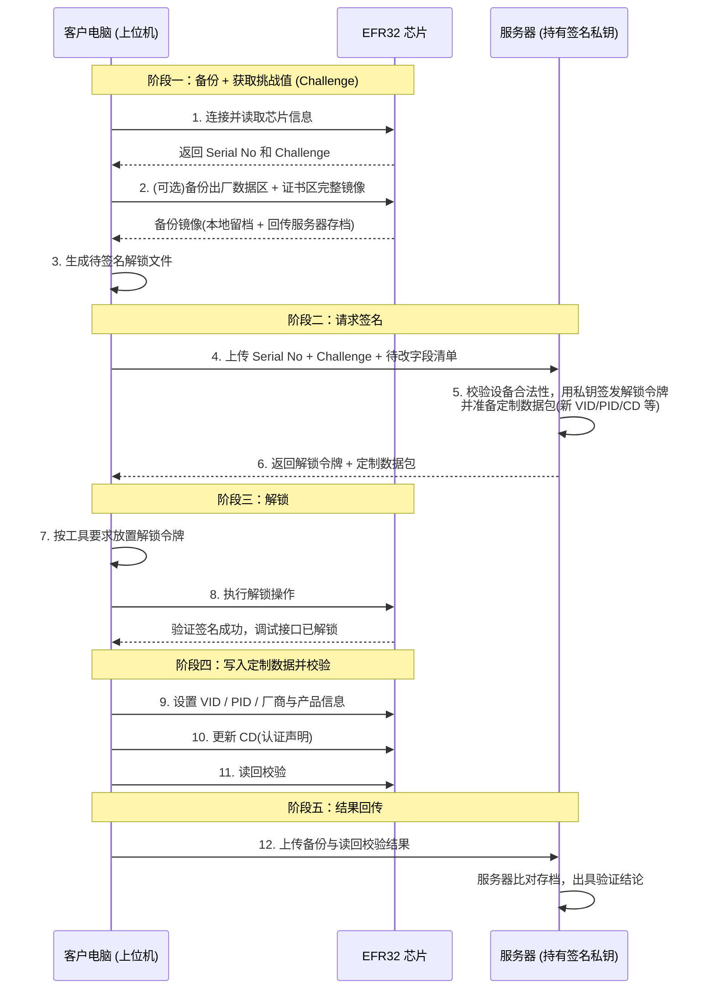

## 1. 需求背景

产品涉及**转 CD(Certification Declaration / 认证声明)给其客户**。
模块完成生产(烧录固件、CD、DAC、产品信息)，交付到客户手中后，需要留有接口可以修改以下出厂定制数据：
- **Vendor ID**(厂商ID)
- **Product ID**(产品ID)
- **Vendor name**(厂商名称)
- **Product name**(产品名称/型号名称)
- **Product url**(产品URL)
- **Product label**(产品标签)
- **Part number**(型号标识)
- **CD**(认证声明)

  

## 2 目的

设计一套**安全、私钥不泄露**的客户化定制接口方案，**MFG_Tool 更新(JSON 配置)** 以支持 JSON 配置方式定义待修改字段，完成出厂数据无感读写。

## 3 核心安全原则

1. **签名私钥永不泄露**——私钥只存在于服务器上，客户电脑只持有服务器签发的一次性解锁材料；
2. **Challenge-Response 解锁**——每次解锁必须由服务器对芯片当前 Challenge 签名，签名与芯片 SE 序列号 + Challenge 绑定；
3. **修改前先备份**——任何写入操作前读取完整备份镜像留档(出厂数据区 + 证书区)；
4. **写后清除一次性材料**——写入后清除解锁签名材料，保证常态下不可访问敏感区域。

## 4 总体流程

量产件生产时 SE 已安装解锁公钥(一次性烧录)，交付时 Debug Lock 开启，直接读写被拒绝；须先用芯片内公钥对应的私钥(仅服务器持有)签名解锁。

