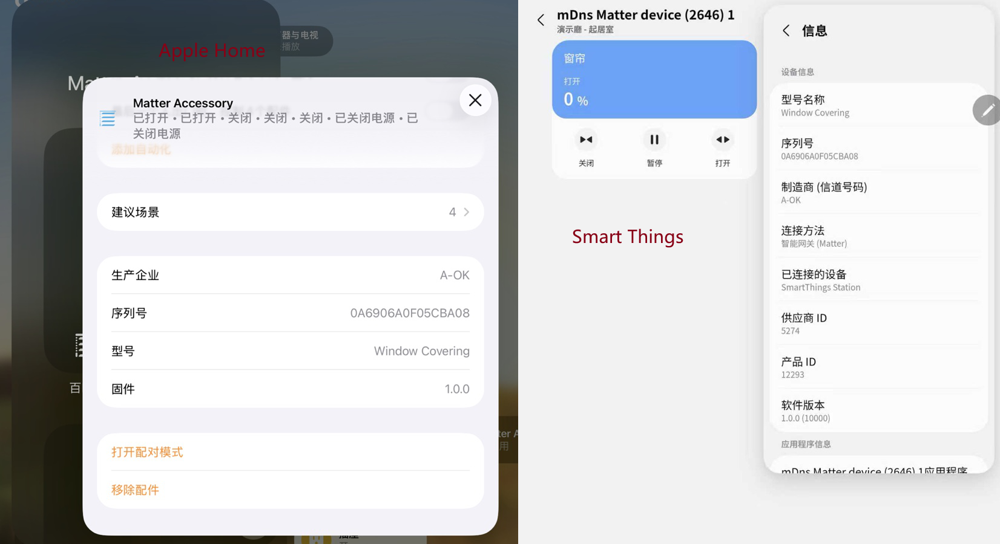
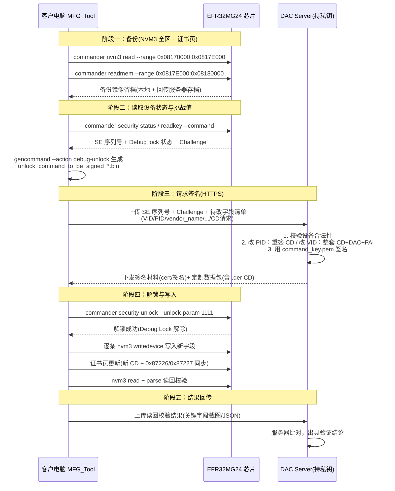

# 模块客户定制化(CD/产品信息)

## 1. 概述

### 1.1 背景

产品涉及**转 CD(Certification Declaration / 认证声明)给其客户**。  
模块完成生产(烧录固件、CD、DAC、产品信息)，交付到客户手中后，需要留有接口可以修改以下出厂定制数据：
- <font color="#dd00dd">**Vendor ID**(厂商ID)</font>
- <font color="#dd00dd">**Product ID**(产品ID)</font>
- <font color="#dd00dd">**Vendor name**(厂商名称)</font>
- <font color="#dd00dd">**Product name**(产品名称/型号名称)</font>
- **Product url**(产品URL)
- **Product label**(产品标签)
- **Part number**(型号标识)
- **CD**(认证声明)

<div align="left">
  
</div>

### 1.2 目的

设计一套**安全、私钥不泄露**的客户化定制接口方案, **MFG_Tool 更新(JSON 配置)** 以支持 JSON 配置方式定义待修改字段，完成 NVM3 无感读写。

### 1.3 核心安全原则
1. **签名私钥(command_key.pem)永不泄露**——私钥只存在于服务器上，客户电脑只持有服务器签发的一次性解锁材料；
2. **Challenge-Response 解锁**——每次解锁必须由服务器对芯片当前 Challenge 签名，签名与芯片 SE 序列号 + Challenge 绑定；
3. **NVM3 与证书页修改前先备份**——任何写入操作前读取完整备份镜像留档(NVM3 全区 + 证书页，见 §3.1)；
4. **写后清除一次性材料**——写入后清除解锁签名材料，保证常态下不可访问敏感区域。

## 2. 术语与凭证关系

### 2.1 术语定义

| 术语 | 全称 / 解释 |
|---|---|
| NVM3 | Non-Volatile Memory #3，Silicon Labs 非易失性键值存储区 |
| CD | Certification Declaration(认证声明)，CSA 签发的 .der 文件，声明其有效的 VID/PID，与 DAC/PAI 共同参与设备证明校验 |
| DAC | Device Attestation Certificate(设备证明证书)，每台设备唯一，**与 CD 是两个不同凭证** |
| PAI / PAA | Product Attestation Intermediate / Authority Certificate，DAC 的签发链；DAC 必须锚定在 PAA 之下 |
| VID / PID | Matter Vendor ID / Product ID(uint16，小端存储) |
| SE | 芯片内部 Secure Engine，管理安全启动密钥、Debug Lock 与解锁命令公钥 |
| Debug Lock | SE 的调试锁；开启后 SWD 无法直接读写 flash，须先走安全解锁流程 |
| Challenge | 芯片安全解锁的随机挑战值，用于生成一次性签名请求 |
| SecurityStore | Commander 在本地的凭据缓存目录(keystorage)，security 操作时自动按设备创建与查询 |
| MFG_Tool | HopeRF生产/定制上位机工具(本次需更新 JSON 配置支持) |
| DAC Server | HopeRF持有签名密钥、负责生成证书与签名的服务器 |

### 2.2 CD 与 VID/PID/DAC 的约束

Matter 配网时会对 CD、DAC、Basic Information 中的 VID/PID 做一致性校验，**不同修改场景需要的凭证不同**：

| 定制场景 | 需更新的凭证 | 说明 |
|---|---|---|
| 同 VID 下新增/修改 PID | 重签 **CD**(PID 清单加入新值) | DAC/PAI 不变，设备证明链不受影响 —— **常规定制路径** |
| 修改 VID | 整套替换 **CD + DAC + PAI** | 新 VID 的 DAC 必须由客户自己的 PAA 链签发；只换 CD 会在 Device Attestation 失败(DAC subject VID 与 CD VID 不一致) |

- CD 由 CSA 生成(如 `fam226497.der`)，不能自行构造；
- DAC 签发受限且留痕——必须由对应 PAA 签发的 PAI 签出；
- 量产件 DAC 由 MFG_Tool 向 DAC Server 按台申领(生产日志：`avaliable_dac=200, used_dac=116`)。

## 3. 出厂数据存储布局

### 3.1 Flash 布局总览

| 区域 | 地址范围 | 大小 | 内容 |
|---|---|---|---|
| 固件区 | `0x08000000 – 0x08170000` | 1480 KB | bootloader + Matter 应用 |
| NVM3 区 | `0x08170000 – 0x0817E000` | 56 KB (57344 B) | 出厂数据 + 应用键值 |
| 证书页 | `0x0817E000 – 0x08180000` | 8 KB | CD/DAC/PAI 数据本体 |

依据：
- NVM3 起止：链接脚本 `__main_flash_end__ = 0x8006000 + 0x178000 = 0x0817E000`；map 实测 `linker_nvm_begin = 0x08170000`；`NVM3_DEFAULT_NVM_SIZE = 57344`；
- 证书页：Provision 组件取 **flash 末页**为证书存储基址(`base_addr = flash_addr + flash_size - FLASH_PAGE_SIZE`)，CD/DAC/PAI 写入该页，NVM3 中只记录各自的 offset/size。

> ⚠️ 备份必须覆盖 **NVM3 全区 + 证书页**(`0x08170000 – 0x08180000`)。只备 NVM3 会漏掉 CD/DAC/PAI 本体，回滚不完整。

### 3.2 NVM3 Factory Key 映射表

Factory 区 key 域为 `0x087200 – 0x0872FF`(SDK `kMatterFactory_KeyBase = 0x2`，恢复出厂设置不清除)。样机(aok02_ac)内容如下：

| NVM3 Key | SDK 定义 | 长度 | 内容(ASCII 解析) | 说明 | 客户可否修改 |
|---|---|---|---|---|---|
| `0x87200` | SerialNum | 16 | `0ECB29B3...` | 模块序列号 | 否 |
| `0x87204` | ManufacturingDate | 8 | `20260907` | 生产日期(产线自动生成) | 否 |
| `0x87205` | SetupPayloadBitSet | 11 | `D0 A4 28 80 41 E0 81 FF ...` | 配网二维码 payload 位集 | 否 |
| `0x87206` | MfrDeviceICACerts | | | DAC 中间证书 | 否 |
| `0x87207` | SetupDiscriminator | 2 | `0F 0C` | 配网 Discriminator(LE 0x0C0F) | 否 |
| `0x8720b` | **ProductId** | 2 | `05 30` | **PID**(小端 0x3005) | 可 |
| `0x8720c` | **VendorId** | 2 | `9A 14` | **VID**(小端 0x149A) | 可 |
| `0x8720d` | **VendorName** | 4 | `A-OK` | **vendor name** | 可 |
| `0x8720e` | **ProductName** | 15 | `Window C...` | **product name**(产品名称/型号名称) | 可 |
| `0x8720f` | HardwareVersionString | 4 | `V1.0` | 硬件版本字符串(**非软件版本**) | 否 |
| `0x87210` | **ProductLabel** | 15 | `Window C...` | **product label** | 可 |
| `0x87211` | **ProductURL** | 22 | `https://...` | **product url** | 可 |
| `0x87212` | **PartNumber** | 15 | `Window C...` | part number(型号标识) | 可 |
| `0x87218` | HardwareVersion | 2 | `01 00` | 硬件版本号(uint16) | 否 |
| `0x87222` | Creds_DAC_Offset | 4 | `00 10 00 00` | **DAC在证书页的偏移**(0x1000) | 否 |
| `0x87223` | Creds_DAC_Size | 4 | `E1 01 00 00` | DAC 长度 | 否 |
| `0x87224` | Creds_PAI_Offset | 4 | `00 12 00 00` | **PAI在证书页的偏移**(0x1200) | 否 |
| `0x87225` | Creds_PAI_Size | 4 | `D6 01 00 00` | PAI 长度 | 否 |
| `0x87226` | **Creds_CD_Offset** | 4 | `00 14 00 00` | **CD 证书在证书页的偏移**(0x1400) | 否 |
| `0x87227` | **Creds_CD_Size** | | | CD 长度 | 否 |

### 3.3 证书页寻址机制

- CD/DAC/PAI 的**内容本体不在 NVM3**，而是写在证书页(`0x0817E000` 起)；NVM3 只存各自的 offset/size key；
- 运行时按 `证书页基址 + offset` 直接读 flash；

### 3.4 修改约束
- 字符串类字段(vendor_name 等)：写入字节长度 **不得大于** 原 NVM3 对象长度，超长需重新分配对象(工具需做长度预校验)；
- VID/PID 为 2 字节小端 uint16；
- 修改动作必须按 Key 粒度执行 `commander nvm3 writedevice`，**禁止整区擦除重写**(保留其他出厂数据)；
- **改 PID 后二维码不会自动更新**：配网二维码由闭源库按烧录时固化的 SetupPayloadBitSet 生成。固件已实现重建逻辑(`app_task_update_pid` → 解析旧二维码 → 覆盖当前 PID → SDK 生成器重编码)，写入 PID 后重启即可打印新二维码；
- **PID** 有串口运行时更新路径(MCU 经 `kGetProductInfo` 下发，Basic Info 实时生效)；**VID 没有**——VID 只能通过本章工厂区写入流程修改。

## 4. 总体流程(客户定制修改)
量产件生产时 SE 已安装 Command key / Sign key(`security writekey`，OTP 一次性)，交付时 Debug Lock 开启，SWD 直接读写被拒绝，需先用芯片内 Command 公钥对应的私钥(仅服务器持有)签名解锁。

### 4.1 总体流程图



### 4.2 阶段说明

#### 阶段〇 环境准备 —— SecurityStore(commander 凭据缓存)

Commander 执行 `security` 系列命令时，在本机自动维护按设备索引的凭据缓存：

```
C:\Users\<用户名>\AppData\Local\SiliconLabs\commander\SecurityStore\
└── device_<SE序列号>\          ← 32 位十六进制，如 device_00000000000000000c2a6ffffee5e29f
    ├── command_pubkey.pem      ← 从芯片读出的 Command 公钥(security 操作时自动缓存)
    └── user_configuration.json ← 设备 OPN + Secure Boot 配置(自动生成)
```

- 该目录由 commander **自动创建与查询**，无需手动放置任何令牌文件；
- 服务器下发的解锁材料通过 `security unlock --cert ...` 显式传入；
- 解锁失败时先核对此目录：目录名必须与目标芯片 SE 序列号一致，`command_pubkey.pem` 必须与服务器持有的私钥配对；
- 附加 `--nostore` 可禁用缓存行为。


#### 阶段一 备份

全区读取(NVM3 + 证书页，见 §3.1 ⚠️)，本地留档并回传服务器存档。

#### 阶段二/三 状态读取与签名

`security status` 确认 Debug lock / Command key 状态 → `gencommand --action debug-unlock` 生成待签名命令(内含芯片当前 Challenge，绑定 SE 序列号)→ 服务器校验设备合法性后签名，随定制数据包(含新 CD)下发。

#### 阶段四 解锁与写入

`security unlock` 解除 Debug Lock → 按 Key 粒度 `nvm3 writedevice` → 证书页更新由 MFG_Tool 完成(CD 数据 + offset/size 同步，见 §3.3)→ 读回校验。

#### 阶段五 结果回传

读回结果上传服务器比对归档。

### 4.3 关键命令参考

```bat
:: ── 备份(全区：NVM3 + 证书页)─────────────────────────────
commander nvm3 read -o nvm3.s37 --device EFR32MG24A410F1536IM40 --range 0x08170000:0x0817E000
commander readmem --device EFR32MG24A410F1536IM40 --range 0x0817E000:0x08180000 -o cert_page.bin

:: ── 设备状态与 Command 公钥 ────────────────────────────────
commander security status --device EFR32MG24
commander security readkey --command --device EFR32MG24 -o device_command_pubkey.pem

:: ── 生成待签名解锁命令(绑定当前 Challenge 与 SE 序列号)──────
commander security gencommand --action debug-unlock --device EFR32MG24 -o unlock_command_to_be_signed.bin

:: ── (服务器侧)用 command_key.pem 签名，下发签名材料与定制数据包 ──

:: ── 解锁(量产件必经；工程件无需此步)────────────────────────
commander security unlock --device EFR32MG24 --cert <signed_cert_file> --unlock-param 1111

:: ── 写入(按 Key 粒度)────────────────────────────────────
commander nvm3 writedevice --object 0x08720D:424B --device EFR32MG24A410F1536IM40

:: ── 读回校验 ─────────────────────────────────────────────
commander nvm3 read -o nvm3_check.s37 --device EFR32MG24A410F1536IM40 --range 0x08170000:0x0817E000
commander nvm3 parse nvm3_check.s37 --key 0x08720D

:: ── 作废旧签名(令牌泄露/订单终止时)────────────────────────
commander security rollchallenge --device EFR32MG24
```

> `--unlock-param 1111` 为调试访问位掩码(SPNIDLOCK / SPIDLOCK / NIDLOCK / DBGLOCK 四位全开)，也是默认值。
> 证书页(CD/DAC/PAI)的更新由 MFG_Tool 完成：证书数据写入证书页 + 同步更新 `0x87222`–`0x87227` 的 offset/size(见 §3.3)。
> 命令已对照 Commander 1v22p1b1957 帮助核实。

### 4.4 实测记录

工程件 Debug lock=False，无需解锁，直接读写验证 Key 粒度修改闭环：

```c
C:\Users\huide>commander nvm3 read -o nvm3.s37 --device efr32mg24 --range 0x08170000:0x817e000
Reconfiguring debug connection with detected device part number: EFR32MG24A410F1536IM40
Found NVM3 range: 0x08170000 - 0x0817e000. Security mode: none
Reading 57344 bytes from 0x08170000...
Writing to nvm3.s37...
DONE

C:\Users\huide>commander nvm3 parse nvm3.s37 --key 0x08720D
Parsing file nvm3.s37...
Found NVM3 range: 0x08170000 - 0x0817E000
Using 4096 B as maximum object size, based on given size of NVM3 area.
Matching NVM3 objects:
Key   : 0x8720d (553485)
Type  : Data
Length: 4 B
Data  :
{address:  0  1  2  3  4  5  6  7  8  9  A  B  C  D  E  F}
00000000: 41 2D 4F 4B -- -- -- -- -- -- -- -- -- -- -- --
NVM3 erase count: 1
DONE

C:\Users\huide>commander nvm3 writedevice --object 0x08720D:424B --device EFR32MG24A410F1536IM40
Setting NVM3 object: 0x8720d = 424B
Found NVM3 range: 0x08170000 - 0x0817e000. Security mode: none
Using 4096 B as maximum object size, based on given size of NVM3 area.
Flashing modified NVM3 (57344 bytes) to 0x08170000...
DONE

C:\Users\huide>commander nvm3 read -o nvm3-bk.s37 --device efr32mg24 --range 0x08170000:0x817e000
Reconfiguring debug connection with detected device part number: EFR32MG24A410F1536IM40
Found NVM3 range: 0x08170000 - 0x0817e000. Security mode: none
Reading 57344 bytes from 0x08170000...
Writing to nvm3-bk.s37...
DONE

C:\Users\huide>commander nvm3 parse nvm3-bk.s37 --key 0x08720D
Parsing file nvm3-bk.s37...
Found NVM3 range: 0x08170000 - 0x0817E000
Using 4096 B as maximum object size, based on given size of NVM3 area.
Matching NVM3 objects:
Key   : 0x8720d (553485)
Type  : Data
Length: 2 B
Data  :
{address:  0  1  2  3  4  5  6  7  8  9  A  B  C  D  E  F}
00000000: 42 4B -- -- -- -- -- -- -- -- -- -- -- -- -- --
NVM3 erase count: 1
DONE
```

> 实测记录：`0x8720d` 原值 `41 2D 4F 4B`("A-OK") → 写入 `424B`("BK") → 读回确认 `42 4B`，流程闭环验证通过。
