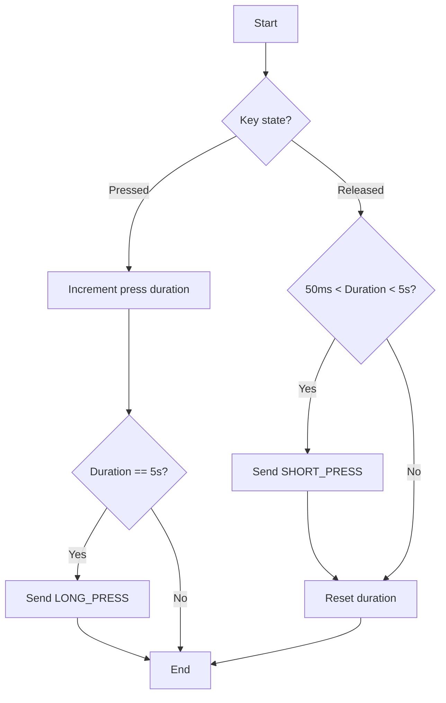

```c
/*
 *
 *    Copyright (c) 2020 Project CHIP Authors
 *    Copyright (c) 2019 Google LLC.
 *    All rights reserved.
 *
 *    Licensed under the Apache License, Version 2.0 (the "License");
 *    you may not use this file except in compliance with the License.
 *    You may obtain a copy of the License at
 *
 *        http://www.apache.org/licenses/LICENSE-2.0
 *
 *    Unless required by applicable law or agreed to in writing, software
 *    distributed under the License is distributed on an "AS IS" BASIS,
 *    WITHOUT WARRANTIES OR CONDITIONS OF ANY KIND, either express or implied.
 *    See the License for the specific language governing permissions and
 *    limitations under the License.
 */

/**********************************************************
 * Includes
 *********************************************************/

#include "AppTask.h"
#include "AppConfig.h"
#include "AppEvent.h"
#include "BindingHandler.h"
#include "LEDWidget.h"
#include "LightSwitchMgr.h"
#ifdef DISPLAY_ENABLED
#include "lcd.h"
#ifdef QR_CODE_ENABLED
#include "qrcodegen.h"
#endif // QR_CODE_ENABLED
#endif // DISPLAY_ENABLED
#include <app/server/Server.h>
#include <app/util/attribute-storage.h>
#include <assert.h>
#include <lib/support/CodeUtils.h>
#include <platform/CHIPDeviceLayer.h>
#include <platform/silabs/platformAbstraction/SilabsPlatform.h>
#include <setup_payload/OnboardingCodesUtil.h>
#include <setup_payload/QRCodeSetupPayloadGenerator.h>
#include <setup_payload/SetupPayload.h>

/**********************************************************
 * Defines and Constants
 *********************************************************/

#define SYSTEM_STATE_LED &sl_led_led0

namespace {
constexpr chip::EndpointId kLightSwitchEndpoint   = 1;
constexpr chip::EndpointId kGenericSwitchEndpoint = 2;
} // namespace

using namespace chip;
using namespace chip::app;
using namespace ::chip::DeviceLayer;
using namespace ::chip::DeviceLayer::Silabs;

using namespace chip::TLV;
using namespace ::chip::DeviceLayer;

/**********************************************************
Key Scan Module
*********************************************************/
#define KEY_SCAN_MAX_BUTTONS    4
#define KEY_SHORT_PRESS_TICKS   5     // 50ms (10ms/tick)
#define KEY_LONG_PRESS_TICKS    500   // 5000ms

// 自定义按键事件类型
static constexpr uint16_t kAppEvent_KeyShortPress = 0x100;
static constexpr uint16_t kAppEvent_KeyLongPress  = 0x101;

struct KeyState {
    bool     is_pressed;      // 当前是否按下
    uint16_t press_tick_count; // 按下的累计 ticks (每10ms增加1)
    bool     long_triggered;   // 长按是否已触发过
};

static KeyState s_keyStates[KEY_SCAN_MAX_BUTTONS] = {};
static osTimerId_t s_keyScanTimer = nullptr;

// 10ms 周期定时器回调：实现长短按判定
void KeyScanTimerCallback(void * arg)
{
    for (uint8_t i = 0; i < KEY_SCAN_MAX_BUTTONS; ++i)
    {
        if (s_keyStates[i].is_pressed)
        {
            // 按下状态：累计时间
            s_keyStates[i].press_tick_count++;

            // 达到长按时间 且 尚未触发过长按
            if (s_keyStates[i].press_tick_count == KEY_LONG_PRESS_TICKS &&
                !s_keyStates[i].long_triggered)
            {
                s_keyStates[i].long_triggered = true;
                AppEvent evt = {};
                evt.Type = kAppEvent_KeyLongPress;
                evt.ButtonEvent.Button = i;
                evt.ButtonEvent.Action = static_cast<uint8_t>(SilabsPlatform::ButtonAction::ButtonPressed);
                evt.Handler = AppTask::AppEventHandler;
                AppTask::GetAppTask().PostEvent(&evt);
            }
        }
        else
        {
            // 释放状态：判断是否为有效短按
            // 条件：按下时间 >= 短按阈值 且 按下时间 < 长按阈值 且 未触发过长按
            if (s_keyStates[i].press_tick_count >= KEY_SHORT_PRESS_TICKS &&
                s_keyStates[i].press_tick_count < KEY_LONG_PRESS_TICKS &&
                !s_keyStates[i].long_triggered)
            {
                AppEvent evt = {};
                evt.Type = kAppEvent_KeyShortPress;
                evt.ButtonEvent.Button = i;
                evt.ButtonEvent.Action = static_cast<uint8_t>(SilabsPlatform::ButtonAction::ButtonReleased);
                evt.Handler = AppTask::AppEventHandler;
                AppTask::GetAppTask().PostEvent(&evt);
            }

            // 复位该按键所有状态
            s_keyStates[i].press_tick_count = 0;
            s_keyStates[i].long_triggered   = false;
        }
    }
}

/**********************************************************
 * AppTask Definitions
*********************************************************/

AppTask AppTask::sAppTask;

CHIP_ERROR AppTask::AppInit()
{
    CHIP_ERROR err = CHIP_NO_ERROR;
    chip::DeviceLayer::Silabs::GetPlatform().SetButtonsCb(AppTask::ButtonEventHandler);

    err = LightSwitchMgr::GetInstance().Init(kLightSwitchEndpoint, kGenericSwitchEndpoint);
    if (err != CHIP_NO_ERROR)
    {
        SILABS_LOG("LightSwitchMgr Init failed!");
        appError(err);
    }

    // 创建 10ms 周期按键扫描定时器
    s_keyScanTimer = osTimerNew(KeyScanTimerCallback, osTimerPeriodic, nullptr, nullptr);
    if (s_keyScanTimer == nullptr)
    {
        SILABS_LOG("KeyScan Timer create failed");
        appError(APP_ERROR_CREATE_TIMER_FAILED);
    }
    else
    {
        osStatus_t status = osTimerStart(s_keyScanTimer, pdMS_TO_TICKS(10));
        if (status != osOK)
        {
            SILABS_LOG("KeyScan Timer start failed");
            appError(APP_ERROR_START_TIMER_FAILED);
        }
    }

    return err;
}

// 底层按键中断/轮询回调：仅更新状态，不处理逻辑
void AppTask::ButtonEventHandler(uint8_t button, uint8_t btnAction)
{
    if (button >= KEY_SCAN_MAX_BUTTONS) { return; }

    if (btnAction == to_underlying(SilabsPlatform::ButtonAction::ButtonPressed))
    {
        // 新按下：重置所有状态，开始计时
        s_keyStates[button].is_pressed       = true;
        s_keyStates[button].press_tick_count = 0;
        s_keyStates[button].long_triggered   = false;
    }
    else
    {
        s_keyStates[button].is_pressed = false;
    }
}

// 按键事件集中处理中心
void AppTask::AppEventHandler(AppEvent * aEvent)
{
    switch (aEvent->Type)
    {
    case kAppEvent_KeyShortPress:
    {
        uint8_t btn = aEvent->ButtonEvent.Button;
        SILABS_LOG("Key %d Short Press", btn);
        // 示例：按键1短按触发 Toggle
        if (btn == 1) {
            LightSwitchMgr::GetInstance().SwitchActionEventHandler(AppEvent::kEventType_TriggerToggle);
        }
        break;
    }
    case kAppEvent_KeyLongPress:
    {
        uint8_t btn = aEvent->ButtonEvent.Button;
        SILABS_LOG("Key %d Long Press", btn);
        // 示例：按键1长按进入调光/连续控制模式
        if (btn == 1) {
            LightSwitchMgr::GetInstance().SwitchActionEventHandler(AppEvent::kEventType_TriggerLevelControlAction);
        }
        break;
    }

    default:
        break;
    }
}

CHIP_ERROR AppTask::StartAppTask()
{
    return BaseApplication::StartAppTask(AppTaskMain);
}

void AppTask::AppTaskMain(void * pvParameter)
{
    AppEvent event;
    osMessageQueueId_t sAppEventQueue = *(static_cast<osMessageQueueId_t *>(pvParameter));
    
    CHIP_ERROR err = sAppTask.Init();
    if (err != CHIP_NO_ERROR)
    {
        SILABS_LOG("AppTask.Init() failed");
        appError(err);
    }

#if !(defined(CHIP_CONFIG_ENABLE_ICD_SERVER) && CHIP_CONFIG_ENABLE_ICD_SERVER)
    sAppTask.StartStatusLEDTimer();
#endif

    SILABS_LOG("App Task started");
    while (true)
    {
        osStatus_t eventReceived = osMessageQueueGet(sAppEventQueue, &event, NULL, osWaitForever);
        while (eventReceived == osOK)
        {
            sAppTask.DispatchEvent(&event);
            eventReceived = osMessageQueueGet(sAppEventQueue, &event, NULL, 0);
        }
    }
}
```