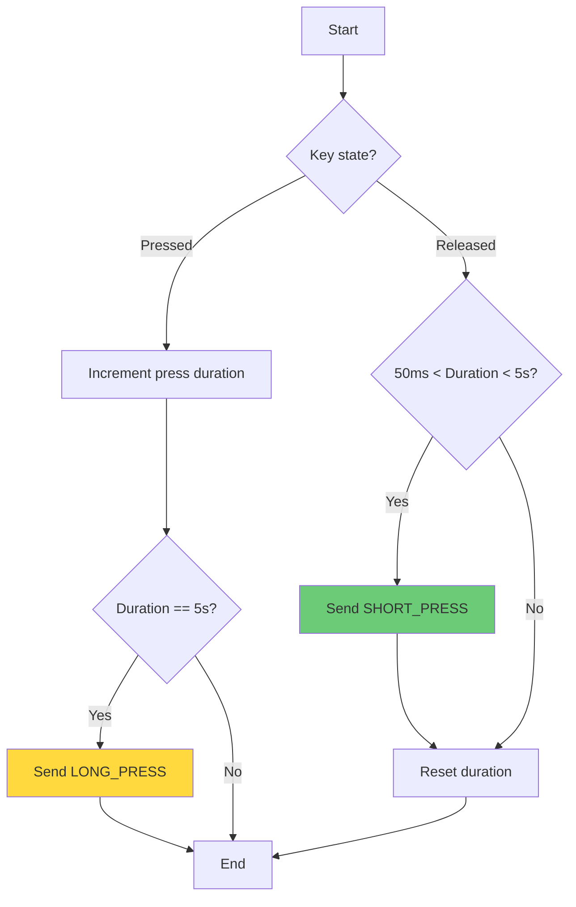
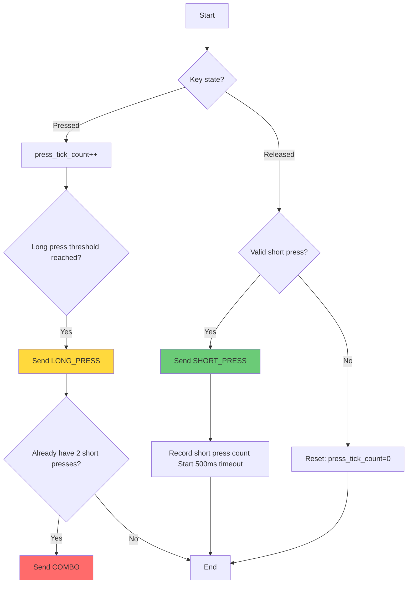

   
# Short Press and Long Press Detection

```c
//AppTask.cpp
/*
 *
 *    Copyright (c) 2020 Project CHIP Authors
 *    Copyright (c) 2019 Google LLC.
 *    All rights reserved.
 *
 *    Licensed under the Apache License, Version 2.0 (the "License");
 *    you may not use this file except in compliance with the License.
 *    You may obtain a copy of the License at
 *
 *        http://www.apache.org/licenses/LICENSE-2.0
 *
 *    Unless required by applicable law or agreed to in writing, software
 *    distributed under the License is distributed on an "AS IS" BASIS,
 *    WITHOUT WARRANTIES OR CONDITIONS OF ANY KIND, either express or implied.
 *    See the License for the specific language governing permissions and
 *    limitations under the License.
 */

/**********************************************************
 * Includes
 *********************************************************/

#include "AppTask.h"
#include "AppConfig.h"
#include "AppEvent.h"
#include "BindingHandler.h"
#include "LEDWidget.h"
#include "LightSwitchMgr.h"
#ifdef DISPLAY_ENABLED
#include "lcd.h"
#ifdef QR_CODE_ENABLED
#include "qrcodegen.h"
#endif // QR_CODE_ENABLED
#endif // DISPLAY_ENABLED
#include <app/server/Server.h>
#include <app/util/attribute-storage.h>
#include <assert.h>
#include <lib/support/CodeUtils.h>
#include <platform/CHIPDeviceLayer.h>
#include <platform/silabs/platformAbstraction/SilabsPlatform.h>
#include <setup_payload/OnboardingCodesUtil.h>
#include <setup_payload/QRCodeSetupPayloadGenerator.h>
#include <setup_payload/SetupPayload.h>

/**********************************************************
 * Defines and Constants
 *********************************************************/

#define SYSTEM_STATE_LED &sl_led_led0

namespace {
constexpr chip::EndpointId kLightSwitchEndpoint   = 1;
constexpr chip::EndpointId kGenericSwitchEndpoint = 2;
} // namespace

using namespace chip;
using namespace chip::app;
using namespace ::chip::DeviceLayer;
using namespace ::chip::DeviceLayer::Silabs;

using namespace chip::TLV;
using namespace ::chip::DeviceLayer;

/**********************************************************
 * Key Scan Module - Long/Short Press Detection
 *********************************************************/

#define KEY_SCAN_MAX_BUTTONS    4
#define KEY_SHORT_PRESS_TICKS   5     // 50ms (10ms/tick)
#define KEY_LONG_PRESS_TICKS    500   // 5000ms (5 seconds)

struct KeyState {
    bool     is_pressed;       // Current press state
    uint16_t press_tick_count; // Accumulated press ticks (increments every 10ms)
    bool     long_triggered;   // Whether long press has been triggered
};

static KeyState s_keyStates[KEY_SCAN_MAX_BUTTONS] = {};
static osTimerId_t s_keyScanTimer = nullptr;

/**********************************************************
 * AppTask Definitions
 *********************************************************/

AppTask AppTask::sAppTask;

bool AppTask::functionButtonPressed  = false;
bool AppTask::actionButtonPressed    = false;
bool AppTask::actionButtonSuppressed = false;
bool AppTask::isButtonEventTriggered = false;

// 10ms periodic timer callback: Implements long/short press detection
void KeyScanTimerCallback(void * arg)
{
    for (uint8_t i = 0; i < KEY_SCAN_MAX_BUTTONS; ++i)
    {
        if (s_keyStates[i].is_pressed)
        {
            // Pressed state: accumulate time
            s_keyStates[i].press_tick_count++;

            // Long press time reached and not yet triggered
            if (s_keyStates[i].press_tick_count == KEY_LONG_PRESS_TICKS &&
                !s_keyStates[i].long_triggered)
            {
                s_keyStates[i].long_triggered = true;
                AppEvent evt = {};
                evt.Type = AppEvent::kEventType_KeyLongPress;
                evt.ButtonEvent.Button = i;
                evt.ButtonEvent.Action = static_cast<uint8_t>(SilabsPlatform::ButtonAction::ButtonPressed);
                evt.Handler = AppTask::AppEventHandler;
                AppTask::GetAppTask().PostEvent(&evt);
            }
        }
        else
        {
            // Released state: check if it's a valid short press
            // Conditions: press time >= short press threshold AND press time < long press threshold AND long press not triggered
            if (s_keyStates[i].press_tick_count >= KEY_SHORT_PRESS_TICKS &&
                s_keyStates[i].press_tick_count < KEY_LONG_PRESS_TICKS &&
                !s_keyStates[i].long_triggered)
            {
                AppEvent evt = {};
                evt.Type = AppEvent::kEventType_KeyShortPress;
                evt.ButtonEvent.Button = i;
                evt.ButtonEvent.Action = static_cast<uint8_t>(SilabsPlatform::ButtonAction::ButtonReleased);
                evt.Handler = AppTask::AppEventHandler;
                AppTask::GetAppTask().PostEvent(&evt);
            }

            // Reset all states for this button
            s_keyStates[i].press_tick_count = 0;
            s_keyStates[i].long_triggered   = false;
        }
    }
}

CHIP_ERROR AppTask::AppInit()
{
    CHIP_ERROR err = CHIP_NO_ERROR;
    chip::DeviceLayer::Silabs::GetPlatform().SetButtonsCb(AppTask::ButtonEventHandler);

    err = LightSwitchMgr::GetInstance().Init(kLightSwitchEndpoint, kGenericSwitchEndpoint);
    if (err != CHIP_NO_ERROR)
    {
        SILABS_LOG("LightSwitchMgr Init failed!");
        appError(err);
    }

    // Create 10ms periodic key scan timer
    s_keyScanTimer = osTimerNew(KeyScanTimerCallback, osTimerPeriodic, nullptr, nullptr);
    if (s_keyScanTimer == nullptr)
    {
        SILABS_LOG("KeyScan Timer create failed");
        appError(APP_ERROR_CREATE_TIMER_FAILED);
    }
    else
    {
        osStatus_t status = osTimerStart(s_keyScanTimer, pdMS_TO_TICKS(10));
        if (status != osOK)
        {
            SILABS_LOG("KeyScan Timer start failed");
            appError(APP_ERROR_START_TIMER_FAILED);
        }
    }

    // Initialize long press timer
    longPressTimer = new Timer(LONG_PRESS_TIMEOUT_MS, OnLongPressTimeout, this);

    return err;
}

void AppTask::Timer::Start()
{
    // Starts or restarts the function timer
    osStatus_t status = osTimerStart(mHandler, pdMS_TO_TICKS(LONG_PRESS_TIMEOUT_MS));
    if (status != osOK)
    {
        SILABS_LOG("Timer start() failed with error code : %ld", status);
        appError(APP_ERROR_START_TIMER_FAILED);
    }

    mIsActive = true;
}

void AppTask::Timer::Timeout()
{
    mIsActive = false;
    if (mCallback)
    {
        mCallback(*this);
    }
}

void AppTask::HandleLongPress()
{
    AppEvent event;
    event.Handler = AppTask::AppEventHandler;

    if (actionButtonPressed)
    {
        actionButtonSuppressed = true;
        // Long press button up : Trigger Level Control Action
        event.Type = AppEvent::kEventType_TriggerLevelControlAction;
        AppTask::GetAppTask().PostEvent(&event);
    }
}

void AppTask::OnLongPressTimeout(AppTask::Timer & timer)
{
    AppTask * app = static_cast<AppTask *>(timer.mContext);
    if (app)
    {
        app->HandleLongPress();
    }
}

AppTask::Timer::Timer(uint32_t timeoutInMs, Callback callback, void * context) : mCallback(callback), mContext(context)
{
    mHandler = osTimerNew(TimerCallback, // timer callback handler
                          osTimerOnce,   // no timer reload (one-shot timer)
                          this,          // pass the app task obj context
                          NULL           // No osTimerAttr_t to provide.
    );

    if (mHandler == NULL)
    {
        SILABS_LOG("Timer create failed");
        appError(APP_ERROR_CREATE_TIMER_FAILED);
    }
}

AppTask::Timer::~Timer()
{
    if (mHandler)
    {
        osTimerDelete(mHandler);
        mHandler = nullptr;
    }
}

void AppTask::Timer::Stop()
{
    // Abort on osError (-1) as it indicates an unspecified failure with no clear recovery path.
    if (osTimerStop(mHandler) == osError)
    {
        SILABS_LOG("Timer stop() failed");
        appError(APP_ERROR_STOP_TIMER_FAILED);
    }
    mIsActive = false;
}

void AppTask::Timer::TimerCallback(void * timerCbArg)
{
    Timer * timer = reinterpret_cast<Timer *>(timerCbArg);
    if (timer)
    {
        timer->Timeout();
    }
}

CHIP_ERROR AppTask::StartAppTask()
{
    return BaseApplication::StartAppTask(AppTaskMain);
}

void AppTask::AppTaskMain(void * pvParameter)
{
    AppEvent event;
    osMessageQueueId_t sAppEventQueue = *(static_cast<osMessageQueueId_t *>(pvParameter));

    CHIP_ERROR err = sAppTask.Init();
    if (err != CHIP_NO_ERROR)
    {
        SILABS_LOG("AppTask.Init() failed");
        appError(err);
    }

#if !(defined(CHIP_CONFIG_ENABLE_ICD_SERVER) && CHIP_CONFIG_ENABLE_ICD_SERVER)
    sAppTask.StartStatusLEDTimer();
#endif

    SILABS_LOG("App Task started");
    while (true)
    {
        osStatus_t eventReceived = osMessageQueueGet(sAppEventQueue, &event, NULL, osWaitForever);
        while (eventReceived == osOK)
        {
            sAppTask.DispatchEvent(&event);
            eventReceived = osMessageQueueGet(sAppEventQueue, &event, NULL, 0);
        }
    }
}

// Low-level button interrupt/polling callback: Only updates state, no logic processing
void AppTask::ButtonEventHandler(uint8_t button, uint8_t btnAction)
{
    if (button >= KEY_SCAN_MAX_BUTTONS) { return; }

    if (btnAction == to_underlying(SilabsPlatform::ButtonAction::ButtonPressed))
    {
        // New press: reset all states and start timing
        s_keyStates[button].is_pressed       = true;
        s_keyStates[button].press_tick_count = 0;
        s_keyStates[button].long_triggered   = false;
        s_keyStates[button].press_tick_count = 0;
    }
    else if (btnAction == to_underlying(SilabsPlatform::ButtonAction::ButtonReleased))
    {
        s_keyStates[button].is_pressed = false;
    }
    
    // Also trigger original event processing logic for compatibility
    AppEvent event = {};
    event.Handler  = AppTask::AppEventHandler;
    if (btnAction == to_underlying(SilabsPlatform::ButtonAction::ButtonPressed))
    {
        event.Type = (button ? AppEvent::kEventType_ActionButtonPressed : AppEvent::kEventType_FunctionButtonPressed);
    }
    else
    {
        event.Type = (button ? AppEvent::kEventType_ActionButtonReleased : AppEvent::kEventType_FunctionButtonReleased);
    }
    AppTask::GetAppTask().PostEvent(&event);
}

// Central button event processing handler
void AppTask::AppEventHandler(AppEvent * aEvent)
{
    switch (aEvent->Type)
    {
    case AppEvent::kEventType_KeyShortPress:
    {
        uint8_t btn = aEvent->ButtonEvent.Button;
        SILABS_LOG("Key %d Short Press", btn);
        #if 0
        // Perform different actions based on button
        if (btn == 0)  // Function Button (assuming button0 is function key)
        {
	        functionButtonPressed = true;
	        if (actionButtonPressed)
	        {
	            actionButtonSuppressed = true;
	            LightSwitchMgr::GetInstance().changeStepMode();
	        }
	        else
	        {
	            isButtonEventTriggered = true;
	            // Post button press event to BaseApplication
	            AppEvent button_event           = {};
	            button_event.Type               = AppEvent::kEventType_Button;
	            button_event.ButtonEvent.Action = static_cast<uint8_t>(SilabsPlatform::ButtonAction::ButtonPressed);
	            button_event.Handler            = BaseApplication::ButtonHandler;
	            AppTask::GetAppTask().PostEvent(&button_event);
            }
        }
        else if (btn == 1)  // Action Button (assuming button1 is action key)
        {
            // Short press triggers Toggle action
            LightSwitchMgr::GetInstance().SwitchActionEventHandler(AppEvent::kEventType_TriggerToggle);
        }
        #endif
        break;
    }
    
    case AppEvent::kEventType_KeyLongPress:
    {
        uint8_t btn = aEvent->ButtonEvent.Button;
        SILABS_LOG("Key %d Long Press", btn);
        #if 0
        // Perform different actions based on button
        if (btn == 0)  // Function Button long press
        {
            // Add function button long press logic as needed
        }
        else if (btn == 1)  // Action Button long press
        {
            actionButtonSuppressed = true;
            // Long press triggers Level Control action (dimming)
            LightSwitchMgr::GetInstance().SwitchActionEventHandler(AppEvent::kEventType_TriggerLevelControlAction);
        }
        #endif
        break;
    }
    #if 0
    case AppEvent::kEventType_FunctionButtonPressed:
        // Original logic is handled in KeyScanTimerCallback, can be left empty or add extra logic
        break;
        
    case AppEvent::kEventType_FunctionButtonReleased:
        functionButtonPressed = false;
        if (isButtonEventTriggered)
        {
            isButtonEventTriggered = false;
            // Post button release event to BaseApplication
            AppEvent button_event           = {};
            button_event.Type               = AppEvent::kEventType_Button;
            button_event.ButtonEvent.Action = static_cast<uint8_t>(SilabsPlatform::ButtonAction::ButtonReleased);
            button_event.Handler            = BaseApplication::ButtonHandler;
            AppTask::GetAppTask().PostEvent(&button_event);
        }
        break;
        
    case AppEvent::kEventType_ActionButtonPressed:
        actionButtonPressed = true;
        LightSwitchMgr::GetInstance().SwitchActionEventHandler(aEvent->Type);
        if (functionButtonPressed)
        {
            actionButtonSuppressed = true;
            LightSwitchMgr::GetInstance().changeStepMode();
        }
        else if (sAppTask.longPressTimer)
        {
            sAppTask.longPressTimer->Start();
        }
        break;
    case AppEvent::kEventType_ActionButtonReleased:
        actionButtonPressed = false;
        if (sAppTask.longPressTimer)
        {
            sAppTask.longPressTimer->Stop();
        }
        if (actionButtonSuppressed)
        {
            actionButtonSuppressed = false;
        }
        else
        {
            aEvent->Type = AppEvent::kEventType_TriggerToggle;
            LightSwitchMgr::GetInstance().SwitchActionEventHandler(aEvent->Type);
        }
        aEvent->Type = AppEvent::kEventType_ActionButtonReleased;
        LightSwitchMgr::GetInstance().SwitchActionEventHandler(aEvent->Type);
        break;
    case AppEvent::kEventType_TriggerLevelControlAction:
        LightSwitchMgr::GetInstance().SwitchActionEventHandler(aEvent->Type);
        break;
    #endif    
    default:
        break;
    }
}

```
```c
//AppEvent.h
/*
 *
 *    Copyright (c) 2020 Project CHIP Authors
 *    Copyright (c) 2018 Nest Labs, Inc.
 *    All rights reserved.
 *
 *    Licensed under the Apache License, Version 2.0 (the "License");
 *    you may not use this file except in compliance with the License.
 *    You may obtain a copy of the License at
 *
 *        http://www.apache.org/licenses/LICENSE-2.0
 *
 *    Unless required by applicable law or agreed to in writing, software
 *    distributed under the License is distributed on an "AS IS" BASIS,
 *    WITHOUT WARRANTIES OR CONDITIONS OF ANY KIND, either express or implied.
 *    See the License for the specific language governing permissions and
 *    limitations under the License.
 */

#pragma once

#include "BaseAppEvent.h"

struct AppEvent : public BaseAppEvent
{
    enum AppEventTypes
    {
        kEventType_Light = BaseAppEvent::kEventType_Max + 1,
        kEventType_Install,
        kEventType_ResetWarning,
        kEventType_ResetCanceled,
        // Button events
        kEventType_ActionButtonPressed,
        kEventType_ActionButtonReleased,
        kEventType_FunctionButtonPressed,
        kEventType_FunctionButtonReleased,
        kEventType_TriggerLevelControlAction,
        kEventType_TriggerToggle,
        // Key scan events
        kEventType_KeyShortPress,
        kEventType_KeyLongPress,
    };

    struct ButtonEventData
    {
        uint8_t Button;
        uint8_t Action;
    };

    union
    {
        struct
        {
            void * Context;
        } LightSwitchEvent;
        
        struct
        {
            ButtonEventData ButtonEvent;
        };
    };
};
```
# Combo Key

```c
//AppTask.cpp
/*
 *
 *    Copyright (c) 2020 Project CHIP Authors
 *    Copyright (c) 2019 Google LLC.
 *    All rights reserved.
 *
 *    Licensed under the Apache License, Version 2.0 (the "License");
 *    you may not use this file except in compliance with the License.
 *    You may obtain a copy of the License at
 *
 *        http://www.apache.org/licenses/LICENSE-2.0
 *
 *    Unless required by applicable law or agreed to in writing, software
 *    distributed under the License is distributed on an "AS IS" BASIS,
 *    WITHOUT WARRANTIES OR CONDITIONS OF ANY KIND, either express or implied.
 *    See the License for the specific language governing permissions and
 *    limitations under the License.
 */

/**********************************************************
 * Includes
 *********************************************************/

#include "AppTask.h"
#include "AppConfig.h"
#include "AppEvent.h"
#include "BindingHandler.h"
#include "LEDWidget.h"
#include "LightSwitchMgr.h"
#ifdef DISPLAY_ENABLED
#include "lcd.h"
#ifdef QR_CODE_ENABLED
#include "qrcodegen.h"
#endif // QR_CODE_ENABLED
#endif // DISPLAY_ENABLED
#include <app/server/Server.h>
#include <app/util/attribute-storage.h>
#include <assert.h>
#include <lib/support/CodeUtils.h>
#include <platform/CHIPDeviceLayer.h>
#include <platform/silabs/platformAbstraction/SilabsPlatform.h>
#include <setup_payload/OnboardingCodesUtil.h>
#include <setup_payload/QRCodeSetupPayloadGenerator.h>
#include <setup_payload/SetupPayload.h>

/**********************************************************
 * Defines and Constants
 *********************************************************/

#define SYSTEM_STATE_LED &sl_led_led0

namespace {
constexpr chip::EndpointId kLightSwitchEndpoint   = 1;
constexpr chip::EndpointId kGenericSwitchEndpoint = 2;
} // namespace

using namespace chip;
using namespace chip::app;
using namespace ::chip::DeviceLayer;
using namespace ::chip::DeviceLayer::Silabs;

using namespace chip::TLV;
using namespace ::chip::DeviceLayer;

/**********************************************************
 * Key Scan Module - Long/Short Press Detection
 *********************************************************/

#define KEY_SCAN_MAX_BUTTONS    4
#define KEY_SHORT_PRESS_TICKS   5     // 50ms (10ms/tick)
#define KEY_LONG_PRESS_TICKS    500   // 5000ms (5 seconds)
#define KEY_COMBO_TIMEOUT_TICKS 50    // 500ms timeout for combo detection

struct KeyState {
    bool     is_pressed;       // Current press state
    uint16_t press_tick_count; // Accumulated press ticks (increments every 10ms)
    bool     long_triggered;   // Whether long press has been triggered
    
    // Combo key detection states
    uint8_t  short_press_count;   // Number of short presses detected
    uint16_t last_press_tick;     // Tick count of last short press
    bool     combo_mode_active;   // Whether combo detection is active
    bool     combo_triggered;     // Whether combo has been triggered
};

static KeyState s_keyStates[KEY_SCAN_MAX_BUTTONS] = {};
static osTimerId_t s_keyScanTimer = nullptr;
static uint32_t s_systemTickCount = 0;  // System tick counter (increments every 10ms)

// Helper function to update system tick count (called from timer)
void UpdateSystemTickCount()
{
    s_systemTickCount++;
}

/**********************************************************
 * AppTask Definitions
 *********************************************************/

AppTask AppTask::sAppTask;

bool AppTask::functionButtonPressed  = false;
bool AppTask::actionButtonPressed    = false;
bool AppTask::actionButtonSuppressed = false;
bool AppTask::isButtonEventTriggered = false;

// 10ms periodic timer callback: Implements long/short press detection
void KeyScanTimerCallback(void * arg)
{
    UpdateSystemTickCount();
    
    for (uint8_t i = 0; i < KEY_SCAN_MAX_BUTTONS; ++i)
    {
        // Check combo mode timeout
        if (s_keyStates[i].combo_mode_active && !s_keyStates[i].is_pressed)
        {
            // Check if timeout has expired since last short press
            if ((s_systemTickCount - s_keyStates[i].last_press_tick) >= KEY_COMBO_TIMEOUT_TICKS)
            {
                // Timeout: reset combo detection
                s_keyStates[i].short_press_count = 0;
                s_keyStates[i].combo_mode_active = false;
                s_keyStates[i].combo_triggered = false;
            }
        }
        
        if (s_keyStates[i].is_pressed)
        {
            // Pressed state: accumulate time
            s_keyStates[i].press_tick_count++;

            // Long press time reached and not yet triggered
            if (s_keyStates[i].press_tick_count == KEY_LONG_PRESS_TICKS &&
                !s_keyStates[i].long_triggered)
            {
                s_keyStates[i].long_triggered = true;
                
                // Trigger normal long press event
                AppEvent evt = {};
                evt.Type = AppEvent::kEventType_KeyLongPress;
                evt.ButtonEvent.Button = i;
                evt.ButtonEvent.Action = static_cast<uint8_t>(SilabsPlatform::ButtonAction::ButtonPressed);
                evt.Handler = AppTask::AppEventHandler;
                AppTask::GetAppTask().PostEvent(&evt);
                
                // Check if this long press completes a combo (two short presses followed by long press)
                if (s_keyStates[i].short_press_count >= 2 && s_keyStates[i].combo_mode_active && 
                    !s_keyStates[i].combo_triggered)
                {
                    // Trigger combo key event in addition to normal long press
                    s_keyStates[i].combo_triggered = true;
                    s_keyStates[i].combo_mode_active = false;
                    s_keyStates[i].short_press_count = 0;
                    
                    AppEvent comboEvt = {};
                    comboEvt.Type = AppEvent::kEventType_KeyCombo;
                    comboEvt.ButtonEvent.Button = i;
                    comboEvt.ButtonEvent.Action = static_cast<uint8_t>(SilabsPlatform::ButtonAction::ButtonPressed);
                    comboEvt.Handler = AppTask::AppEventHandler;
                    AppTask::GetAppTask().PostEvent(&comboEvt);
                }
            }
        }
        else
        {
            // Released state: check if it's a valid short press
            // Conditions: press time >= short press threshold AND press time < long press threshold AND long press not triggered
            if (s_keyStates[i].press_tick_count >= KEY_SHORT_PRESS_TICKS &&
                s_keyStates[i].press_tick_count < KEY_LONG_PRESS_TICKS &&
                !s_keyStates[i].long_triggered)
            {
                // Always trigger short press event first
                AppEvent evt = {};
                evt.Type = AppEvent::kEventType_KeyShortPress;
                evt.ButtonEvent.Button = i;
                evt.ButtonEvent.Action = static_cast<uint8_t>(SilabsPlatform::ButtonAction::ButtonReleased);
                evt.Handler = AppTask::AppEventHandler;
                AppTask::GetAppTask().PostEvent(&evt);
                
                // Then handle combo detection logic (for tracking purposes)
                if (s_keyStates[i].combo_mode_active)
                {
                    // Check if within timeout window
                    if ((s_systemTickCount - s_keyStates[i].last_press_tick) <= KEY_COMBO_TIMEOUT_TICKS)
                    {
                        s_keyStates[i].short_press_count++;
                        s_keyStates[i].last_press_tick = s_systemTickCount;
                        
                        // Keep combo mode active if we have 2 or more short presses
                        if (s_keyStates[i].short_press_count >= 2)
                        {
                            s_keyStates[i].combo_mode_active = true;
                        }
                    }
                    else
                    {
                        // Timeout occurred, reset and start new combo detection
                        s_keyStates[i].short_press_count = 1;
                        s_keyStates[i].last_press_tick = s_systemTickCount;
                        s_keyStates[i].combo_mode_active = true;
                        s_keyStates[i].combo_triggered = false;
                    }
                }
                else
                {
                    // First short press, start combo detection
                    s_keyStates[i].short_press_count = 1;
                    s_keyStates[i].last_press_tick = s_systemTickCount;
                    s_keyStates[i].combo_mode_active = true;
                    s_keyStates[i].combo_triggered = false;
                }
            }

            // Reset press state (but preserve combo counter)
            s_keyStates[i].press_tick_count = 0;
            s_keyStates[i].long_triggered   = false;
            
            // Reset combo states if timeout occurred and no combo pending
            if (s_keyStates[i].combo_mode_active && 
                (s_systemTickCount - s_keyStates[i].last_press_tick) >= KEY_COMBO_TIMEOUT_TICKS)
            {
                s_keyStates[i].short_press_count = 0;
                s_keyStates[i].combo_mode_active = false;
                s_keyStates[i].combo_triggered = false;
            }
        }
    }
}

CHIP_ERROR AppTask::AppInit()
{
    CHIP_ERROR err = CHIP_NO_ERROR;
    chip::DeviceLayer::Silabs::GetPlatform().SetButtonsCb(AppTask::ButtonEventHandler);

    err = LightSwitchMgr::GetInstance().Init(kLightSwitchEndpoint, kGenericSwitchEndpoint);
    if (err != CHIP_NO_ERROR)
    {
        SILABS_LOG("LightSwitchMgr Init failed!");
        appError(err);
    }

    // Initialize system tick count
    s_systemTickCount = 0;
    
    // Initialize key states
    for (uint8_t i = 0; i < KEY_SCAN_MAX_BUTTONS; ++i)
    {
        s_keyStates[i].short_press_count = 0;
        s_keyStates[i].combo_mode_active = false;
        s_keyStates[i].combo_triggered = false;
        s_keyStates[i].last_press_tick = 0;
    }

    // Create 10ms periodic key scan timer
    s_keyScanTimer = osTimerNew(KeyScanTimerCallback, osTimerPeriodic, nullptr, nullptr);
    if (s_keyScanTimer == nullptr)
    {
        SILABS_LOG("KeyScan Timer create failed");
        appError(APP_ERROR_CREATE_TIMER_FAILED);
    }
    else
    {
        osStatus_t status = osTimerStart(s_keyScanTimer, pdMS_TO_TICKS(10));
        if (status != osOK)
        {
            SILABS_LOG("KeyScan Timer start failed");
            appError(APP_ERROR_START_TIMER_FAILED);
        }
    }

    // Initialize long press timer
    longPressTimer = new Timer(LONG_PRESS_TIMEOUT_MS, OnLongPressTimeout, this);

    return err;
}

void AppTask::Timer::Start()
{
    // Starts or restarts the function timer
    osStatus_t status = osTimerStart(mHandler, pdMS_TO_TICKS(LONG_PRESS_TIMEOUT_MS));
    if (status != osOK)
    {
        SILABS_LOG("Timer start() failed with error code : %ld", status);
        appError(APP_ERROR_START_TIMER_FAILED);
    }

    mIsActive = true;
}

void AppTask::Timer::Timeout()
{
    mIsActive = false;
    if (mCallback)
    {
        mCallback(*this);
    }
}

void AppTask::HandleLongPress()
{
    AppEvent event;
    event.Handler = AppTask::AppEventHandler;

    if (actionButtonPressed)
    {
        actionButtonSuppressed = true;
        // Long press button up : Trigger Level Control Action
        event.Type = AppEvent::kEventType_TriggerLevelControlAction;
        AppTask::GetAppTask().PostEvent(&event);
    }
}

void AppTask::OnLongPressTimeout(AppTask::Timer & timer)
{
    AppTask * app = static_cast<AppTask *>(timer.mContext);
    if (app)
    {
        app->HandleLongPress();
    }
}

AppTask::Timer::Timer(uint32_t timeoutInMs, Callback callback, void * context) : mCallback(callback), mContext(context)
{
    mHandler = osTimerNew(TimerCallback, // timer callback handler
                          osTimerOnce,   // no timer reload (one-shot timer)
                          this,          // pass the app task obj context
                          NULL           // No osTimerAttr_t to provide.
    );

    if (mHandler == NULL)
    {
        SILABS_LOG("Timer create failed");
        appError(APP_ERROR_CREATE_TIMER_FAILED);
    }
}

AppTask::Timer::~Timer()
{
    if (mHandler)
    {
        osTimerDelete(mHandler);
        mHandler = nullptr;
    }
}

void AppTask::Timer::Stop()
{
    // Abort on osError (-1) as it indicates an unspecified failure with no clear recovery path.
    if (osTimerStop(mHandler) == osError)
    {
        SILABS_LOG("Timer stop() failed");
        appError(APP_ERROR_STOP_TIMER_FAILED);
    }
    mIsActive = false;
}

void AppTask::Timer::TimerCallback(void * timerCbArg)
{
    Timer * timer = reinterpret_cast<Timer *>(timerCbArg);
    if (timer)
    {
        timer->Timeout();
    }
}

CHIP_ERROR AppTask::StartAppTask()
{
    return BaseApplication::StartAppTask(AppTaskMain);
}

void AppTask::AppTaskMain(void * pvParameter)
{
    AppEvent event;
    osMessageQueueId_t sAppEventQueue = *(static_cast<osMessageQueueId_t *>(pvParameter));

    CHIP_ERROR err = sAppTask.Init();
    if (err != CHIP_NO_ERROR)
    {
        SILABS_LOG("AppTask.Init() failed");
        appError(err);
    }

#if !(defined(CHIP_CONFIG_ENABLE_ICD_SERVER) && CHIP_CONFIG_ENABLE_ICD_SERVER)
    sAppTask.StartStatusLEDTimer();
#endif

    SILABS_LOG("App Task started");
    while (true)
    {
        osStatus_t eventReceived = osMessageQueueGet(sAppEventQueue, &event, NULL, osWaitForever);
        while (eventReceived == osOK)
        {
            sAppTask.DispatchEvent(&event);
            eventReceived = osMessageQueueGet(sAppEventQueue, &event, NULL, 0);
        }
    }
}

// Low-level button interrupt/polling callback: Only updates state, no logic processing
void AppTask::ButtonEventHandler(uint8_t button, uint8_t btnAction)
{
    if (button >= KEY_SCAN_MAX_BUTTONS) { return; }

    if (btnAction == to_underlying(SilabsPlatform::ButtonAction::ButtonPressed))
    {
        // New press: reset all states and start timing
        s_keyStates[button].is_pressed       = true;
        s_keyStates[button].press_tick_count = 0;
        s_keyStates[button].long_triggered   = false;
    }
    else if (btnAction == to_underlying(SilabsPlatform::ButtonAction::ButtonReleased))
    {
        s_keyStates[button].is_pressed = false;
    }
    
    // Also trigger original event processing logic for compatibility
    AppEvent event = {};
    event.Handler  = AppTask::AppEventHandler;
    if (btnAction == to_underlying(SilabsPlatform::ButtonAction::ButtonPressed))
    {
        event.Type = (button ? AppEvent::kEventType_ActionButtonPressed : AppEvent::kEventType_FunctionButtonPressed);
    }
    else
    {
        event.Type = (button ? AppEvent::kEventType_ActionButtonReleased : AppEvent::kEventType_FunctionButtonReleased);
    }
    AppTask::GetAppTask().PostEvent(&event);
}

// Central button event processing handler
void AppTask::AppEventHandler(AppEvent * aEvent)
{
    switch (aEvent->Type)
    {
    case AppEvent::kEventType_KeyCombo:
    {
        uint8_t btn = aEvent->ButtonEvent.Button;
        SILABS_LOG("Key %d Combo Press (2 short + long)", btn);
        #if 0
        // Perform combo action based on button
        if (btn == 0)  // Function Button combo
        {
            // Add function button combo logic here
        }
        else if (btn == 1)  // Action Button combo
        {
            // Add action button combo logic here
        }
        #endif
        break;
    }
    
    case AppEvent::kEventType_KeyShortPress:
    {
        uint8_t btn = aEvent->ButtonEvent.Button;
        SILABS_LOG("Key %d Short Press", btn);
        #if 0
        // Perform different actions based on button
        if (btn == 0)  // Function Button (assuming button0 is function key)
        {
            functionButtonPressed = true;
            if (actionButtonPressed)
            {
                actionButtonSuppressed = true;
                LightSwitchMgr::GetInstance().changeStepMode();
            }
            else
            {
                isButtonEventTriggered = true;
                // Post button press event to BaseApplication
                AppEvent button_event           = {};
                button_event.Type               = AppEvent::kEventType_Button;
                button_event.ButtonEvent.Action = static_cast<uint8_t>(SilabsPlatform::ButtonAction::ButtonPressed);
                button_event.Handler            = BaseApplication::ButtonHandler;
                AppTask::GetAppTask().PostEvent(&button_event);
            }
        }
        else if (btn == 1)  // Action Button (assuming button1 is action key)
        {
            // Short press triggers Toggle action
            LightSwitchMgr::GetInstance().SwitchActionEventHandler(AppEvent::kEventType_TriggerToggle);
        }
        #endif
        break;
    }
    
    case AppEvent::kEventType_KeyLongPress:
    {
        uint8_t btn = aEvent->ButtonEvent.Button;
        SILABS_LOG("Key %d Long Press", btn);
        #if 0
        // Perform different actions based on button
        if (btn == 0)  // Function Button long press
        {
            // Add function button long press logic as needed
        }
        else if (btn == 1)  // Action Button long press
        {
            actionButtonSuppressed = true;
            // Long press triggers Level Control action (dimming)
            LightSwitchMgr::GetInstance().SwitchActionEventHandler(AppEvent::kEventType_TriggerLevelControlAction);
        }
        #endif
        break;
    }
    #if 0
    case AppEvent::kEventType_FunctionButtonPressed:
        // Original logic is handled in KeyScanTimerCallback, can be left empty or add extra logic
        break;
        
    case AppEvent::kEventType_FunctionButtonReleased:
        functionButtonPressed = false;
        if (isButtonEventTriggered)
        {
            isButtonEventTriggered = false;
            // Post button release event to BaseApplication
            AppEvent button_event           = {};
            button_event.Type               = AppEvent::kEventType_Button;
            button_event.ButtonEvent.Action = static_cast<uint8_t>(SilabsPlatform::ButtonAction::ButtonReleased);
            button_event.Handler            = BaseApplication::ButtonHandler;
            AppTask::GetAppTask().PostEvent(&button_event);
        }
        break;
        
    case AppEvent::kEventType_ActionButtonPressed:
        actionButtonPressed = true;
        LightSwitchMgr::GetInstance().SwitchActionEventHandler(aEvent->Type);
        if (functionButtonPressed)
        {
            actionButtonSuppressed = true;
            LightSwitchMgr::GetInstance().changeStepMode();
        }
        else if (sAppTask.longPressTimer)
        {
            sAppTask.longPressTimer->Start();
        }
        break;
    case AppEvent::kEventType_ActionButtonReleased:
        actionButtonPressed = false;
        if (sAppTask.longPressTimer)
        {
            sAppTask.longPressTimer->Stop();
        }
        if (actionButtonSuppressed)
        {
            actionButtonSuppressed = false;
        }
        else
        {
            aEvent->Type = AppEvent::kEventType_TriggerToggle;
            LightSwitchMgr::GetInstance().SwitchActionEventHandler(aEvent->Type);
        }
        aEvent->Type = AppEvent::kEventType_ActionButtonReleased;
        LightSwitchMgr::GetInstance().SwitchActionEventHandler(aEvent->Type);
        break;
    case AppEvent::kEventType_TriggerLevelControlAction:
        LightSwitchMgr::GetInstance().SwitchActionEventHandler(aEvent->Type);
        break;
    #endif    
    default:
        break;
    }
}
```
```c
//AppEvent.h
/*
 *
 *    Copyright (c) 2020 Project CHIP Authors
 *    Copyright (c) 2018 Nest Labs, Inc.
 *    All rights reserved.
 *
 *    Licensed under the Apache License, Version 2.0 (the "License");
 *    you may not use this file except in compliance with the License.
 *    You may obtain a copy of the License at
 *
 *        http://www.apache.org/licenses/LICENSE-2.0
 *
 *    Unless required by applicable law or agreed to in writing, software
 *    distributed under the License is distributed on an "AS IS" BASIS,
 *    WITHOUT WARRANTIES OR CONDITIONS OF ANY KIND, either express or implied.
 *    See the License for the specific language governing permissions and
 *    limitations under the License.
 */

#pragma once

#include "BaseAppEvent.h"

struct AppEvent : public BaseAppEvent
{
    enum AppEventTypes
    {
        kEventType_Light = BaseAppEvent::kEventType_Max + 1,
        kEventType_Install,
        kEventType_ResetWarning,
        kEventType_ResetCanceled,
        // Button events
        kEventType_ActionButtonPressed,
        kEventType_ActionButtonReleased,
        kEventType_FunctionButtonPressed,
        kEventType_FunctionButtonReleased,
        kEventType_TriggerLevelControlAction,
        kEventType_TriggerToggle,
        // Key scan events
        kEventType_KeyShortPress,
        kEventType_KeyLongPress,
        kEventType_KeyCombo,           // Combo key: two short presses + long press
    };

    // Button event structure
    struct ButtonEventData
    {
        uint8_t Button;
        uint8_t Action;
    };

    union
    {
        struct
        {
            void * Context;
        } LightSwitchEvent;
        
        struct
        {
            ButtonEventData ButtonEvent;
        };
    };
};
```
