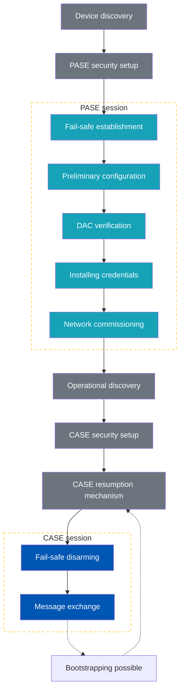

# matter的Commissioning（入网过程）整体流程、加密方式、通信信息结构

在Matter协议中，**控制器负责将新设备加入网络（commissioning）** 的整个流程，这一过程包括设备的发现、验证、授权、加入Fabric，以及最终建立数据通信的步骤。配网完成后的数据通信过程同样遵循严格的加密方式，以确保设备之间的通信安全可靠。

---

## 1. Commissioning（入网过程）整体流程

Matter控制器负责将新设备加入到Matter网络，这一流程被称为commissioning（配网或入网）。下面是详细的步骤：

### 1.1. 设备发现

- 设备发现是Matter网络中的第一步，控制器需要识别网络中新的或待入网的设备。
- 设备通常通过**mDNS（多播DNS）** 服务向网络广播其存在，并包括设备的基本信息，如设备类型、功能等。控制器使用mDNS查询找到这些设备。
- 新设备处于未加入状态时，也可以显示二维码（或其他形式的凭证），供控制器扫描以开始入网流程。

### 1.2. 认证与初始配置

- 发现设备后，控制器需要与设备进行初步的设备认证和身份验证。这通常通过设备提供的凭证或安全代码来完成（例如二维码中的设备凭证或手动输入的PIN码）。
- 控制器会验证设备的身份，确保它是一个可信的Matter设备。这一步防止未经授权的设备加入网络。

### 1.3. 会话建立

- 设备认证后，控制器会通过**PAKE协议（Password Authenticated Key Exchange，基于密码的认证密钥交换）** 与设备建立一个安全的临时会话。
- 该会话用于确保在设备加入到网络前的通信安全，避免中间人攻击和未经授权的数据截取。
- PAKE是一种基于双方共享的短密码或认证信息的密钥交换机制，确保双方能够建立一个加密的通信通道。

### 1.4. 加入Fabric（Fabric Enrollment）

- 通过安全会话，控制器将设备添加到特定的Fabric（即网络结构）。Fabric是Matter网络中的一个安全隔离域，保证加入的设备只能与该Fabric内的设备安全通信。
- 控制器为设备分配一个唯一的节点ID，并将设备注册到Fabric中。
- 在加入Fabric时，控制器还会分发与Fabric相关的配置信息，例如网络配置、Fabric ID、设备角色等。

### 1.5. 密钥协商和持久化

- 一旦设备成功加入Fabric，控制器与设备会进行加密密钥的协商，用于后续的安全通信。
- 这些密钥会被设备持久化存储，用于未来与该Fabric中其他设备的通信。
- 控制器和设备之间的所有后续通信都将通过这些密钥进行加密。

### 1.6. Commissioning完成

- 配网过程完成后，设备将成为该Fabric的一部分，能够与Fabric中的其他设备和控制器进行通信。
- 设备此时会有一个持久化的安全身份，并可以参与Fabric的正常数据通信。

---

## 2. 数据通信流程（配网后的通信）

当设备完成配网后，它会与控制器及其他设备进行日常的数据通信。数据通信的整个流程依赖于Matter协议的安全层。

### 2.1. 安全会话建立

- 在设备之间进行数据通信时，Matter首先通过**Session Establishment Protocol（SEP，会话建立协议）** 来建立一个加密的通信会话。
- 在首次通信时，设备会基于共享的密钥或通过之前协商好的密钥生成一个安全会话。
- 该会话会用来加密数据并验证通信的完整性，防止消息篡改和重放攻击。

### 2.2. 消息加密

- 在通信过程中，所有设备之间的数据传输都使用AES-128对称加密。AES是一种高效的对称加密算法，能够保证数据的保密性。
- Matter协议采用了AES-CCM模式（AES加密结合消息认证码），这意味着每条消息在加密的同时也会生成一个认证码，用于验证消息的完整性。
- 消息认证码（Message Authentication Code，MAC）确保设备能够检测到数据是否在传输过程中被篡改。

### 2.3. 公钥加密和认证

- Matter协议还使用**ECDSA（Elliptic Curve Digital Signature Algorithm，椭圆曲线数字签名算法）** 进行设备的身份认证。这种机制在设备首次连接或会话重新建立时，确保通信双方的身份是可信的。
- ECDSA可以在设备上生成数字签名，并由另一方使用预先存储的公钥验证该签名。

### 2.4. 消息完整性和防重放

- Matter协议中的每条消息都包含一个消息计数器，用于防止重放攻击。该计数器确保即使攻击者截获了通信数据，也无法重新发送旧的数据包。
- 每个加密的数据包都需要包括消息认证码和计数器，设备会验证这些信息以确保消息的有效性。

### 2.5. 长时间通信的密钥更新

- 对于长时间运行的设备，Matter协议还支持会话密钥更新机制。设备会定期轮换密钥，以防止长时间使用相同密钥导致的安全风险。
- 这种机制在不中断现有会话的情况下，通过安全的密钥协商过程更新加密密钥。

---

## 3. Matter的加密和安全性概述

Matter协议中采用了多层次的加密机制，确保每个通信阶段都高度安全：

- **PAKE协议**：用于初次建立安全会话，防止初始通信中的中间人攻击。
- **AES-128对称加密**：用于加密数据通信，确保数据的机密性。
- **ECDSA数字签名**：用于设备认证，确保通信双方的身份是可信的。
- **消息认证码（MAC）**：保证消息的完整性，防止篡改。
- **消息计数器**：防止重放攻击。
- **密钥轮换机制**：用于长时间运行设备的安全性，确保设备密钥可以动态更新。

### 配网（Commissioning）期间和正常数据通信使用了两种不同的加密机制：

- **PASE（Password Authenticated Session Establishment）** 用于配网期间的加密。
- **CASE（Certificate Authenticated Session Establishment）** 用于配网完成后的正常数据通信。

详细解释一下：

#### 1. PASE（Password Authenticated Session Establishment）—— 配网期间的加密

- PASE协议用于在配网期间建立初始的安全会话。配网时，设备和控制器之间通过共享的密码（Password）或PIN码进行身份验证。
- **应用场景**：PASE适用于设备首次加入Matter网络时（即Commissioning阶段），例如：
  - 控制器扫描设备的二维码或手动输入PIN码，设备和控制器使用该信息进行身份验证。

##### PASE的工作流程：

- **密码验证**：设备和控制器会通过PAKE协议（基于密码的认证密钥交换协议）验证彼此身份，并建立一个安全的通信信道。
- **密钥协商**：双方通过PAKE协议协商出一个临时的会话密钥，保护配网过程中的数据传输安全。
- **安全会话**：在PASE会话建立后，控制器和设备可以通过加密通道进行进一步的配网操作，比如将设备添加到Fabric、分发配置等。

PASE提供了配网阶段的加密保护，确保即使配网期间传输的数据被截获，未经授权的第三方也无法解密通信内容。

#### 2. CASE（Certificate Authenticated Session Establishment）—— 正常通信中的加密

- CASE协议用于在设备已经加入Matter网络后，进行日常数据通信时的安全会话建立。
- **应用场景**：CASE适用于设备已经成功加入Fabric后，设备与设备之间、设备与控制器之间的日常通信，例如：
  - 控制设备的开关、读取传感器数据等。

##### CASE的工作流程：

- **证书认证**：CASE基于设备的数字证书（通常是X.509证书），每个Matter设备在出厂时都有一组设备认证凭证（DAC，Device Attestation Certificate）。设备使用其证书链来验证其身份。
- **密钥协商**：在证书认证通过后，设备与控制器或其他设备通过CASE协议协商会话密钥，使用这些密钥来加密后续的通信。
- **安全通信**：一旦会话密钥建立，设备和控制器之间的通信数据将通过AES-128加密算法加密，确保通信的机密性和完整性。

CASE使用公钥基础设施（PKI）和证书进行身份认证，比PASE更安全且适用于更长期的设备间通信。CASE协议的目标是确保只有经过认证的设备能够在网络中安全通信，并防止中间人攻击。

#### 3. PASE 和 CASE 的比较

| 特性 | PASE | CASE |
|------|------|------|
| 使用场景 | 配网（Commissioning）阶段 | 正常数据通信阶段 |
| 认证方式 | 基于密码/PIN码的身份验证 | 基于证书的身份验证（X.509证书） |
| 密钥交换机制 | PAKE（基于密码的认证密钥交换） | 公钥加密和证书认证 |
| 加密算法 | AES-128加密（会话层加密） | AES-128加密（会话层加密） |
| 安全级别 | 适用于短期通信，如设备加入网络 | 适用于长期设备间通信，基于PKI的更高安全性 |

---

## 4. Matter消息的组成部分

### 4.1. 消息头（Message Header）

消息头包含了用于路由、加密、消息类型等信息，通常位于消息的开头部分，负责定义消息的基本属性。消息头可以进一步分为：

**会话层头（Session Layer Header）**：

- **会话ID（Session ID）**：用于识别消息属于哪个安全会话，确保消息是在相同的会话中传输的。
- **消息计数器（Message Counter）**：每次发送消息时都会递增，用于防止消息重放攻击。接收方通过检查计数器是否为递增的数字来判断消息是否被重放。

**安全层头（Security Layer Header）**：

- **加密算法信息**：标识使用的加密算法，如AES-128-CCM。
- **消息认证码（Message Authentication Code, MAC）**：用于验证消息的完整性，防止数据篡改。

**网络层头（Network Layer Header）**：

- **消息类型（Message Type）**：指示消息的类型，如数据请求、响应、命令等。
- **目标节点ID**：标识消息的接收者节点，可以是单播或组播的目标。
- **源节点ID**：标识发送消息的设备节点。

### 4.2. 加密负载（Encrypted Payload）

这是经过加密的消息负载部分，包含设备之间通信的实际内容。为了确保安全性，负载部分通常通过AES-128加密算法进行加密。负载部分还包括了设备间的应用数据和指令。

负载部分的组成如下：

- **命令对象（Command Object）**：通常用于定义设备之间的操作或指令，例如开关灯、读取传感器数据等。
- **状态响应（Status Response）**：用于设备之间的状态通信，如成功或错误响应。
- **事件（Event）**：设备之间的特定事件报告，比如状态变化或警告等。
- **属性报告（Attribute Reporting）**：设备报告其某些状态或属性的变化。

### 4.3. 应用数据（Application Data）

应用层是设备之间具体执行操作的层次，负责承载实际的数据内容。根据应用场景不同，应用数据可能是命令、响应、状态更新等。这部分的数据取决于消息的类型：

- **指令（Commands）**：设备操作，如开关设备、调整温度等。
- **响应（Responses）**：接收方对命令或请求的响应结果，如成功、失败或者设备状态。
- **属性（Attributes）**：设备的状态数据，例如当前温度、亮度等。

### 4.4. 附加信息（Additional Information）

有时，Matter消息还可以包含其他附加信息，包括：

- **组播信息（Multicast Information）**：用于组播通信的消息，如一个设备控制多个设备。
- **时间戳**：消息发送的时间，用于同步设备的时钟。
- **扩展字段（Extension Fields）**：允许扩展未来的功能，确保协议的灵活性和可扩展性。

---

## 5. Matter消息的加密与安全性

Matter协议对消息的安全性非常重视，每个Matter消息在传输前都经过加密。常见的加密方式包括：

- **AES-128-CCM加密**：用于加密消息的负载部分，确保数据的机密性。
- **消息计数器和消息认证码（MAC）**：用于防止消息重放和数据篡改。

**加密的流程**：

1. 应用层的负载先生成一个消息。
2. 消息通过安全层加密，形成加密的负载。
3. 最终形成完整的Matter消息，包括加密头、会话信息、负载等。

---

## 6. 不同类型的Matter消息

根据应用场景的不同，Matter消息可以有不同的类型：

- **命令消息（Command Message）**：用于控制设备操作，如开关、调节设备状态等。
- **状态消息（Status Message）**：报告设备的当前状态或操作结果。
- **事件消息（Event Message）**：用于通知网络中的其他设备某些事件的发生，如传感器数据变化、设备故障等。
- **属性消息（Attribute Message）**：设备报告或请求某些属性数据，如温度、湿度、亮度等传感器数据。