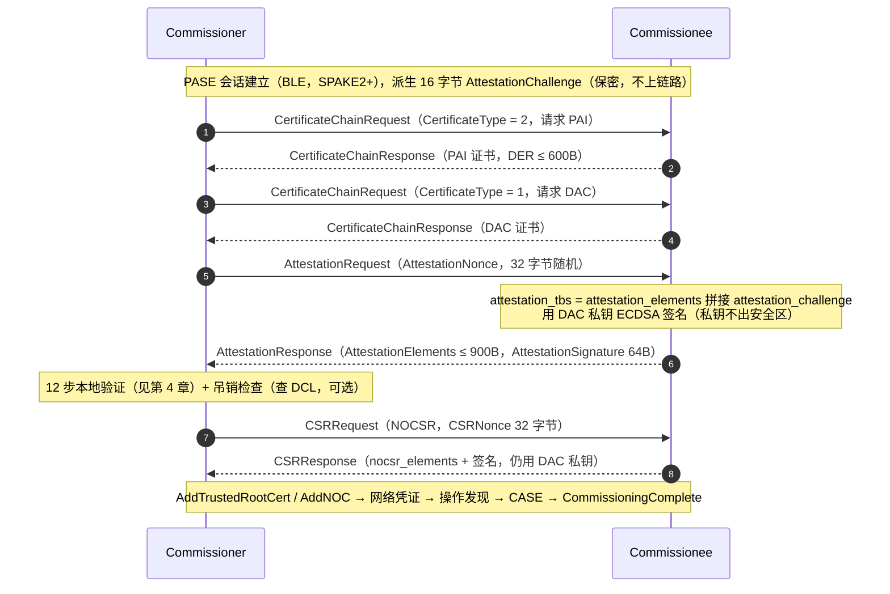

# Matter 安全：PAA / PAI / DAC / CD 验签详解

## 1. 一图看懂：验签发生在配网流程的哪里



命令与阶段名均来自 SDK `src/controller/CommissioningDelegate.h`（`CommissioningStage` 枚举），与 chip-tool 日志中的 `Commissioning stage: -> 'SendPAICertificateRequest'` 等字样一一对应。

### 1.1 完整配网阶段表

下面是从设备日志（`commissioning/commissioning-raspi-log.md`，chip-tool 配网，BLE + Thread）提取的**完整阶段序列**。★ 为本档重点（设备认证相关）：

| # | 阶段（日志字段） | 做什么 | 日志关键行 |
|---|----------------|--------|-----------|
| 1 | BLE 扫描连接 | 按 Discriminator 匹配广播设备 | `Device discriminator match. Attempting to connect.` |
| 2 | SecurePairing | PASE/SPAKE2+ 会话（PBKDFParamRequest → Pake1~3） | `Remote device completed SPAKE2+ handshake` / `Pairing Success` |
| 3 | ReadCommissioningInfo | 读 Descriptor + **Basic Information 集群(0x28)** | `OnReadCommissioningInfo - vendorId=0x149A productId=0x3005` |
| 4 | ArmFailSafe | 布 60 秒失败保险，超时回滚 | `Arming failsafe (60 seconds)` |
| | ConfigRegulatory / ConfigureTCAcknowledgments | 地区配置；条款确认（可跳过） | `Setting Terms and Conditions: Skipped` |
| 5★ | SendPAICertificateRequest | CertificateChainRequest（type=2） | PAI 470 字节 |
| 6★ | SendDACCertificateRequest | CertificateChainRequest（type=1） | DAC 481 字节 |
| 7★ | SendAttestationRequest | 32B nonce → AttestationResponse | `AttestationElements 423B + AttestationSignature 64B` |
| 8★ | AttestationVerification | 本档第 4 章的 12 步验证 | `Successfully finished commissioning step 'AttestationVerification'` |
| 9★ | AttestationRevocationCheck | 查 DCL 吊销（无 delegate 则跳过） | `WARNING: No revocation delegate available...` |
| 10 | SendOpCertSigningRequest → ValidateCSR → GenerateNOCChain | NOCSR（复用 DAC 私钥签名）→ 生成 NOC | `Received certificate signing request from the device` |
| 11 | SendTrustedRootCert → SendNOC | 装根证书 + 装运营证书 | `Device returned status 0 on receiving the NOC` |
| 12 | ThreadNetworkSetup / FailsafeBeforeThreadEnable / ThreadNetworkEnable | 配网凭证 + 重布保险 + 启用网络 | `Received ConnectNetwork response, networkingStatus=0` |
| 13 | EvictPreviousCaseSessions → FindOperational（DNS-SD） | 操作发现，找到设备 IPv6 地址 | `UDP:[fd00:...]:5540: new best score: 5` |
| 14 | CASE 建立（Sigma1/2/3） | 用 NOC 建立运营会话 | `Success status report received. Session was established` |
| 15 | SendComplete → Cleanup | CommissioningComplete，自动撤保险 | `Device commissioning completed with success` |

**为什么证书链要分两条命令单独取，而 CD 塞在 AttestationResponse 里？**
证书链静态不变，取一次可缓存复用；CD + nonce + 时间戳是"本次会话动态证据"，必须和签名绑在一起防重放。

---

## 2. 三张证书与一份声明

### 2.1 用一个类比建立直觉

| 现实世界 | Matter 世界 | 说明 |
|---------|------------|------|
| 公安部 / 根身份证签发机构 | **PAA** | 信任的锚点。Commissioner 只信任"名单上"的 PAA |
| 户籍派出所 / 分局 | **PAI** | 代表某个厂商（VID），或某个厂商的某条产品线（VID+PID） |
| 个人身份证 | **DAC** | 每台设备唯一，"我是谁" |
| 学历/学位认证报告 | **CD (Certification Declaration)** | CSA 联盟签发："这个 (VID,PID) 产品通过了认证" |

一句话：**证书链证明"我是谁、谁为我背书"；CD 证明"我这个型号通过了官方认证"**。两者缺一不可，配网时同时校验。

### 2.2 PKI 层级（规范 §6.2.2.1）

```
PAA (Product Attestation Authority) —— 自签名信任根
 │  Basic Constraints: CA:TRUE, pathLen 缺省或 1（critical）
 │  KeyUsage: keyCertSign + cRLSign（critical）
 │  Subject: 可含 VID（0 或 1 个），禁止 PID
 │  存放：Commissioner 信任库 + DCL 全球清单
 │
 └── 签发 ──► PAI (Product Attestation Intermediate)
                 │  Basic Constraints: CA:TRUE, pathLen=0（critical，必须为0）
                 │  KeyUsage: keyCertSign + cRLSign（critical；digitalSignature 可选）
                 │  Subject: 必含 1 个 VID；PID 0 或 1 个
                 │  存放：设备固件/工厂数据（要发给 Commissioner）
                 │
                 └── 签发 ──► DAC (Device Attestation Certificate)
                                  Basic Constraints: CA:FALSE（critical，无 pathLen）
                                  KeyUsage: 仅 digitalSignature（critical）
                                  Subject: 必含 1 个 VID + 1 个 PID
                                  私钥：设备安全区，不可导出
```

三条硬性规定（v1.5）：

1. **DAC 必须由 PAI 签发**，认证路径长度固定为 2，整链**恰好 3 张证书**（§6.2.2、§6.2.3.1）。多插一张 PAI、或省掉 PAI 直连 PAA，都会在策略校验中被拒。
2. **PAI 必须归属一个 VID；可以再限定到一个 PID**。"一个 PAI 服务多个产品"时就必须不带 PID（§6.2.2.1）。
3. **所有证书 DER ≤ 600 字节**；Key Identifier（SKID/AKID）固定 **20 字节**（§6.1.2、§6.1.3）。

> **实测样例**（设备日志）：`CN = HOPERF Matter PAA 01`（VID 0x1470，无 PID，466B）→ `CN = HOPERF Matter PAI 01`（VID 0x1470，无 PID，470B）→ `CN = HOPERF Matter DAC`（VID 0x1470 + PID 0x8006，481B）——完全符合上表；PAA/PAI 有效期 100 年也是常见做法。

### 2.3 谁必须有 VID/PID（全景表）

这是最容易混淆的一张表，也是部门讨论（PAI 能不能带"一串 PID"）的根源：

| 位置 | VID | PID | 说明 |
|------|-----|-----|------|
| **PAA** Subject | 0 或 1 个 | **禁止** | 共享型 PAA 常不带 VID；SDK 强制 PAA 有 PID 直接判 `kPaaFormatInvalid` |
| **PAI** Subject | **必须 1 个** | 0 或 1 个 | 带 PID = 只能服务这一个产品；不带 = 服务该 VID 下所有产品 |
| **DAC** Subject | **必须 1 个** | **必须 1 个** | 设备的"身份证号" |
| **CD** TLV | vendor_id（1 个） | **product_id_array（数组，1~100 个）** | "PID 列表"只存在于 CD，不在 PAI |
| **Basic Information Cluster** (0x0028) | VendorID 属性 | ProductID 属性 | 设备运行时"自报家门"， Commissioner 用它做交叉校验 |

> **记住两个"只能有 0 或 1 个"**：PAI/DAC 的 PID 是 X.509 DN 里的单值 RDN，**天生不支持列表**。想要"一个中间证书覆盖多个型号"，唯一的做法是 PAI 不带 PID + CD 的 product_id_array 列出全部已认证 PID（详见第 6 章 FAQ-Q1）。

### 2.4 证书要求逐项对照表（规范 §6.2.2.3 / §6.2.2.4 / §6.2.2.5）

| 检查项 | DAC | PAI | PAA |
|--------|-----|-----|-----|
| 版本 | v3 | v3 | v3 |
| 签名算法 | ecdsa-with-SHA256 | ecdsa-with-SHA256 | ecdsa-with-SHA256 |
| 公钥曲线 | prime256v1 (P-256) | prime256v1 | prime256v1 |
| Basic Constraints | critical, **CA:FALSE** | critical, **CA:TRUE, pathLen=0** | critical, **CA:TRUE, pathLen 缺省或 1** |
| Key Usage | critical, **仅 digitalSignature** | critical, **keyCertSign+cRLSign**（digitalSignature 可选） | critical, **keyCertSign+cRLSign**（digitalSignature 可选） |
| SKID | 必须 | 必须 | 必须 |
| AKID | 必须 | 必须 | 可选（自签名） |
| Extended Key Usage | 可选 | 可选 | 可选 |
| Subject VID/PID | 1 VID + 1 PID | 1 VID + 0..1 PID | 0..1 VID + 0 PID |
| issuer 要求 | = PAI 的 subject（逐字节相同） | = PAA 的 subject（逐字节相同） | issuer == subject（自签） |

> 证书里的 `cRLDistributionPoints` 扩展**可以被带，但 Commissioner 必须忽略**——吊销统一走 DCL（§6.2.4，见 4.4 节）。

---

## 3. VID/PID 在证书里的编码（最容易做错的地方）

### 3.1 Matter OID 分配（Appendix E, Table 128；DN 属性见 §6.1.1 Table 83）

Matter 在私有 arc `1.3.6.1.4.1.37244`（zigbee 企业号）下分两个子 arc：

```
1.3.6.1.4.1.37244
├── .1.x = matter-op-cert（运营证书 NOC/ICAC/RCAC 的 DN 属性）
│    .1.1  matter-node-id            Node ID
│    .1.2  matter-firmware-signing-id
│    .1.3  matter-icac-id
│    .1.4  matter-rcac-id
│    .1.5  matter-fabric-id
│    .1.6  matter-noc-cat            CASE Authenticated Tag (CAT)
│    .1.7  matter-vvs-id             Vendor ID Verification Signer ID（1.5 新增，VID 验证机制）
│
└── .2.x = matter-att-cert（设备认证证书的 DN 属性）★ 本档主角
     .2.1  matter-oid-vid            Vendor ID
     .2.2  matter-oid-pid            Product ID
```

> **口诀：`.2.x` 管认证（VID/PID），`.1.x` 管运营（NodeID/FabricID/CAT）**。生成证书时 OID 用错 arc，证书过不了 Matter 合规校验。

### 3.2 值的编码：4 字符大写 HEX 字符串（不是 2 字节二进制！）

规范 §6.1.1：X.509 DER 中 VID/PID 的 RDN **值**必须是 `UTF8String` 或 `PrintableString`，内容为**大写十六进制、恰好 4 字符、不省略前导零、无任何前缀分隔符**。

```
VID 0xFFF1  →  RDN 值 = "FFF1"        （4 字符 ASCII）
PID 0x00B1  →  RDN 值 = "00B1"        （前导零必须保留）
PID 0x2A    →  错，必须写 "002A"
```

SDK 解析侧代码（`src/crypto/CHIPCryptoPAL.cpp`）：

```cpp
inline constexpr size_t kVIDandPIDHexLength = sizeof(uint16_t) * 2;   // 必须 4 字节 ASCII

// kMatterVID / kMatterPID 分支：
VerifyOrReturnError(attr.size() == kVIDandPIDHexLength, CHIP_ERROR_WRONG_CERT_DN);
VerifyOrReturnError(Encoding::UppercaseHexToUint16(attr.data(), attr.size(), matterAttr) == sizeof(matterAttr),
                    CHIP_ERROR_WRONG_CERT_DN);
```

如果工具把 VID 编成 2 字节二进制 INTEGER，OpenSSL 显示正常，Matter 解析必失败——这是生成证书时最隐蔽的坑。

### 3.3 两种编码方法（preferred / fallback）与解析优先级

规范 §6.2.2.2 允许两种写法，**同一个字段内不得混用**：

1. **Preferred**：用 Matter OID 作 RDN 属性类型
   `Subject: CN = Matter Test PAI, 1.3.6.1.4.1.37244.2.1 = FFF1, 1.3.6.1.4.1.37244.2.2 = 8000`
2. **Fallback**（给不支持的 CA 基础设施）：塞在 commonName 字符串里
   `Subject: CN = Matter Test DAC 0001 Mvid:FFF1 Mpid:8000`
   规则：`Mvid:` / `Mpid:` 前缀后**恰好 4 位大写 HEX**；取**最左边的合法匹配**；出现前缀但找不到完整合法值 → 整个证书判非法。

SDK 解析（`ExtractVIDPIDFromX509Cert`，mbedTLS 后端）真实行为：

```cpp
// 遍历 Subject DN 的每个 RDN
for (dnIterator = &mbed_cert.subject; dnIterator != nullptr; dnIterator = dnIterator->next) {
    if      (OID == sOID_AttributeType_CommonName)     attrType = kCommonName;   // 尝试 fallback
    else if (OID == sOID_AttributeType_MatterVendorId) attrType = kMatterVID;    // 1.3.6.1.4.1.37244.2.1
    else if (OID == sOID_AttributeType_MatterProductId) attrType = kMatterPID;   // 1.3.6.1.4.1.37244.2.2
    ExtractVIDPIDFromAttributeString(attrType, ...);
}
// 关键优先级：只要 OID 属性解析出了结果，CN 里的 Mvid:/Mpid: 就被丢弃
if (!vidpid.Initialized()) {
    vidpid = vidpidFromCN;      // 只有 OID 方式一无所获时才用 CN fallback 的结果
}
```

配套的 DN 规则（§6.2.2.2 末尾 + SDK 同款逻辑）：
- 出现 Matter OID 的字段，**禁止再**从 CN 里解析 fallback（防止两套值打架）；
- DAC 的 issuer 必须与 PAI 的 subject **逐字节相同**（链验证的基础），因此 PAI 用了哪种编码，它签的 DAC 的 issuer 就固定是那种。

---

## 4. 验签全流程（按 SDK 真实执行顺序）

### 4.0 核心数据流

```
AttestationResponse
 ├── AttestationElements [0]  = TLV 结构 attestation-elements（≤900B，RESP_MAX）
 │     {
 │        certification_declaration [1] : OCTET STRING  ← CMS 签名的 CD
 │        attestation_nonce         [2] : OCTET STRING[32] ← 原样带回 Commissioner 给的 nonce
 │        timestamp                 [3] : uint32 (epoch-s)
 │        firmware_information      [4] : OCTET STRING (可选)
 │        ...厂商自定义字段：必须用 fully-qualified profile tag，未知则忽略
 │     }
 └── AttestationSignature [1] = 64 字节 ECDSA(r||s)
       签名消息 attestation_tbs = attestation_elements_message || attestation_challenge
       challenge：16 字节，来自当前 PASE/CASE 会话，不出现在任何链路载荷中
```

规范依据：§11.18.4.6 / §11.18.4.7；SDK：`src/credentials/DeviceAttestationConstructor.cpp`。
TLV 解析强制：**第一个 tag 必须是 1（CD），后续 tag 严格递增**，缺 CD/nonce/timestamp 任一即 `CHIP_ERROR_MISSING_TLV_ELEMENT`。

### 4.1 设备端签名（为什么这样设计）

```
attestation_elements (TLV)      attestation_challenge (16B, 会话内保密)
          │                              │
          └──────────┬───────────────────┘
                     ▼
        SHA-256（签名函数内部计算）
                     ▼
        ECDSA-Sign(DAC 私钥, P-256)  →  64 字节 r||s
```

- **掺 nonce**：绑定"这一次配网"——重放上一次的 AttestationResponse，nonce 对不上，`kAttestationNonceMismatch`；
- **掺 challenge**：绑定"这条安全会话"——中间人即使拿到签名，也无法在另一条会话里使用，因为 challenge 从不离开会话；
- **timestamp**：给 DCL 查询用（按 DAC 的 notBefore 时间点查当时的 PAA 清单与吊销状态）。

设备端同一把 DAC 私钥还用于第 ⑦ 步 CSR：`nocsr_tbs = nocsr_elements || attestation_challenge`，再次证明"**私钥不出安全区、数据过来签名**"的模型（§11.18.4.8 NOCSR Elements）。

### 4.2 Commissioner 的 12 步验证（`DefaultDACVerifier::VerifyAttestationInformation` 真实顺序）

> 路径：`src/credentials/attestation_verifier/DefaultDeviceAttestationVerifier.cpp`
> 规范允许优化执行顺序（§6.2.3.1 末段），SDK 的顺序以"最便宜且能尽早失败"为原则。

| 步 | 做什么 | SDK 关键代码 | 失败错误码 |
|----|--------|-------------|-----------|
| 1 | 入参完整性 + 大小检查（elements ≤ 900B） | `VerifyOrExit(!info.attestationElementsBuffer.empty() && ...)` | `kInvalidArgument(701)` |
| 2 | PAI 必须存在 | `VerifyOrExit(!info.paiDerBuffer.empty())` | `kPaiMissing(207)` |
| 3 | PAI/DAC 格式校验：v3、ecdsa-with-SHA256、P-256、BC/KU 必须 critical、pathLen 规则、KU 位、SKID/AKID 在位 | `VerifyAttestationCertificateFormat(pai, kPAI)` / `(dac, kDAC)` | `kPaiFormatInvalid(203)` / `kDacFormatInvalid(303)` |
| 4 | VID/PID 交叉：PAI 必须有 VID 且 == DAC.VID；DAC 必须有 PID；PAI 有 PID 则必须 == DAC.PID | `ExtractVIDPIDFromX509Cert` + `VerifyOrExit` | `kDacVendorIdMismatch(305)` / `kDacProductIdMismatch(306)` |
| 5 | **attestation 签名校验**（用 DAC 公钥） | `ValidateAttestationSignature(dacPubKey, elements, challenge, sig)` | `kAttestationSignatureInvalid(500)` / `...InvalidFormat(503)` |
| 6 | 找 PAA：取 PAI.AKID → 信任库按 SKID 查 | `mAttestationTrustStore->GetProductAttestationAuthorityCert(paiAkid, paaDer)` | `kPaaNotFound(101)` |
| 7 | PAA 策略检查：PAA 有 VID 则必须 == PAI.VID；**PAA 禁止有 PID** | `VerifyOrExit(!paaVidPid.mProductId.HasValue(), kPaaFormatInvalid)` | `kPaiVendorIdMismatch(205)` / `kPaaFormatInvalid(105)` |
| 8 | DAC 有效期：以**签发时刻**（notBefore）为基准检查整链 | `IsCertificateValidAtCurrentTime(dac)`（编译期可关） | `kDacExpired(300)` |
| 9 | 证书链密码学验证（PAA→PAI→DAC） | `ValidateCertificateChain(paa, pai, dac)`（mbedTLS/OpenSSL 后端） | `MapError()` → `kPaaFormatInvalid/kPaiFormatInvalid/kDacFormatInvalid/kDacSignatureInvalid(301)` |
| 10 | 解析 attestation elements + **nonce 比对** | `DeconstructAttestationElements(...)` + `attestationNonceSpan.data_equal(info.attestationNonceBuffer)` | `kAttestationElementsMalformed(501)` / `kAttestationNonceMismatch(502)` |
| 11 | **CD 校验**：先验签，再做交叉一致性 | 见 4.3、第 5 章 | `kCertificationDeclaration*(600~606)` |
| 12 | 吊销检查（独立 commissioner 阶段） | `CheckForRevokedDACChain(...)` | `kDacRevoked(302)` / `kPaiRevoked(202)` / `kPaiAndDacRevoked(208)` |

其中第 5 步的签名验证（`DeviceAttestationVerifier.cpp`）：

```cpp
CHIP_ERROR DeviceAttestationVerifier::ValidateAttestationSignature(const P256PublicKey & pubkey,
                                                                   const ByteSpan & attestationElements,
                                                                   const ByteSpan & attestationChallenge,
                                                                   const P256ECDSASignature & signature)
{
    Hash_SHA256_stream hashStream;                      // 流式 SHA-256
    uint8_t md[kSHA256_Hash_Length];
    MutableByteSpan messageDigestSpan(md);

    ReturnErrorOnFailure(hashStream.Begin());
    ReturnErrorOnFailure(hashStream.AddData(attestationElements));   // 先喂 elements
    ReturnErrorOnFailure(hashStream.AddData(attestationChallenge));  // 再拼 challenge
    ReturnErrorOnFailure(hashStream.Finish(messageDigestSpan));

    // 用 DAC 证书里的公钥验证哈希签名（ECDSA over P-256）
    ReturnErrorOnFailure(pubkey.ECDSA_validate_hash_signature(
        messageDigestSpan.data(), messageDigestSpan.size(), signature));
    return CHIP_NO_ERROR;
}
```

第 6 步的信任库接口（`DeviceAttestationVerifier.h`）：

```cpp
class AttestationTrustStore
{
public:
    // 用 PAI 的 AKID（= PAA 的 SKID）查询信任库
    virtual CHIP_ERROR GetProductAttestationAuthorityCert(const ByteSpan & skid,
                                                          MutableByteSpan & outPaaDerBuffer) const = 0;
};
```

两个现成实现：
- `FileAttestationTrustStore`：chip-tool 的 `--paa-trust-store-path <dir>` 从目录加载 PAA 文件；
- `TestAttestationTrustStore`：SDK 内置测试 PAA（如 `Chip-Test-PAA-FFF1-Cert.pem`，SKID `6A:FD:22:77:...`）。生产禁止依赖。

### 4.3 第 11 步展开：CD 校验（先签名、后语义）

```cpp
// ① 验 CMS 签名（DefaultDACVerifier::ValidateCertificationDeclarationSignature）
CMS_ExtractKeyId(cmsEnvelope, kid);                      // 从 SignerInfo 取 KeyID
mCdKeysTrustStore.LookupVerifyingKey(kid, verifyingKey); // 查 6 把内置钥匙（第 5.4 节）
if (mCdKeysTrustStore.IsCdTestKey(kid) && !IsCdTestKeySupported()) {
    return kCertificationDeclarationNoCertificateFound;  // 生产禁用测试钥匙
}
CMS_Verify(cmsEnvelope, verifyingKey, cdPayload);        // ECDSA 验签，取出 TLV 明文

// ② 语义交叉校验（ValidateCertificateDeclarationPayload）
DecodeCertificationElements(...);                        // TLV 解析
VerifyOrReturnError(cdContent.formatVersion == 1 &&
                    cdContent.certificationType < CertificationType::kReserved,   // 0/1/2 合法
                    kAttestationElementsMalformed);

// 第一基准：Basic Information Cluster（vendorId/productId 来自设备自报）
VerifyOrReturnError(cdContent.vendorId == deviceInfo.vendorId,
                    kCertificationDeclarationInvalidVendorId);
VerifyOrReturnError(cdElementsDecoder.IsProductIdIn(cd, deviceInfo.productId),
                    kCertificationDeclarationInvalidProductId);

if (!cdContent.dacOriginVIDandPIDPresent) {
    // 普通模式：DAC 与 PAI 的身份必须落在 CD 的常规字段里
    //   DAC.VID == CD.vendor_id；PAI.VID == CD.vendor_id
    //   DAC.PID ∈ CD.product_id_array；PAI.PID(若有) ∈ CD.product_id_array
} else {
    // ODM 模式：DAC 与 PAI 的身份必须落在 dac_origin_* 字段里
    //   DAC.VID == dac_origin_vendor_id；PAI.VID == dac_origin_vendor_id
    //   DAC.PID == dac_origin_product_id；PAI.PID(若有) == dac_origin_product_id
}

if (cdContent.authorizedPAAListPresent) {
    // PAA 的 SKID 必须出现在 authorized_paa_list 中
}
```

注意两处容易被忽略的强制点：
- **PAI 带 PID 时，这个 PID 也必须在 CD 的 product_id_array 里**（普通模式）或等于 dac_origin_product_id（ODM 模式）——"PAI 通配所有 PID"的前提是它根本不带 PID；
- **即使 ODM 模式，CD.vendor_id / product_id_array 仍然必须匹配 Basic Info**——即设备 Basic Info 报的是**品牌** VID/PID，DAC 报的是**原厂** VID/PID，CD 用 `dac_origin_*` 把两套身份绑定（见 5.5 节矩阵）。

### 4.4 吊销检查（v1.5 §6.2.4）

- Matter 设备认证 PKI **不用 OCSP，也不强制证书带 CRLDP**；证书里的 `cRLDistributionPoints` 扩展**必须被忽略**。
- 唯一互操作方法是 **DCL（Distributed Compliance Ledger）的 Device Attestation PKI Revocation Distribution Points**（§11.23.9）。吊销信息可拆分在多条记录里，支持 PAI/PAA 的 CRL 委派（indirect CRL）。
- SDK 侧是可选挂件：`DeviceAttestationRevocationDelegate`。没挂时打日志并放行：
  `WARNING: No revocation delegate available. Revocation checks will be skipped!`（生产建议实现）。

---

## 5. Certification Declaration（CD）深度解析

### 5.1 CD 是什么

CD 是**CSA 联盟**（不是厂商！）签发的一段 CMS 签名数据：内嵌一段 TLV 明文，声明"VID=P 的这些 PID 已通过认证（类型 T）"。产品完成认证后由联盟颁发，随固件/工厂数据写入设备，配网时在 AttestationResponse 里上交。**任何 Node 都不得生成 CD，只能存储并转发**（§6.3.1 末段）。

### 5.2 CMS 结构（RFC 5652 SignedData 的最小子集）

```
CertificationDeclaration ::= SEQUENCE {
    version            INTEGER (v3(3)),
    digestAlgorithm    OID sha256 (2.16.840.1.101.3.4.2.1),
    encapContentInfo   SEQUENCE {
        eContentType   OID pkcs7-data (1.2.840.113549.1.7.1),
        eContent       OCTET STRING  ← 内嵌 TLV 明文（见 5.3）
    },
    signerInfo         SEQUENCE {
        version              INTEGER (v3(3)),
        subjectKeyIdentifier OCTET STRING[20]   ← KeyID：用来选验签公钥
        digestAlgorithm      OID sha256,
        signatureAlgorithm   OID ecdsa-with-SHA256 (1.2.840.10045.4.3.2),
        signature            OCTET STRING
    }
}
```

### 5.3 内嵌 TLV 明文（certification-elements，§6.3.1 修正版）

```
certification-elements => STRUCTURE [tag-order]
{
   format_version          [0]  : uint16            = 1（固定）
   vendor_id               [1]  : uint16            ← 必须匹配 Basic Info VendorID
   product_id_array        [2]  : uint16[1..100]    ← 必须包含 Basic Info ProductID
   device_type_id          [3]  : uint32            ← 设备主设备类型
   certificate_id          [4]  : string[19]        ← CSA 分配的全局唯一编号，如 "ZIG20142ZB330003-24"
   security_level          [5]  : uint8             ← 保留，置 0，读时忽略   ★8-bit，不是32-bit
   security_information    [6]  : uint16            ← 保留，置 0，读时忽略
   version_number          [7]  : uint16            ← CD 自身版本号（联盟分配，与固件版本无关）
   certification_type      [8]  : uint8             ← 0=开发测试 1=临时 2=正式；≥3 保留
   dac_origin_vendor_id    [9]  : uint16  (可选)    ← ODM 场景，与 [10] 必须同时出现/同时缺省
   dac_origin_product_id   [10] : uint16  (可选)
   authorized_paa_list     [11] : OCTET STRING[20][1..10] (可选) ← 允许的 PAA SKI 白名单
}
未列出的 context tag：保留，Commissioner 必须静默忽略。
```

### 5.4 CD 验签公钥：SDK 内置 6 把钥匙

`DefaultDeviceAttestationVerifier.cpp` 中 `gCdSigningKeys[]`（按 KeyID 匹配）：

| 用途 | Key ID (SKID, 20B) |
|------|--------------------|
| **测试** CD Signing Key（仅开发，可被 `EnableCdTestKeySupport(false)` 关闭；默认 `true`） | `62:FA:82:33:59:AC:FA:A9:96:3E:1C:FA:14:0A:DD:F5:04:F3:71:60` |
| 官方 Signing Key **001** | `FE:34:3F:95:99:47:76:3B:61:EE:45:39:13:13:38:49:4F:E6:7D:8E` |
| 官方 Signing Key **002** | `DD:04:DB:58:5B:21:4C:1C:58:15:87:E6:56:8D:F4:87:B6:DD:C7:01` |
| 官方 Signing Key **003** | `47:10:35:E7:C0:4E:AA:A8:BE:7C:4D:4C:13:E3:E4:C2:09:95:A8:4B` |
| 官方 Signing Key **004** | `F6:86:03:A3:69:2E:98:10:72:41:9E:A1:E1:AB:38:54:BD:77:95:D3` |
| 官方 Signing Key **005** | `63:7F:26:34:AD:62:EA:FE:6A:F6:62:EF:B9:6F:6F:D2:FC:BF:FC:2F` |

信任锚：官方钥匙的证书必须链到 CSA 根 `CN = Matter Certification and Testing CA, O = CSA, matter-vendor-id = C5A0`（SDK 内嵌 `gCdRootCert`；运行时用 `CsaCdKeysTrustStore::AddTrustedKey(derCert)` 追加的钥匙会先做链验证）。日志中 `CD signing key identifier: FE:34:...` 即命中官方 001 号钥匙。

### 5.5 VID/PID 交叉校验总矩阵

| 校验关系 | 普通模式 | ODM 模式（CD 含 dac_origin_*） |
|---------|---------|------------------------------|
| CD.vendor_id ↔ Basic Info VendorID | 必须 | 必须（不变） |
| CD.product_id_array ⊇ Basic Info ProductID | 必须 | 必须（不变） |
| DAC.VID ↔ CD.vendor_id | 必须 | ✗（换成下行） |
| DAC.VID ↔ CD.dac_origin_vendor_id | — | 必须 |
| PAI.VID ↔ CD.vendor_id | 必须 | ✗（换成下行） |
| PAI.VID ↔ CD.dac_origin_vendor_id | — | 必须 |
| DAC.PID ↔ CD | ∈ product_id_array | == dac_origin_product_id |
| PAI.PID（若有）↔ CD | ∈ product_id_array | == dac_origin_product_id |
| DAC.VID ↔ PAI.VID（第 4 步，与 CD 无关） | 必须 | 必须 |
| PAI 有 PID 时 ↔ DAC.PID（第 4 步） | 必须相等 | 必须相等 |
| PAA.SKID ∈ CD.authorized_paa_list（若存在） | 必须 | 必须 |

> **实例（ODM 模式）**：日志中 `DAC's VID: 0x1470, PID: 0x8006`、`CD --> VID: 0x149A`、`--> DAC origin VID: 0x1470, PID: 0x8006`、Basic Info 报 `vendorId=0x149A productId=0x3005`。即：设备自报品牌身份 0x149A/0x3005（匹配 CD 常规字段），DAC/PAI 携带原厂身份 0x1470/0x8006（匹配 dac_origin_*），CD 把两套身份绑定——正是右列的完整落地，且 `certification_type: 2 (Certified device)` 为正式认证。

### 5.6 certification_type

| 值 | 含义 | 典型用途 |
|----|------|---------|
| 0 | Development and testing | 开发调试（配 SDK 测试 PAA/测试 DAC） |
| 1 | Provisional | 进认证测试/边认证边量产（允许后续以更高 SoftwareVersion 取证） |
| 2 | Official（Certified device） | 正式认证 |
| ≥3 | 保留 | SDK 直接拒绝（`kAttestationElementsMalformed`） |

---

## 6. 常见疑问 FAQ

**Q1：PAI 能不能带"一组 PID"，让 DAC 报列表里任意一个都通过？**

不能。PAI 的 PID 是 X.509 DN 里的单值 RDN（§6.2.2.2），**只能 0 个或 1 个**。要覆盖多个型号，只有一种姿势：
- PAI **不带 PID**（此时它对该 VID 下所有 PID 都有签发权）；
- 所有已认证 PID 进 **CD 的 product_id_array**（数组，最多 100 个）；
- SDK 的第 4 步只在"PAI 带了 PID"时才强制 `PAI.PID == DAC.PID`；第 11 步强制 `DAC.PID ∈ CD 列表`，且 **PAI.PID（若有）也 ∈ CD 列表**。

**Q2：DAC 的 PID 不在 CD 的 product_id_array 里，能入网吗？**

不能，这是硬性失败：SDK 返回 `kCertificationDeclarationInvalidProductId(605)`，规范 §6.2.3.1 为 SHALL 级校验，chip-tool 直接终止 commissioning。同理 VID 不匹配报 604。**例外**见 Q4。

**Q3：那如果真有一台"PID 对不上却入网成功"的设备，怎么解释？**

按可能性排查：
1. **ODM 模式**：DAC 的 (VID,PID) 匹配的是 CD 的 `dac_origin_*` 字段而不是常规字段——这是合规行为（看日志 `DAC origin VID: 0x%04X, PID: 0x%04X` 是否打印）；
2. **Commissioner 实现有缺陷/宽松**：规范是 SHALL，但实现漏检、或某些工具在开发模式放宽了校验；
3. **Basic Info 交叉没做**：CD 校验的第一基准是 Basic Info 的 VendorID/ProductID，若某 Commissioner 不读这两个属性，就少了一道交叉；
4. 吊销/固件信息检查被跳过（这两项规范允许降级：revocation delegate 缺省跳过、firmware info 可不验），但这不影响 VID/PID 强校验本身。
结论：对量产零售产品，"PID 不在 CD 里还能入网"是异常，**不合理**，除非命中 1。

**Q4：dac_origin_vendor_id / dac_origin_product_id 是什么？（"Original PID"）**

规范里没有叫 "Original PID" 的字段，正式名称就是 CD 的 `dac_origin_vendor_id [9]` / `dac_origin_product_id [10]`（§6.3.1）：
- **必须成对出现或成对缺省**（SDK/规范一致）；
- 设计动机：**ODM 贴牌**。ODM 出厂时 DAC/PAI 已固化自己的 VID/PID；品牌方采购后给设备写入自己的 CD（内含品牌 `vendor_id/product_id_array` + 指向 ODM 链的 `dac_origin_*`），
- 于是校验基准从"常规字段"切到"origin 字段"（见 5.5 矩阵右列）；
- **origin 值与常规值可以相同**（原厂即品牌时）——字段只是切换校验目标，不强制区分；
- 关键洞察：**Basic Info 集群报的是品牌身份（必须匹配 CD.vendor_id），DAC 报的是原厂身份（匹配 dac_origin_*），CD 把两套身份绑定在一起**；
- **实例**：日志中设备 Basic Info 报 `vendorId=0x149A productId=0x3005`，DAC 携带 `0x1470/0x8006`，CD 打印 `VID: 0x149A` + `DAC origin VID: 0x1470, PID: 0x8006` 且 `certification_type: 2 (Certified device)`——一条日志看全 ODM 模式的所有角色（详见 §8.2）。

**Q5：Basic Information 集群报的 VID/PID 和证书不一致会怎样？**

CD 校验直接失败（604/605），因为 CD.vendor_id 必须 == Basic Info VendorID、product_id_array 必须包含 Basic Info ProductID。SDK 错误描述也写明：`Certification declaration vendor ID failed to cross-reference with DAC and/or PAI and/or Basic Information cluster`。所以烧录工厂数据时，**证书、CD、Basic Info 三处的 VID/PID 必须同源配置**。

**Q6：签名为什么要同时掺 nonce 和 challenge？**

nonce 防重放（每次配网唯一，响应必须原样带回并签名）；challenge 绑定安全会话（16 字节，PASE/CASE 派生，从不上链路），防中间人把签名挪到别的会话使用。二者缺一不可——只防"旧证据重放"不够，还要防"证据挪用"。

**Q7：开发用 0xFFF1/0x8000 测试证书，量产要注意什么？**

| 项 | 开发 | 量产 |
|----|------|------|
| PAA | SDK 内置测试 PAA（FFF1） | CSA 官方 PAA 或自有 PAA（注册 DCL） |
| CD | 测试钥匙（`62:FA:...`）签的 CD，`certification_type=0` | 联盟签发的正式 CD，`certification_type=1/2` |
| `EnableCdTestKeySupport` | `true`（默认） | **`false`**（否则测试 CD 仍可通行） |
| DAC/PAI | `credentials/test/` 开发证书 | 真实 PKI 签发，DAC 私钥进安全元件 |
| 吊销检查 | 可跳过 | 建议实现 revocation delegate |

---

## 7. 设备端落地（Silicon Labs）

### 7.1 DAC 与 NOC：出厂身份 vs 入网身份

| | DAC（设备认证证书） | NOC（节点运营证书） |
|----|------------------|-------------------|
| 定位 | 设备出厂时烧录的"出生证明"，独一无二、不可伪造 | 设备加入 Fabric 后获得的"数字身份证" |
| 签发者 | 厂商 PKI（PAA → PAI → DAC），出厂前固化 | Fabric 的 Root CA / ICA 在配网时签发 |
| 存储 | 工厂凭据区（flash 凭据页 / 安全元件），整机生命周期不变 | 配网时随 AddNOC 写入，可 UpdateNOC 更换 |
| 用途 | 仅用于设备认证：向 Commissioner 证明"来自可信厂商的合法设备" | CASE 会话建立、Fabric 内节点间日常认证 |
| 私钥 | DAC 私钥（SE/TA 内，不导出） | 运营私钥（配网时在设备内生成） |

一句话：**DAC 回答"你是不是合法厂商生产的"，NOC 回答"你是不是这个 Fabric 里的合法成员"**。配网流程先用 DAC 完成认证（第 4 章），再换发 NOC；两把私钥相互独立。

### 7.2 统一入口：DeviceAttestationCredentialsProvider

```cpp
// src/credentials/DeviceAttestationCredsProvider.h
class DeviceAttestationCredentialsProvider
{
public:
    virtual CHIP_ERROR GetCertificationDeclaration(MutableByteSpan & outCdBuffer) = 0;      // CD
    virtual CHIP_ERROR GetFirmwareInformation(MutableByteSpan & outFirmwareInfoBuffer) = 0; // 可为空
    virtual CHIP_ERROR GetDeviceAttestationCert(MutableByteSpan & outDacBuffer) = 0;        // DAC (DER)
    virtual CHIP_ERROR GetProductAttestationIntermediateCert(MutableByteSpan & outPaiBuffer) = 0; // PAI
    // 签名在设备内部完成，私钥永远不返回：
    virtual CHIP_ERROR SignWithDeviceAttestationKey(const ByteSpan & messageToSign,
                                                    MutableByteSpan & outSignatureBuffer) = 0;
};
```

- 开发版实现：`src/credentials/examples/DeviceAttestationCredsExample.cpp`（`ExampleDACProvider`，内置 DevelopmentCerts 的 DAC/PAI/CD，签名直接用开发私钥软算）；
- 实现：DAC/PAI/CD 从工厂数据区读取，`SignWithDeviceAttestationKey` 下发到安全元件（SE/TEE/TA）内部完成。

### 7.3 凭据存储：NVM3 机制与实测布局

**Matter 在 NVM3 中的 Key 域**：全芯片 NVM3 Key 空间按协议栈划分，Matter 占用 `0x87200 ~ 0x872FFF`：


**凭据相关 Key 全表**（`src/platform/silabs/SilabsConfig.h`）：

```cpp
// key = 0x087000 (Matter NVM3 域) | (keyBase << 8) | id；Matter 工厂区合法区间 [0x087200, 0x087FFF]
constexpr uint32_t SilabsConfigKey(uint8_t keyBaseOffset, uint8_t id)
{ return kMatterNvm3KeyDomain | (keyBaseOffset << 8) | id; }   // kMatterFactory_KeyBase = 0x2

static constexpr Key kConfigKey_PersistentUniqueId = SilabsConfigKey(0x2, 0x1F); // 0x08721F
static constexpr Key kConfigKey_Creds_KeyId        = SilabsConfigKey(0x2, 0x20); // 0x087220 CD 签名钥匙序号
static constexpr Key kConfigKey_Creds_Base_Addr    = SilabsConfigKey(0x2, 0x21); // 0x087221 凭据区 flash 基址
static constexpr Key kConfigKey_Creds_DAC_Offset   = SilabsConfigKey(0x2, 0x22); // 0x087222
static constexpr Key kConfigKey_Creds_DAC_Size     = SilabsConfigKey(0x2, 0x23); // 0x087223
static constexpr Key kConfigKey_Creds_PAI_Offset   = SilabsConfigKey(0x2, 0x24); // 0x087224
static constexpr Key kConfigKey_Creds_PAI_Size     = SilabsConfigKey(0x2, 0x25); // 0x087225
static constexpr Key kConfigKey_Creds_CD_Offset    = SilabsConfigKey(0x2, 0x26); // 0x087226
static constexpr Key kConfigKey_Creds_CD_Size      = SilabsConfigKey(0x2, 0x27); // 0x087227
static constexpr Key kConfigKey_Provision_Request  = SilabsConfigKey(0x2, 0x28); // 0x087228 产线写入请求
static constexpr Key kConfigKey_Provision_Version  = SilabsConfigKey(0x2, 0x29); // 0x087229 产线协议版本
static constexpr Key kOtaTlvEncryption_KeyId       = SilabsConfigKey(0x2, 0x30); // 0x087230 OTA TLV 加密钥匙
```

**区分"Key"与"值"**：Key（如 `0x087221`）是 NVM3 里的条目编号；它存的"值"才是有效数据。实测推导链：

```
kConfigKey_Creds_Base_Addr  = 553505UL = 0x087221 → 值 = 0x0817E000（凭据区 flash 基址）
kConfigKey_Creds_DAC_Offset = 553506UL = 0x087222 → 值 = 0x00001000（DAC 在基址 +0x1000 处）
kConfigKey_Creds_PAI_Offset = 553508UL = 0x087224 → 旧布局时值 = 0x200（PAI 位于 0x0817E200）
```

即证书本体不在 NVM3 里，NVM3 只存**"凭据区基址 + 各段偏移/长度"**这组索引，证书 DER 放在独立 flash 凭据页，DAC 私钥放 SE/TA。

**新旧布局对比**（同一条产线两个版本的实测 `commander nvm3 parse` 结果）：

| 段 | 旧布局 偏移 / 长度 | 新布局 偏移 / 长度 |
|----|------------------|------------------|
| DAC | 0x0000 / 0x1E1（481B） | **0x1000** / 0x1E0（480B） |
| PAI | 0x0200 / 0x1D6（470B） | **0x1200** / 0x1D6（470B） |
| CD  | 0x0400 / 0x1F4（500B） | **0x1400** / 0x00F5（245B） |

新布局按 flash 页（0x1000）对齐，各段之间留出隔离区；旧布局紧贴基址排布，一旦索引与 flash 实际内容版本不同步，就容易读到已擦除区域（见 7.4 案例）。索引实测：


**排查工具链**：

```bash
# 读出 Matter NVM3 区域并解析
commander nvm3 read  -o nvm3.s37 --device efr32mg24 --range 0x8174000:0x817e000
commander nvm3 parse nvm3.s37
# 解析输出节选（凭据索引部分）
# 0x87220 - Data - 4 B - 02 00 00 00     <- CD 签名钥匙序号 = 2
# 0x87221 - Data - 4 B - 00 E0 17 08     <- 基址 = 0x0817E000（小端）
# 0x87222 - Data - 4 B - 00 10 00 00     <- DAC 偏移 = 0x1000
# 0x87223 - Data - 4 B - E0 01 00 00     <- DAC 长度 = 0x1E0
# 0x87224 - Data - 4 B - 00 12 00 00     <- PAI 偏移 = 0x1200
# 0x87225 - Data - 4 B - D6 01 00 00     <- PAI 长度 = 0x1D6
# 0x87226 - Data - 4 B - 00 14 00 00     <- CD 偏移 = 0x1400
# 0x87227 - Data - 4 B - F5 00 00 00     <- CD 长度 = 0xF5
```

同一份 parse 输出还能解码出一批工厂数据（值均为实测样例）：

| Key | 类型 | 解码 |
|-----|------|------|
| 0x87200 | ASCII 16B | 序列号 |
| 0x87204 | ASCII 10B | 生产日期 |
| 0x87207 | uint16 | Discriminator（`5C 07` → 0x075C） |
| 0x87208 | uint32 | SPAKE2+ 迭代次数（1000） |
| 0x87209 | ASCII | Rotating Device ID |
| 0x8720A | ASCII 132B | 二维码 payload 字符串 |
| 0x8720C | uint16 | VID（`9A 14` → **0x149A**，与配网日志 Basic Info 一致） |
| 0x8720D | ASCII 4B | 项目标识（`A-OK`） |
| 0x8720E | ASCII 18B | 设备名（`Curtain ...`） |
| 0x8720F | ASCII 4B | 软件版本（`V1.0`） |
| 0x87211 | ASCII 21B | 厂商资料 URL |
| 0x8721F | ASCII 32B | PersistentUniqueId |
| 0x8730A | ASCII 2B | 国家码（`CN`） |

**flash 实证**：对凭据页（0x0817E000 起）直接做 S-record dump（见 `dac/dac_flash.md`），在 0x0817F000（基址 +0x1000）处可见 DAC DER 开头：

```
30 82 01 DF 30 82 01 84 A0 03 02 01 02 ...              <- X.509 SEQUENCE 头
... 48 4F 50 45 52 46 20 4D 61 74 74 65 72 20 44 41 43  <- CN = "HOPERF Matter DAC"
... 82 A2 7C 02 01 0C 04 31 34 37 30 ... 38 30 30 36    <- vid="1470"、pid="8006"
```

与配网日志里 Commissioner 收到的 DAC（AKID `EB:B4:9A:F1:...`）完全一致——**NVM3 索引 → flash 偏移 → 证书 DER → 配网日志**四层证据链闭合。

### 7.4 排查案例：PAI 凭据读出无效

**现象**：设备配网失败，错误指向 PAI（`kPaiFormatInvalid` 方向）。

**排查路径**：

1. `commander nvm3 parse`：索引显示 PAI_Offset = 0x200（旧布局）；
2. dump 凭据页 S-record，检查 0x0817E200（基址 + 0x200）：


该区域**整片 0xFF（已擦除状态）**——索引说 PAI 在这里，flash 里却是空的。

**根因**：NVM3 凭据索引与 flash 实际内容版本不一致（旧版索引配了新布局烧录，或烧录工具只写了部分段、未回写索引）。

**修复**：切换到页对齐新布局（DAC@0x1000 / PAI@0x1200 / CD@0x1400），整页重新烧录并回写索引。

**教训**：产线烧录后必须**回读校验**——每段 DER 头应为 `30 82`（X.509 SEQUENCE）、段长度与索引一致、DAC→PAI→PAA 的 AKID/SKID 链可完整解析。把"凭据回读比对"做成产测固定项，这类问题在出厂前就会暴露。

### 7.5 量产工厂数据清单（与验签强相关）

1. DAC 证书（DER ≤600B，Subject 含 VID+PID，KU 仅 digitalSignature）
2. PAI 证书（DER，pathLen=0，KU=keyCertSign+cRLSign）
3. CD（CMS，`certification_type` 与产品阶段一致，VID/PID 与证书同源）
4. DAC 私钥（安全元件内生成/注入，禁导出）
5. Basic Information 集群数据：VendorID / ProductID / SerialNumber / ManufacturingDate 等（必须与证书、CD 一致）
6. SPAKE2+ 参数（IterationCount/Salt/Verifier）、Setup PIN、Discriminator

### 7.6 量产烧录与密钥保护要点

| 要点 | 说明 |
|------|------|
| DAC 唯一性 | 每台设备必须有独立的 DAC 与公私钥对，多台设备共用同一 DAC/私钥等于身份伪造 |
| 私钥保护 | 优先在设备内部生成（产线触发 NOCSR）或 HSM 生成后安全注入；注入完成即销毁外部副本 |
| PAA 离线 | PAA 私钥保持离线/气隙保存，仅用于签发 PAI，不进入产线环境 |
| DCL 注册 | 量产用 PAA 必须注册到 DCL，否则 Commissioner 信任库查不到（`kPaaNotFound`） |

## 8. 错误码与排查

### 8.1 AttestationVerificationResult 全表（SDK 真实值）

```cpp
// src/credentials/attestation_verifier/DeviceAttestationVerifier.h
enum class AttestationVerificationResult : uint16_t
{
    kSuccess = 0,
    // PAA (100~106)
    kPaaUntrusted = 100, kPaaNotFound = 101, kPaaExpired = 102,
    kPaaSignatureInvalid = 103, kPaaRevoked = 104,
    kPaaFormatInvalid = 105, kPaaArgumentInvalid = 106,
    // PAI (200~208)
    kPaiExpired = 200, kPaiSignatureInvalid = 201, kPaiRevoked = 202,
    kPaiFormatInvalid = 203, kPaiArgumentInvalid = 204, kPaiVendorIdMismatch = 205,
    kPaiAuthorityNotFound = 206, kPaiMissing = 207, kPaiAndDacRevoked = 208,
    // DAC (300~307)
    kDacExpired = 300, kDacSignatureInvalid = 301, kDacRevoked = 302,
    kDacFormatInvalid = 303, kDacArgumentInvalid = 304, kDacVendorIdMismatch = 305,
    kDacProductIdMismatch = 306, kDacAuthorityNotFound = 307,
    // 固件信息 (400~401)
    kFirmwareInformationMismatch = 400, kFirmwareInformationMissing = 401,
    // attestation (500~503)
    kAttestationSignatureInvalid = 500, kAttestationElementsMalformed = 501,
    kAttestationNonceMismatch = 502, kAttestationSignatureInvalidFormat = 503,
    // CD (600~606)
    kCertificationDeclarationNoKeyId = 600, kCertificationDeclarationNoCertificateFound = 601,
    kCertificationDeclarationInvalidSignature = 602, kCertificationDeclarationInvalidFormat = 603,
    kCertificationDeclarationInvalidVendorId = 604, kCertificationDeclarationInvalidProductId = 605,
    kCertificationDeclarationInvalidPAA = 606,
    // 通用 (700~703)
    kNoMemory = 700, kInvalidArgument = 701, kInternalError = 702, kNotImplemented = 703,
};
```

排错速查：

| 现象（错误码） | 根因方向 |
|---------------|---------|
| `kPaaNotFound(101)`，日志 `Unable to find PAA ... PAI's AKID: xx` | 信任库缺 PAA：`--paa-trust-store-path` 目录不对 / PAA 未注册 / AKID 与库内 SKID 不匹配 |
| `kDacVendorIdMismatch(305)` | DAC 与 PAI 的 VID 不一致，或 PAI 缺 VID |
| `kDacProductIdMismatch(306)` | DAC 缺 PID，或 PAI.PID 与 DAC.PID 不等 |
| `kDacSignatureInvalid(301)` | 链签名失败：PAI 不是签发该 DAC 的钥匙（常为产线刷错 PAI） |
| `kAttestationSignatureInvalid(500)` | 设备端签名数据/密钥不对（elements、challenge 拼接顺序，或没用 DAC 私钥） |
| `kAttestationNonceMismatch(502)` | 设备没把请求里的 nonce 原样放进 elements[2] |
| `kCertificationDeclarationInvalidProductId(605)` | DAC/Basic Info 的 PID 不在 CD 列表（FAQ-Q2/Q5） |
| `kCertificationDeclarationNoCertificateFound(601)` + `Disallowing CD signed by test key` | CD 用测试钥匙签发，而 Commissioner 已关测试钥匙支持 |

### 8.2 设备日志逐段注解（chip-tool BLE + Thread）

> 完整日志：`commissioning/commissioning-raspi-log.md`。这是设备的真实配网记录——不是 0xFFF1 测试件，**CD 走的是 ODM（dac_origin）模式，认证类型为正式认证**，是本档所有规则的一次完整落地。

**命令行解析：**

```bash
sudo ./chip-tool pairing ble-thread 2250 \
  hex:0e0800000000000100004a0300000b35060004001fffe00208d66aa42e...0f \
  77822335 \                            # ← Setup PIN Code（PASE passcode）
  3087 \                                # ← Discriminator（BLE 广播匹配用）
  --paa-trust-store-path /home/ubuntu/paa-root-certs   # ← PAA 信任库目录
# 2250 = 目标 Node ID (0x8CA)；hex:... = Thread 运营数据集（ TLV：ExtendedPANID/NetworkName="OpenThread-225f"/PSKc/Channel 等 ）
```

**设备认证段注解（日志节选）：**

```
[CTL] Setting attestation nonce to random value          ← 32B nonce 由 CSPRNG 生成
[SVR] OnReadCommissioningInfo - vendorId=0x149A productId=0x3005
        ↑ Basic Info 集群(0x28)自报：品牌身份 0x149A/0x3005（CD 第一基准）
[CTL] Commissioning stage: -> 'SendPAICertificateRequest'
[CTL] Received certificate chain from the device          ← PAI, 470 字节
[CTL] Commissioning stage: -> 'SendDACCertificateRequest' ← DAC, 481 字节
[CTL] Commissioning stage: -> 'SendAttestationRequest'
[CTL] Received Attestation Information from the device    ← elements 423B + 签名 64B
[CTL] Commissioning stage: -> 'AttestationVerification'
[-] Device candidate DAC chain details:
[-] --> DAC's VID: 0x1470, PID: 0x8006                   ← 第 4 步交叉结果（取自证书 DN）
[-] --> DAC certificate SKID: 9C:44:E4:A9:69:D2:AA:CE:76:05:51:CB:E8:4C:DB:E9:68:39:3C:BC
[-] --> DAC certificate AKID: EB:B4:9A:F1:2D:D5:23:57:BD:3E:5A:D2:3D:6F:47:06:D0:BF:9F:9A
[-] --> PAI certificate SKID: EB:B4:9A:F1:2D:D5:23:57:BD:3E:5A:D2:3D:6F:47:06:D0:BF:9F:9A
[-] --> PAI certificate AKID: E9:16:0D:C4:17:F7:41:9C:95:32:0B:BF:36:56:71:93:3F:F3:12:22
[-] --> PAA certificate SKID: E9:16:0D:C4:17:F7:41:9C:95:32:0B:BF:36:56:71:93:3F:F3:12:22
[-] --> PAA certificate AKID: E9:16:0D:C4:17:F7:41:9C:95:32:0B:BF:36:56:71:93:3F:F3:12:22
[-] CD signing key identifier: FE:34:3F:95:99:47:76:3B:61:EE:45:39:13:13:38:49:4F:E6:7D:8E
        ↑ 官方 CD Signing Key 001 命中
[-] --> VID: 0x149A                                       ← CD 常规字段 = 品牌身份
[-] --> Device type ID: 0x0000_0202
[-] --> Certification type: 2 (Certified device)          ← 正式认证（不是开发件！）
[-] --> DAC origin VID: 0x1470, PID: 0x8006               ← ODM 模式：DAC/PAI 的原厂身份
[CTL] Successfully finished commissioning step 'AttestationVerification'
[CTL] Commissioning stage: -> 'AttestationRevocationCheck'
[-] WARNING: No revocation delegate available. Revocation checks will be skipped!
[CTL] Commissioning stage: -> 'SendOpCertSigningRequest'  ← 通过后进入 NOCSR
```

**SKID/AKID 链核对表（实测值，与本档第 2.2 节的链式关系一致）：**

| 证书 | CN | SKID | AKID | 关系 |
|------|----|------|------|------|
| PAA | HOPERF Matter PAA 01 | `E9:16:0D:C4:...:3F:F3:12:22` | `E9:16:0D:C4:...`（==SKID，自签） | 信任根 |
| PAI | HOPERF Matter PAI 01 | `EB:B4:9A:F1:...:D0:BF:9F:9A` | `E9:16:0D:C4:...`（=PAA.SKID） | 指向 PAA |
| DAC | HOPERF Matter DAC | `9C:44:E4:A9:...:68:39:3C:BC` | `EB:B4:9A:F1:...`（=PAI.SKID） | 指向 PAI |

**身份三处对照（ODM 模式全角色）：**

| 来源 | VID | PID | 校验对象 |
|------|-----|-----|---------|
| DAC / PAI 证书 DN | 0x1470 | 0x8006（仅 DAC） | CD.dac_origin_* |
| CD 常规字段（vendor_id / product_id_array） | 0x149A | （数组含 0x3005） | Basic Info 集群 |
| Basic Information 集群（0x28 属性读取：`Attribute 0x04 = 12293(0x3005)`、`Attribute 0x02 = 5274(0x149A)`） | 0x149A | 0x3005 | CD.vendor_id / product_id_array |
| CD.dac_origin_vendor_id / dac_origin_product_id | 0x1470 | 0x8006 | DAC/PAI 证书 DN |

一句话：**设备自报品牌身份（0x149A/0x3005），证书携带原厂身份（0x1470/0x8006），CD 用 dac_origin_* 把两者绑定**——这正是 §5.5 矩阵右列的完整落地。

**其余可观察点：**
- PAI/PAA 有效期 100 年（`20230905→22201022` / `20230825→21230708`），证书常见做法；
- 日志明确打印 `Certification type: 2 (Certified device)`——与 SDK `CertificationTypeAsString` 一一对应；
- NOCSR 响应（CSRResponse 261B elements + 64B 签名）同样来自 DAC 私钥，可对比 AttestationResponse 的 64B 签名格式；
- CASE 阶段（Sigma1→Sigma2→Sigma3→StatusReport）用的就是刚装的 NOC——NOC 私钥与 DAC 私钥是两把不同的钥匙。

## 9. 参考资料

**规范（Matter Core Specification R1.5, 23-27349-009）**
- §6.1 证书公共约定；§6.1.1 Matter DN OID（Table 83）；§6.1.2 KeyID 20B；§6.1.3 证书 ≤600B
- §6.2.2.1 DAC PKI 层级；§6.2.2.2 VID/PID 编码（preferred/fallback）；§6.2.2.3 DAC；§6.2.2.4 PAI；§6.2.2.5 PAA
- §6.2.3 设备认证流程；§6.2.3.1 验证清单（SHALL 条款全集）；§6.2.4 吊销与 DCL
- §6.3.1 CD 格式（TLV + CMS）；§6.3.2 Firmware Information
- §11.18.4.6 Attestation Elements；§11.18.4.7 Attestation Information（attestation_tbs 构造）；§11.18.6.1~4 命令定义
- §11.23.9 DCL 吊销分发点 Schema；Appendix E OID 总表（Table 128）；Appendix F 测试向量（F.1 CD / F.2 AttestationResponse）

**SDK（Silicon Labs Matter 扩展内置 connectedhomeip）**
```
src/credentials/attestation_verifier/DeviceAttestationVerifier.h        # 错误码枚举 / AttestationTrustStore / DeviceInfoForAttestation
src/credentials/attestation_verifier/DefaultDeviceAttestationVerifier.cpp  # 12 步验证 / CD 钥匙表 / MapError
src/credentials/attestation_verifier/FileAttestationTrustStore.cpp      # chip-tool PAA 目录信任库
src/credentials/DeviceAttestationConstructor.cpp                        # attestation elements TLV 构造/解析
src/credentials/CertificationDeclaration.h/.cpp                         # CD TLV + CMS 编解码
src/credentials/CHIPCert.cpp                                            # ExtractVIDPIDFromX509Cert（声明在 CHIPCert.h，实现经 CryptoPAL）
src/crypto/CHIPCryptoPALmbedTLSCert.cpp / CHIPCryptoPALOpenSSL.cpp      # VerifyAttestationCertificateFormat / ValidateCertificateChain / OID 常量
src/credentials/DeviceAttestationCredsProvider.h                        # 设备端 Provider 接口
src/credentials/examples/DeviceAttestationCredsExample.cpp              # 开发用测试凭据
src/platform/silabs/SilabsConfig.h / MigrationManager.cpp               # NVM3 工厂数据 Key
src/controller/CommissioningDelegate.h                                  # CommissioningStage 全流程枚举
```
---

## 附录 A：术语速查

| 缩写 | 全称 | 角色定位 |
|------|------|---------|
| CA | Certificate Authority | 通用术语，负责颁发和管理数字证书的机构。Matter 中泛指 PAI/PAA 这类有颁发权限的机构 |
| DAC | Device Attestation Certificate | 设备认证证书，出厂烧录的"出生证明"，独一无二且不可伪造；首次入网时向网络证明自己是可信厂商的合法设备 |
| PAI | Product Attestation Intermediate | 产品认证中间证书，由 PAA 颁发给具体厂商，位于证书链中间层，用于签署该厂商产品的 DAC |
| PAA | Product Attestation Authority | 产品认证机构，整个设备认证体系的最高信任根；由 CSA 审核并列入公共清单，负责签发 PAI |
| NOC | Node Operational Certificate | 节点运营证书，设备加入 Fabric 后获得的"数字身份证"，用于日常通信与身份验证 |
