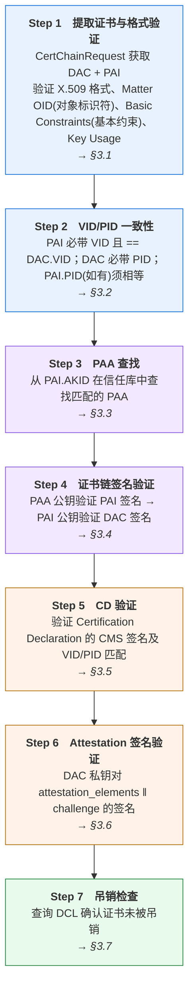
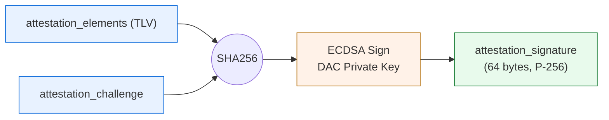
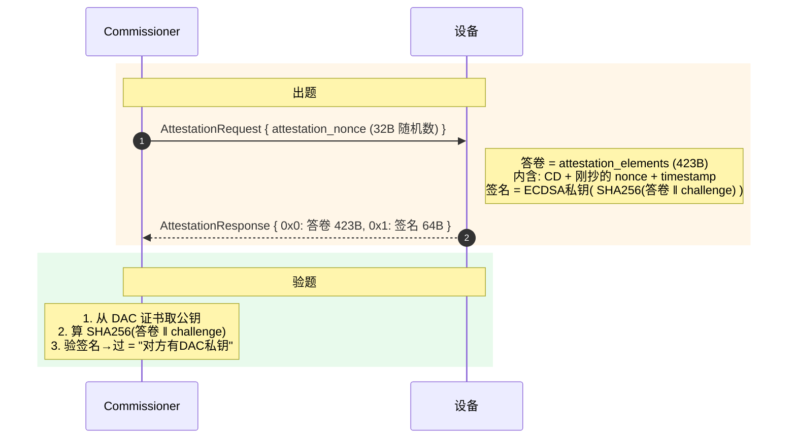
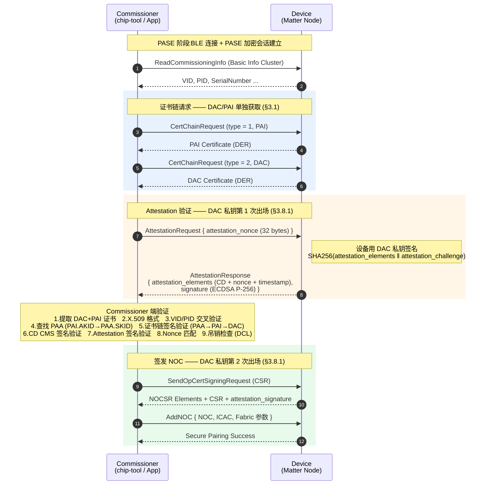

# Matter PAA/PAI/DAC 验签过程

---

## 目录

1. [证书链架构概览](#1-证书链架构概览)
2. [PAA / PAI / DAC 证书详解](#2-paa--pai--dac-证书详解)
3. [验签流程](#3-验签流程)
4. [配网与验签 Log 分析](#4-配网与验签-log-分析)
5. [错误排查指南](#5-错误排查指南)

---

## 1. 证书链架构概览

Matter 设备认证采用三层 X.509 证书链架构,形成完整的信任传递链:

```c
PAA (信任根 / Root CA)
 │  由 CSA 或厂商自建
 │  存储在 Commissioner 端信任库
 │  私钥在 (AWS CloudHSM)中离线保管
 │
 └── 签名 ──→ PAI (中间证书 / Intermediate CA)
                  │  每个产品系列一个
                  │  存储在设备固件中
                  │  包含 VID + PID
                  │  私钥在(?)
                  │
                  └── 签名 ──→ DAC (设备证书 / Leaf Certificate)
                                   每台设备唯一
                                   存储在设备安全区域
                                   DAC 私钥在 SE/TEE 中不可导出
```
> 公钥加密,私钥解密.私钥签名,公钥验证.

### 角色对比

| 特性 | PAA | PAI | DAC |
|------|-----|-----|-----|
| **证书类型** | Root CA | Intermediate CA | Leaf / End Entity |
| **数量** | CSA 官方多把 / 厂商自建 1 个 | 每个产品系列 1 个 | 每台设备 1 个 |
| **存储位置** | Commissioner 信任库 | 设备固件 Flash | 设备安全元件 |
| **私钥存储** | HSM / 离线 CA | 安全工厂 | 设备 SE/TEE (不可导出) |
| **Basic Constraints** | CA:TRUE, pathlen:1 | CA:TRUE, pathlen:0 | CA:FALSE |
| **Key Usage** | keyCertSign, cRLSign | keyCertSign | digitalSignature |

> 实测证书(§2)中 PAA 未写 pathlen(不限层数)、Key Usage 额外含 digitalSignature,
> PAI Key Usage 为 Certificate Sign + CRL Sign——均在 Spec 允许范围内.

---

## 2. PAA / PAI / DAC 证书详解

> 本章以一套真实设备证书为例(HOPERF 体系,ECDSA P-256),用`openssl x509 -in xxx.pem -text -noout` 逐张解析.  
> 用 `Format-Hex -Path xxx.der`查看.der文件raw data.  
> 用`commander readmem --device efr32mg24 --range 0x0817E000:0x08180000 -o cert_page.bin`导出查看PAI与DAC raw data.  
> 三张证书与 §4 配网日志中设备上报的内容完全一致,可对照阅读.

通俗地讲,设备认证就像"查验证件":

- **PAA** —— "签证机关":信任的源头,Commissioner 的信任库里必须有它才肯放行；
- **PAI** —— "产品线签证章":一个产品系列一枚,由 PAA 授权刻制；
- **DAC** —— "设备护照":每台设备一张,密钥各不相同,私钥永不出设备.

Commissioner 只直接信任 PAA,另外两级都靠"盖章链条"逐级验上来(怎么验见 §3.4).

[commissioning-attestation-log](commissioning-attestation.md)  

| **PAA**(根证书) | **PAI**(中间证书) | **DAC**(设备证书) |
| :--- | :--- | :--- |
| <pre>00000000 30 82 01 CE 30 82 01 74 A0 03 02 01 02 02 11 00 C0 7E 62 96 99 41 EB B4 E4 92 2E 17 F0 0C B2 26<br>00000020 30 0A 06 08 2A 86 48 CE 3D 04 03 02 30 35 31 1D 30 1B 06 03 55 04 03 0C 14 48 4F 50 45 52 46 20<br>00000040 4D 61 74 74 65 72 20 50 41 41 20 30 31 31 14 30 12 06 0A 2B 06 01 04 01 82 A2 7C 02 01 0C 04 31<br>00000060 34 37 30 30 20 17 0D 32 33 30 38 32 35 30 35 32 39 35 37 5A 18 0F 32 32 32 33 30 37 30 38 30 36<br>00000080 32 39 35 37 5A 30 35 31 1D 30 1B 06 03 55 04 03 0C 14 48 4F 50 45 52 46 20 4D 61 74 74 65 72 20<br>000000A0 50 41 41 20 30 31 31 14 30 12 06 0A 2B 06 01 04 01 82 A2 7C 02 01 0C 04 31 34 37 30 30 59 30 13<br>000000C0 06 07 2A 86 48 CE 3D 02 01 06 08 2A 86 48 CE 3D 03 01 07 03 42 00 04 D5 C4 93 D5 37 77 EB EE F8<br>000000E0 3D B0 E5 F6 E0 03 B7 5B 23 0B 58 DF CE F6 EE 59 A6 38 EA B8 93 58 88 F5 D5 CE 23 63 D5 8A BB A3<br>00000100 57 C5 4F E2 49 FD 5F 20 12 4A B7 6B 3D C2 31 F4 E0 AF 90 37 0E 11 E4 A3 63 30 61 30 0F 06 03 55<br>00000120 1D 13 01 01 FF 04 05 30 03 01 01 FF 30 1D 06 03 55 1D 0E 04 16 04 14 E9 16 0D C4 17 F7 41 9C 95<br>00000140 32 0B BF 36 56 71 93 3F F3 12 22 30 0E 06 03 55 1D 0F 01 01 FF 04 04 03 02 01 86 30 1F 06 03 55<br>00000160 1D 23 04 18 30 16 80 14 E9 16 0D C4 17 F7 41 9C 95 32 0B BF 36 56 71 93 3F F3 12 22 30 0A 06 08<br>00000180 2A 86 48 CE 3D 04 03 02 03 48 00 30 45 02 21 00 C8 21 8F 7B EB CB 85 A7 B9 98 72 3C AF 19 1A AC<br>000001A0 85 1B 66 8D 74 A9 09 0A AC 32 FF 84 A4 70 74 FB 02 20 71 C4 22 DC 00 2E 5B 0D CC DE FF AB 49 70<br>000001C0 2B 8B 5F 9B D6 69 54 18 C3 A2 15 C0 1C 1C 88 4A 3E AF</pre> | <pre>00001200 30 82 01 D2 30 82 01 77 A0 03 02 01 02 02 11 00 EB 49 BF AA 73 8F A5 5D A8 EB 1B 36 94 58 3F EC<br>00001220 30 0A 06 08 2A 86 48 CE 3D 04 03 02 30 35 31 1D 30 1B 06 03 55 04 03 0C 14 48 4F 50 45 52 46 20<br>00001240 4D 61 74 74 65 72 20 50 41 41 20 30 31 31 14 30 12 06 0A 2B 06 01 04 01 82 A2 7C 02 01 0C 04 31<br>00001260 34 37 30 30 20 17 0D 32 33 30 39 30 35 30 30 31 39 34 30 5A 18 0F 32 32 32 30 31 30 32 32 30 31<br>00001280 31 39 34 30 5A 30 35 31 1D 30 1B 06 03 55 04 03 0C 14 48 4F 50 45 52 46 20 4D 61 74 74 65 72 20<br>000012A0 50 41 49 20 30 31 31 14 30 12 06 0A 2B 06 01 04 01 82 A2 7C 02 01 0C 04 31 34 37 30 30 59 30 13<br>000012C0 06 07 2A 86 48 CE 3D 02 01 06 08 2A 86 48 CE 3D 03 01 07 03 42 00 04 02 37 C9 8E C5 FB FC 70 3B<br>000012E0 9C 17 63 4A 94 4A E1 0E 06 22 2E AB 58 8E 60 E4 C8 8C 71 07 BE E9 EB B6 43 36 E5 EA 19 F3 4F 69<br>00001300 16 42 63 CA E2 09 7E 65 A5 16 F8 A0 5F B3 6D 0C 45 1F 3C A6 50 88 24 A3 66 30 64 30 12 06 03 55<br>00001320 1D 13 01 01 FF 04 08 30 06 01 01 FF 02 01 00 30 1F 06 03 55 1D 23 04 18 30 16 80 14 E9 16 0D C4<br>00001340 17 F7 41 9C 95 32 0B BF 36 56 71 93 3F F3 12 22 30 1D 06 03 55 1D 0E 04 16 04 14 EB B4 9A F1 2D<br>00001360 D5 23 57 BD 3E 5A D2 3D 6F 47 06 D0 BF 9F 9A 30 0E 06 03 55 1D 0F 01 01 FF 04 04 03 02 01 06 30<br>00001380 0A 06 08 2A 86 48 CE 3D 04 03 02 03 49 00 30 46 02 21 00 99 85 DC C5 9A 00 1D FE 58 56 AF F3 D0<br>000013A0 F7 6B 42 A8 0D 9F BB 73 84 86 98 9B 63 0D DC B3 08 F6 82 02 21 00 F0 37 E7 CC 53 1A 57 3F 10 68<br>000013C0 3C 88 FF 28 1D 08 61 0F 30 16 E9 BC 7C 71 F4 A3 44 88 9B 3B 81 C1</pre> | <pre>00001000 30 82 01 DD 30 82 01 83 A0 03 02 01 02 02 10 0E CB 29 B3 32 16 A9 9D 31 83 FC 5D FE C9 24 F9 30<br>00001020 0A 06 08 2A 86 48 CE 3D 04 03 02 30 35 31 1D 30 1B 06 03 55 04 03 0C 14 48 4F 50 45 52 46 20 4D<br>00001040 61 74 74 65 72 20 50 41 49 20 30 31 31 14 30 12 06 0A 2B 06 01 04 01 82 A2 7C 02 01 0C 04 31 34<br>00001060 37 30 30 20 17 0D 32 34 31 30 32 31 30 35 31 30 32 38 5A 18 0F 32 31 32 34 30 39 32 37 30 36 31<br>00001080 30 32 38 5A 30 48 31 1A 30 18 06 03 55 04 03 0C 11 48 4F 50 45 52 46 20 4D 61 74 74 65 72 20 44<br>000010A0 41 43 31 14 30 12 06 0A 2B 06 01 04 01 82 A2 7C 02 01 0C 04 31 34 37 30 31 14 30 12 06 0A 2B 06<br>000010C0 01 04 01 82 A2 7C 02 02 0C 04 38 30 30 36 30 59 30 13 06 07 2A 86 48 CE 3D 02 01 06 08 2A 86 48<br>000010E0 CE 3D 03 01 07 03 42 00 04 E9 56 79 4B 3D 63 E4 E6 32 B1 60 AC B2 3D E6 50 47 76 1F E6 DC 20 E2<br>00001100 16 11 D1 7E 9E 7B 3D 73 5C A9 F7 3A 60 84 CA 2D 61 07 29 4B BB 0A F9 BD EB 92 98 B4 7F 7C 11 73<br>00001120 00 39 B2 76 36 C9 A2 A0 8E A3 60 30 5E 30 0C 06 03 55 1D 13 01 01 FF 04 02 30 00 30 1F 06 03 55<br>00001140 1D 23 04 18 30 16 80 14 EB B4 9A F1 2D D5 23 57 BD 3E 5A D2 3D 6F 47 06 D0 BF 9F 9A 30 1D 06 03<br>00001160 55 1D 0E 04 16 04 14 9C 44 E4 A9 69 D2 AA CE 76 05 51 CB E8 4C DB E9 68 39 3C BC 30 0E 06 03 55<br>00001180 1D 0F 01 01 FF 04 04 03 02 07 80 30 0A 06 08 2A 86 48 CE 3D 04 03 02 03 48 00 30 45 02 21 00 F7<br>000011A0 7E AC 88 9A D6 CE BD 65 F1 84 8B F4 35 79 85 09 C3 D3 B8 17 A3 3A BD FE 70 AD 35 82 BA 56 D4 02<br>000011C0 20 02 F5 86 53 79 95 B3 A3 7B E6 A2 1F 33 75 B0 A4 21 A8 84 9A D3 E3 81 0F 72 6C ED 0E A6 D6 F1<br>000011E0 2E</pre> |
| <pre>-----BEGIN CERTIFICATE-----<br>MIIBzjCCAXSgAwIBAgIRAMB+YpaZQeu05JIuF/AMsiYwCgYIKoZIzj0EAwIwNTEd<br>MBsGA1UEAwwUSE9QRVJGIE1hdHRlciBQQUEgMDExFDASBgorBgEEAYKifAIBDAQx<br>NDcwMCAXDTIzMDgyNTA1Mjk1N1oYDzIyMjMwNzA4MDYyOTU3WjA1MR0wGwYDVQQD<br>DBRIT1BFUkYgTWF0dGVyIFBBQSAwMTEUMBIGCisGAQQBgqJ8AgEMBDE0NzAwWTAT<br>BgcqhkjOPQIBBggqhkjOPQMBBwNCAATVxJPVN3fr7vg9sOX24AO3WyMLWN/O9u5Z<br>pjjquJNYiPXVziNj1Yq7o1fFT+JJ/V8gEkq3az3CMfTgr5A3DhHko2MwYTAPBgNV<br>HRMBAf8EBTADAQH/MB0GA1UdDgQWBBTpFg3EF/dBnJUyC782VnGTP/MSIjAOBgNV<br>HQ8BAf8EBAMCAYYwHwYDVR0jBBgwFoAU6RYNxBf3QZyVMgu/NlZxkz/zEiIwCgYI<br>KoZIzj0EAwIDSAAwRQIhAMghj3vry4WnuZhyPK8ZGqyFG2aNdKkJCqwy/4SkcHT7<br>AiBxxCLcAC5bDcze/6tJcCuLX5vWaVQYw6IVwBwciEo+rw==<br>-----END CERTIFICATE-----</pre> | <pre>-----BEGIN CERTIFICATE-----<br>MIIB0jCCAXegAwIBAgIRAOtJv6pzj6VdqOsbNpRYP+wwCgYIKoZIzj0EAwIwNTEd<br>MBsGA1UEAwwUSE9QRVJGIE1hdHRlciBQQUEgMDExFDASBgorBgEEAYKifAIBDAQx<br>NDcwMCAXDTIzMDkwNTAwMTk0MFoYDzIyMjAxMDIyMDExOTQwWjA1MR0wGwYDVQQD<br>DBRIT1BFUkYgTWF0dGVyIFBBSSAwMTEUMBIGCisGAQQBgqJ8AgEMBDE0NzAwWTAT<br>BgcqhkjOPQIBBggqhkjOPQMBBwNCAAQCN8mOxfv8cDucF2NKlErhDgYiLqtYjmDk<br>yIxxB77p67ZDNuXqGfNPaRZCY8riCX5lpRb4oF+zbQxFHzymUIgko2YwZDASBgNV<br>HRMBAf8ECDAGAQH/AgEAMB8GA1UdIwQYMBaAFOkWDcQX90GclTILvzZWcZM/8xIi<br>MB0GA1UdDgQWBBTrtJrxLdUjV70+WtI9b0cG0L+fmjAOBgNVHQ8BAf8EBAMCAQYw<br>CgYIKoZIzj0EAwIDSQAwRgIhAJmF3MWaAB3+WFav89D3a0KoDZ+7c4SGmJtjDdyz<br>CPaCAiEA8DfnzFMaVz8QaDyI/ygdCGEPMBbpvHxx9KNEiJs7gcE=<br>-----END CERTIFICATE-----</pre> | <pre>-----BEGIN CERTIFICATE-----<br>MIIB3TCCAYOgAwIBAgIQDsspszIWqZ0xg/xd/skk+TAKBggqhkjOPQQDAjA1MR0w<br>GwYDVQQDDBRIT1BFUkYgTWF0dGVyIFBBSSAwMTEUMBIGCisGAQQBgqJ8AgEMBDE0<br>NzAwIBcNMjQxMDIxMDUxMDI4WhgPMjEyNDA5MjcwNjEwMjhaMEgxGjAYBgNVBAMM<br>EUhPUEVSRiBNYXR0ZXIgREFDMRQwEgYKKwYBBAGConwCAQwEMTQ3MDEUMBIGCisG<br>AQQBgqJ8AgIMBDgwMDYwWTATBgcqhkjOPQIBBggqhkjOPQMBBwNCAATpVnlLPWPk<br>5jKxYKyyPeZQR3Yf5twg4hYR0X6eez1zXKn3OmCEyi1hBylLuwr5veuSmLR/fBFz<br>ADmydjbJoqCOo2AwXjAMBgNVHRMBAf8EAjAAMB8GA1UdIwQYMBaAFOu0mvEt1SNX<br>vT5a0j1vRwbQv5+aMB0GA1UdDgQWBBScROSpadKqznYFUcvoTNvpaDk8vDAOBgNV<br>HQ8BAf8EBAMCB4AwCgYIKoZIzj0EAwIDSAAwRQIhAPd+rIia1s69ZfGEi/Q1eYUJ<br>w9O4F6M6vf5wrTWCulbUAiAC9YZTeZWzo3vmoh8zdbCkIaiEmtPjgQ9ybO0Optbx<br>Lg==<br>-----END CERTIFICATE-----</pre> |
| <pre>Certificate:<br>&nbsp;&nbsp;&nbsp;&nbsp;Data:<br>&nbsp;&nbsp;&nbsp;&nbsp;&nbsp;&nbsp;&nbsp;&nbsp;Version: 3 (0x2)<br>&nbsp;&nbsp;&nbsp;&nbsp;&nbsp;&nbsp;&nbsp;&nbsp;Serial Number:<br>&nbsp;&nbsp;&nbsp;&nbsp;&nbsp;&nbsp;&nbsp;&nbsp;&nbsp;&nbsp;&nbsp;&nbsp;c0:7e:62:96:99:41:eb:b4:e4:92:2e:17:f0:0c:b2:26<br>&nbsp;&nbsp;&nbsp;&nbsp;&nbsp;&nbsp;&nbsp;&nbsp;Signature Algorithm: ecdsa-with-SHA256<br>&nbsp;&nbsp;&nbsp;&nbsp;&nbsp;&nbsp;&nbsp;&nbsp;Issuer: CN=HOPERF Matter PAA 01, 1.3.6.1.4.1.37244.2.1=1470<br>&nbsp;&nbsp;&nbsp;&nbsp;&nbsp;&nbsp;&nbsp;&nbsp;Validity<br>&nbsp;&nbsp;&nbsp;&nbsp;&nbsp;&nbsp;&nbsp;&nbsp;&nbsp;&nbsp;&nbsp;&nbsp;Not Before: Aug 25 05:29:57 2023 GMT<br>&nbsp;&nbsp;&nbsp;&nbsp;&nbsp;&nbsp;&nbsp;&nbsp;&nbsp;&nbsp;&nbsp;&nbsp;Not After : Jul  8 06:29:57 2223 GMT<br>&nbsp;&nbsp;&nbsp;&nbsp;&nbsp;&nbsp;&nbsp;&nbsp;Subject: CN=HOPERF Matter PAA 01, 1.3.6.1.4.1.37244.2.1=1470<br>&nbsp;&nbsp;&nbsp;&nbsp;&nbsp;&nbsp;&nbsp;&nbsp;Subject Public Key Info:<br>&nbsp;&nbsp;&nbsp;&nbsp;&nbsp;&nbsp;&nbsp;&nbsp;&nbsp;&nbsp;&nbsp;&nbsp;Public Key Algorithm: id-ecPublicKey<br>&nbsp;&nbsp;&nbsp;&nbsp;&nbsp;&nbsp;&nbsp;&nbsp;&nbsp;&nbsp;&nbsp;&nbsp;&nbsp;&nbsp;&nbsp;&nbsp;Public-Key: (256 bit)<br>&nbsp;&nbsp;&nbsp;&nbsp;&nbsp;&nbsp;&nbsp;&nbsp;&nbsp;&nbsp;&nbsp;&nbsp;&nbsp;&nbsp;&nbsp;&nbsp;pub:<br>&nbsp;&nbsp;&nbsp;&nbsp;&nbsp;&nbsp;&nbsp;&nbsp;&nbsp;&nbsp;&nbsp;&nbsp;&nbsp;&nbsp;&nbsp;&nbsp;&nbsp;&nbsp;&nbsp;&nbsp;04:d5:c4:93:d5:37:77:eb:ee:f8:3d:b0:e5:f6:e0:<br>&nbsp;&nbsp;&nbsp;&nbsp;&nbsp;&nbsp;&nbsp;&nbsp;&nbsp;&nbsp;&nbsp;&nbsp;&nbsp;&nbsp;&nbsp;&nbsp;&nbsp;&nbsp;&nbsp;&nbsp;03:b7:5b:23:0b:58:df:ce:f6:ee:59:a6:38:ea:b8:<br>&nbsp;&nbsp;&nbsp;&nbsp;&nbsp;&nbsp;&nbsp;&nbsp;&nbsp;&nbsp;&nbsp;&nbsp;&nbsp;&nbsp;&nbsp;&nbsp;&nbsp;&nbsp;&nbsp;&nbsp;93:58:88:f5:d5:ce:23:63:d5:8a:bb:a3:57:c5:4f:<br>&nbsp;&nbsp;&nbsp;&nbsp;&nbsp;&nbsp;&nbsp;&nbsp;&nbsp;&nbsp;&nbsp;&nbsp;&nbsp;&nbsp;&nbsp;&nbsp;&nbsp;&nbsp;&nbsp;&nbsp;e2:49:fd:5f:20:12:4a:b7:6b:3d:c2:31:f4:e0:af:<br>&nbsp;&nbsp;&nbsp;&nbsp;&nbsp;&nbsp;&nbsp;&nbsp;&nbsp;&nbsp;&nbsp;&nbsp;&nbsp;&nbsp;&nbsp;&nbsp;&nbsp;&nbsp;&nbsp;&nbsp;90:37:0e:11:e4<br>&nbsp;&nbsp;&nbsp;&nbsp;&nbsp;&nbsp;&nbsp;&nbsp;&nbsp;&nbsp;&nbsp;&nbsp;&nbsp;&nbsp;&nbsp;&nbsp;ASN1 OID: prime256v1<br>&nbsp;&nbsp;&nbsp;&nbsp;&nbsp;&nbsp;&nbsp;&nbsp;&nbsp;&nbsp;&nbsp;&nbsp;&nbsp;&nbsp;&nbsp;&nbsp;NIST CURVE: P-256<br>&nbsp;&nbsp;&nbsp;&nbsp;&nbsp;&nbsp;&nbsp;&nbsp;X509v3 extensions:<br>&nbsp;&nbsp;&nbsp;&nbsp;&nbsp;&nbsp;&nbsp;&nbsp;&nbsp;&nbsp;&nbsp;&nbsp;X509v3 Basic Constraints: critical<br>&nbsp;&nbsp;&nbsp;&nbsp;&nbsp;&nbsp;&nbsp;&nbsp;&nbsp;&nbsp;&nbsp;&nbsp;&nbsp;&nbsp;&nbsp;&nbsp;CA:TRUE<br>&nbsp;&nbsp;&nbsp;&nbsp;&nbsp;&nbsp;&nbsp;&nbsp;&nbsp;&nbsp;&nbsp;&nbsp;X509v3 Subject Key Identifier:<br>&nbsp;&nbsp;&nbsp;&nbsp;&nbsp;&nbsp;&nbsp;&nbsp;&nbsp;&nbsp;&nbsp;&nbsp;&nbsp;&nbsp;&nbsp;&nbsp;E9:16:0D:C4:17:F7:41:9C:95:32:0B:BF:36:56:71:93:3F:F3:12:22<br>&nbsp;&nbsp;&nbsp;&nbsp;&nbsp;&nbsp;&nbsp;&nbsp;&nbsp;&nbsp;&nbsp;&nbsp;X509v3 Key Usage: critical<br>&nbsp;&nbsp;&nbsp;&nbsp;&nbsp;&nbsp;&nbsp;&nbsp;&nbsp;&nbsp;&nbsp;&nbsp;&nbsp;&nbsp;&nbsp;&nbsp;Digital Signature, Certificate Sign, CRL Sign<br>&nbsp;&nbsp;&nbsp;&nbsp;&nbsp;&nbsp;&nbsp;&nbsp;&nbsp;&nbsp;&nbsp;&nbsp;X509v3 Authority Key Identifier:<br>&nbsp;&nbsp;&nbsp;&nbsp;&nbsp;&nbsp;&nbsp;&nbsp;&nbsp;&nbsp;&nbsp;&nbsp;&nbsp;&nbsp;&nbsp;&nbsp;E9:16:0D:C4:17:F7:41:9C:95:32:0B:BF:36:56:71:93:3F:F3:12:22<br>&nbsp;&nbsp;&nbsp;&nbsp;Signature Algorithm: ecdsa-with-SHA256<br>&nbsp;&nbsp;&nbsp;&nbsp;Signature Value:<br>&nbsp;&nbsp;&nbsp;&nbsp;&nbsp;&nbsp;&nbsp;&nbsp;30:45:02:21:00:c8:21:8f:7b:eb:cb:85:a7:b9:98:72:3c:af:<br>&nbsp;&nbsp;&nbsp;&nbsp;&nbsp;&nbsp;&nbsp;&nbsp;19:1a:ac:85:1b:66:8d:74:a9:09:0a:ac:32:ff:84:a4:70:74:<br>&nbsp;&nbsp;&nbsp;&nbsp;&nbsp;&nbsp;&nbsp;&nbsp;fb:02:20:71:c4:22:dc:00:2e:5b:0d:cc:de:ff:ab:49:70:2b:<br>&nbsp;&nbsp;&nbsp;&nbsp;&nbsp;&nbsp;&nbsp;&nbsp;8b:5f:9b:d6:69:54:18:c3:a2:15:c0:1c:1c:88:4a:3e:af</pre> | <pre>Certificate:<br>&nbsp;&nbsp;&nbsp;&nbsp;Data:<br>&nbsp;&nbsp;&nbsp;&nbsp;&nbsp;&nbsp;&nbsp;&nbsp;Version: 3 (0x2)<br>&nbsp;&nbsp;&nbsp;&nbsp;&nbsp;&nbsp;&nbsp;&nbsp;Serial Number:<br>&nbsp;&nbsp;&nbsp;&nbsp;&nbsp;&nbsp;&nbsp;&nbsp;&nbsp;&nbsp;&nbsp;&nbsp;eb:49:bf:aa:73:8f:a5:5d:a8:eb:1b:36:94:58:3f:ec<br>&nbsp;&nbsp;&nbsp;&nbsp;&nbsp;&nbsp;&nbsp;&nbsp;Signature Algorithm: ecdsa-with-SHA256<br>&nbsp;&nbsp;&nbsp;&nbsp;&nbsp;&nbsp;&nbsp;&nbsp;Issuer: CN=HOPERF Matter PAA 01, 1.3.6.1.4.1.37244.2.1=1470<br>&nbsp;&nbsp;&nbsp;&nbsp;&nbsp;&nbsp;&nbsp;&nbsp;Validity<br>&nbsp;&nbsp;&nbsp;&nbsp;&nbsp;&nbsp;&nbsp;&nbsp;&nbsp;&nbsp;&nbsp;&nbsp;Not Before: Sep  5 00:19:40 2023 GMT<br>&nbsp;&nbsp;&nbsp;&nbsp;&nbsp;&nbsp;&nbsp;&nbsp;&nbsp;&nbsp;&nbsp;&nbsp;Not After : Oct 22 01:19:40 2220 GMT<br>&nbsp;&nbsp;&nbsp;&nbsp;&nbsp;&nbsp;&nbsp;&nbsp;Subject: CN=HOPERF Matter PAI 01, 1.3.6.1.4.1.37244.2.1=1470<br>&nbsp;&nbsp;&nbsp;&nbsp;&nbsp;&nbsp;&nbsp;&nbsp;Subject Public Key Info:<br>&nbsp;&nbsp;&nbsp;&nbsp;&nbsp;&nbsp;&nbsp;&nbsp;&nbsp;&nbsp;&nbsp;&nbsp;Public Key Algorithm: id-ecPublicKey<br>&nbsp;&nbsp;&nbsp;&nbsp;&nbsp;&nbsp;&nbsp;&nbsp;&nbsp;&nbsp;&nbsp;&nbsp;&nbsp;&nbsp;&nbsp;&nbsp;Public-Key: (256 bit)<br>&nbsp;&nbsp;&nbsp;&nbsp;&nbsp;&nbsp;&nbsp;&nbsp;&nbsp;&nbsp;&nbsp;&nbsp;&nbsp;&nbsp;&nbsp;&nbsp;pub:<br>&nbsp;&nbsp;&nbsp;&nbsp;&nbsp;&nbsp;&nbsp;&nbsp;&nbsp;&nbsp;&nbsp;&nbsp;&nbsp;&nbsp;&nbsp;&nbsp;&nbsp;&nbsp;&nbsp;&nbsp;04:02:37:c9:8e:c5:fb:fc:70:3b:9c:17:63:4a:94:<br>&nbsp;&nbsp;&nbsp;&nbsp;&nbsp;&nbsp;&nbsp;&nbsp;&nbsp;&nbsp;&nbsp;&nbsp;&nbsp;&nbsp;&nbsp;&nbsp;&nbsp;&nbsp;&nbsp;&nbsp;4a:e1:0e:06:22:2e:ab:58:8e:60:e4:c8:8c:71:07:<br>&nbsp;&nbsp;&nbsp;&nbsp;&nbsp;&nbsp;&nbsp;&nbsp;&nbsp;&nbsp;&nbsp;&nbsp;&nbsp;&nbsp;&nbsp;&nbsp;&nbsp;&nbsp;&nbsp;&nbsp;be:e9:eb:b6:43:36:e5:ea:19:f3:4f:69:16:42:63:<br>&nbsp;&nbsp;&nbsp;&nbsp;&nbsp;&nbsp;&nbsp;&nbsp;&nbsp;&nbsp;&nbsp;&nbsp;&nbsp;&nbsp;&nbsp;&nbsp;&nbsp;&nbsp;&nbsp;&nbsp;ca:e2:09:7e:65:a5:16:f8:a0:5f:b3:6d:0c:45:1f:<br>&nbsp;&nbsp;&nbsp;&nbsp;&nbsp;&nbsp;&nbsp;&nbsp;&nbsp;&nbsp;&nbsp;&nbsp;&nbsp;&nbsp;&nbsp;&nbsp;&nbsp;&nbsp;&nbsp;&nbsp;3c:a6:50:88:24<br>&nbsp;&nbsp;&nbsp;&nbsp;&nbsp;&nbsp;&nbsp;&nbsp;&nbsp;&nbsp;&nbsp;&nbsp;&nbsp;&nbsp;&nbsp;&nbsp;ASN1 OID: prime256v1<br>&nbsp;&nbsp;&nbsp;&nbsp;&nbsp;&nbsp;&nbsp;&nbsp;&nbsp;&nbsp;&nbsp;&nbsp;&nbsp;&nbsp;&nbsp;&nbsp;NIST CURVE: P-256<br>&nbsp;&nbsp;&nbsp;&nbsp;&nbsp;&nbsp;&nbsp;&nbsp;X509v3 extensions:<br>&nbsp;&nbsp;&nbsp;&nbsp;&nbsp;&nbsp;&nbsp;&nbsp;&nbsp;&nbsp;&nbsp;&nbsp;X509v3 Basic Constraints: critical<br>&nbsp;&nbsp;&nbsp;&nbsp;&nbsp;&nbsp;&nbsp;&nbsp;&nbsp;&nbsp;&nbsp;&nbsp;&nbsp;&nbsp;&nbsp;&nbsp;CA:TRUE, pathlen:0<br>&nbsp;&nbsp;&nbsp;&nbsp;&nbsp;&nbsp;&nbsp;&nbsp;&nbsp;&nbsp;&nbsp;&nbsp;X509v3 Authority Key Identifier:<br>&nbsp;&nbsp;&nbsp;&nbsp;&nbsp;&nbsp;&nbsp;&nbsp;&nbsp;&nbsp;&nbsp;&nbsp;&nbsp;&nbsp;&nbsp;&nbsp;E9:16:0D:C4:17:F7:41:9C:95:32:0B:BF:36:56:71:93:3F:F3:12:22<br>&nbsp;&nbsp;&nbsp;&nbsp;&nbsp;&nbsp;&nbsp;&nbsp;&nbsp;&nbsp;&nbsp;&nbsp;X509v3 Subject Key Identifier:<br>&nbsp;&nbsp;&nbsp;&nbsp;&nbsp;&nbsp;&nbsp;&nbsp;&nbsp;&nbsp;&nbsp;&nbsp;&nbsp;&nbsp;&nbsp;&nbsp;EB:B4:9A:F1:2D:D5:23:57:BD:3E:5A:D2:3D:6F:47:06:D0:BF:9F:9A<br>&nbsp;&nbsp;&nbsp;&nbsp;&nbsp;&nbsp;&nbsp;&nbsp;&nbsp;&nbsp;&nbsp;&nbsp;X509v3 Key Usage: critical<br>&nbsp;&nbsp;&nbsp;&nbsp;&nbsp;&nbsp;&nbsp;&nbsp;&nbsp;&nbsp;&nbsp;&nbsp;&nbsp;&nbsp;&nbsp;&nbsp;Certificate Sign, CRL Sign<br>&nbsp;&nbsp;&nbsp;&nbsp;Signature Algorithm: ecdsa-with-SHA256<br>&nbsp;&nbsp;&nbsp;&nbsp;Signature Value:<br>&nbsp;&nbsp;&nbsp;&nbsp;&nbsp;&nbsp;&nbsp;&nbsp;30:46:02:21:00:99:85:dc:c5:9a:00:1d:fe:58:56:af:f3:d0:<br>&nbsp;&nbsp;&nbsp;&nbsp;&nbsp;&nbsp;&nbsp;&nbsp;f7:6b:42:a8:0d:9f:bb:73:84:86:98:9b:63:0d:dc:b3:08:f6:<br>&nbsp;&nbsp;&nbsp;&nbsp;&nbsp;&nbsp;&nbsp;&nbsp;82:02:21:00:f0:37:e7:cc:53:1a:57:3f:10:68:3c:88:ff:28:<br>&nbsp;&nbsp;&nbsp;&nbsp;&nbsp;&nbsp;&nbsp;&nbsp;1d:08:61:0f:30:16:e9:bc:7c:71:f4:a3:44:88:9b:3b:81:c1</pre> | <pre>Certificate:<br>&nbsp;&nbsp;&nbsp;&nbsp;Data:<br>&nbsp;&nbsp;&nbsp;&nbsp;&nbsp;&nbsp;&nbsp;&nbsp;Version: 3 (0x2)<br>&nbsp;&nbsp;&nbsp;&nbsp;&nbsp;&nbsp;&nbsp;&nbsp;Serial Number:<br>&nbsp;&nbsp;&nbsp;&nbsp;&nbsp;&nbsp;&nbsp;&nbsp;&nbsp;&nbsp;&nbsp;&nbsp;0e:cb:29:b3:32:16:a9:9d:31:83:fc:5d:fe:c9:24:f9<br>&nbsp;&nbsp;&nbsp;&nbsp;&nbsp;&nbsp;&nbsp;&nbsp;Signature Algorithm: ecdsa-with-SHA256<br>&nbsp;&nbsp;&nbsp;&nbsp;&nbsp;&nbsp;&nbsp;&nbsp;Issuer: CN=HOPERF Matter PAI 01, 1.3.6.1.4.1.37244.2.1=1470<br>&nbsp;&nbsp;&nbsp;&nbsp;&nbsp;&nbsp;&nbsp;&nbsp;Validity<br>&nbsp;&nbsp;&nbsp;&nbsp;&nbsp;&nbsp;&nbsp;&nbsp;&nbsp;&nbsp;&nbsp;&nbsp;Not Before: Oct 21 05:10:28 2024 GMT<br>&nbsp;&nbsp;&nbsp;&nbsp;&nbsp;&nbsp;&nbsp;&nbsp;&nbsp;&nbsp;&nbsp;&nbsp;Not After : Sep 27 06:10:28 2124 GMT<br>&nbsp;&nbsp;&nbsp;&nbsp;&nbsp;&nbsp;&nbsp;&nbsp;Subject: CN=HOPERF Matter DAC, 1.3.6.1.4.1.37244.2.1=1470, 1.3.6.1.4.1.37244.2.2=8006<br>&nbsp;&nbsp;&nbsp;&nbsp;&nbsp;&nbsp;&nbsp;&nbsp;Subject Public Key Info:<br>&nbsp;&nbsp;&nbsp;&nbsp;&nbsp;&nbsp;&nbsp;&nbsp;&nbsp;&nbsp;&nbsp;&nbsp;Public Key Algorithm: id-ecPublicKey<br>&nbsp;&nbsp;&nbsp;&nbsp;&nbsp;&nbsp;&nbsp;&nbsp;&nbsp;&nbsp;&nbsp;&nbsp;&nbsp;&nbsp;&nbsp;&nbsp;Public-Key: (256 bit)<br>&nbsp;&nbsp;&nbsp;&nbsp;&nbsp;&nbsp;&nbsp;&nbsp;&nbsp;&nbsp;&nbsp;&nbsp;&nbsp;&nbsp;&nbsp;&nbsp;pub:<br>&nbsp;&nbsp;&nbsp;&nbsp;&nbsp;&nbsp;&nbsp;&nbsp;&nbsp;&nbsp;&nbsp;&nbsp;&nbsp;&nbsp;&nbsp;&nbsp;&nbsp;&nbsp;&nbsp;&nbsp;04:e9:56:79:4b:3d:63:e4:e6:32:b1:60:ac:b2:3d:<br>&nbsp;&nbsp;&nbsp;&nbsp;&nbsp;&nbsp;&nbsp;&nbsp;&nbsp;&nbsp;&nbsp;&nbsp;&nbsp;&nbsp;&nbsp;&nbsp;&nbsp;&nbsp;&nbsp;&nbsp;e6:50:47:76:1f:e6:dc:20:e2:16:11:d1:7e:9e:7b:<br>&nbsp;&nbsp;&nbsp;&nbsp;&nbsp;&nbsp;&nbsp;&nbsp;&nbsp;&nbsp;&nbsp;&nbsp;&nbsp;&nbsp;&nbsp;&nbsp;&nbsp;&nbsp;&nbsp;&nbsp;3d:73:5c:a9:f7:3a:60:84:ca:2d:61:07:29:4b:bb:<br>&nbsp;&nbsp;&nbsp;&nbsp;&nbsp;&nbsp;&nbsp;&nbsp;&nbsp;&nbsp;&nbsp;&nbsp;&nbsp;&nbsp;&nbsp;&nbsp;&nbsp;&nbsp;&nbsp;&nbsp;0a:f9:bd:eb:92:98:b4:7f:7c:11:73:00:39:b2:76:<br>&nbsp;&nbsp;&nbsp;&nbsp;&nbsp;&nbsp;&nbsp;&nbsp;&nbsp;&nbsp;&nbsp;&nbsp;&nbsp;&nbsp;&nbsp;&nbsp;&nbsp;&nbsp;&nbsp;&nbsp;36:c9:a2:a0:8e<br>&nbsp;&nbsp;&nbsp;&nbsp;&nbsp;&nbsp;&nbsp;&nbsp;&nbsp;&nbsp;&nbsp;&nbsp;&nbsp;&nbsp;&nbsp;&nbsp;ASN1 OID: prime256v1<br>&nbsp;&nbsp;&nbsp;&nbsp;&nbsp;&nbsp;&nbsp;&nbsp;&nbsp;&nbsp;&nbsp;&nbsp;&nbsp;&nbsp;&nbsp;&nbsp;NIST CURVE: P-256<br>&nbsp;&nbsp;&nbsp;&nbsp;&nbsp;&nbsp;&nbsp;&nbsp;X509v3 extensions:<br>&nbsp;&nbsp;&nbsp;&nbsp;&nbsp;&nbsp;&nbsp;&nbsp;&nbsp;&nbsp;&nbsp;&nbsp;X509v3 Basic Constraints: critical<br>&nbsp;&nbsp;&nbsp;&nbsp;&nbsp;&nbsp;&nbsp;&nbsp;&nbsp;&nbsp;&nbsp;&nbsp;&nbsp;&nbsp;&nbsp;&nbsp;CA:FALSE<br>&nbsp;&nbsp;&nbsp;&nbsp;&nbsp;&nbsp;&nbsp;&nbsp;&nbsp;&nbsp;&nbsp;&nbsp;X509v3 Authority Key Identifier:<br>&nbsp;&nbsp;&nbsp;&nbsp;&nbsp;&nbsp;&nbsp;&nbsp;&nbsp;&nbsp;&nbsp;&nbsp;&nbsp;&nbsp;&nbsp;&nbsp;EB:B4:9A:F1:2D:D5:23:57:BD:3E:5A:D2:3D:6F:47:06:D0:BF:9F:9A<br>&nbsp;&nbsp;&nbsp;&nbsp;&nbsp;&nbsp;&nbsp;&nbsp;&nbsp;&nbsp;&nbsp;&nbsp;X509v3 Subject Key Identifier:<br>&nbsp;&nbsp;&nbsp;&nbsp;&nbsp;&nbsp;&nbsp;&nbsp;&nbsp;&nbsp;&nbsp;&nbsp;&nbsp;&nbsp;&nbsp;&nbsp;9C:44:E4:A9:69:D2:AA:CE:76:05:51:CB:E8:4C:DB:E9:68:39:3C:BC<br>&nbsp;&nbsp;&nbsp;&nbsp;&nbsp;&nbsp;&nbsp;&nbsp;&nbsp;&nbsp;&nbsp;&nbsp;X509v3 Key Usage: critical<br>&nbsp;&nbsp;&nbsp;&nbsp;&nbsp;&nbsp;&nbsp;&nbsp;&nbsp;&nbsp;&nbsp;&nbsp;&nbsp;&nbsp;&nbsp;&nbsp;Digital Signature<br>&nbsp;&nbsp;&nbsp;&nbsp;Signature Algorithm: ecdsa-with-SHA256<br>&nbsp;&nbsp;&nbsp;&nbsp;Signature Value:<br>&nbsp;&nbsp;&nbsp;&nbsp;&nbsp;&nbsp;&nbsp;&nbsp;30:45:02:21:00:f7:7e:ac:88:9a:d6:ce:bd:65:f1:84:8b:f4:<br>&nbsp;&nbsp;&nbsp;&nbsp;&nbsp;&nbsp;&nbsp;&nbsp;35:79:85:09:c3:d3:b8:17:a3:3a:bd:fe:70:ad:35:82:ba:56:<br>&nbsp;&nbsp;&nbsp;&nbsp;&nbsp;&nbsp;&nbsp;&nbsp;d4:02:20:02:f5:86:53:79:95:b3:a3:7b:e6:a2:1f:33:75:b0:<br>&nbsp;&nbsp;&nbsp;&nbsp;&nbsp;&nbsp;&nbsp;&nbsp;a4:21:a8:84:9a:d3:e3:81:0f:72:6c:ed:0e:a6:d6:f1:2e</pre> |
| PAA 证书 (Product Attestation Authority) —— 信任的起点.<br>PAA 是整个信任体系的根,Commissioner 必须内置并信任 PAA 才能验证任何设备.<br>Issuer == Subject(自己给自己签名,根证书的标志)；CA:TRUE(可签发下级)；<br>SKID == AKID(自签名的直接证据)；Key Usage 含 Certificate Sign + CRL Sign(干"签证书"这一行的资格).| PAI 证书 (Product Attestation Intermediate) —— 产品线的中间签证<br>PAI 由 PAA 签发,代表一个产品系列,起承上启下的作用.<br>pathlen:0("签证章"只能盖在护照上,不能再刻新章)；Subject 无 PID,<br>一枚 PAI 覆盖 VID=0x1470 下整个产品系列；AKID == PAA.SKID(指回签发者). | DAC 证书 (Device Attestation Certificate) —— 设备唯一的身份证书<br>DAC 是每台设备的"出生证明",由 PAI 签发,设备唯一.<br>CA:FALSE(叶子)；VID/PID 就写在 Subject 里(§3.2 讲怎么取出来)；<br>Key Usage 仅 Digital Signature——它的私钥只用来给 Attestation 消息签名(§3.6)；AKID == PAI.SKID.|

> Matter OID(Object Identifier)为 X.509 数字证书内特定的专有属性所定义的 ASN.1 对象标识符. Vendor ID (VID) -> 1.3.6.1.4.1.37244.2.1, Product ID (PID)	-> 1.3.6.1.4.1.37244.2.2	

### 2.1 证书链如何咬合:AKID ↔ SKID 与 key 比对

先记住两个缩写:**SKID** = "这把公钥的编号",**AKID** = "签发我的那把公钥的编号".
验链只做两件事:**对号**(子证书 AKID == 签发者 SKID)和**验章**(用签发者的公钥验证下一级签名).

| 证书  | SKID | AKID | 检查 |
|------|------|------|------|
| **PAA** | `E9:16:0D:C4:17:F7:41:9C:95:32:0B:BF:36:56:71:93:3F:F3:12:22` | `E9:16:0D:C4:17:F7:41:9C:95:32:0B:BF:36:56:71:93:3F:F3:12:22` | SKID == AKID → 自签名 ✓ |
| **PAI** | `EB:B4:9A:F1:2D:D5:23:57:BD:3E:5A:D2:3D:6F:47:06:D0:BF:9F:9A` | `E9:16:0D:C4:17:F7:41:9C:95:32:0B:BF:36:56:71:93:3F:F3:12:22` | AKID == PAA.SKID ✓ |
| **DAC** | `9C:44:E4:A9:69:D2:AA:CE:76:05:51:CB:E8:4C:DB:E9:68:39:3C:BC` | `EB:B4:9A:F1:2D:D5:23:57:BD:3E:5A:D2:3D:6F:47:06:D0:BF:9F:9A` | AKID == PAI.SKID ✓ |

用 openssl 独立复现整条链验证(等价于 Commissioner 的 Step 4):

```c
$ openssl verify -CAfile paa.pem -untrusted pai.pem dac.pem
dac.pem: OK        ← PAA 验 PAI、PAI 验 DAC, 全部通过
$ openssl verify -CAfile paa.pem paa.pem
paa.pem: OK        ← PAA 自签名验证通过
```

> 验链只能用 "子证书 AKID == 签发者 SKID" 的比对规则；
### 2.2 VID/PID 要求

三级证书 Subject DN 里 VID/PID 的要求
|   | VID | PID | Spec 条款 |
|------|------|------|------|
| **PAA** | 0 或 1(vendor-scoped) | 禁止出现(SHALL NOT) | §6.2.2.5 |
| **PAI** | 恰好 1(必带) | 0 或 1(可选) | §6.2.2.4 |
| **DAC** | 恰好 1(必带) | 恰好 1(必带) | §6.2.2.3 |

> 规律:**从根到叶,要求单调变严**——PAA 最松(VID 都可选),DAC 最严(两个都必须有).

> 为什么 允许 PAI 不带 PID

| | PAI 不带 PID(现状) | PAI 带 PID |
|---|---|---|
| 覆盖 | 一把 PAI 覆盖该 VID 下**整个产品系列**的 DAC | 一把 PAI 只服务一个产品 |
| 管理 | 证书少,产线简单 | 每产品一把,产线要选对 |
| PAI 私钥泄露影响面 | 该 VID 下所有产品 | 只波及一个产品 |

---

## 3. 验签流程

Commissioner 端的设备验证分为 7 个步骤(编号与 §3.1–§3.7 一致):



> 注①:上面 7 步是按逻辑分的组——像菜单,SDK 代码实际下锅的顺序不同,但一道不少.  
> **查格式(Step1)→对VID/PID(Step2)→验设备签名(Step6)→找 PAA(Step3)→查DAC有效期→验证书链(Step4)→最后才处理CD(Step5):拆报文→对Nonce→验CD签名→核CD内容**  
> 与下方代码注释 ①–⑨ 一一对应.
> 这样安排的道理:验签名只用 DAC 证书里自带的公钥,本地就能完成；  
> 找 PAA、验链都要查信任库——轻的检查放前面,失败早返回、白工少.  
> 另有三个容易踩的"隐藏关卡":**PAI 必须带 VID、DAC 必须带 PID、PAA 不允许带 PID**,缺一个直接判失败.  
>  
> 注②:`firmware_info`(tag 4) 会随 Attestation Elements 一起解出来,但**当前 SDK 只解不校验**  
> (源码该处是 TODO:validate contents based on DCL)——它现在不参与任何判定.  

### SDK 代码:DefaultDACVerifier 验证入口

```cpp
// SDK 路径: src/credentials/attestation_verifier/DefaultDeviceAttestationVerifier.cpp
// 省略日志与内存管理细节, 执行顺序/校验点/错误码与源码一一对应

void DefaultDACVerifier::VerifyAttestationInformation(
    const DeviceAttestationVerifier::AttestationInfo & info,
    Callback::Callback<OnAttestationInformationVerification> * onCompletion)
{
    AttestationVerificationResult attestationError = kSuccess;

    // ── ① 参数有效性(含 onCompletion 非空、elements 长度上限) ──
    VerifyOrExit(!info.attestationElementsBuffer.empty() && !info.attestationChallengeBuffer.empty() &&
                     !info.attestationSignatureBuffer.empty() && !info.dacDerBuffer.empty() &&
                     !info.attestationNonceBuffer.empty() && onCompletion != nullptr,
                 attestationError = kInvalidArgument);
    VerifyOrExit(info.attestationElementsBuffer.size() <= kMaxResponseLength,
                 attestationError = kInvalidArgument);

    // ── ② PAI 必须存在 (Step 1) ──
    VerifyOrExit(!info.paiDerBuffer.empty(), attestationError = kPaiMissing);

    // ── ③ 证书格式验证 (Step 1, §3.1): PAI/DAC 各查 Basic Constraints + Key Usage + 必含 VID ──
    VerifyOrExit(VerifyAttestationCertificateFormat(info.paiDerBuffer, kPAI) == CHIP_NO_ERROR,
                 attestationError = kPaiFormatInvalid);
    VerifyOrExit(VerifyAttestationCertificateFormat(info.dacDerBuffer, kDAC) == CHIP_NO_ERROR,
                 attestationError = kDacFormatInvalid);

    // ── ④ VID/PID 交叉验证 (Step 2, §3.2) ──
    {
        VerifyOrExit(ExtractVIDPIDFromX509Cert(info.dacDerBuffer, dacVidPid) == CHIP_NO_ERROR,
                     attestationError = kDacFormatInvalid);
        VerifyOrExit(ExtractVIDPIDFromX509Cert(info.paiDerBuffer, paiVidPid) == CHIP_NO_ERROR,
                     attestationError = kPaiFormatInvalid);
        // PAI 必须带 VID, 且 == DAC.VID
        VerifyOrExit(paiVidPid.mVendorId.HasValue() && paiVidPid.mVendorId == dacVidPid.mVendorId,
                     attestationError = kDacVendorIdMismatch);
        // DAC 必须带 PID; PAI 若带 PID 则必须 == DAC.PID
        VerifyOrExit(dacVidPid.mProductId.HasValue(), attestationError = kDacProductIdMismatch);
        if (paiVidPid.mProductId.HasValue())
            VerifyOrExit(paiVidPid.mProductId == dacVidPid.mProductId,
                         attestationError = kDacProductIdMismatch);
    }

    // 打印 "Device candidate DAC chain details:" + "DAC's VID: 0x1470, PID: 0x8006",
    // 并逐张打印,  "==== DAC certificate considered (481 B) ====" / "==== PAI certificate considered (470 B) ===="
    if (AreVerboseLogsEnabled())
    {
        ChipLogProgress(NotSpecified, "Device candidate DAC chain details:");
        ChipLogProgress(NotSpecified, "--> DAC's VID: 0x%04X, PID: 0x%04X", dacVidPid.mVendorId.Value(),
                        dacVidPid.mProductId.Value());

        LogCertDebugData(AttestationChainElement::kDAC, info.dacDerBuffer);
        LogCertDebugData(AttestationChainElement::kPAI, info.paiDerBuffer);
    }

    // ── ⑤ Attestation 签名验证 (Step 6, §3.6) ── [失败会有 kAttestationSignatureInvalid]
    {
        P256PublicKey remoteManufacturerPubkey;
        P256ECDSASignature deviceSignature;
        VerifyOrExit(ExtractPubkeyFromX509Cert(info.dacDerBuffer, remoteManufacturerPubkey) == CHIP_NO_ERROR,
                     attestationError = kDacFormatInvalid);
        VerifyOrExit(deviceSignature.SetLength(info.attestationSignatureBuffer.size()) == CHIP_NO_ERROR,
                     attestationError = kAttestationSignatureInvalidFormat);
        memcpy(deviceSignature.Bytes(), info.attestationSignatureBuffer.data(),
               info.attestationSignatureBuffer.size());
        VerifyOrExit(ValidateAttestationSignature(remoteManufacturerPubkey, info.attestationElementsBuffer,
                                                  info.attestationChallengeBuffer, deviceSignature) == CHIP_NO_ERROR,
                     attestationError = kAttestationSignatureInvalid);
    }

    // ── ⑥ PAA 查找与 PAA 自身检查 (Step 3, §3.3) ──
    {
        VerifyOrExit(ExtractAKIDFromX509Cert(info.paiDerBuffer, paiAkid) == CHIP_NO_ERROR,
                     attestationError = kPaiFormatInvalid);
        // 按 PAI.AKID 查信任库; 配置的信任库不可用时回退内置测试信任库
        err = mAttestationTrustStore->GetProductAttestationAuthorityCert(paiAkid, paaDerBuffer);
        if (err == CHIP_ERROR_NOT_IMPLEMENTED)
            err = gTestAttestationTrustStore->GetProductAttestationAuthorityCert(paiAkid, paaDerBuffer);
        if (err != CHIP_NO_ERROR)
        {
            // 日志: "Unable to find PAA, err: ..., PAI's AKID: ..." (§5.2 排查示例出自这里)
            attestationError = kPaaNotFound;
            ExitNow();
        }
        // 找到后打印 "==== PAA certificate considered (466 bytes) ====" 
        // 这 466 B 是按 PAI.AKID 从信任库捞出来的, 从不上线传输 —— "PAA 来自信任库"的直接证据(§4.2 误读点 2)
        // PAA 的 VID 是可选属性: 有则必须 == PAI.VID; PAA 不允许带 PID
        VerifyOrExit(ExtractVIDPIDFromX509Cert(paaDerBuffer, paaVidPid) == CHIP_NO_ERROR,
                     attestationError = kPaaFormatInvalid);
        if (paaVidPid.mVendorId.HasValue())
            VerifyOrExit(paaVidPid.mVendorId == paiVidPid.mVendorId,
                         attestationError = kPaiVendorIdMismatch);
        VerifyOrExit(!paaVidPid.mProductId.HasValue(), attestationError = kPaaFormatInvalid);
    }

    // ── ⑦ DAC 有效期检查(受编译开关控制, 测试证书 9999 年也由此放行) ──
    VerifyOrExit(IsCertificateValidAtCurrentTime(info.dacDerBuffer) == CHIP_NO_ERROR,
                 attestationError = kDacExpired);

    // ── ⑧ 证书链签名验证: PAA 公钥验 PAI, PAI 公钥验 DAC (Step 4, §3.4) ──
    VerifyOrExit(ValidateCertificateChain(paaDerBuffer.data(), paaDerBuffer.size(), info.paiDerBuffer.data(),
                                          info.paiDerBuffer.size(), info.dacDerBuffer.data(),
                                          info.dacDerBuffer.size(), chainValidationResult) == CHIP_NO_ERROR,
                 attestationError = MapError(chainValidationResult));

    // ── ⑨ CD 验证四连: 拆 Attestation Elements(TLV) → Nonce 比对 → CD 签名 → CD 内容 (Step 5, §3.5) ──
    {
        // 组装 deviceInfo: Basic Info 的 VID/PID + dac/pai/paa 的 VID/PID + paaSKID(供 authorized_paa_list 比对)
        VerifyOrExit(ExtractSKIDFromX509Cert(paaDerBuffer, paaSKID) == CHIP_NO_ERROR,
                     attestationError = kPaaFormatInvalid);
        VerifyOrExit(DeconstructAttestationElements(info.attestationElementsBuffer, cdSpan, nonceSpan,
                                                    timestamp, fwInfo, vendorReserved) == CHIP_NO_ERROR,
                     attestationError = kAttestationElementsMalformed);
        // Nonce 必须与 Commissioner 发送的一致 —— 在 CD 检查之前, 不在签名阶段
        VerifyOrExit(attestationNonceSpan.data_equal(info.attestationNonceBuffer),
                     attestationError = kAttestationNonceMismatch);
        // 打印 "CD signing key identifier: FE:34:3F:95:..."
        attestationError = ValidateCertificationDeclarationSignature(cdSpan, cdPayload);
        VerifyOrExit(attestationError == kSuccess, attestationError = attestationError);
        // CD 内容校验: VID/PID 列表、certification_type、authorized_paa_list、firmware_info 等
        // 打印 "Device certification declaration details:" VID/type/dac_origin 
        attestationError = ValidateCertificateDeclarationPayload(cdPayload, fwInfo, deviceInfo);
        VerifyOrExit(attestationError == kSuccess, attestationError = attestationError);
    }

exit:
    // kSuccess 回调后, chip-tool 打印 "Successfully finished commissioning step 'AttestationVerification'"  
    //并推进阶段机 → AttestationRevocationCheck (§3.7)
    onCompletion->mCall(onCompletion->mContext, info, attestationError);
}
```

---

### 3.1 Step 1: 提取证书与格式验证

#### 3.1.1 证书提取

DAC 和 PAI 通过 **Certificate Chain Request / Response** 单独获取(见 §3.1 时序):Commissioner 先后发送  
`CertChainRequest(type=PAI)` 与 `CertChainRequest(type=DAC)`,设备在 `CertChainResponse` 中返回对应的  
X.509 DER 证书.`Attestation Response` 本身只含 `attestation_elements + attestation_signature`,**不含证书**.

```cpp
// SDK 路径: src/controller/CHIPDeviceController.cpp

// ① §4.2 里三句日志的原文出处
case CommissioningStage::kSendPAICertificateRequest: {
    ChipLogProgress(Controller, "Sending request for PAI certificate");
    CHIP_ERROR err = SendCertificateChainRequestCommand(proxy, CertificateType::kPAI, timeout);
    ... 
}
case CommissioningStage::kSendDACCertificateRequest: {
    ChipLogProgress(Controller, "Sending request for DAC certificate");
    ... // 同上, CertificateType::kDAC
}

// ② 构造并发送 Spec 命令: Operational Credentials 集群(0x3E)的 CertificateChainRequest
CHIP_ERROR DeviceCommissioner::SendCertificateChainRequestCommand(
    DeviceProxy * device, Credentials::CertificateType certificateType,
    Optional<System::Clock::Timeout> timeout)
{
    ChipLogDetail(Controller, "Sending Certificate Chain request to %p device", device);
    OperationalCredentials::Commands::CertificateChainRequest::Type request;
    request.certificateType = static_cast<OperationalCredentials::CertificateChainTypeEnum>(certificateType);
    return SendCommissioningCommand(device, request, OnCertificateChainResponse,
                                    OnCertificateChainFailureResponse, kRootEndpointId, timeout);
}

// ③ 响应回调
void DeviceCommissioner::OnCertificateChainResponse(...)
{
    ChipLogProgress(Controller, "Received certificate chain from the device");  
}
```

#### 3.1.2 格式验证

```cpp
// SDK 路径: src/crypto/CHIPCryptoPALmbedTLSCert.cpp (EFR32MG24 实际使用的 mbedTLS 后端)
// 对 PAI、DAC 逐张执行(PAA 来自信任库, 不走此函数); 以下为全部检查点:

CHIP_ERROR VerifyAttestationCertificateFormat(const ByteSpan & cert, AttestationCertType certType)
{
    // 1. 证书可解析, 且必须是 X.509 v3
    // 2. 签名算法必须是 ecdsa-with-SHA256
    // 3. 公钥必须存在且可提取 (P-256)

    // 4. Basic Constraints 扩展: 必须存在且 critical
    //      DAC: CA=FALSE, 且不允许出现 pathlen
    //      PAI: CA=TRUE,  pathlen 必须 == 0 (只能再签一级)
    //      (PAA 分支也在本函数: CA=TRUE, pathlen 缺省或 1 —— Matter 1.1 规范 6.2.2.5)

    // 5. Key Usage 扩展: 必须存在且 critical
    //      DAC: 只允许 digitalSignature 一个位 (多一位都不行)
    //      PAI/PAA: keyCertSign + cRLSign 必须都有, 且不得含其他位
}
```

---

### 3.2 Step 2: VID/PID 一致性校验

#### 3.2.1 交叉验证逻辑

```cpp
// SDK 路径: src/credentials/attestation_verifier/DefaultDeviceAttestationVerifier.cpp

// 从 DAC / PAI 证书提取 VID/PID (提取失败直接按格式错误处理)
VerifyOrExit(ExtractVIDPIDFromX509Cert(info.dacDerBuffer, dacVidPid) == CHIP_NO_ERROR,
             attestationError = kDacFormatInvalid);
VerifyOrExit(ExtractVIDPIDFromX509Cert(info.paiDerBuffer, paiVidPid) == CHIP_NO_ERROR,
             attestationError = kPaiFormatInvalid);

// 规则 1: PAI 必须带 VID, 且 == DAC.VID
VerifyOrExit(paiVidPid.mVendorId.HasValue() && paiVidPid.mVendorId == dacVidPid.mVendorId,
             attestationError = kDacVendorIdMismatch);

// 规则 2: DAC 必须带 PID
VerifyOrExit(dacVidPid.mProductId.HasValue(),
             attestationError = kDacProductIdMismatch);

// 规则 3: PAI 若带 PID, 必须 == DAC.PID
if (paiVidPid.mProductId.HasValue())
    VerifyOrExit(paiVidPid.mProductId == dacVidPid.mProductId,
                 attestationError = kDacProductIdMismatch);
```

> 注①:PAA 的检查不在本步,在验证入口 ⑥:**PAA.VID 可选**(有则必须 == PAI.VID)、**PAA.PID 禁止出现**.  
> 注②:Basic Information 不在本步与 DAC 比对——SDK 里与 Basic Information 强制绑定的是 **CD**  
> (CD.VID 必须 == Basic Info 的 VID、CD 的 PID 列表必须包含 Basic Info 的 PID,见 §3.5.2).  
> §5 实测中 DAC 为 0x1470/0x8006 而 Basic Information 上报 0x149A/0x3005(贴牌场景)并不在这里判失败,  
> 而是由 CD 的 dac_origin 字段兜底(DAC.VID == PAI.VID == dac_origin_vendor_id).  

#### 3.2.2 VID/PID 提取

从证书 **Subject DN 的属性(RDN)** 中提取——VID/PID 是 DN 属性, 不是 v3 扩展.

```cpp
// SDK 路径: src/crypto/CHIPCryptoPALmbedTLSCert.cpp
CHIP_ERROR ExtractVIDPIDFromX509Cert(const ByteSpan & certificate, AttestationCertVidPid & vidpid)
{
    AttestationCertVidPid vidpidFromCN;              // CN 回退值专用
    mbedtls_x509_crt mbed_cert;
    mbedtls_x509_crt_parse(&mbed_cert, certificate.data(), certificate.size());

    // 遍历 Subject DN 的属性链, 按属性类型分流
    for (dnIterator = &mbed_cert.subject; dnIterator != nullptr; dnIterator = dnIterator->next)
    {
        DNAttrType attrType = kUnspecified;
        if      (OID_CMP(sOID_AttributeType_CommonName,      dn)) attrType = kCommonName; // 2.5.4.3
        else if (OID_CMP(sOID_AttributeType_MatterVendorId,  dn)) attrType = kMatterVID;  // 1.3.6.1.4.1.37244.2.1
        else if (OID_CMP(sOID_AttributeType_MatterProductId, dn)) attrType = kMatterPID; // 1.3.6.1.4.1.37244.2.2

        // kMatterVID/kMatterPID: 直读 4 字符大写 HEX
        // kCommonName:         解析内嵌 Mvid:/Mpid: 前缀, 结果暂存 vidpidFromCN
        ExtractVIDPIDFromAttributeString(attrType, ByteSpan(val_p, val_len), vidpid, vidpidFromCN);
    }

    // Subject DN 里没有 Matter OID 属性时, 才用从 CN 抠出来的值兜底 (可能同样为空)
    if (!vidpid.Initialized())
        vidpid = vidpidFromCN;

    return error;
}
```

**实测对照:** VID/PID 就写在证书 Subject 里,openssl 直接可见——  
`CN=HOPERF Matter DAC, 1.3.6.1.4.1.37244.2.1=1470, 1.3.6.1.4.1.37244.2.2=8006`.  
三张证书的提取结果与日志中 `DAC's VID: 0x1470, PID: 0x8006` 一致(多来源汇总比对见 §4.3).  

> 注①:识别属性类型后, 取值在 `ExtractVIDPIDFromAttributeString()` 完成——kMatterVID/kMatterPID   

---

### 3.3 Step 3: PAA 查找与信任库

#### 3.3.1 AKID → SKID 查找

```cpp
// SDK 路径: src/credentials/attestation_verifier/DefaultDeviceAttestationVerifier.cpp
// 1. 从 PAI 证书提取 AKID
VerifyOrExit(ExtractAKIDFromX509Cert(info.paiDerBuffer, paiAkid) == CHIP_NO_ERROR,
             attestationError = kPaiFormatInvalid);

// 2. 在信任库中按 PAI.AKID 查找 PAA (SKID of PAA must match AKID of PAI)
err = mAttestationTrustStore->GetProductAttestationAuthorityCert(paiAkid, paaDerBuffer);
if (err == CHIP_ERROR_NOT_IMPLEMENTED)   // 配置的信任库不可用 → 回退内置测试信任库
    err = gTestAttestationTrustStore->GetProductAttestationAuthorityCert(paiAkid, paaDerBuffer);

if (err != CHIP_NO_ERROR)                // 两个库都查不到 → kPaaNotFound
{
    // 日志: "Unable to find PAA, err: ..., PAI's AKID: ..." (§5.2 排查示例的出处)
    attestationError = kPaaNotFound;
    ExitNow();
}
// 查到后还有两项 PAA 自身检查: PAA.VID(可选)须 == PAI.VID; PAA 不允许带 PID (见入口 ⑥)
```

#### 3.3.2 AttestationTrustStore 接口

```cpp
// SDK 路径: src/credentials/attestation_verifier/DeviceAttestationVerifier.h
class AttestationTrustStore
{
public:
    /**
     * @brief 通过 SKID 查找 PAA 证书
     *
     * @param[in]  skid             Subject Key Identifier (通常来自 PAI.AKID)
     * @param[out] outPaaDerBuffer  接收 PAA 证书 DER 数据
     * @return CHIP_ERROR           找不到返回 CHIP_ERROR_CA_CERT_NOT_FOUND
     */
    virtual CHIP_ERROR GetProductAttestationAuthorityCert(
        const ByteSpan & skid,
        MutableByteSpan & outPaaDerBuffer) const = 0;

    virtual ~AttestationTrustStore() = default;
};
```

#### 3.3.3 实测:信任库里的 PAA 与设备证书链同根

§4.1 命令中 `--paa-trust-store-path /home/ubuntu/paa-root-certs` 目录里放的就是这一把 PAA:

```c
ubuntu@ubuntu:~/paa-root-certs$ ls
dcld_mirror_CN_HOPERF_Matter_PAA_01_vid_0x1470.pem
```

文件名前缀 `dcld_mirror_` 表示它来自 **DCL**(Distributed Compliance Ledger,CSA 的  
分布式合规账本)的 PAA 镜像:厂商把 PAA 注册到 DCL,配网工具侧再从 DCL 拉取.  
把它和 §2 chip-tool log里的的 `PAA` 逐项对比——**是同一张证书**:  

| 字段 | 信任库 dcld_mirror_*.pem | chip-tool log里的 PAA (§2) | 比对 |
|------|--------------------------|----------------------|------|
| Serial Number | `c0:7e:62:96:...:b2:26` | `c0:7e:62:96:...:b2:26` | 一致 ✓ |
| 公钥 (P-256, 前 8 字节) | `04:d5:c4:93:d5:37:77:eb` | `04:d5:c4:93:d5:37:77:eb` | 一致 ✓ |
| SKID == AKID | `E9:16:0D:C4:...:F3:12:22` | `E9:16:0D:C4:...:F3:12:22` | 一致 ✓ |
| Signature Value (开头) | `30:45:02:21:00:c8:21:8f...` | `30:45:02:21:00:c8:21:8f...` | 一致 ✓ |

信任闭环由此形成:

```c
厂商自签 PAA (SKID = E9:16...)
   ├── 注册到 DCL ──────→ 配网工具信任库镜像 (dcld_mirror_*.pem)
   └── 离线签发 PAI/DAC ──→ 烧录进设备
                                 │
配网时: 设备上报 PAI → PAI.AKID = E9:16...
        → 按此 SKID 在信任库命中同一把 PAA (§3.3) → 链验证通过 (§3.4)
```

> Commissioner 从不"相信"设备自带的任何证书:PAA 永远来自自己信任库(DCL 镜像),  
> 设备证书链能否被接受,就看它的 AKID 能否对上信任库里那把 PAA 的 SKID.  

---

### 3.4 Step 4: 证书链签名验证

#### 3.4.1 链式验证原理

```c
PAA 公钥 ──验证──→ PAI 的签名    (PAA 是否真的签发了这个 PAI？)
PAI 公钥 ──验证──→ DAC 的签名    (PAI 是否真的签发了这个 DAC？)
```

#### 3.4.2 SDK 实现

```cpp
// SDK 路径: src/crypto/CHIPCryptoPALmbedTLSCert.cpp (mbedTLS 后端)
// 不是手工逐级验签, 而是把三张证书交给 mbedTLS 的链验证器一次完成:

CHIP_ERROR ValidateCertificateChain(const uint8_t * rootCertificate, size_t rootCertificateLen,
                                    const uint8_t * caCertificate, size_t caCertificateLen,
                                    const uint8_t * leafCertificate, size_t leafCertificateLen,
                                    CertificateChainValidationResult & result)
{
    // 1. 解析: DAC(leaf) + PAI(ica) 组成待验链, PAA 作为信任锚
    //    任一张解析失败 → kLeafFormatInvalid / kICAFormatInvalid / kRootFormatInvalid
    // 2. mbedtls_x509_crt_verify(&certChain, &rootCert, ...):
    //    一次完成 逐级签名验证(PAA 公钥验 PAI、PAI 公钥验 DAC)、有效期、
    //    AKID↔SKID 匹配、CA/pathlen 约束检查
    //    失败: 日期或验证失败 → kChainInvalid; 其他 → kInternalFrameworkError
    // 3. 成功 → kSuccess (验证入口再把 result 经 MapError() 折算成 Attestation 错误码, §3.4.3)
}
```

#### 3.4.3 错误码映射
```cpp
// SDK 路径: src/credentials/attestation_verifier/DefaultDeviceAttestationVerifier.cpp
AttestationVerificationResult MapError(
    CertificateChainValidationResult certificateChainValidationResult)
{
    switch (certificateChainValidationResult)
    {
    case kRootFormatInvalid:     return kPaaFormatInvalid;
    case kRootArgumentInvalid:   return kPaaArgumentInvalid;
    case kICAFormatInvalid:      return kPaiFormatInvalid;
    case kICAArgumentInvalid:    return kPaiArgumentInvalid;
    case kLeafFormatInvalid:     return kDacFormatInvalid;
    case kLeafArgumentInvalid:   return kDacArgumentInvalid;
    case kChainInvalid:          return kDacSignatureInvalid;
    case kNoMemory:              return kNoMemory;
    case kInternalFrameworkError:return kInternalError;
    default:                     return kInternalError;
    }
}
```
---

### 3.5 Step 5: Certification Declaration (CD) 验证

#### 3.5.1 CD 的作用

CD 证明设备已通过 CSA 认证,包含 VID、PID 列表、认证类型等信息,由 CSA 的 CD Signing Key 进行 CMS 签名.
> 用哪个公钥验证,由 CD 信封里的 20 字节 Key ID 决定. 
> 参考§3.5.4 CSA CD Signing Keys, 当前命中的是gCdSigningKey001Kid -> gCdSigningKey001PubkeyBytes.

#### 3.5.2 CD 验证流程

```cpp
// SDK 路径: src/credentials/attestation_verifier/DefaultDeviceAttestationVerifier.cpp
// 实现分两步, 由验证入口 ⑨ 先后调用:
// ── 第一步: ValidateCertificationDeclarationSignature —— 只管"签名真不真" ──
AttestationVerificationResult DefaultDACVerifier::ValidateCertificationDeclarationSignature(
    const ByteSpan & cmsEnvelopeBuffer, ByteSpan & certDeclBuffer)
{
    // 1. 从 CMS 信封提取 Key ID (kid) —— 失败: kCertificationDeclarationNoKeyId
    CMS_ExtractKeyId(cmsEnvelopeBuffer, kid);
    // 2. 按 kid 查验证公钥(内置测试钥 + CSA 官方 001~005) —— 查不到: k...NoCertificateFound
    mCdKeysTrustStore.LookupVerifyingKey(kid, verifyingKey);
    //    测试钥放行开关: IsCdTestKey(kid) 且未 EnableCdTestKeySupport(true) → 直接拒绝
    //    (日志 "CD signing key identifier: ..." 就在这一步打印)
    // 3. CMS 验签 —— 失败: kCertificationDeclarationInvalidSignature
    CMS_Verify(cmsEnvelopeBuffer, verifyingKey, certDeclBuffer);
}

// ── 第二步: ValidateCertificateDeclarationPayload —— 管"内容对不对" ──
AttestationVerificationResult DefaultDACVerifier::ValidateCertificateDeclarationPayload(
    const ByteSpan & certDeclBuffer, const ByteSpan & firmwareInfo,
    const DeviceInfoForAttestation & deviceInfo)
{
    // 0. 解析 CD 内容 —— 失败: kCertificationDeclarationInvalidFormat
    //    format_version 必须 == 1; certification_type 不得为保留值
    //    (security_level / security_information / version_number 按 Spec 约定忽略)
    // 1. CD.VID 必须 == Basic Information 集群上报的 VID;
    //    CD 的 PID 列表必须包含 Basic Information 上报的 PID
    // 2. dac_origin 存在时(贴牌场景):
    //      dac_origin_vendor_id  == DAC.VID == PAI.VID
    //      dac_origin_product_id == DAC.PID (PAI.PID 若有, 也要相等)
    //    dac_origin 不存在时: DAC.VID == PAI.VID == CD.VID, DAC.PID(±PAI.PID) ∈ CD.PID 列表
    // 3. authorized_paa_list 存在时: PAA 的 SKID 必须在列表中 —— kCertificationDeclarationInvalidPAA
    // 4. firmware_info: 当前 SDK 只解出不校验 (源码处 TODO)
}
```

#### 3.5.3 CD 内容结构 (protobuf 编码后 CMS 签名)

```
CertificationDeclaration:
{
    format_version:      1
    vendor_id:           0xFFF1        // 厂商 ID
    product_ids:         [0x8010, ...] // 产品 ID 列表
    device_type_id:      0x0000_0016   // 设备类型
    certificate_id:      "ZIG20142ZB330003-24"  // CSA 证书 ID
    security_level:      0
    security_information: 0
    version_number:      0x0001
    certification_type:  0             // 0=Dev/Test, 1=Provisional, 2=Official
    dac_origin_vendor_id: (可选)       // DAC 实际签发 VID 与 CD VID 不同时填写(贴牌场景)
    dac_origin_product_id: (可选)      // 实测日志示例(§4.3): origin_vendor_id=0x1470, origin_product_id=0x8006
    csa_revision_number: 1
    authorized_paa_list: [...]         // (可选) 允许的 PAA 列表
}
```
##### 3.5.3.1
```c
ubuntu@ubuntu:~$ ./chip-cert print-cd ./famxxxxxx.der
SignerKeyId value: hex:FE343F959947763B61EE4539131338494FE67D8E
//...
0xA9,         tag[Anonymous]: 0x100, type: Octet String (0x10), length: 20, value: hex:E9160DC417F7419C95320BBF365671933FF31222
```

#### 3.5.4 CSA CD Signing Keys 

```cpp
// SDK 路径: src/credentials/attestation_verifier/DefaultDeviceAttestationVerifier.cpp

// 测试用 CD 签名公钥 (仅开发/测试)
constexpr uint8_t gTestCdPubkeyBytes[] = { 0x04, ... };
constexpr uint8_t gTestCdPubkeyKid[]   = { 0x62, 0xFA, ... };

// 官方 CD Signing Key 共 5 把 (001~005),SDK gCdSigningKeys[] 内置 6 项 = 测试钥 + 001~005
constexpr uint8_t gCdSigningKey001PubkeyBytes[] = {
    0x04, 0xcd, 0xee, 0xe9, 0x3e, 0x44, 0xf8, 0xb7, 0x2b, 0xe3, 0xd1, 0xa9, 0xc0, 0x7e, 0x21, 0x96, 0x8b,
    0x9a, 0xff, 0xf3, 0xb4, 0x03, 0xf0, 0x5e, 0x16, 0x69, 0xd7, 0xb1, 0xe5, 0xca, 0xee, 0x6f, 0xc7, 0x71,
    0x4b, 0x42, 0xe7, 0xe2, 0x36, 0x95, 0xe9, 0x2c, 0xd7, 0x63, 0x54, 0x73, 0xa2, 0x80, 0xae, 0x68, 0x8f,
    0x37, 0xbb, 0x94, 0x89, 0xe1, 0x16, 0x29, 0xb9, 0xb9, 0x4f, 0xf7, 0xb0, 0x99, 0x29,
};
constexpr uint8_t gCdSigningKey001Kid[] = {
    0xFE, 0x34, 0x3F, 0x95, 0x99, 0x47, 0x76, 0x3B, 0x61, 0xEE, 0x45, 0x39, 0x13, 0x13, 0x38, 0x49, 0x4F, 0xE6, 0x7D, 0x8E,
};
// 002~005 见 src/credentials/attestation_verifier/DefaultDeviceAttestationVerifier.cpp

// 生产环境必须禁用测试密钥
void EnableCdTestKeySupport(bool enabled);  // 默认 true (DeviceAttestationVerifier.h:445),生产设为 false
```

---

### 3.6 Step 6: Attestation Signature 验证
Step 1–5 在检查“证件体系可不可信”.Step 6 验“人证合一”. 
   
> 护照检查分两步：先比对照片和本人(Step 6,证明“这本证是你的”),  
> 再查护照防伪、确认是公安真发的(Step 4,证明“这本证本身可信”).  
> nonce/challenge 就是现场让你口头复述的“当日口令”——昨天背的今天不管用.  

#### 3.6.1 签名消息构造

设备使用 DAC 私钥对以下消息进行 ECDSA 签名:

```c
message_to_sign = SHA256(attestation_elements || attestation_challenge)
```

其中:
- `attestation_elements`: TLV 编码的结构体,包含 CD、nonce、timestamp 等
- `attestation_challenge`: 来自当前安全会话的挑战值(配网阶段为 PASE/SPAKE2+ 派生；后续阶段为 CASE)

**流程图:**



**交互时序:**



#### 3.6.2 Attestation Elements TLV 结构

```cpp
// TLV 编码的 Attestation Elements
//
// Structure:
//   [Context Tag 1] certification_declaration  : OctetString (CMS Signed Data)
//   [Context Tag 2] attestation_nonce          : OctetString (32 bytes)
//   [Context Tag 3] timestamp                  : Unsigned Int (epoch seconds)
//   [Context Tag 4] firmware_info              : OctetString (optional)
//   [Profile Tags]  vendor_reserved            : 厂商自定义 (optional)

// SDK 路径: src/credentials/DeviceAttestationConstructor.cpp
// 规则: 第一个 tag 必须是 CD(tag 1); 后续 tag 必须严格递增; 违反 → CHIP_ERROR_UNEXPECTED_TLV_ELEMENT
CHIP_ERROR DeconstructAttestationElements(
    const ByteSpan & attestationElements,
    ByteSpan & certificationDeclaration,
    ByteSpan & attestationNonce,
    uint32_t & timestamp,
    ByteSpan & firmwareInfo,
    DeviceAttestationVendorReservedDeconstructor & vendorReserved)   // ⑥ 传入, 厂商保留区单独解析
{
    TLV::ContiguousBufferTLVReader tlvReader;
    TLV::TLVType containerType = TLV::kTLVType_Structure;

    tlvReader.Init(attestationElements);
    ReturnErrorOnFailure(tlvReader.Next(containerType, TLV::AnonymousTag()));
    ReturnErrorOnFailure(tlvReader.EnterContainer(containerType));

    uint32_t lastContextTagId = 0;

    while (tlvReader.Next() == CHIP_NO_ERROR)
    {
        TLV::Tag tag = tlvReader.GetTag();
        if (!TLV::IsContextTag(tag))
            break;

        uint32_t contextTagId = TLV::TagNumFromTag(tag);

        // 首个 tag 必须是 CD(tag 1); 后续 tag 必须严格递增 (防重排/混淆)
        if (!gotFirstContextTag)
            VerifyOrReturnError(contextTagId == kCertificationDeclarationTagId,
                                CHIP_ERROR_UNEXPECTED_TLV_ELEMENT);
        else
            VerifyOrReturnError(contextTagId > lastContextTagId,
                                CHIP_ERROR_UNEXPECTED_TLV_ELEMENT);
        gotFirstContextTag = true;
        lastContextTagId = contextTagId;

        switch (contextTagId)
        {
        case 1:  // certification_declaration
            ReturnErrorOnFailure(tlvReader.GetByteView(certificationDeclaration));
            break;
        case 2:  // attestation_nonce
            ReturnErrorOnFailure(tlvReader.GetByteView(attestationNonce));
            break;
        case 3:  // timestamp
            ReturnErrorOnFailure(tlvReader.Get(timestamp));
            break;
        case 4:  // firmware_info (optional)
            ReturnErrorOnFailure(tlvReader.GetByteView(firmwareInfo));
            break;
        }
    }

    return CHIP_NO_ERROR;
}
```

#### 3.6.3 签名验证代码

```cpp
// SDK 路径: src/credentials/attestation_verifier/DeviceAttestationVerifier.cpp

CHIP_ERROR DeviceAttestationVerifier::ValidateAttestationSignature(
    const P256PublicKey & pubkey,            // 从 DAC 证书提取的公钥
    const ByteSpan & attestationElements,    // TLV 编码的 Attestation Elements
    const ByteSpan & attestationChallenge,   // 来自安全会话的 Challenge
    const P256ECDSASignature & signature)    // 设备返回的签名
{
    // 1. 计算消息哈希: SHA256(attestation_elements || attestation_challenge)
    Hash_SHA256_stream hashStream;
    uint8_t md[kSHA256_Hash_Length];
    MutableByteSpan messageDigestSpan(md);

    ReturnErrorOnFailure(hashStream.Begin());
    ReturnErrorOnFailure(hashStream.AddData(attestationElements));
    ReturnErrorOnFailure(hashStream.AddData(attestationChallenge));
    ReturnErrorOnFailure(hashStream.Finish(messageDigestSpan));

    // 2. 使用 DAC 公钥验证 ECDSA 签名 (P-256 曲线)
    ReturnErrorOnFailure(pubkey.ECDSA_validate_hash_signature(
        messageDigestSpan.data(),
        messageDigestSpan.size(),
        signature));

    return CHIP_NO_ERROR;
}
```

#### 3.6.4 Nonce 机制

Nonce (32 bytes 随机数) 的作用是防止重放攻击:

```cpp
// Commissioner 端生成 nonce (示意; 实际由 chip-tool 配网阶段生成并随 AttestationRequest 下发)
constexpr size_t kExpectedAttestationNonceSize = 32;   // Spec: nonce 固定 32 字节

uint8_t attestation_nonce[kExpectedAttestationNonceSize];
CHIP_ERROR err = DRBG_get_bytes(attestation_nonce, sizeof(attestation_nonce));

// Nonce 必须:
// 1. 长度 = 32 bytes
// 2. 使用 CSPRNG 生成
// 3. 每次认证请求唯一
// 4. 设备必须将 nonce 包含在 Attestation Elements 中并一起签名

// 验证 nonce 匹配
if (memcmp(requestedNonce.data(), receivedNonce.data(), kExpectedAttestationNonceSize) != 0)
{
    return kAttestationNonceMismatch;
}
```

---

### 3.7 Step 7: 吊销检查 (DCL)

#### 3.7.1 DCL (Distributed Compliance Ledger)

Matter 使用 DCL 来管理证书吊销状态. Commissioner 应在分配 NOC 前检查 DAC/PAI 是否被吊销.  

> connectedhomeip 里 **SDK 验证器本身已带吊销检查入口**  
> (`DefaultDACVerifier::CheckForRevokedDACChain`),   
> 但它只做"转发"——真正查吊销源的是注入的Delegate 实现(可查 DCL 等);   
> **未注入 Delegate 时跳过并放行**(§4.2 日志里的 WARNING 即此).    

真实调用链(三层, 均有源码出处):

```cpp
// ── 第 1 层: chip-tool 阶段机 ──
// SDK 路径: src/controller/CHIPDeviceController.cpp:3573
case CommissioningStage::kAttestationRevocationCheck: {
    ChipLogProgress(Controller, "Verifying the device's DAC chain revocation status");
    ...
    CHIP_ERROR err = CheckForRevokedDACChain(info);       // → 第 2 层
    if (err != CHIP_NO_ERROR)
        CommissioningStageComplete(CHIP_ERROR_FAILED_DEVICE_ATTESTATION);
    ...
}

// ── 第 2 层: DeviceCommissioner 转发给验证器 ──
// SDK 路径: src/controller/CHIPDeviceController.cpp:1657
CHIP_ERROR DeviceCommissioner::CheckForRevokedDACChain(
    const Credentials::DeviceAttestationVerifier::AttestationInfo & info)
{
    mDeviceAttestationVerifier->CheckForRevokedDACChain(info, &mDeviceAttestationInformationVerificationCallback);
    ...
}

// ── 第 3 层: 验证器 → Delegate (未注入则放行) ──
// SDK 路径: src/credentials/attestation_verifier/DefaultDeviceAttestationVerifier.cpp:803
void DefaultDACVerifier::CheckForRevokedDACChain(const AttestationInfo & info, ...onCompletion)
{
    if (mRevocationDelegate != nullptr)
        mRevocationDelegate->CheckForRevokedDACChain(info, onCompletion);   // → 第 4 层: 具体吊销源实现
    else
    {
        ChipLogProgress(NotSpecified, "WARNING: No revocation delegate available. "
                                      "Revocation checks will be skipped!");  // ← §4.2 WARNING 原句
        onCompletion->mCall(onCompletion->mContext, info, kSuccess);          // 未配置 = 跳过并放行
    }
}

// Delegate 接口(纯虚, 由集成方实现, 例如查 DCL):
// SDK 路径: src/credentials/attestation_verifier/DeviceAttestationVerifier.h:456
class DeviceAttestationRevocationDelegate
{
public:
    virtual void CheckForRevokedDACChain(const DeviceAttestationVerifier::AttestationInfo & info,
        Callback::Callback<OnAttestationInformationVerification> * onCompletion) = 0;
};
// chip-tool 默认未注入 → 开发/测试环境跳过; 生产环境应注入查 DCL 的实现 (§5 对照表: 吊销检查必须启用)
```

---

### 3.8 完整配网流程中的验签时序



#### 3.8.1 设备端视角:DAC 私钥的两次出场

DAC 私钥在设备内 PSA key 中(不可导出),**每次配网用到两次**,都用于签 `attestation_signature`:  

1. **Attestation Response**(§4.2 日志 `Received Attestation Information` 那次)——签  
   `SHA256(attestation_elements || attestation_challenge)`(§3.6).challenge 来自当前安全会话 +  
   Commissioner 现发的 nonce,所以签名每次都不同,防重放；  
2. **CSR Response**(§4.2 日志 `Received certificate signing request` 那次)——NOCSR elements 里  
   同样带一个 attestation_signature,仍由 DAC 私钥签发,把"即将签发的 NOC"与"这颗 DAC 设备"绑死,  
   防止 CSR 被调包.  

配网完成后,设备日常通信全用 NOC/CASE(运营身份),DAC 私钥即休息；它是 factory 数据,  
恢复出厂也不会改变.  

> 设备端落地:两次签名都走 `AttestationKey::SignMessage()` → PSA API 完成；  
> 产线/换证书场景用 `GetDeviceAttestationCSR()` 以私钥现场生成 CSR——  
> 签名能力留在设备内,CSR 出得去,私钥出不去.  
> Spec 要求正式出货设备的 DAC 私钥不可导出.  

---

## 4. 配网与验签 Log 分析

> 素材:树莓派上 chip-tool 配网一台真实设备的完整记录.

### 4.1 配网命令与 PAA 信任库

```c
sudo ./chip-tool pairing ble-thread 2250 hex:0e0800000000000100004a03...0f \
  77822335 3087 --paa-trust-store-path /home/ubuntu/paa-root-certs
```

- `ble-thread`:BLE 配网,配网后切换到 Thread
- `2250`:分配给设备的 Node ID
- `hex:...`:Thread 网络凭证
- `77822335` / `3087`:Setup PIN Code / Discriminator
- `--paa-trust-store-path`:**PAA 信任库目录**(对应 §3.3,目录内容见 §3.3)——Commissioner 只信任这个目录里的 PAA

### 4.2 配网的 Log
| Log | Raw Data |
| :--- | :--- |
| <code class="language-c" style="white-space: pre-wrap">[读取设备基本信息]&#10;[SVR] OnReadCommissioningInfo - vendorId=0x149A productId=0x3005&#10;&#10;[请求 PAI 证书]&#10;[CTL] Commissioning stage next step: 'ConfigureTCAcknowledgments' -> 'SendPAICertificateRequest'&#10;[CTL] Sending request for PAI certificate&#10;[CTL] Received certificate chain from the device&#10;&#10;[请求 DAC 证书]&#10;[CTL] Commissioning stage next step: 'SendPAICertificateRequest' -> 'SendDACCertificateRequest'&#10;[CTL] Sending request for DAC certificate&#10;[CTL] Received certificate chain from the device&#10;&#10;[Attestation 验证]&#10;[CTL] Sending Attestation Request to the device.&#10;[CTL] Received Attestation Information from the device&#10;[CTL] AutoCommissioner setting attestationElements buffer size 423/423&#10;[CTL] Verifying Device Attestation information received from the device&#10;&#10;[-] Device candidate DAC chain details:&#10;[-] --> DAC's VID: 0x1470, PID: 0x8006          ← 从 DAC 证书 Subject DN 解析 (§3.2)&#10;[-] ==== DAC certificate considered (481 bytes) ====&#10;[-] --> DAC certificate SKID: 9C:44:E4:A9:69:D2:AA:CE:76:05:51:CB:E8:4C:DB:E9:68:39:3C:BC&#10;[-] --> DAC certificate AKID: EB:B4:9A:F1:2D:D5:23:57:BD:3E:5A:D2:3D:6F:47:06:D0:BF:9F:9A&#10;[-] ==== PAI certificate considered (470 bytes) ====&#10;[-] --> PAI certificate SKID: EB:B4:9A:F1:2D:D5:23:57:BD:3E:5A:D2:3D:6F:47:06:D0:BF:9F:9A&#10;[-] --> PAI certificate AKID: E9:16:0D:C4:17:F7:41:9C:95:32:0B:BF:36:56:71:93:3F:F3:12:22&#10;[-] ==== PAA certificate considered (466 bytes) ====&#10;[-] --> PAA certificate SKID: E9:16:0D:C4:17:F7:41:9C:95:32:0B:BF:36:56:71:93:3F:F3:12:22&#10;[-] --> PAA certificate AKID: E9:16:0D:C4:17:F7:41:9C:95:32:0B:BF:36:56:71:93:3F:F3:12:22&#10;&#10;[-] CD signing key identifier: FE:34:3F:95:99:47:76:3B:61:EE:45:39:13:13:38:49:4F:E6:7D:8E&#10;[-] Device certification declaration details:&#10;[-] --> VID: 0x149A&#10;[-] --> Device type ID: 0x0000_0202&#10;[-] --> Certification type: 2 (Certified device)&#10;[-] --> DAC origin VID: 0x1470, PID: 0x8006&#10;&#10;[CTL] Successfully finished commissioning step 'AttestationVerification'&#10;[CTL] Verifying the device's DAC chain revocation status&#10;[CTL] Successfully validated 'Attestation Information' command received from the device. &#10;&#10;[签发 NOC:DAC 私钥的第二次出场]&#10;[CTL] Commissioning stage next step: 'AttestationRevocationCheck' -> 'SendOpCertSigningRequest'&#10;[CTL] Received certificate signing request from the device</code> | <pre><code class="language-c" style="white-space: pre-wrap">//DAC Offset 0x1000, Size 481&#10;00001000 30 82 01 DD 30 82 01 83 A0 03 02 01 02 02 10 0E CB 29 B3 32 16 A9 9D 31 83 FC 5D FE C9 24 F9 30&#10;00001020 0A 06 08 2A 86 48 CE 3D 04 03 02 30 35 31 1D 30 1B 06 03 55 04 03 0C 14 48 4F 50 45 52 46 20 4D&#10;00001040 61 74 74 65 72 20 50 41 49 20 30 31 31 14 30 12 06 0A 2B 06 01 04 01 82 A2 7C 02 01 0C 04 31 34&#10;00001060 37 30 30 20 17 0D 32 34 31 30 32 31 30 35 31 30 32 38 5A 18 0F 32 31 32 34 30 39 32 37 30 36 31&#10;00001080 30 32 38 5A 30 48 31 1A 30 18 06 03 55 04 03 0C 11 48 4F 50 45 52 46 20 4D 61 74 74 65 72 20 44&#10;000010A0 41 43 31 14 30 12 06 0A 2B 06 01 04 01 82 A2 7C 02 01 0C 04 31 34 37 30 31 14 30 12 06 0A 2B 06&#10;000010C0 01 04 01 82 A2 7C 02 02 0C 04 38 30 30 36 30 59 30 13 06 07 2A 86 48 CE 3D 02 01 06 08 2A 86 48&#10;000010E0 CE 3D 03 01 07 03 42 00 04 E9 56 79 4B 3D 63 E4 E6 32 B1 60 AC B2 3D E6 50 47 76 1F E6 DC 20 E2&#10;00001100 16 11 D1 7E 9E 7B 3D 73 5C A9 F7 3A 60 84 CA 2D 61 07 29 4B BB 0A F9 BD EB 92 98 B4 7F 7C 11 73&#10;00001120 00 39 B2 76 36 C9 A2 A0 8E A3 60 30 5E 30 0C 06 03 55 1D 13 01 01 FF 04 02 30 00 30 1F 06 03 55&#10;00001140 1D 23 04 18 30 16 80 14 EB B4 9A F1 2D D5 23 57 BD 3E 5A D2 3D 6F 47 06 D0 BF 9F 9A 30 1D 06 03&#10;00001160 55 1D 0E 04 16 04 14 9C 44 E4 A9 69 D2 AA CE 76 05 51 CB E8 4C DB E9 68 39 3C BC 30 0E 06 03 55&#10;00001180 1D 0F 01 01 FF 04 04 03 02 07 80 30 0A 06 08 2A 86 48 CE 3D 04 03 02 03 48 00 30 45 02 21 00 F7&#10;000011A0 7E AC 88 9A D6 CE BD 65 F1 84 8B F4 35 79 85 09 C3 D3 B8 17 A3 3A BD FE 70 AD 35 82 BA 56 D4 02&#10;000011C0 20 02 F5 86 53 79 95 B3 A3 7B E6 A2 1F 33 75 B0 A4 21 A8 84 9A D3 E3 81 0F 72 6C ED 0E A6 D6 F1&#10;000011E0 2E&#10;&#10;//PAI Offset 0x1200, Size 470&#10;00001200 30 82 01 D2 30 82 01 77 A0 03 02 01 02 02 11 00 EB 49 BF AA 73 8F A5 5D A8 EB 1B 36 94 58 3F EC&#10;00001220 30 0A 06 08 2A 86 48 CE 3D 04 03 02 30 35 31 1D 30 1B 06 03 55 04 03 0C 14 48 4F 50 45 52 46 20&#10;00001240 4D 61 74 74 65 72 20 50 41 41 20 30 31 31 14 30 12 06 0A 2B 06 01 04 01 82 A2 7C 02 01 0C 04 31&#10;00001260 34 37 30 30 20 17 0D 32 33 30 39 30 35 30 30 31 39 34 30 5A 18 0F 32 32 32 30 31 30 32 32 30 31&#10;00001280 31 39 34 30 5A 30 35 31 1D 30 1B 06 03 55 04 03 0C 14 48 4F 50 45 52 46 20 4D 61 74 74 65 72 20&#10;000012A0 50 41 49 20 30 31 31 14 30 12 06 0A 2B 06 01 04 01 82 A2 7C 02 01 0C 04 31 34 37 30 30 59 30 13&#10;000012C0 06 07 2A 86 48 CE 3D 02 01 06 08 2A 86 48 CE 3D 03 01 07 03 42 00 04 02 37 C9 8E C5 FB FC 70 3B&#10;000012E0 9C 17 63 4A 94 4A E1 0E 06 22 2E AB 58 8E 60 E4 C8 8C 71 07 BE E9 EB B6 43 36 E5 EA 19 F3 4F 69&#10;00001300 16 42 63 CA E2 09 7E 65 A5 16 F8 A0 5F B3 6D 0C 45 1F 3C A6 50 88 24 A3 66 30 64 30 12 06 03 55&#10;00001320 1D 13 01 01 FF 04 08 30 06 01 01 FF 02 01 00 30 1F 06 03 55 1D 23 04 18 30 16 80 14 E9 16 0D C4&#10;00001340 17 F7 41 9C 95 32 0B BF 36 56 71 93 3F F3 12 22 30 1D 06 03 55 1D 0E 04 16 04 14 EB B4 9A F1 2D&#10;00001360 D5 23 57 BD 3E 5A D2 3D 6F 47 06 D0 BF 9F 9A 30 0E 06 03 55 1D 0F 01 01 FF 04 04 03 02 01 06 30&#10;00001380 0A 06 08 2A 86 48 CE 3D 04 03 02 03 49 00 30 46 02 21 00 99 85 DC C5 9A 00 1D FE 58 56 AF F3 D0&#10;000013A0 F7 6B 42 A8 0D 9F BB 73 84 86 98 9B 63 0D DC B3 08 F6 82 02 21 00 F0 37 E7 CC 53 1A 57 3F 10 68&#10;000013C0 3C 88 FF 28 1D 08 61 0F 30 16 E9 BC 7C 71 F4 A3 44 88 9B 3B 81 C1&#10;&#10;//CD Offset 0x1400, Size 379&#10;00001400 30 82 01 77 06 09 2A 86 48 86 F7 0D 01 07 02 A0 82 01 68 30 82 01 64 02 01 03 31 0D 30 0B 06 09&#10;00001420 60 86 48 01 65 03 04 02 01 30 81 D0 06 09 2A 86 48 86 F7 0D 01 07 01 A0 81 C2 04 81 BF 15 24 00&#10;00001440 01 25 01 9A 14 36 02 05 05 30 05 15 30 05 25 30 05 35 30 05 45 30 05 55 30 05 65 30 05 75 30 05&#10;00001460 85 30 05 95 30 05 A5 30 05 B5 30 05 C5 30 05 D5 30 05 E5 30 05 F5 30 05 05 40 05 15 40 05 25 40&#10;00001480 05 35 40 05 45 40 05 55 40 05 65 40 05 75 40 05 85 40 05 95 40 05 A5 40 05 B5 40 05 C5 40 05 D5&#10;000014A0 40 05 E5 40 05 F5 40 05 05 42 05 15 42 05 25 42 05 35 42 18 25 03 02 02 2C 04 13 46 41 4D 32 32&#10;000014C0 36 34 39 37 20 20 20 20 20 20 20 20 20 20 24 05 00 24 06 00 24 07 01 24 08 02 25 09 70 14 25 0A&#10;000014E0 06 80 36 0B 10 14 E9 16 0D C4 17 F7 41 9C 95 32 0B BF 36 56 71 93 3F F3 12 22 18 18 31 7D 30 7B&#10;00001500 02 01 03 80 14 FE 34 3F 95 99 47 76 3B 61 EE 45 39 13 13 38 49 4F E6 7D 8E 30 0B 06 09 60 86 48&#10;00001520 01 65 03 04 02 01 30 0A 06 08 2A 86 48 CE 3D 04 03 02 04 47 30 45 02 20 26 6B F6 E9 B4 18 09 45&#10;00001540 84 A4 26 63 F2 FC A4 C4 AB D5 45 DA 12 48 AE 70 B5 71 29 7A 3C 9D 34 67 02 21 00 88 31 C5 4A 68&#10;00001560 EB 55 12 49 62 8C 44 9A AE F1 EA 37 E8 57 98 3E 0F 57 C8 D8 D1 30 0E 75 84 88 CB</code></pre> |

```c
Format-Hex -Path famxxxxxx.der
00000000  30 82 01 77 06 09 2A 86 48 86 F7 0D 01 07 02 A0 82 01 68 30 82 01 64 02 01 03 31 0D 30 0B 06 09
00000020  60 86 48 01 65 03 04 02 01 30 81 D0 06 09 2A 86 48 86 F7 0D 01 07 01 A0 81 C2 04 81 BF 15 24 00
00000040  01 25 01 9A 14 36 02 05 05 30 05 15 30 05 25 30 05 35 30 05 45 30 05 55 30 05 65 30 05 75 30 05
00000060  85 30 05 95 30 05 A5 30 05 B5 30 05 C5 30 05 D5 30 05 E5 30 05 F5 30 05 05 40 05 15 40 05 25 40
00000080  05 35 40 05 45 40 05 55 40 05 65 40 05 75 40 05 85 40 05 95 40 05 A5 40 05 B5 40 05 C5 40 05 D5
000000A0  40 05 E5 40 05 F5 40 05 05 42 05 15 42 05 25 42 05 35 42 18 25 03 02 02 2C 04 13 46 41 4D 32 32
000000C0  36 34 39 37 20 20 20 20 20 20 20 20 20 20 24 05 00 24 06 00 24 07 01 24 08 02 25 09 70 14 25 0A
000000E0  06 80 36 0B 10 14 E9 16 0D C4 17 F7 41 9C 95 32 0B BF 36 56 71 93 3F F3 12 22 18 18 31 7D 30 7B
00000100  02 01 03 80 14 FE 34 3F 95 99 47 76 3B 61 EE 45 39 13 13 38 49 4F E6 7D 8E 30 0B 06 09 60 86 48
00000120  01 65 03 04 02 01 30 0A 06 08 2A 86 48 CE 3D 04 03 02 04 47 30 45 02 20 26 6B F6 E9 B4 18 09 45
00000140  84 A4 26 63 F2 FC A4 C4 AB D5 45 DA 12 48 AE 70 B5 71 29 7A 3C 9D 34 67 02 21 00 88 31 C5 4A 68
00000160  EB 55 12 49 62 8C 44 9A AE F1 EA 37 E8 57 98 3E 0F 57 C8 D8 D1 30 0E 75 84 88 CB
```

**两处容易误读的地方(抓包级解码):**

1. **`attestationElements buffer size 423` 不是证书,也不含 PAA** —— 它是 AttestationResponse 里的  
   `attestation_elements` (TLV),逐段拆开是:  
   `tag 1` = Certification Declaration(CMS 签名信封,379 B.里面 ASCII 可见证书号 "FAMxxxxxx"、  
   certification_type=2、dac_origin=0x1470/0x8006,以及 authorized_paa_list = `E9:16:0D:C4:...:F3:12:22`  
   ——这是"只认这把 PAA"的 **SKID 引用**,不是 PAA 本体)；`tag 2` = attestation_nonce (32 B)；  
   `tag 3` = timestamp.随后的 64 B 字段才是 `attestation_signature`(DAC 私钥签的 P-256 r‖s).  
2. **`PAA certificate considered (466 bytes)` 不来自设备** —— 设备在两包 CertChainResponse 里只发了  
   PAI (470 B) 和 DAC (481 B).PAA 是 chip-tool 验证时按 PAI.AKID 从本地信任库  
   (`--paa-trust-store-path`,见 §3.3)捞出来打印的,从不上线传输.  

> 附:DER 原始字节里就能看到 VID/PID 的存放形态——PAI 的 Matter VID OID  
> (`2b 06 01 04 01 82 a2 7c 02 01`) 后面紧跟 ASCII `31 34 37 30` = "1470",  
> DAC 同样有 "1470" 和 "8006",即 §5.4 所说"4 字符大写 HEX 字符串".  

### 4.3 从 Log 反看验签结果

**① 证书链比对:** Log 中三级 SKID/AKID 与 §2.1 的表逐项一致(DAC.AKID = EB:B4… = PAI.SKID,  
PAI.AKID = E9:16… = PAA.SKID,PAA SKID == AKID 自签名),说明设备上报的证书就是 §2 解析的那三张；  
DAC 481 B / PAI 470 B 也与设备 Flash 里的实测尺寸一致(§5.4).  

**② VID/PID 多源比对:**

| 来源 | VID | PID | 比对规则 |
|------|-----|-----|---------|
| DAC 证书 | 0x1470 | 0x8006 | DAC.VID == PAI.VID ✓(SDK 强制,§3.2) |
| PAI 证书 | 0x1470 | — | PAI 无 PID → 跳过 PID 比对 |
| PAA 证书 | 0x1470 | — | 私有 PAA 带 VID,与 PAI 一致 ✓ |
| CD | 0x149A | — | CD.VID == 0x149A,dac_origin(0x1470/0x8006) == DAC ✓ |
| Basic Information | 0x149A | 0x3005 | 与 DAC 不同(贴牌场景),见 §3.2 注② |

→ 两条主线并行:**证书链主线 0x1470/0x8006**(凭据签发方)与  
**认证主线 0x149A**(认证证书持有方),由 CD 的 `dac_origin_vendor_id / dac_origin_product_id`  
字段绑定(§3.5),验证通过.  

**③ CD 验证:** 签名 Key ID `FE:34:3F:95:...` 是 CSA 官方 CD Signing Key(§3.5)；  
`Certification type: 2 (Certified device)` 为正式认证(SDK 测试件是 type 0).  
随后吊销检查按配置跳过,Attestation 验证完成,配网继续走 CSR → NOC(§3.1 时序).  

---

## 5. 错误排查指南

### 5.1 常见错误码及排查

| 错误码 | 值 | 原因 | 排查方向 |
|--------|-----|------|---------|
| `kPaiMissing` | 207 | Response 中未包含 PAI | 检查 `GetProductAttestationIntermediateCert()` 返回值 |
| `kPaiFormatInvalid` | 203 | PAI X.509 格式错误 | 检查 PAI DER 编码是否正确 |
| `kDacFormatInvalid` | 303 | DAC X.509 格式错误 | 检查 DAC DER 编码是否正确 |
| `kDacVendorIdMismatch` | 305 | DAC.VID != PAI.VID | 检查证书生成时的 VID 配置 |
| `kDacProductIdMismatch` | 306 | DAC.PID != PAI.PID | 检查证书生成时的 PID 配置 |
| `kDacSignatureInvalid` | 301 | PAI 公钥无法验证 DAC 签名 | PAI 私钥与签发 DAC 时的私钥不一致 |
| `kPaaNotFound` | 101 | 信任库中找不到 PAA | 确认 PAA 已正确安装到 Commissioner |
| `kPaaUntrusted` | 100 | PAA 不在信任列表中 | 检查信任库配置 |
| `kAttestationSignatureInvalid` | 500 | DAC 签名验证失败 | 设备端签名逻辑或 nonce 使用有误 |
| `kAttestationNonceMismatch` | 502 | Nonce 不匹配 | 设备未使用 Commissioner 发送的 nonce |
| `kCertificationDeclarationInvalidSignature` | 602 | CD CMS 签名无效 | CD 签名密钥不匹配,或使用了错误的 CD |

### 5.2 验证失败日志示例

**示例:VID 不匹配**

```c
[E] DeviceAttestation: DAC Vendor ID mismatch!
[E]   DAC VID: 0xFFF1
[E]   PAI VID: 0xFFF2  ← 不匹配!
[E]   BasicInfo VID: 0xFFF1

[NotSpecified] Attestation verification failed: kDacVendorIdMismatch (305)
```

**示例:PAA 未找到**

```c
[NotSpecified] Looking up PAA with SKID from PAI's AKID...
[NotSpecified] PAI.AKID: E9:16:0D:C4:17:F7:41:9C:95:32:0B:BF:36:56:71:93:3F:F3:12:22
[E] Attestation: No matching PAA found in trust store!
[NotSpecified] Attestation verification failed: kPaaNotFound (101)
```

### 5.3 调试工具

```bash
# 解析证书 (字段/扩展全量打印; 本文档 §2 的解析也可用 openssl x509 -text 完成)
chip-cert print-cert dac.pem

# 验证整条认证链 (AKID↔SKID 对号 + 逐级签名, 等价 §3.3+§3.4)
chip-cert validate-att-cert --dac dac.pem --pai pai.pem --paa paa.pem

# 查看 CD 内容 (VID/PID 列表/证书号/authorized_paa_list)
chip-cert print-cd cd.der
```

> 命令名以 `chip-cert help` 为准(SDK `src/tools/chip-cert/`):解析是 `print-*` 不是 `dump-*`,
> 链验证是 `validate-att-cert`(--dac/--pai/--paa)不是 `validate-chain`.

---

### 5.4 SDK 关键数据结构与错误码
#### 5.4.1 AttestationVerificationResult 完整枚举

```cpp
// SDK 路径: src/credentials/attestation_verifier/DeviceAttestationVerifier.h

enum class AttestationVerificationResult : uint16_t
{
    kSuccess = 0,

    // PAA 相关 (100-106)
    kPaaUntrusted        = 100,
    kPaaNotFound         = 101,
    kPaaExpired          = 102,
    kPaaSignatureInvalid = 103,
    kPaaRevoked          = 104,
    kPaaFormatInvalid    = 105,
    kPaaArgumentInvalid  = 106,

    // PAI 相关 (200-208)
    kPaiExpired           = 200,
    kPaiSignatureInvalid  = 201,
    kPaiRevoked           = 202,
    kPaiFormatInvalid     = 203,
    kPaiArgumentInvalid   = 204,
    kPaiVendorIdMismatch  = 205,
    kPaiAuthorityNotFound = 206,
    kPaiMissing           = 207,
    kPaiAndDacRevoked     = 208,

    // DAC 相关 (300-307)
    kDacExpired           = 300,
    kDacSignatureInvalid  = 301,
    kDacRevoked           = 302,
    kDacFormatInvalid     = 303,
    kDacArgumentInvalid   = 304,
    kDacVendorIdMismatch  = 305,
    kDacProductIdMismatch = 306,
    kDacAuthorityNotFound = 307,

    // 固件信息 (400-401)
    kFirmwareInformationMismatch = 400,
    kFirmwareInformationMissing  = 401,

    // Attestation 签名 (500-503)
    kAttestationSignatureInvalid       = 500,
    kAttestationElementsMalformed      = 501,
    kAttestationNonceMismatch          = 502,
    kAttestationSignatureInvalidFormat = 503,

    // CD 验证 (600-606)
    kCertificationDeclarationNoKeyId            = 600,
    kCertificationDeclarationNoCertificateFound = 601,
    kCertificationDeclarationInvalidSignature   = 602,
    kCertificationDeclarationInvalidFormat      = 603,
    kCertificationDeclarationInvalidVendorId    = 604,
    kCertificationDeclarationInvalidProductId   = 605,
    kCertificationDeclarationInvalidPAA         = 606,

    // 通用 (700-703)
    kNoMemory        = 700,
    kInvalidArgument = 701,
    kInternalError   = 702,
    kNotImplemented  = 703,
};
```

#### 5.4.2 设备端 Provider 接口

```cpp
// SDK 路径: src/credentials/DeviceAttestationCredsProvider.h

class DeviceAttestationCredentialsProvider
{
public:
    // 获取 Certification Declaration
    virtual CHIP_ERROR GetCertificationDeclaration(
        MutableByteSpan & out_cd_buffer) = 0;

    // 获取 Firmware Information
    virtual CHIP_ERROR GetFirmwareInformation(
        MutableByteSpan & out_firmware_info_buffer) = 0;

    // 获取 DAC 证书 (从 Flash/安全元件读取)
    virtual CHIP_ERROR GetDeviceAttestationCert(
        MutableByteSpan & out_dac_buffer) = 0;

    // 获取 PAI 证书 (从 Flash 读取)
    virtual CHIP_ERROR GetProductAttestationIntermediateCert(
        MutableByteSpan & out_pai_buffer) = 0;

    // 使用 DAC 私钥签名 (私钥不离开安全区域)
    virtual CHIP_ERROR SignWithDeviceAttestationKey(
        const ByteSpan & message_to_sign,
        MutableByteSpan & out_signature_buffer) = 0;
};

// 全局接口
DeviceAttestationCredentialsProvider * GetDeviceAttestationCredentialsProvider();
void SetDeviceAttestationCredentialsProvider(
    DeviceAttestationCredentialsProvider * provider);
```

> Silabs 平台现状:这 5 个接口由 **Provision 组件**实现(`matter_support/provision/headers/ProvisionStorage.h`,
> 另加 `GetDeviceAttestationCSR()`),私钥侧即 §3.8.1 的 `AttestationKey`(PSA key).

#### 5.4.3 DAC/PAI/CD 在 Flash 中的存储 (Silicon Labs NVM3)

```c
NVM3 Key 布局 (Platform: EFR32MG24, Silabs SDK):

kMatterNvm3KeyLoLimit  = 0x087200U
kMatterNvm3KeyHiLimit  = 0x087FFFU

kConfigKey_Creds_KeyId       = 0x87220  // 4B: credential key ID (= 2, 即 §3.8.1 的 PSA key id)
kConfigKey_Creds_Base_Addr   = 0x87221  // 4B: flash base address (0x0817E000)
kConfigKey_Creds_DAC_Offset  = 0x87222  // 4B: DAC cert offset (0x1000)
kConfigKey_Creds_DAC_Size    = 0x87223  // 4B: DAC cert size (0x01E1 = 481 bytes, 实测)
kConfigKey_Creds_PAI_Offset  = 0x87224  // 4B: PAI cert offset (0x1200)
kConfigKey_Creds_PAI_Size    = 0x87225  // 4B: PAI cert size (0x01D6 = 470 bytes)
kConfigKey_Creds_CD_Offset   = 0x87226  // 4B: CD offset (0x1400)
kConfigKey_Creds_CD_Size     = 0x87227  // 4B: CD size (0x17B = 379 bytes, 实测)
```

**Flash 布局 (证书页 0x0817E000 起始, 8KB):**

```c
Offset      Content
──────────────────────────
0x0000      保留
0x1000      DAC Certificate (DER, 0x1E1 = 481 bytes, 实测)
0x1200      PAI Certificate (DER, 0x1D6 = 470 bytes, 实测)
0x1400      Certification Declaration (CMS Signed, 0x17B = 379 bytes, 实测)
0x1700      Lockout code (物理地址 0x0817F700, 见 common/app/app_lockout_mgr.c)
```

> DAC 私钥的使用时机(配网中的两次签名)见 §3.8.1；Spec 要求正式出货设备的 DAC 私钥不可导出.

**读取 NVM3 与证书页的工具命令:**

```c
# 读取 NVM3 全区 (0x08170000 起, 56KB = 57344 B)
commander nvm3 read -o nvm3.s37 --device efr32mg24 --range 0x08170000:0x0817E000

# 读取证书页 (CD/DAC/PAI 本体)
commander readmem --device efr32mg24 --range 0x0817E000:0x08180000 -o cert_page.bin

# 解析 NVM3 数据
commander nvm3 parse nvm3.s37
```

#### 5.4.4 Matter 证书 OID 定义

**X.509 证书 DN 属性**(源码实测:`CHIPCryptoPALmbedTLSCert.cpp:167-168`):

```c
Matter OID 弧: 1.3.6.1.4.1.37244.2.x

1.3.6.1.4.1.37244.2.1  - Vendor ID  (VID)   必选, DAC/PAI/PAA 的 DN 属性
1.3.6.1.4.1.37244.2.2  - Product ID (PID)   可选, DAC/PAI 的 DN 属性
```

**Matter 运营证书(NOC 一族)的专用 DN 属性**(`src/lib/asn1/gen_asn1oid.py`, 弧 37244.1.x):

```c
1.3.6.1.4.1.37244.1.1  - MatterNodeId               (NOC)
1.3.6.1.4.1.37244.1.2  - MatterFirmwareSigningId
1.3.6.1.4.1.37244.1.3  - MatterICACId
1.3.6.1.4.1.37244.1.4  - MatterRCACId
1.3.6.1.4.1.37244.1.5  - MatterFabricId             (NOC)
1.3.6.1.4.1.37244.1.6  - MatterCASEAuthTag          (NOC)
1.3.6.1.4.1.37244.1.7  - MatterVidVerificationSignerId
```

| OID | 含义 |
|--------|------|
| 1 | ISO(国际标准化组织)——树根 |
| 1.3 | 认可的组织 |
| 1.3.6 | 美国国防部 |
| 1.3.6.1 | 互联网 |
| 1.3.6.1.4.1 | 私营企业编号注册处(IANA 管理) |
| 1.3.6.1.4.1.37244 | CSA(Matter 联盟)——花钱在 IANA 注册的门牌号 |
| 1.3.6.1.4.1.37244.2 | “认证证书”分支(DAC/PAI 的 DN 属性都在这) |
| 1.3.6.1.4.1.37244.2.1 | Vendor ID |

> 注意:
> - X.509 证书中 VID/PID 在 **37244.2.x** 弧,不要与运营证书(NOC 一族)的 37244.1.x 弧混淆；
> - **DAC/PAI/CD 全程使用 DER/CMS 原样字节存储与传输**(设备端证书页即 DER),不存在"TLV 编码的证书"；
>   证书相关的 TLV 只出现在消息结构里(如 Attestation Elements 容器), 不是证书编码；
> - Product URL / Product Label / Serial Number 等是 **Basic Information 集群属性**,不存在对应证书 OID；
> - 解析代码 `ExtractVIDPIDFromX509Cert()` 仅识别 CommonName(2.5.4.3)、MatterVendorId、MatterProductId
>   三种 DN 属性；CN 中内嵌的 `0xVID/0xPID` 后缀作为回退解析来源.

---

## 参考资源

### Spec 文档
- Matter Core Specification v1.5 (23-27349-009), Chapter 6: Device Attestation and Operational Credentials
- Section 6.2: Device Attestation (DAC/PAI/PAA = §6.2.2.3–§6.2.2.5)；Key Identifier 约束 §6.1.2,SKID 扩展 §6.5.11.4

### SDK 代码路径
```c
connectedhomeip/
├── src/credentials/
│   ├── attestation_verifier/
│   │   ├── DeviceAttestationVerifier.h            # 验证器接口
│   │   ├── DefaultDeviceAttestationVerifier.cpp   # 默认实现
│   │   └── DeviceAttestationDelegate.h
│   ├── DeviceAttestationCredsProvider.h           # Provider 接口
│   ├── DeviceAttestationConstructor.cpp           # TLV 构造/解析
│   ├── CHIPCert.h / .cpp                          # 证书核心实现
│   └── CertificationDeclaration.h / .cpp          # CD 处理
│
├── src/protocols/secure_channel/
│   ├── CASESession.cpp                            # CASE 协议
│   └── PASESession.cpp                            # PASE 协议
│
└── src/platform/silabs/
    └── SilabsConfig.h                             # NVM3 Key 定义
```

---

