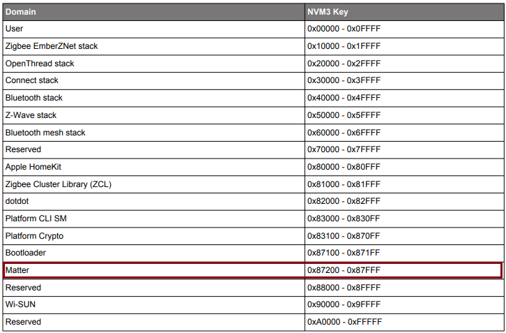
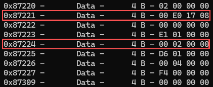
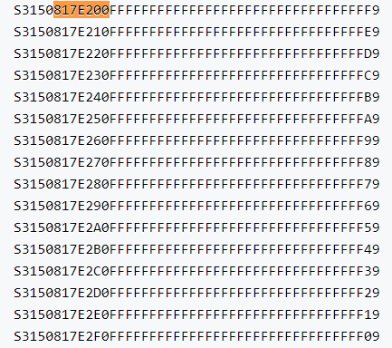

[dac_flash](dac_flash.md)  
[nvm3-old](nvm3-old.md)  
[nvm3-new](nvm3-new.md)  

## DAC
### Referenc
[AN1135](https://www.silabs.com/documents/public/application-notes/an1135-using-third-generation-nonvolatile-memory.pdf)  
<div align="left">
  
</div>

### code
```c
third_party\matter_sdk\src\platform\silabs\SilabsConfig.h
inline constexpr uint32_t kMatterNvm3KeyLoLimit = 0x087200U; // Do not modify without Silabs SiSDK team approval
inline constexpr uint32_t kMatterNvm3KeyHiLimit = 0x087FFFU; // Do not modify without Silabs SiSDK team approval
```
```c
third_party\matter_sdk\src\platform\silabs\SilabsConfig.h
    static constexpr Key kConfigKey_PersistentUniqueId = SilabsConfigKey(kMatterFactory_KeyBase, 0x1F);
    static constexpr Key kConfigKey_Creds_KeyId        = SilabsConfigKey(kMatterFactory_KeyBase, 0x20);
    static constexpr Key kConfigKey_Creds_Base_Addr    = SilabsConfigKey(kMatterFactory_KeyBase, 0x21);
    static constexpr Key kConfigKey_Creds_DAC_Offset   = SilabsConfigKey(kMatterFactory_KeyBase, 0x22);
    static constexpr Key kConfigKey_Creds_DAC_Size     = SilabsConfigKey(kMatterFactory_KeyBase, 0x23);
    static constexpr Key kConfigKey_Creds_PAI_Offset   = SilabsConfigKey(kMatterFactory_KeyBase, 0x24);
    static constexpr Key kConfigKey_Creds_PAI_Size     = SilabsConfigKey(kMatterFactory_KeyBase, 0x25);
    static constexpr Key kConfigKey_Creds_CD_Offset    = SilabsConfigKey(kMatterFactory_KeyBase, 0x26);
    static constexpr Key kConfigKey_Creds_CD_Size      = SilabsConfigKey(kMatterFactory_KeyBase, 0x27);
    static constexpr Key kConfigKey_Provision_Request  = SilabsConfigKey(kMatterFactory_KeyBase, 0x28);
    static constexpr Key kConfigKey_Provision_Version  = SilabsConfigKey(kMatterFactory_KeyBase, 0x29);
    static constexpr Key kOtaTlvEncryption_KeyId       = SilabsConfigKey(kMatterFactory_KeyBase, 0x30);
```
```c
kConfigKey_Creds_Base_Addr 
static constexpr inline chip::DeviceLayer::Internal::SilabsConfig::Key chip::DeviceLayer::Internal::SilabsConfig::kConfigKey_Creds_Base_Addr = 553505UL
553505UL -> 0x87221 -> 0x817E000
```
```c
kConfigKey_Creds_PAI_Offset
static constexpr inline chip::DeviceLayer::Internal::SilabsConfig::Key chip::DeviceLayer::Internal::SilabsConfig::kConfigKey_Creds_PAI_Offset = 553508UL
553508UL -> 0x87224 -> (0x817E000 + 0x00000200) -> 0x817E200
```
### NVM3 map
<div align="left">
  
</div>

### PAI(Invalid)
<div align="left">
  
</div>

