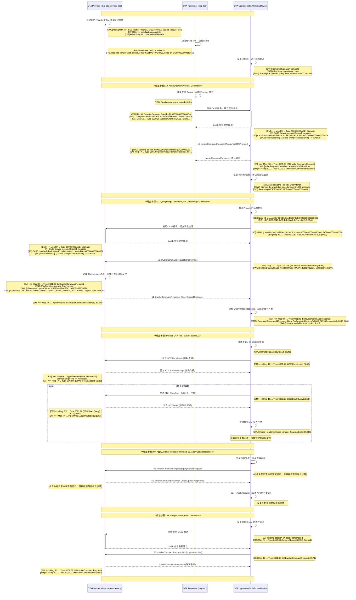

```mermaid
sequenceDiagram
    participant OTA_Provider as OTA Provider (chip-ota-provider-app)
    participant OTA_Requestor as OTA Requestor (chip-tool)
    participant OTA_Upgradee as OTA Upgradee (SL-Window Device)

    Note over OTA_Provider, OTA_Upgradee: ## 阶段 0: 准备工作 (Preparation)

    OTA_Provider->>OTA_Provider: 启动OTA Provider服务，加载OTA文件
    Note right of OTA_Provider: [SWU] Using OTA file: bk01_matter_0x149A_0x3215-v0.0.2-signed-cebe2e75.ota<br/>[SVR] Server initialization complete<br/>[DIS] Advertising as commissionable node

    OTA_Requestor->>OTA_Requestor: 初始化chip-tool，加载Fabric
    Note left of OTA_Requestor: [FP] Added new fabric at index: 0x1<br/>[FP] Assigned compressed fabric ID: 0x0FCE5DA14975F0EB, node ID: 0x000000000001B669

    OTA_Upgradee->>OTA_Upgradee: 设备已配网，处于运营状态
    Note right of OTA_Upgradee: [SVR] Server initialization complete<br/>[DIS] Advertising operational node<br/>[SWU] Starting the periodic query timer, timeout: 86400 seconds


    Note over OTA_Provider, OTA_Upgradee: ## 阶段 1: Provider 发现与通告 (Provider Discovery & Announcement)
    Note over OTA_Provider, OTA_Upgradee: **规范步骤: 10. AnnounceOTAProvider Command**

    OTA_Requestor->>OTA_Requestor: 准备发送 AnnounceOTAProvider 命令
    Note left of OTA_Requestor: [TOO] Sending command to node 0x8ca

    OTA_Requestor->>+OTA_Upgradee: 发起CASE握手，建立安全会话
    Note left of OTA_Requestor: [CSM] FindOrEstablishSession: PeerId = [1:00000000000008CA]<br/>[DIS] Lookup started for 0FCE5DA14975F0EB-00000000000008CA<br/>[EM] Msg TX ... Type 0000:30 (SecureChannel:CASE_Sigma1)

    OTA_Upgradee-->>-OTA_Requestor: CASE 会话建立成功
    Note right of OTA_Upgradee: [EM] >>> Msg RX ... Type 0000:30 (CASE_Sigma1)<br/>[IN] CASE Server received Sigma1 message<br/>[SC] CASE matched destination ID: fabricIndex 1, NodeID 0x00000000000008CA<br/>[SC] SecureSession[...]: State change 'kEstablishing' --> 'kActive'

    OTA_Requestor->>OTA_Upgradee: 10. InvokeCommandRequest (AnnounceOTAProvider)
    Note left of OTA_Requestor: [TOO] Sending cluster (0x0000002A) command (0x00000000)<br/>[EM] Msg TX ... Type 0001:08 (IM:InvokeCommandRequest) (B:71)

    OTA_Upgradee-->>OTA_Requestor: InvokeCommandResponse (确认收到)
    Note right of OTA_Upgradee: [EM] >>> Msg RX ... Type 0001:08 (IM:InvokeCommandRequest)<br/>[SWU] OTA Requestor received AnnounceOTAProvider<br/>[EM] <<< Msg TX ... Type 0001:09 (IM:InvokeCommandResponse)

    OTA_Upgradee->>OTA_Upgradee: 记录Provider信息，停止周期性查询
    Note right of OTA_Upgradee: [SWU] Stopping the Periodic Query timer<br/>[SWU] Starting the watchdog timer, timeout: 21600 seconds<br/>[DIS] Resolving 0FCE5DA14975F0EB:0000000000000001 ...


    Note over OTA_Provider, OTA_Upgradee: ## 阶段 2: 查询镜像 (Query Image)
    Note over OTA_Provider, OTA_Upgradee: **规范步骤: 11. QueryImage Command, 50. QueryImage Command**

    OTA_Upgradee->>OTA_Upgradee: 发现Provider的运营地址
    Note right of OTA_Upgradee: [DIS] Node ID resolved for 0FCE5DA14975F0EB-0000000000000001<br/>[DIS] UDP:[fd53:6f42:3a33:4efe:8aa2:9eff:fe1d:c2c2]:5540

    OTA_Upgradee->>+OTA_Provider: 发起CASE握手，建立安全会话
    Note right of OTA_Upgradee: [SC] Initiating session on local FabricIndex 1 from 0x00000000000008CA -> 0x0000000000000001<br/>[EM] Msg TX ... Type 0000:30 (SecureChannel:CASE_Sigma1)

    OTA_Provider-->>-OTA_Upgradee: CASE 会话建立成功
    Note left of OTA_Provider: [EM] >>> Msg RX ... Type 0000:30 (CASE_Sigma1)<br/>[IN] CASE Server received Sigma1 message<br/>[SC] CASE matched destination ID: fabricIndex 1, NodeID 0x0000000000000001<br/>[SC] SecureSession[...]: State change 'kEstablishing' --> 'kActive'

    OTA_Upgradee->>OTA_Provider: 50. InvokeCommandRequest (QueryImage)
    Note right of OTA_Upgradee: [EM] Msg TX ... Type 0001:08 (IM:InvokeCommandRequest) (B:85)<br/>[SWU] Sending QueryImage: VendorID=0x149A, ProductID=12821, SoftwareVersion=1

    OTA_Provider->>OTA_Provider: 处理 QueryImage 请求，查找匹配的OTA文件
    Note left of OTA_Provider: [EM] >>> Msg RX ... Type 0001:08 (IM:InvokeCommandRequest)<br/>[ZCL] OTA Provider received QueryImage<br/>[SWU] Generated updateToken: C562048B24C93611A11059B927B8F8<br/>[SWU] Generated URI: bdx://0000000000000001/bk01_matter_0x149A_0x3215-v0.0.2-signed-cebe2e75.ota

    OTA_Provider-->>OTA_Upgradee: 51. InvokeCommandResponse (QueryImageResponse)
    Note left of OTA_Provider: [EM] <<< Msg TX ... Type 0001:09 (IM:InvokeCommandResponse) (B:196)

    OTA_Upgradee->>OTA_Upgradee: 处理 QueryImageResponse，发现新版本可用
    Note right of OTA_Upgradee: [EM] >>> Msg RX ... Type 0001:09 (IM:InvokeCommandResponse)<br/>[DMG] Received Command Response Data, Endpoint=0 Cluster=0x0000_0029 Command=0x0000_0001<br/>[SWU] Update available from version 1 to 2


    Note over OTA_Provider, OTA_Upgradee: ## 阶段 3: BDX 文件传输 (BDX File Transfer)
    Note over OTA_Provider, OTA_Upgradee: **规范步骤: Proxied OTA File Transfer over BDX**

    OTA_Upgradee->>OTA_Upgradee: 准备下载，启动 BDX 传输
    Note right of OTA_Upgradee: [SWU] HandlePrepareDownload: started

    OTA_Upgradee->>OTA_Provider: 发送 BDX ReceiveInit (发起传输)
    Note right of OTA_Upgradee: [EM] <<< Msg TX ... Type 0002:04 (BDX:ReceiveInit) (B:88)

    OTA_Provider-->>OTA_Upgradee: 回复 BDX ReceiveAccept (接受传输)
    Note left of OTA_Provider: [EM] >>> Msg RX ... Type 0002:04 (BDX:ReceiveInit)<br/>[BDX] Start polling for messages<br/>[EM] <<< Msg TX ... Type 0002:05 (BDX:ReceiveAccept) (B:38)

    loop 每个数据块
        OTA_Upgradee->>OTA_Provider: 发送 BDX BlockQuery (请求下一个块)
        Note right of OTA_Upgradee: [EM] <<< Msg TX ... Type 0002:10 (BDX:BlockQuery) (B:38)

        OTA_Provider-->>OTA_Upgradee: 发送 BDX Block (返回数据块)
        Note left of OTA_Provider: [EM] >>> Msg RX ... Type 0002:10 (BDX:BlockQuery)<br/>[ATM] Block<br/>[EM] <<< Msg TX ... Type 0002:11 (BDX:Block) (B:1062)

        OTA_Upgradee->>OTA_Upgradee: 接收数据块，写入存储
        Note right of OTA_Upgradee: [SWU] Image Header software version: 2 payload size: 553476
        Note over OTA_Upgradee: 此循环重复数百次，传输完整的OTA文件
    end


    Note over OTA_Provider, OTA_Upgradee: ## 阶段 4: 应用更新 (Apply Update)
    Note over OTA_Provider, OTA_Upgradee: **规范步骤: 60. ApplyUpdateRequest Command, 61. ApplyUpdateResponse**

    OTA_Upgradee->>OTA_Upgradee: 文件传输完成，准备应用更新

    OTA_Upgradee->>OTA_Provider: 60. InvokeCommandRequest (ApplyUpdateRequest)
    Note right of OTA_Upgradee: (此命令在日志中未完整显示，但根据规范应有此步骤)

    OTA_Provider-->>OTA_Upgradee: 61. InvokeCommandResponse (ApplyUpdateResponse)
    Note left of OTA_Provider: (此命令在日志中未完整显示，但根据规范应有此步骤)

    OTA_Upgradee->>OTA_Upgradee: 62. 「Apply Update」(设备内部执行更新)
    Note right of OTA_Upgradee: (设备开始重启并应用新固件)


    Note over OTA_Provider, OTA_Upgradee: ## 阶段 5: 更新完成通知 (Notify Update Applied)
    Note over OTA_Provider, OTA_Upgradee: **规范步骤: 63. NotifyUpdateApplied Command**

    OTA_Upgradee->>OTA_Upgradee: 设备重启完成，新固件运行

    OTA_Upgradee->>+OTA_Provider: 重新建立 CASE 会话
    Note right of OTA_Upgradee: [SC] Initiating session on local FabricIndex 1<br/>[EM] Msg TX ... Type 0000:30 (SecureChannel:CASE_Sigma1)

    OTA_Provider-->>-OTA_Upgradee: CASE 会话重新建立

    OTA_Upgradee->>OTA_Provider: 63. InvokeCommandRequest (NotifyUpdateApplied)
    Note right of OTA_Upgradee: [EM] Msg TX ... Type 0001:08 (IM:InvokeCommandRequest) (B:71)

    OTA_Provider-->>OTA_Upgradee: InvokeCommandResponse (确认通知)
    Note left of OTA_Provider: [EM] >>> Msg RX ... Type 0001:08 (IM:InvokeCommandRequest)<br/>[EM] <<< Msg TX ... Type 0001:09 (IM:InvokeCommandResponse)

    Note over OTA_Provider, OTA_Upgradee: ## **OTA 升级成功完成 (OTA Update Successfully Complete)**
```