# Matter OTA 深度剖析——从协议机制到设备实现

> **目标受众**: Matter 开发部同事  
> **核心问题**: OTA 怎么实现？出了问题怎么排查？  
> **版本**: Matter 1.5 (Spec 23-27349-009)  
> **参考 SDK**: `third_party/matter_sdk`

---

## Page 1 | 为什么 OTA 是量产产品的核心工程问题

**CSA 规范强制要求**：Matter 规范（Chapter 11）要求所有可升级节点必须实现 OTA Software Update Requestor Cluster (0x002A)。这是 CSA 认证的必测项。

**OTA 是安全基线**：
- 漏洞修复唯一途径（如 CVE 补丁）
- 固件防篡改（ECDSA 签名校验）
- 防降级攻击（Anti-Rollback）

**量产四大痛点**：
| 痛点 | 影响 | 典型错误 |
|------|------|----------|
| Flash 分区规划不当 | 更新失败变砖 | `CHIP Error 0x000000A0` |
| BDX 传输中断 | 大文件传不完整 | `kBadBlockCounter` |
| 非安全 Bootloader | 无法校验镜像 | `SL_BOOTLOADER_OK` 失败 |
| Thread/BLE 带宽受限 | 影响主业务 | `Long dispatch time: 127ms` |

**本分享解决三个问题：**
1. Requestor ↔ Provider 交互逻辑是怎么协作的？
2. BDX 协议怎么做大数据块传输的？
3. 出了问题怎么从日志定位？

---

## Page 2 | 整体架构：两个 Cluster + 一个传输协议

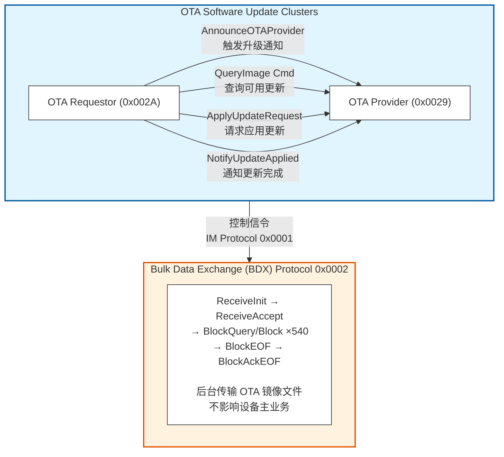

**关键分离**：控制信令走 IM (Interaction Model, Protocol 0x0001)，数据传输走 BDX (Protocol 0x0002)

---

## Page 3 | OTA Provider 角色：源码级拆解

**定义**：持有 OTA 镜像文件的节点（Raspberry Pi、网关、云端代理）

**SDK 核心文件路径**：
```
src/app/clusters/ota-provider/
├── OTAProvider.cpp              # 镜像管理
├── DefaultOTAProvider.cpp       # 默认 Provider 实现
└── BDXSenderDelegate.cpp        # BDX 数据发送
```

**启动加载 OTA 文件**：
```bash
sudo ./chip-ota-provider-app --KVS /tmp/chip_kvs_provider \
  -f bk01_matter_0x149A_0x3215-v0.0.2-signed-cebe2e75.ota
```

**日志输出**：
```
[SWU] Using OTA file: bk01_matter_0x149A_0x3215-v0.0.2-signed-cebe2e75.ota
[SWU] Using ImageList file: (none)
```

Provider 在启动时解析 OTA 文件的 TLV 头，提取 `Vendor ID`、`Product ID`、`Software Version` 等元数据，用于后续匹配 QueryImage 请求。

---

## Page 4 | OTA Requestor 角色：源码级拆解

**定义**：需要升级固件的 Matter 设备

**SDK 核心文件路径**：
```
src/app/clusters/ota-requestor/
├── OTARequestor.cpp             # 状态机管理
├── BDXDownloader.cpp            # BDX 数据接收
├── OTAImageProcessor.cpp        # 镜像解析与写入
└── OTARequestorDriver.h         # 驱动接口定义
```

**设备端初始化**（来自 Silabs 平台代码）：
```cpp
// examples/platform/silabs/OTARequestorInitiator.h
#include "app/clusters/ota-requestor/BDXDownloader.h"

class OTARequestorInitiator {
    // ...
    BDXDownloader gDownloader;
    OTARequestor gRequestor;
    
    void Init() {
        gRequestor.SetOTADownloader(&gDownloader);
        gDownloader.SetImageProcessor(&mImageProcessor);
    }
};
```

**Requestor 五大状态**（UpdateStateEnum）：
```cpp
enum class UpdateStateEnum : uint8_t {
    kIdle                 = 0x01,  // 空闲
    kQuerying             = 0x02,  // 正在查询
    kDownloading          = 0x04,  // 正在下载 (BDX)
    kApplying             = 0x05,  // 正在应用
    kRollingBack          = 0x07,  // 正在回滚
};
```

---

## Page 5 | QueryImage 命令：参数结构与交互

**Requestor → Provider**：QueryImage (Cluster 0x0029, Command 0x00)

**SDK 结构体定义**：
```cpp
namespace QueryImage {
struct Type {
    chip::VendorId vendorID;                                     // required
    uint16_t productID;                                          // required
    uint32_t softwareVersion;                                    // required
    DataModel::List<const DownloadProtocolEnum> protocolsSupported; // required
    Optional<uint16_t> hardwareVersion;                          // optional
    Optional<chip::CharSpan> location;                           // optional, 2 chars
    Optional<bool> requestorCanConsent;                          // optional
    Optional<chip::ByteSpan> metadataForProvider;                // optional, max 512 bytes
};
}
```

**支持的下载协议**：
```cpp
enum class DownloadProtocolEnum : uint8_t {
    kBDXSynchronous  = 0x00,  // 同步 BDX（最常用）
    kBDXAsynchronous = 0x01,  // 异步 BDX
    kHttps           = 0x02,  // HTTPS 下载
    kVendorSpecific  = 0x03,  // 厂商自定义
};
```

**典型 QueryImage 发送场景**：
- 收到 `AnnounceOTAProvider` 命令
- 周期性轮询定时器到期
- 看门狗定时器超时后重试

---

## Page 6 | QueryImageResponse 命令：Provider 的应答

**Provider → Requestor**：QueryImageResponse (Command 0x01)

**SDK 结构体定义**：
```cpp
namespace QueryImageResponse {
struct Type {
    StatusEnum status;                              // required
    Optional<uint32_t> delayedActionTime;           // optional
    Optional<chip::CharSpan> imageURI;              // optional
    Optional<uint32_t> softwareVersion;             // optional
    Optional<chip::CharSpan> softwareVersionString; // optional
    Optional<chip::ByteSpan> updateToken;           // optional, 8-32 bytes
    Optional<bool> userConsentNeeded;               // optional
    Optional<chip::ByteSpan> metadataForRequestor;  // optional
};
}
```

**状态枚举**：
```cpp
enum class StatusEnum : uint8_t {
    kUpdateAvailable              = 0x00,  // 有可用更新
    kBusy                         = 0x01,  // Provider 忙
    kNotAvailable                 = 0x02,  // 无可用更新
    kDownloadProtocolNotSupported = 0x03,  // 不支持的协议
};
```

**日志实例**：
```
[SWU] Generated updateToken: D9D2ACD10AFD4B276CE2A8CCC07417
[SWU] Generated URI: bdx://0000000000000001/bk01_matter_0x149A_0x3215-v0.0.2-signed-cebe2e75.ota
```

**关键字段解读**：
- `updateToken`：唯一标识本次更新会话（8-32 bytes），后续 ApplyUpdateRequest 必须携带
- `imageURI`：格式为 `bdx://<NodeID>/<FileDesignator>`，指向 BDX 文件
- `softwareVersion`：新版本号，Requestor 用此做 Anti-Rollback 检查

---

## Page 7 | AnnounceOTAProvider 命令：外部触发升级

**Controller → Requestor**：AnnounceOTAProvider (Cluster 0x002A, Command 0x00)

这是最常见的 OTA 触发方式（由 chip-tool 发起）：

```bash
sudo ./chip-tool otasoftwareupdaterequestor announce-otaprovider \
  1 0 0 0 2250 0
```

**命令参数映射**：
```cpp
namespace AnnounceOTAProvider {
struct Type {
    chip::NodeId providerNodeID;               // = 1 (Provider Node ID)
    chip::VendorId vendorID;                   // = 厂商 ID
    AnnouncementReasonEnum announcementReason; // = 0 (Simple) / 1 (Update) / 2 (Urgent)
    Optional<chip::ByteSpan> metadataForNode;  // optional
    chip::EndpointId endpoint;                 // = 0
};
}
```

**chip-tool 参数对应关系**：
```
announce-otaprovider <ProviderNodeID> <ProviderEndpoint> \
                     <RequestorNodeID> <RequestorEndpoint> \
                     <TargetNodeID> <RetryInterval>
                      1              0            0              0           2250         0
```

**Requestor 收到后触发的行为链**：

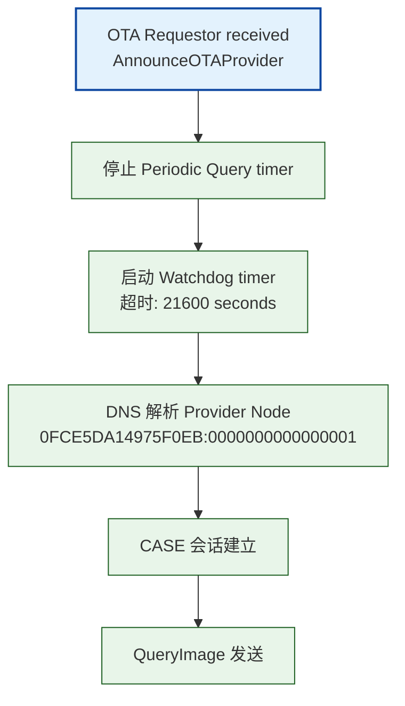

---

## Page 8 | 完整交互流程（Mermaid 序列图）

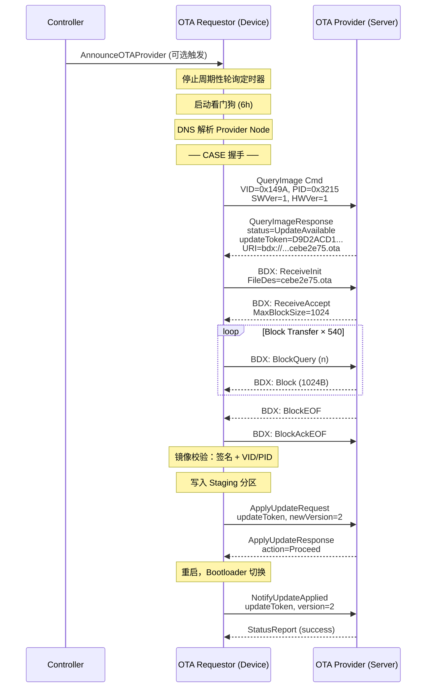

---

## Page 9 | BDX 协议核心：消息类型速查表

**Protocol ID = 0x0002** (在 SDK 中定义)：
```cpp
// src/protocols/Protocols.h
CHIP_STANDARD_PROTOCOL(BDX, 0x0002)  // Bulk Data Exchange Protocol
```

**BDX 全部消息类型**：

| 类型 (Hex) | 消息名 | 方向 | 说明 | 对应日志 |
|-----------|--------|------|------|----------|
| 0x01 | SendInit | Sender → Receiver | 发送方发起 | `Type 0002:01` |
| 0x02 | SendAccept | Receiver → Sender | 接收方接受 | `Type 0002:02` |
| 0x04 | ReceiveInit | Receiver → Sender | 接收方发起下载 | `Type 0002:04` |
| 0x05 | ReceiveAccept | Sender → Receiver | 发送方接受 | `Type 0002:05` |
| 0x10 | BlockQuery | Receiver → Sender | 请求数据块 | `Type 0002:10` |
| 0x11 | Block | Sender → Receiver | 返回数据块 | `Type 0002:11` |
| 0x12 | BlockEOF | Sender → Receiver | 最后一块 | `Type 0002:12` |
| 0x13 | BlockAck | Sender → Receiver | 确认数据块 | `Type 0002:13` |
| 0x14 | BlockAckEOF | Receiver → Sender | 确认最后一块 | `Type 0002:14` |
| 0x15 | BlockQueryWithSkip | Receiver → Sender | 跳字节请求 | `Type 0002:15` |

**OTA 场景使用 ReceiveInit 模式**（下载方向）：
```
Receiver (Requestor) 驱动 → 发送 ReceiveInit → Sender (Provider) 响应
```

---

## Page 10 | BDX 数据结构体：SDK 源码级解析

**ReceiveInit 消息结构**（TransferInit）：
```cpp
struct TransferInit {
    BitFlags<TransferControlFlags> TransferCtlOptions;
    uint8_t Version = 0;
    BitFlags<RangeControlFlags> mRangeCtlFlags;

    uint16_t MaxBlockSize = 0;   // 建议的最大块大小
    uint64_t StartOffset  = 0;   // 起始偏移量
    uint64_t MaxLength    = 0;   // 最大长度 (0 = 不定长)

    const uint8_t * FileDesignator = nullptr;  // 文件标识符
    uint16_t FileDesLength = 0;
    const uint8_t * Metadata = nullptr;        // 可选 TLV 元数据
    size_t MetadataLength = 0;
};
```

**Block / BlockEOF 消息结构**：
```cpp
struct DataBlock {
    uint32_t BlockCounter = 0;   // 块计数器 (从 0 开始递增)
    const uint8_t * Data = nullptr;
    size_t DataLength = 0;
};
```

**BlockQuery 消息结构**：
```cpp
struct CounterMessage {
    uint32_t BlockCounter = 0;   // 请求的块序号
};
```

**BDX 错误码**：
```cpp
enum class StatusCode : uint16_t {
    kLengthTooLarge             = 0x0012,
    kBadBlockCounter            = 0x0017,  // 块计数器不匹配
    kUnexpectedMessage          = 0x0018,
    kResponderBusy              = 0x0019,
    kTransferFailedUnknownError = 0x001F,
    kFileDesignatorUnknown      = 0x0051,  // 找不到文件
    kStartOffsetNotSupported    = 0x0052,
    kVersionNotSupported        = 0x0053,
};
```

---

## Page 11 | BDX 传输实战：553KB 镜像逐块传输

**实测数据**（来自 log-ota-requestor-ng.md）：

| 指标 | 值 |
|------|-----|
| 镜像大小 | 553,476 bytes |
| 每 Block 数据 | ~1,024 bytes |
| 消息总长 | 1,062 bytes (38B header + 1,024B data) |
| 总 Block 数 | ~540 块 |
| 每块间隔 | ~1 秒 (Thread 网络) |
| 总传输时间 | 约 2-3 分钟 |

**日志中的 Block 传输循环**：
```
[EM] <<< Type 0002:10 (BDX:BlockQuery)       # Requestor 请求 Block 0
[EM] >>> Type 0002:11 (BDX:Block)            # Provider 返回 Block 0
[SWU] Image Header software version: 2       # 解析到头信息
         ... 循环 540 次 ...
[EM] >>> Type 0002:12 (BDX:BlockEOF)         # Provider 发送最后一块
[EM] <<< Type 0002:14 (BDX:BlockAckEOF)      # Requestor 确认完成
```

**性能瓶颈分析**：
```
[DL] Long dispatch time: 127 ms, for event type 2
```
- Flash 写入是瓶颈：每收到一个 Block，需写入 Flash，耗时 ~100-130ms
- 网络传输仅 ~10ms，90% 时间在写 Flash

---

## Page 12 | BDX 状态机：TransferSession 内部机制

**SDK 核心类**：`chip::bdx::TransferSession`

**状态流转图**：

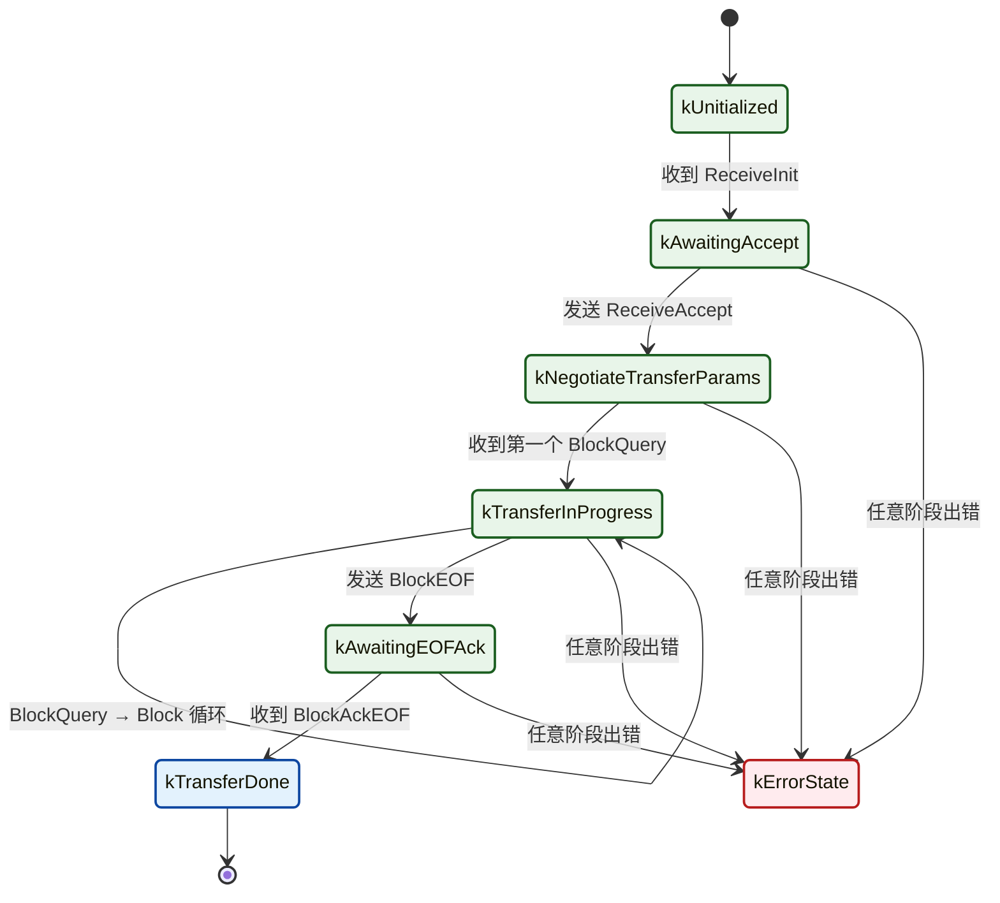

**事件类型**：
```cpp
enum class OutputEventType : uint16_t {
    kNone = 0,
    kMsgToSend,          // 有消息要发送
    kInitReceived,       // 收到初始化消息
    kAcceptReceived,     // 收到接受响应
    kBlockReceived,      // 收到数据块
    kQueryReceived,      // 收到块请求
    kAckEOFReceived,     // 收到完成确认
    kInternalError,      // 内部错误
    kTransferTimeout     // 传输超时
};
```

**超时机制**：
- BDX 有内置超时计时器（默认配置在 TransferFacilitator 中）
- OTA 场景还配合 Watchdog Timer（6 小时）防止无限等待

---

## Page 13 | OTA 镜像结构：TLV 格式全解析

**文件标识符 (Magic Number)**：
```cpp
// src/lib/core/OTAImageHeader.h
inline constexpr uint32_t kOTAImageFileIdentifier = 0x1BEEF11E;
```

**OTA 镜像文件布局**：

```mermaid
graph TB
    subgraph OTA_Image_File["OTA Image File (.ota)"]
        Magic["Magic Number (4B)\n0x1BEEF11E"]

        subgraph TLV_Header["TLV Header (Variable, Max 1024B)"]
            Tag0["Tag 0: Vendor ID (2B) → 0x149A"]
            Tag1["Tag 1: Product ID (2B) → 0x3215"]
            Tag2["Tag 2: Software Version (4B) → 2"]
            Tag3["Tag 3: SW Version String (≤64B)"]
            Tag4["Tag 4: Payload Size (8B) → 553476"]
            Tag5["Tag 5: Min Applicable Ver (4B, optional)"]
            Tag6["Tag 6: Max Applicable Ver (4B, optional)"]
            Tag7["Tag 7: Release Notes URL (≤256B, opt)"]
            Tag8["Tag 8: Image Digest Type (1B) → SHA256"]
            Tag9["Tag 9: Image Digest (32B)"]
        end

        Payload["Payload (553,476 bytes)\n固件二进制数据"]
        Signature["Digital Signature\nECDSA P-256\n厂商私钥签名，确保固件完整性"]

        Magic --> TLV_Header
        TLV_Header --> Tag0
        Tag0 --> Tag1
        Tag1 --> Tag2
        Tag2 --> Tag3
        Tag3 --> Tag4
        Tag4 --> Tag5
        Tag5 --> Tag6
        Tag6 --> Tag7
        Tag7 --> Tag8
        Tag8 --> Tag9
        Tag9 --> Payload
        Payload --> Signature
    end

    classDef magic fill:#fce4ec,stroke:#880e4f,stroke-width:2px
    classDef tlv fill:#e8f5e9,stroke:#1b5e20,stroke-width:1px
    classDef payload fill:#e3f2fd,stroke:#0d47a1,stroke-width:2px
    classDef sig fill:#fff8e1,stroke:#f57f17,stroke-width:2px
    class Magic magic
    class TLV_Header tlv
    class Payload payload
    class Signature sig
```

**SDK 头结构体**：
```cpp
struct OTAImageHeader {
    uint16_t mVendorId;
    uint16_t mProductId;
    uint32_t mSoftwareVersion;
    CharSpan mSoftwareVersionString;
    uint64_t mPayloadSize;
    Optional<uint32_t> mMinApplicableVersion;
    Optional<uint32_t> mMaxApplicableVersion;
    CharSpan mReleaseNotesURL;
    OTAImageDigestType mImageDigestType;
    ByteSpan mImageDigest;
};
```

---

## Page 14 | 安全校验三重保障

**第一重：Vendor ID + Product ID 匹配**

Requestor 收到镜像后，首先校验 TLV 头中的 VID/PID 是否与自身匹配：

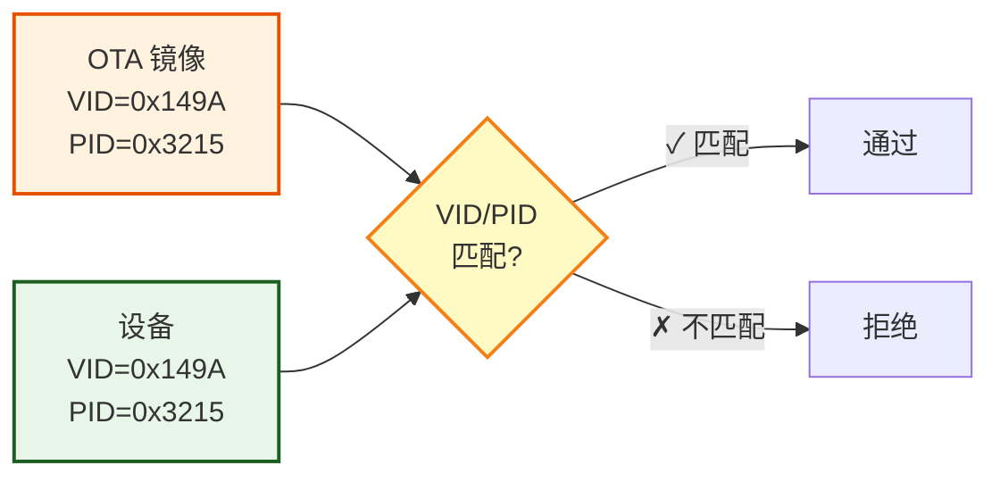

**第二重：ECDSA 数字签名**

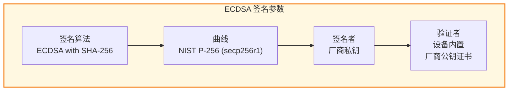

SDK 中的校验流程：

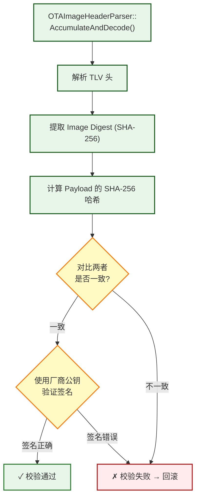

**第三重：Anti-Rollback (防降级)**

```cpp
// 日志证据
[SWU] Update available from version 1 to 2
```

新镜像版本号必须 > 当前版本号，否则 Provider 返回 `kNotAvailable`。

**注意**：版本号递增策略由厂商自行实现，CSA 规范不强制。

---

## Page 15 | OTA 状态机与事件上报

**UpdateStateEnum 全状态**：
```cpp
enum class UpdateStateEnum : uint8_t {
    kUnknown              = 0x00,
    kIdle                 = 0x01,  // 空闲，等待触发
    kQuerying             = 0x02,  // 正在查询 Provider
    kDelayedOnQuery       = 0x03,  // Provider 要求延迟查询
    kDownloading          = 0x04,  // 正在 BDX 下载
    kApplying             = 0x05,  // 正在应用更新
    kDelayedOnApply       = 0x06,  // Provider 要求延迟应用
    kRollingBack          = 0x07,  // 正在回滚
    kDelayedOnUserConsent = 0x08,  // 等待用户同意
};
```

**三大事件（Events）**：
```cpp
// 1. StateTransition (Info 级别)
struct StateTransition {
    UpdateStateEnum previousState;
    UpdateStateEnum newState;
    ChangeReasonEnum reason;  // kSuccess / kFailure / kTimeOut / kDelayByProvider
    Nullable<uint32_t> targetSoftwareVersion;
};

// 2. VersionApplied (Critical 级别)
struct VersionApplied {
    uint32_t softwareVersion;
    uint16_t productID;
};

// 3. DownloadError (Info 级别)
struct DownloadError {
    uint32_t softwareVersion;
    uint64_t bytesDownloaded;
    Nullable<uint8_t> progressPercent;
    Nullable<int64_t> platformCode;
};
```

**属性查询**：
```bash
# 查询 OTA 状态 (0=Unknown, 1=Idle, 4=Downloading, 5=Applying...)
chip-tool otasoftwareupdaterequestor read update-state 2250 0

# 查询进度 (0-100%)
chip-tool otasoftwareupdaterequestor read update-state-progress 2250 0
```

---

## Page 16 | ApplyUpdateRequest & NotifyUpdateApplied

**ApplyUpdateRequest (Command 0x02)**：

Requestor 下载并校验镜像后，请求 Provider 批准应用：
```cpp
namespace ApplyUpdateRequest {
struct Type {
    chip::ByteSpan updateToken;  // 与 QueryImageResponse 中的 token 一致
    uint32_t newVersion;         // 新版本号
};
}
```

**ApplyUpdateResponse (Command 0x03)**：

Provider 回复操作指令：
```cpp
namespace ApplyUpdateResponse {
struct Type {
    ApplyUpdateActionEnum action;  // 操作类型
    uint32_t delayedActionTime;    // 延迟时间（秒）
};
}

enum class ApplyUpdateActionEnum : uint8_t {
    kProceed         = 0x00,  // 立即执行更新
    kAwaitNextAction = 0x01,  // 等待，稍后重试
    kDiscontinue     = 0x02,  // 终止本次更新
};
```

**NotifyUpdateApplied (Command 0x04)**：

设备重启并成功运行新固件后，通知 Provider：
```cpp
namespace NotifyUpdateApplied {
struct Type {
    chip::ByteSpan updateToken;  // 同一 token
    uint32_t softwareVersion;    // 实际应用的版本号
};
}
```

**日志证据**：
```
[DMG] Received Command Response Data, Endpoint=0 Cluster=0x0000_0029 Command=0x0000_0003
[SWU] HandleApply: verifying image
[SWU] Image verified, Set image to bootload
[DL] Starting scheduler
[SVR] Current Software Version String: 0.0.2
[ZCL] OTA Provider received NotifyUpdateApplied
```

---

## Page 17 | 工程落地 ①：Flash 双区备份分区规划

**推荐方案：A/B Partition (Swap-less OTA)**

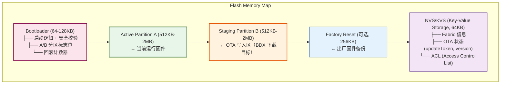

**更新流程**：
1. BDX 数据写入 **Staging Partition B**
2. 每收到一个 Block，追加写入 B 区
3. BlockEOF 后，校验 B 区完整镜像（签名 + VID/PID + Hash）
4. 校验通过 → 设置 Bootloader 标志位 `BOOT_NEXT_PARTITION=B`
5. 设备重启 → Bootloader 从 B 区启动
6. 新固件运行正常 → 标志位永久切换到 B

**回滚策略**：
- 新固件启动失败（看门狗超时 / Crash）→ Bootloader 自动回退 A 区
- Matter SDK 通过 `bootloadCounter` 机制防止"反复重启循环"

---

## Page 18 | 工程落地 ②：非安全 Bootloader 失败案例

**实测问题**：非安全 Bootloader 在执行 OTA 时报错

**错误现场**：
```
// src/platform/silabs/efr32/OTAImageProcessorImpl.cpp
void OTAImageProcessorImpl::HandlePrepareDownload(intptr_t context)
{
    auto * imageProcessor = reinterpret_cast<OTAImageProcessorImpl *>(context);
    
    // 准备 Bootloader 下载环境
    err = SL_BOOTLOADER_prepareDownload(...);
    
    imageProcessor->mDownloader->OnPreparedForDownload(
        err == SL_BOOTLOADER_OK ? CHIP_NO_ERROR : CHIP_ERROR_INTERNAL);
}
```

**错误表现**：
```
[SWU] HandlePrepareDownload: failed
[EM] DownloadError event fired
```

**根因分析**：
| 可能原因 | 排查方法 |
|----------|----------|
| Bootloader 未启用安全模式 | 检查 `SL_BOOTLOADER_SECURE` 编译配置 |
| Flash 分区表配置错误 | 对比 `.slcp` 项目配置中的分区定义 |
| Bootloader 版本与 SDK 不兼容 | 确认 SDK 版本与 Bootloader GBL 匹配 |
| Staging 分区空间不足 | 镜像大小 (553KB) vs 分区大小 |

**解决方案**：
1. 启用安全 Bootloader
2. 确认分区大小 ≥ 最大镜像大小 × 1.2（预留余量）
3. 使用 `gecko bootloader` 工具链生成正确的 GBL 文件

---

## Page 19 | 工程落地 ③：周期性轮询与看门狗机制

**两种定时器**：
```cpp
enum class SelectedTimer {
    kPeriodicQueryTimer,  // 周期性轮询（默认 24 小时）
    kWatchdogTimer,       // 看门狗（默认 6 小时）
};
```

**Periodic Query Timer**：
- 设备定期向 Provider 发起 QueryImage 查询
- 默认间隔：**86400 秒 (24 小时)**
- 日志证据：
  ```
  [SWU] Starting the periodic query timer, timeout: 86400 seconds
  [SWU] No suitable OTA Provider candidate found  // 到期后未找到 Provider
  ```

**Watchdog Timer**：
- 收到 AnnounceOTAProvider 后启动
- 默认超时：**21600 秒 (6 小时)**
- 防止 OTA 流程"卡死"在中间状态
- 日志证据：
  ```
  [SWU] Stopping the Periodic Query timer
  [SWU] Starting the watchdog timer, timeout: 21600 seconds
  ```

**定时器切换逻辑**：

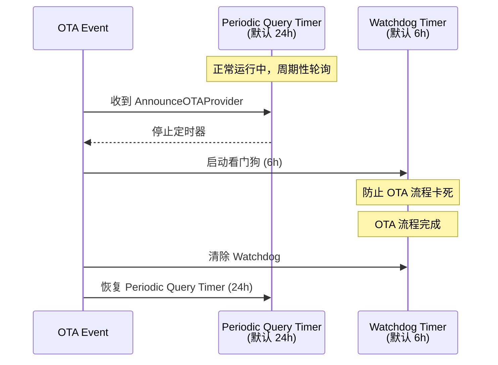

---

## Page 20 | 工程落地 ④：Matter 1.5 TCP 支持

**Matter 1.5 新特性**：BDX over TCP

**为什么需要 TCP？**
- 之前 BDX 只能通过 **UDP + MRP** (Message Reliability Protocol) 传输
- UDP 无连接保障，丢包后依赖 MRP 重传
- 大镜像 (几 MB) 在 UDP 上效率低、延迟高

**TCP 优势**：
| 对比项 | UDP + MRP | TCP |
|--------|-----------|-----|
| 连接管理 | 无连接 | 面向连接 |
| 可靠性 | 应用层重传 (MRP) | 传输层保障 |
| 拥塞控制 | 无 | 内置 (Slow Start) |
| 大文件效率 | 低 (频繁重传) | 高 |

**SDK 配置**：
```cpp
// CHIPProjectConfig.h
#define CHIP_CONFIG_ENABLE_BDX_LOG_TRANSFER 1

// BDX 传输层选择逻辑（SDK 内部）
// 如果两端都支持 TCP，自动选择 TCP
// 否则回退到 UDP + MRP
```

**实测建议**：
- Wi-Fi / Ethernet 网络：优先 TCP（带宽充足）
- Thread 网络：仍使用 UDP（Thread 本身基于 802.15.4，TCP overhead 大）
- 混合网络：SDK 自动协商

---

## Page 21 | 排查工具箱 ①：常用 chip-tool 命令

**配对阶段**：
```bash
# BLE-Thread 配对（Requestor 设备）
sudo ./chip-tool pairing ble-thread 2250 \
  hex:0e080000000000010000000300001835060004001fffe0 \
  85956333 1884 --paa-trust-store-path ~/paa-root-certs

# 网络配对（Provider 设备）
sudo ./chip-tool pairing onnetwork 1 20202021
```

**ACL 配置**：
```bash
# 授予 Provider 操作权限
sudo ./chip-tool accesscontrol write acl \
  '[{"fabricIndex":1,"privilege":5,"authMode":2,"subjects":[112233],"targets":null},
    {"fabricIndex":1,"privilege":3,"authMode":2,"subjects":null,"targets":null}]' \
  1 0
```

**OTA 触发**：
```bash
# 触发 OTA 升级
sudo ./chip-tool otasoftwareupdaterequestor announce-otaprovider \
  1 0 0 0 2250 0

# 查询当前版本
sudo ./chip-tool basicinformation read software-version-string 2250 0
```

**OTA 状态查询**：
```bash
# 读取 OTA 状态机
sudo ./chip-tool otasoftwareupdaterequestor read update-state 2250 0

# 读取下载进度
sudo ./chip-tool otasoftwareupdaterequestor read update-state-progress 2250 0

# 读取默认 Provider 列表
sudo ./chip-tool otasoftwareupdaterequestor read default-ota-providers 2250 0
```

---

## Page 22 | 排查工具箱 ②：日志关键词速查

**正常流程关键词**：

| 日志关键词 | 阶段 | 含义 |
|-----------|------|------|
| `AnnounceOTAProvider` | 触发 | 收到升级通知 |
| `Update available from version` | 查询 | 找到可用更新 |
| `HandlePrepareDownload: started` | 准备 | 开始准备下载 |
| `BDX:ReceiveInit/ReceiveAccept` | BDX 握手 | BDX 传输协商 |
| `BDX:BlockQuery/Block` | BDX 传输 | 逐块传输中 |
| `Image Header software version: 2` | 解析 | 镜像头解析成功 |
| `BDX:BlockEOF` | 传输完成 | 最后一块到达 |
| `Image verified` | 校验 | 签名校验通过 |
| `HandleApply: verifying image` | 应用 | 准备刷写 |
| `NotifyUpdateApplied` | 完成 | 更新成功 |

**异常关键词**：

| 日志关键词 | 含义 | 排查方向 |
|-----------|------|----------|
| `CHIP Error 0x000000A0` | 持久化值未找到 | KVS 配置问题 |
| `SL_BOOTLOADER_OK` 失败 | Bootloader 准备失败 | 安全 Bootloader 配置 |
| `kBadBlockCounter` | BDX 块序号不匹配 | 传输中断/丢包 |
| `kFileDesignatorUnknown` | 找不到 OTA 文件 | Provider 文件加载 |
| `Long dispatch time: 127ms` | 调度延迟过长 | Flash 写入慢 |
| `No suitable OTA Provider` | 无可用 Provider | Provider 未启动/网络 |
| `BUSY / NOT_AVAILABLE` | Provider 拒绝 | 版本/VID/PID 不匹配 |

---

## Page 23 | 排查工具箱 ③：典型故障场景与排查流程

**场景一：OTA 文件未找到**

```
Provider 日志:
  [SWU] Using OTA file: xxx.ota
  (无后续加载日志)
  
Requestor 日志:
  [SWU] Update available from version 1 to 2
  [BDX] ReceiveInit sent
  [StatusReport] kFileDesignatorUnknown (0x0051)
```

**排查步骤**：
1. 确认 Provider 启动参数 `-f xxx.ota` 路径正确
2. 确认文件权限（`ls -la xxx.ota`）
3. 确认文件名与 BDX URI 中的 FileDesignator 一致

---

**场景二：BDX 传输中断**

```
Requestor 日志:
  [BDX] BlockQuery sent for Block 230
  (无后续 Block 响应)
  [BDX] kTransferTimeout
```

**排查步骤**：
1. 检查网络连通性（Thread/BLE 信号强度）
2. 检查 Provider 是否仍在运行
3. 增大 BDX 超时配置（`CHIP_CONFIG_BDX_TIMEOUT`）

---

**场景三：镜像校验失败**

```
Requestor 日志:
  [SWU] HandleApply: verifying image
  [SWU] Image verification FAILED
  [SWU] Rolling back to previous version
```

**排查步骤**：
1. 确认 OTA 文件签名正确（厂商私钥）
2. 确认设备内置厂商公钥证书正确
3. 重新生成 OTA 文件，检查 TLV 头完整性

---

## Page 24 | 排查工具箱 ④：从日志解析 Matter 消息类型

**日志中的 `Type XXXX:YY` 含义**：

`XXXX` = Protocol ID，`YY` = Message Opcode

**三大协议速查**：

| Protocol | 代码 | 名称 |
|----------|------|------|
| Secure Channel | 0x0000 | 加密通道管理 |
| Interaction Model | 0x0001 | 数据交互（读写/命令） |
| BDX | 0x0002 | 批量数据传输 |

**IM 协议 (0x0001) 常见消息**：
```
0x01 = StatusResponse
0x02 = ReadRequest
0x05 = ReportData
0x06 = WriteRequest
0x08 = InvokeCommandRequest   ← OTA 命令用这个
0x09 = InvokeCommandResponse   ← OTA 响应用这个
```

**BDX 协议 (0x0002) 完整列表**：
```
0x04 = ReceiveInit
0x05 = ReceiveAccept
0x10 = BlockQuery
0x11 = Block
0x12 = BlockEOF
0x14 = BlockAckEOF
```

**Secure Channel (0x0000) 握手消息**：
```
0x20-0x24 = PASE 握手 (Commissioning)
0x30-0x33 = CASE 握手 (Operational)
0x40 = StatusReport
```

---

## Page 25 | OTA 镜像生成：从 ELF 到 .ota 文件

**典型构建流程**：

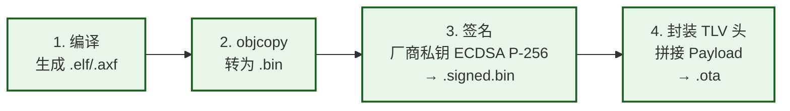

**OTA 文件命名规范**（推荐）：

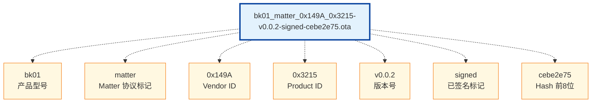

**TLV 头生成关键点**：
- Magic Number: `0x1BEEF11E` (必须)
- Vendor ID / Product ID: 与设备匹配
- Software Version: 单调递增
- Image Digest: SHA-256 of Payload
- Digital Signature: ECDSA P-256 with SHA-256

---

## Page 26 | 总结与最佳实践清单

**核心要点回顾**：
1. OTA = **控制信令 (IM Cluster 0x0029/0x002A)** + **数据传输 (BDX 0x0002)** 双通道
2. BDX 将文件拆分为 ~1KB 块，逐块确认传输，后台运行不影响主业务
3. 镜像安全 = **VID/PID 匹配** + **ECDSA-P256 签名** + **Anti-Rollback**
4. Flash 分区 = **双区备份 (A/B)** 是防止变砖的必备手段
5. Matter 1.5 **TCP 支持**可显著提升大镜像传输效率（Wi-Fi/Ethernet 场景）

**最佳实践清单**：

| # | 实践项 | 优先级 |
|---|--------|--------|
| 1 | 启用安全 Bootloader，禁用非安全模式 | 🔴 必须 |
| 2 | 规划双区 Flash 分区（Active + Staging） | 🔴 必须 |
| 3 | 实现看门狗 + 自动回滚机制 | 🔴 必须 |
| 4 | OTA 文件命名包含 VID/PID/版本（便于追溯） | 🟡 建议 |
| 5 | 使用日志关键词快速定位问题阶段 | 🟡 建议 |
| 6 | 量产前做 OTA 中断/断电恢复测试 | 🔴 必须 |
| 7 | 大镜像场景优先使用 TCP（Wi-Fi/Ethernet） | 🟡 建议 |
| 8 | 版本号单调递增策略（Anti-Rollback） | 🔴 必须 |
| 9 | 定期轮询间隔合理配置（默认 24h） | 🟢 可选 |
| 10 | Provider 部署时确保文件路径和权限正确 | 🟡 建议 |

---

*参考资料*：
- Matter Spec 1.5 (23-27349-009) — Chapter 4, 10, 11
- Matter Cluster Spec 1.5 (23-27350-008) — OTA Clusters
- Matter SDK: `src/app/clusters/ota-requestor/`, `src/app/clusters/ota-provider/`
- Matter SDK: `src/protocols/bdx/`, `src/lib/core/OTAImageHeader.h`
- 实测日志: `log-ota-provider-ng.md`, `log-ota-requestor-ng.md`, `ota-flow.md`
