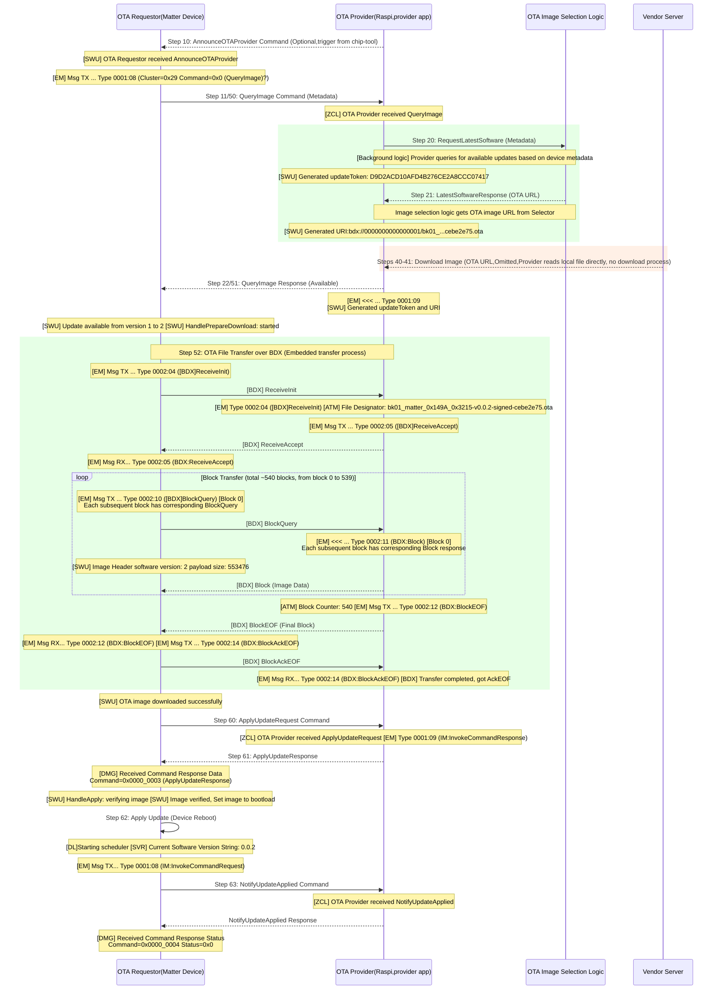

```mermaid
sequenceDiagram
    participant Requestor as OTA Requestor(Matter Device)
    participant Provider as OTA Provider(Raspi,provider app)
    participant Selector as OTA Image Selection Logic
    participant Vendor as Vendor Server

    Provider-->>Requestor: Step 10: AnnounceOTAProvider Command (Optional,trigger from chip-tool)
    Note over Requestor: [SWU] OTA Requestor received AnnounceOTAProvider


    
    Note over Requestor: [EM] Msg TX ... Type 0001:08 (Cluster=0x29 Command=0x0 (QueryImage)?)
    Requestor->>Provider: Step 11/50: QueryImage Command (Metadata)
    Note over Provider: [ZCL] OTA Provider received QueryImage
    rect rgb(230, 255, 230)
        Provider->>Selector: Step 20: RequestLatestSoftware (Metadata)
        Note over Provider,Selector: [Background logic] Provider queries for available updates based on device metadata
        Note over Provider: [SWU] Generated updateToken: D9D2ACD10AFD4B276CE2A8CCC07417
        
        Selector-->>Provider: Step 21: LatestSoftwareResponse (OTA URL)
        Note over Selector,Provider: Image selection logic gets OTA image URL from Selector
        Note over Provider: [SWU] Generated URI:bdx://0000000000000001/bk01_...cebe2e75.ota
    end
    rect rgb(255, 240, 230)
        Vendor-->>Provider: Steps 40-41: Download Image (OTA URL,Omitted,Provider reads local file directly, no download process)
    end

    Provider-->>Requestor: Step 22/51: QueryImage Response (Available)
    Note over Provider: [EM] <<< ... Type 0001:09 <br/> [SWU] Generated updateToken and URI
    Note over Requestor: [SWU] Update available from version 1 to 2 [SWU] HandlePrepareDownload: started

    rect rgb(230, 255, 230)
        Note over Requestor,Provider: Step 52: OTA File Transfer over BDX (Embedded transfer process)

        Note over Requestor: [EM] Msg TX ... Type 0002:04 ([BDX]ReceiveInit)
        Requestor->>Provider: [BDX] ReceiveInit
        Note over Provider: [EM] Type 0002:04 ([BDX]ReceiveInit) [ATM] File Designator: bk01_matter_0x149A_0x3215-v0.0.2-signed-cebe2e75.ota
        
        Note over Provider: [EM] Msg TX ... Type 0002:05 ([BDX]ReceiveAccept)
        Provider-->>Requestor: [BDX] ReceiveAccept
        Note over Requestor:[EM] Msg RX... Type 0002:05 (BDX:ReceiveAccept) 

        loop Block Transfer (total ~540 blocks, from block 0 to 539)
            
            Note over Requestor: [EM] Msg TX ... Type 0002:10 ([BDX]BlockQuery) [Block 0]<br/>Each subsequent block has corresponding BlockQuery
            Requestor->>Provider: [BDX] BlockQuery
            Note over Provider: [EM] <<< ... Type 0002:11 (BDX:Block) [Block 0]<br/>Each subsequent block has corresponding Block response
            Note over Requestor:[SWU] Image Header software version: 2 payload size: 553476
            Provider-->>Requestor: [BDX] Block (Image Data)
        end

        Note over Provider: [ATM] Block Counter: 540 [EM] Msg TX ... Type 0002:12 (BDX:BlockEOF)
        Provider-->>Requestor: [BDX] BlockEOF (Final Block)

        Note over Requestor: [EM] Msg RX... Type 0002:12 (BDX:BlockEOF) [EM] Msg TX ... Type 0002:14 (BDX:BlockAckEOF)
        Requestor->>Provider: [BDX] BlockAckEOF
        Note over Provider: [EM] Msg RX... Type 0002:14 (BDX:BlockAckEOF) [BDX] Transfer completed, got AckEOF
    end

    Note over Requestor: [SWU] OTA image downloaded successfully

    Requestor->>Provider: Step 60: ApplyUpdateRequest Command
    Note over Provider: [ZCL] OTA Provider received ApplyUpdateRequest [EM] Type 0001:09 (IM:InvokeCommandResponse)
    Provider-->>Requestor: Step 61: ApplyUpdateResponse    
    Note over Requestor: [DMG] Received Command Response Data<br/>Command=0x0000_0003 (ApplyUpdateResponse)

    Note over Requestor: [SWU] HandleApply: verifying image [SWU] Image verified, Set image to bootload

    Requestor->>Requestor: Step 62: Apply Update (Device Reboot)
    Note over Requestor: [DL]Starting scheduler [SVR] Current Software Version String: 0.0.2

    Note over Requestor: [EM] Msg TX... Type 0001:08 (IM:InvokeCommandRequest)
    Requestor->>Provider: Step 63: NotifyUpdateApplied Command
    Note over Provider: [ZCL] OTA Provider received NotifyUpdateApplied

    Provider-->>Requestor: NotifyUpdateApplied Response
    Note over Requestor: [DMG] Received Command Response Status<br/>Command=0x0000_0004 Status=0x0
```