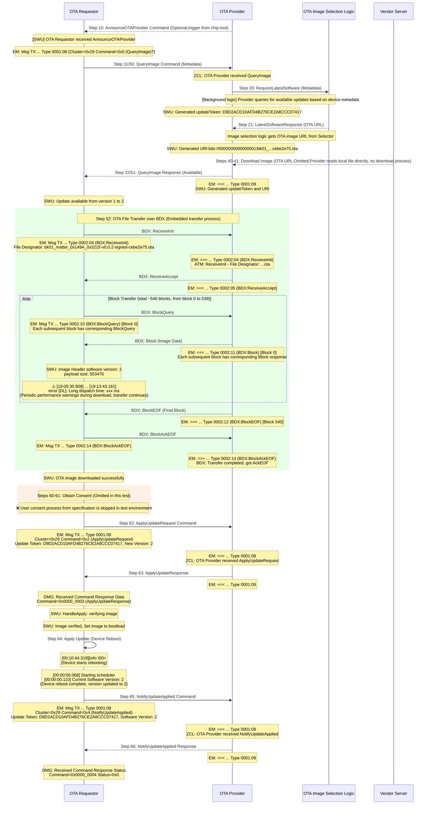

```mermaid
sequenceDiagram
    participant Requestor as OTA Requestor
    participant Provider as OTA Provider
    participant Selector as OTA Image Selection Logic
    participant Vendor as Vendor Server

    Provider-->>Requestor: Step 10: AnnounceOTAProvider Command (Optional,trigger from chip-tool)
    Note over Requestor: [SWU] OTA Requestor received AnnounceOTAProvider


    
    Note over Requestor: EM: Msg TX ... Type 0001:08 (Cluster=0x29 Command=0x0 (QueryImage)?)
    Requestor->>Provider: Step 11/50: QueryImage Command (Metadata)
    Note over Provider: ZCL: OTA Provider received QueryImage

    Provider->>Selector: Step 20: RequestLatestSoftware (Metadata)
    Note over Provider,Selector: [Background logic] Provider queries for available updates based on device metadata
    Note over Provider: SWU: Generated updateToken: D9D2ACD10AFD4B276CE2A8CCC07417
    
    Selector-->>Provider: Step 21: LatestSoftwareResponse (OTA URL)
    Note over Selector,Provider: Image selection logic gets OTA image URL from Selector
    Note over Provider: SWU: Generated URI:bdx://0000000000000001/bk01_...cebe2e75.ota
    
    Vendor-->>Provider: Steps 40-41: Download Image (OTA URL,Omitted,Provider reads local file directly, no download process)


    Provider-->>Requestor: Step 22/51: QueryImage Response (Available)
    Note over Provider: EM: <<< ... Type 0001:09 <br/> SWU: Generated updateToken and URI
    Note over Requestor: SWU: Update available from version 1 to 2

    rect rgb(230, 255, 230)
        Note over Requestor,Provider: Step 52: OTA File Transfer over BDX (Embedded transfer process)
        
        Requestor->>Provider: BDX: ReceiveInit
        Note over Requestor: EM: Msg TX ... Type 0002:04 (BDX:ReceiveInit)<br/>File Designator: bk01_matter_0x149A_0x3215-v0.0.2-signed-cebe2e75.ota
        Note over Provider: EM: >>> ... Type 0002:04 (BDX:ReceiveInit)<br/>ATM: ReceiveInit - File Designator: ...ota
        
        Provider-->>Requestor: BDX: ReceiveAccept
        Note over Provider: EM: <<< ... Type 0002:05 (BDX:ReceiveAccept)

        loop Block Transfer (total ~540 blocks, from block 0 to 539)
            Requestor->>Provider: BDX: BlockQuery
            Note over Requestor: EM: Msg TX ... Type 0002:10 (BDX:BlockQuery) [Block 0]<br/>Each subsequent block has corresponding BlockQuery
            
            Provider-->>Requestor: BDX: Block (Image Data)
            Note over Provider: EM: <<< ... Type 0002:11 (BDX:Block) [Block 0]<br/>Each subsequent block has corresponding Block response
            
            Note over Requestor: SWU: Image Header software version: 2 <br/> payload size: 553476
            Note over Requestor: ⚠️ [19:05:30.908] ... [19:13:43.161] <br/> error [DL]: Long dispatch time: xxx ms<br/>(Periodic performance warnings during download, transfer continues)
        end

        Provider-->>Requestor: BDX: BlockEOF (Final Block)
        Note over Provider: EM: <<< ... Type 0002:12 (BDX:BlockEOF) [Block 540]

        Requestor->>Provider: BDX: BlockAckEOF
        Note over Requestor: EM: Msg TX ... Type 0002:14 (BDX:BlockAckEOF)
        Note over Provider: EM: >>> ... Type 0002:14 (BDX:BlockAckEOF)<br/>BDX: Transfer completed, got AckEOF
    end

    Note over Requestor: SWU: OTA image downloaded successfully

    rect rgb(255, 240, 230)
        Note over Requestor: Steps 60-61: Obtain Consent (Omitted in this test)
        Note over Requestor: ❌ User consent process from specification is skipped in test environment

    end

    Requestor->>Provider: Step 62: ApplyUpdateRequest Command
    Note over Requestor: EM: Msg TX ... Type 0001:08 <br/> Cluster=0x29 Command=0x2 (ApplyUpdateRequest)<br/>Update Token: D9D2ACD10AFD4B276CE2A8CCC07417, New Version: 2
    Note over Provider: EM: >>> ... Type 0001:08 <br/> ZCL: OTA Provider received ApplyUpdateRequest

    Provider-->>Requestor: Step 63: ApplyUpdateResponse
    Note over Provider: EM: <<< ... Type 0001:09
    Note over Requestor: DMG: Received Command Response Data<br/>Command=0x0000_0003 (ApplyUpdateResponse)

    Note over Requestor: SWU: HandleApply: verifying image
    Note over Requestor: SWU: Image verified, Set image to bootload

    Requestor->>Requestor: Step 64: Apply Update (Device Reboot)
    Note over Requestor: [00:10:44.319][info \00> <br/>(Device starts rebooting)
    Note over Requestor: [00:00:00.068] Starting scheduler<br/>[00:00:00.110] Current Software Version: 2<br/>(Device reboot complete, version updated to 2)

    Requestor->>Provider: Step 65: NotifyUpdateApplied Command
    Note over Requestor: EM: Msg TX ... Type 0001:08 <br/> Cluster=0x29 Command=0x4 (NotifyUpdateApplied)<br/>Update Token: D9D2ACD10AFD4B276CE2A8CCC07417, Software Version: 2
    Note over Provider: EM: >>> ... Type 0001:08 <br/> ZCL: OTA Provider received NotifyUpdateApplied

    Provider-->>Requestor: Step 66: NotifyUpdateApplied Response
    Note over Provider: EM: <<< ... Type 0001:09
    Note over Requestor: DMG: Received Command Response Status<br/>Command=0x0000_0004 Status=0x0
```