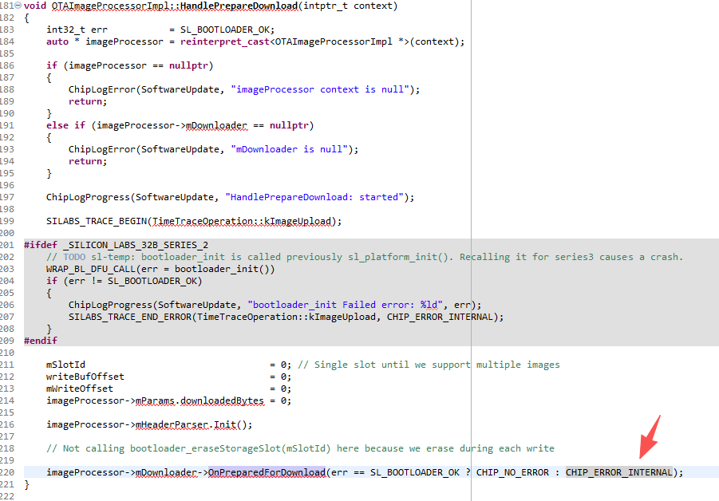

# 1 Non-secure Bootloader OTA Fail With Error
<div align="center">
  
</div>  

```c
//C:\Users\Administrator\.silabs\slt\installs\conan\p\matte66ea43dc8d7de\p\third_party\matter_sdk\src\platform\silabs\efr32\OTAImageProcessorImpl.cpp
void OTAImageProcessorImpl::HandlePrepareDownload(intptr_t context)
{
    //...
    imageProcessor->mDownloader->OnPreparedForDownload(err == SL_BOOTLOADER_OK ? CHIP_NO_ERROR : CHIP_ERROR_INTERNAL);
}
```