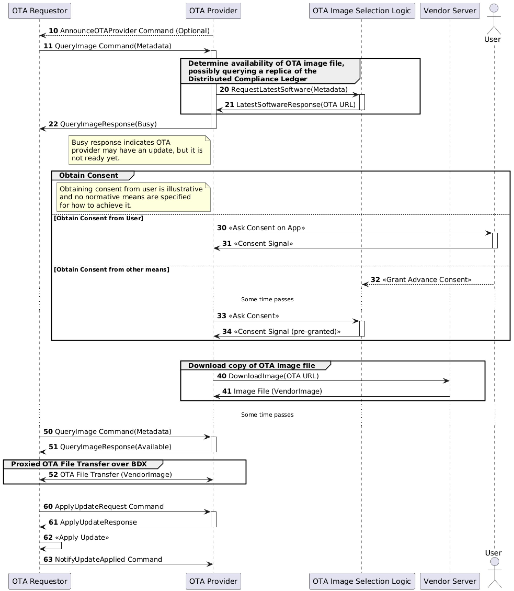

[Chip-tool](../../other/chip-tool.md)  
# 1 OTA Upgrade Operation
## 1.1 OTA Requestor Join network
Kill OTA thread.
```c
ps -ef | grep "ota"
killall -9 sudo chip-ota-provider-app # Force terminate OTA provider application
```
Commission, keep Terminal A open
```c
sudo rm -rf /tmp/chip_* # Clear CHIP temporary files
sudo ./chip-tool pairing ble-thread 2250 hex:0e0800000000000100004a0300000b35060004001fffe00208d66aa42e602782d70708fd119c64dd37b8c40510af58620082e94dcc8b2e7e4a5735245b030f4f70656e5468726561642d323235660102225f04101ab41530faf60b359a71bbd4d65101e50c0402a0f7f8000300000f 22134108 2498 --paa-trust-store-path ~/paa-root-certs
```
```c
sudo ./chip-tool pairing ble-thread 2250 hex:0e0800000000000100004a0300000b35060004001fffe00208d66aa42e602782d70708fd119c64dd37b8c40510af58620082e94dcc8b2e7e4a5735245b030f4f70656e5468726561642d323235660102225f04101ab41530faf60b359a71bbd4d65101e50c0402a0f7f8000300000f 85956333 1884 --paa-trust-store-path ~/paa-root-certs
//Bypass attestation verifier
sudo ./chip-tool pairing ble-thread 2250 hex:0e0800000000000100004a0300000b35060004001fffe00208d66aa42e602782d70708fd119c64dd37b8c40510af58620082e94dcc8b2e7e4a5735245b030f4f70656e5468726561642d323235660102225f04101ab41530faf60b359a71bbd4d65101e50c0402a0f7f8000300000f 85956333 1884 --bypass-attestation-verifier 1
```
```c
sudo ./chip-tool pairing ble-thread 2250 hex:0e0800000000000100004a0300000b35060004001fffe00208d66aa42e602782d70708fd119c64dd37b8c40510af58620082e94dcc8b2e7e4a5735245b030f4f70656e5468726561642d323235660102225f04101ab41530faf60b359a71bbd4d65101e50c0402a0f7f8000300000f 20202021 3840
```
```c
sudo ot-ctl dataset active -x
0e0800000000000100004a0300000b35060004001fffe00208d66aa42e602782d70708fd119c64dd37b8c40510af58620082e94dcc8b2e7e4a5735245b030f4f70656e5468726561642d323235660102225f04101ab41530faf60b359a71bbd4d65101e50c0402a0f7f8000300000f
Done
```

## 1.2 OTA Provider Load File
Open a new Terminal B. Use chip-ota-provider-app to load the target xxx.ota file.
```c
sudo ./chip-ota-provider-app --KVS /tmp/chip_kvs_provider -f xxx.ota
```
Start the OTA provider application and load the firmware file
 - --KVS /tmp/chip_kvs_provider: Specify Key-Value Store path to save device state information
 - -f xxx.ota: Specify the target OTA firmware file (xxx.ota is the firmware to be upgraded)

## 1.3 OTA Provider Join Network
```c
sudo ./chip-tool pairing onnetwork 1 20202021 
```
Add OTA Provider to the network and set access permissions
 - onnetwork 1: Use network pairing method, node ID is 1
 - 20202021: Pairing PIN code
```c
sudo ./chip-tool accesscontrol write acl '[{"fabricIndex": 1, "privilege": 5, "authMode": 2, "subjects": [112233], "targets": null}, {"fabricIndex": 1, "privilege": 3, "authMode": 2, "subjects": null, "targets": null}]' 1 0 
```
ACL (Access Control List) configuration:
 - First ACL: Administrator privileges (privilege:5), authorized to subject 112233
 - Second ACL: Operational privileges (privilege:3), open to all nodes
 - fabricIndex: 1: Fabric index
 - authMode: 2: Authentication mode (Case authentication)

## 1.4 OTA Requestor Trigger
```c
sudo ./chip-tool otasoftwareupdaterequestor announce-otaprovider 1 0 0 0 2250 0 
```
Trigger OTA update process
 - 1: Provider node ID (OTA Provider that was paired earlier)
 - 0: Provider endpoint
 - 0: Requestor node ID (broadcast target, 0 means all nodes)
 - 0: Requestor endpoint
 - 2250: Target upgrade node (Requestor node ID)
 - 0: Retry interval (seconds)

## 1.5 OTA Requestor Version Check
```c
sudo ./chip-tool basicinformation read software-version-string 2250 0
```

# 2 Flowchart on Spec
<div align="center">
  
</div>  

# 3 [ota-flow](ota-flow.md)
## [log-chip-tool](log-chip-tool.md)
## [log-ota-provider](log-ota-provider.md)
## [log-ota-requestor](log-ota-requestor.md)
## [ota-flow-parse](ota-flow-parse.md)

# 4 [ota-issue](ota-issue.md)