# Matter 设备安全认证：PAI & DAC 深度解析

---

## 目录

1. [Matter 安全架构概览](#1-matter-安全架构概览)
2. [证书链：PAA → PAI → DAC](#2-证书链paa--pai--dac)
3. [PAA - Product Attestation Authority](#3-paa---product-attestation-authority)
4. [PAI - Product Attestation Intermediate](#4-pai---product-attestation-intermediate)
5. [DAC - Device Attestation Certificate](#5-dac---device-attestation-certificate)
6. [Spec 解读：设备认证流程](#6-spec-解读设备认证流程)
7. [设备 attest 请求/响应](#7-设备-attest-请求响应)
8. [SDK 代码：DAC Provider 接口](#8-sdk-代码dac-provider-接口)
9. [SDK 代码：DAC Verifier 实现](#9-sdk-代码dac-verifier-实现)
10. [证书链验证流程](#10-证书链验证流程)
11. [Attestation Elements 结构](#11-attestation-elements-结构)
12. [Certification Declaration (CD)](#12-certification-declaration-cd)
13. [Attestation Signature 验证](#13-attestation-signature-验证)
14. [Nonce 机制与安全考量](#14-nonce-机制与安全考量)
15. [CASE 协议中的证书使用](#15-case-协议中的证书使用)
16. [NOC (Node Operational Certificate)](#16-noc-node-operational-certificate)
17. [SDK 实现：关键数据结构](#17-sdk-实现关键数据结构)
18. [错误码与调试](#18-错误码与调试)
19. [Log 分析示例](#19-log-分析示例)
20. [生产环境注意事项](#20-生产环境注意事项)
21. [常见问题与排查](#21-常见问题与排查)
22. [总结](#22-总结)
23. [Q&A](#23-qa)
24. [参考资料](#24-参考资料)
25. [附录：关键 Spec 章节](#25-附录关键-spec-章节)

---

## 1. Matter 安全架构概览

### Matter 安全模型核心组件

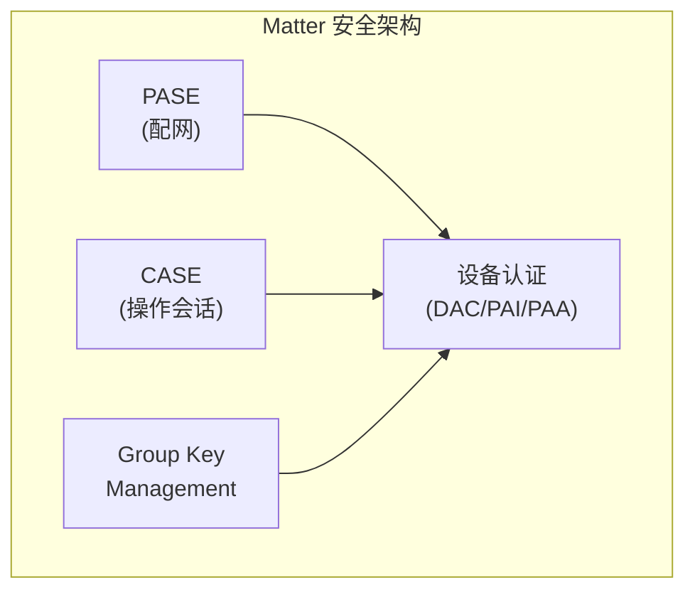

### 安全通信建立流程

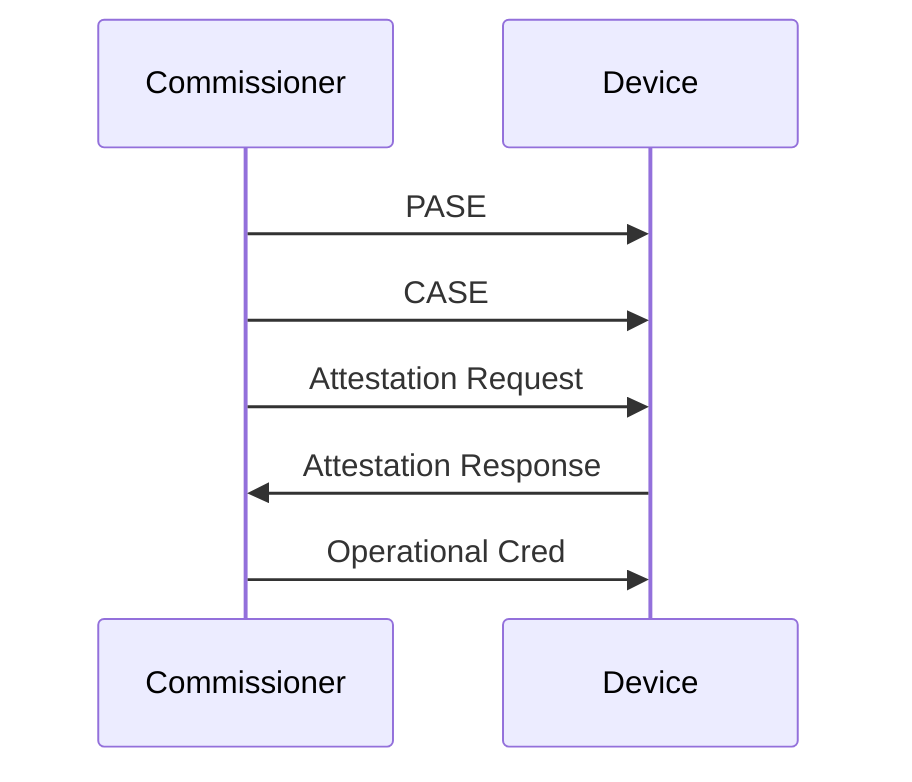

**关键点**:
- **PASE**: Password Authenticated Session Establishment (配网阶段)
- **CASE**: Certificate Authenticated Session Establishment (运行阶段)
- **设备认证**: 在分配操作证书前，必须验证设备的 DAC 链

---

## 2. 证书链：PAA → PAI → DAC

### 三层证书链架构

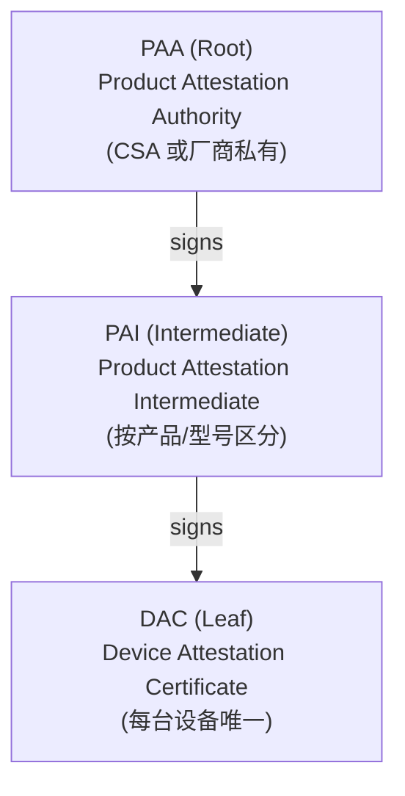

### 证书链特征对比

| 特性 | PAA | PAI | DAC |
|------|-----|-----|-----|
| **证书类型** | Root CA | Intermediate CA | Leaf/End Entity |
| **数量** | 每个厂商 1 个 | 每个产品系列 1 个 | 每台设备 1 个 |
| **存储位置** | Commissioner 信任库 | 设备固件 | 设备安全元件 |
| **私钥存储** | HSM/离线 CA | 安全工厂 | 设备 SE/TEE |
| **是否可导出** | 否 | 是（随设备） | 是（随设备） |
| **包含 VID/PID** | Vendor ID | Vendor ID + Product ID | Vendor ID + Product ID |

---

## 3. PAA - Product Attestation Authority

### PAA 角色

PAA 是证书链的信任根（Root of Trust），具有以下特点：

1. **信任锚点**: Commissioner 必须信任 PAA 才能验证设备
2. **签发 PAI**: PAA 的私钥用于签名 PAI 证书
3. **分发方式**: 
   - CSA 统一分发（官方认证设备）
   - 厂商私有（私有生态设备）

### PAA 证书结构（X.509 扩展）

```
Certificate: PAA
    Subject: CN=Matter PAA, O=Vendor, OID.1.3.6.1.4.1.37244.1.1=<VID>
    Issuer:  Self-signed (or CSA root)
    
    Extensions:
        - Basic Constraints: CA:TRUE, pathlen:1
        - Key Usage: keyCertSign, cRLSign
        - Subject Key Identifier: <SKID>
        - Authority Key Identifier: <SKID> (self-signed)
        - Matter Specific:
            OID.1.3.6.1.4.1.37244.1.1 = Vendor ID (16-bit)
```

### PAA 信任库管理

在 SDK 中，PAA 信任库通过 `AttestationTrustStore` 接口实现：

```cpp
// 来自 SDK: src/credentials/attestation_verifier/DeviceAttestationVerifier.h

class AttestationTrustStore
{
public:
    /**
     * @brief 通过 SKID 查找 PAA 证书
     * 
     * @param[in] skid Subject Key Identifier
     * @param[in,out] outPaaDerBuffer 接收 PAA 证书 DER 数据
     */
    virtual CHIP_ERROR GetProductAttestationAuthorityCert(
        const ByteSpan & skid, 
        MutableByteSpan & outPaaDerBuffer) const = 0;
};
```

---

## 4. PAI - Product Attestation Intermediate

### PAI 角色

PAI 是 PAA 和 DAC 之间的中间证书：

1. **产品级别**: 通常按产品型号或产品线划分
2. **包含 PID**: PAI 证书中包含 Product ID 信息
3. **批量签发**: 同一型号的所有设备共享同一个 PAI

### PAI 证书结构

```
Certificate: PAI
    Subject: CN=Matter PAI, O=Vendor, PID=<ProductID>
    Issuer:  PAA (signed by PAA private key)
    
    Extensions:
        - Basic Constraints: CA:TRUE, pathlen:0
        - Key Usage: keyCertSign
        - Subject Key Identifier: <PAI_SKID>
        - Authority Key Identifier: <PAA_SKID>  ← 链接到 PAA
        - Matter Specific:
            OID.1.3.6.1.4.1.37244.1.1 = Vendor ID
            OID.1.3.6.1.4.1.37244.1.2 = Product ID (可选)
```

### SDK 中的 PAI 示例代码

```cpp
// 来自 SDK: src/credentials/examples/ExamplePAI.h

// PAI 证书以 DER 编码的字节数组形式存储在固件中
extern const uint8_t gExamplePAI_Cert[];
extern const size_t gExamplePAI_Cert_Length;

// 对应的 PAI 私钥（仅用于开发/测试，生产环境应在安全工厂签名）
extern const uint8_t gExamplePAI_PrivateKey[];
```

---

## 5. DAC - Device Attestation Certificate

### DAC 角色

DAC 是设备身份的最终证明：

1. **设备唯一性**: 每台设备拥有独立的 DAC
2. **包含设备身份**: VID + PID + 唯一的 DAC 公钥
3. **私钥保护**: DAC 私钥在设备内部安全元件中生成，永远不导出
4. **用于签名**: 设备用 DAC 私钥对 Attestation Information 签名

### DAC 证书结构

```
Certificate: DAC
    Subject: CN=Matter DAC, O=Vendor, VID=<VendorID>, PID=<ProductID>
    Issuer:  PAI (signed by PAI private key)
    
    Extensions:
        - Basic Constraints: CA:FALSE
        - Key Usage: digitalSignature
        - Extended Key Usage: clientAuth
        - Subject Key Identifier: <DAC_SKID>
        - Authority Key Identifier: <PAI_SKID>  ← 链接到 PAI
        - Matter Specific:
            OID.1.3.6.1.4.1.37244.1.1 = Vendor ID
            OID.1.3.6.1.4.1.37244.1.2 = Product ID
```

### DAC 在设备中的存储

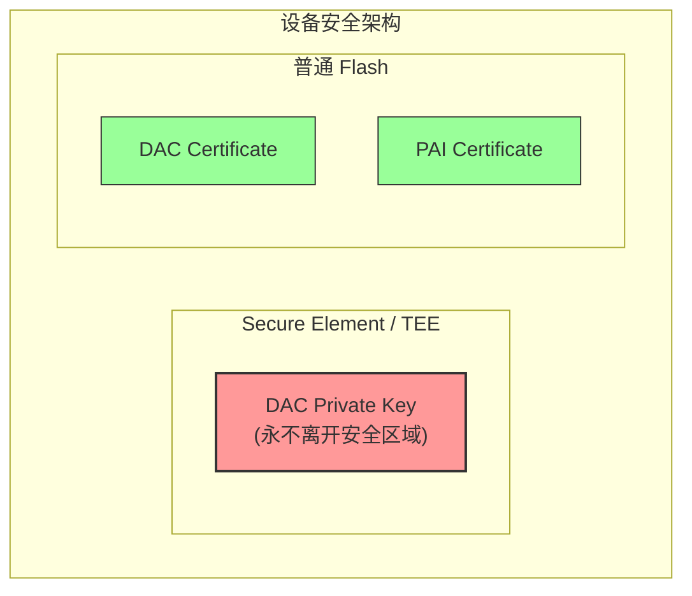

**注**: DAC Private Key 不可导出，证书可读取

---

## 6. Spec 解读：设备认证流程

### 规范参考

> **Matter Core Specification v1.5**  
> Chapter 11: Security and Authentication  
> Section 11.22: Device Attestation

### 设备认证时序图

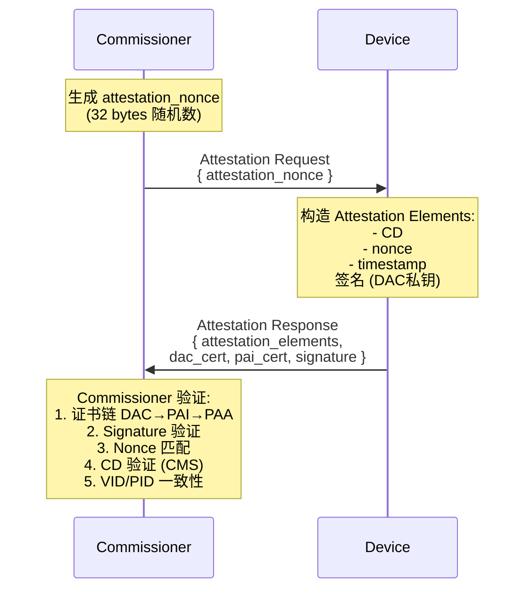

---

## 7. 设备 Attest 请求/响应

### Attestation Request TLV 结构

```
AttestationRequest:
{
    attestation_nonce: octet_string,  // 32 bytes 随机数 (Context Tag 1)
}
```

### Attestation Response TLV 结构

```
AttestationResponse:
{
    attestation_elements: structure {  // Context Tag 1
        certification_declaration: octet_string,  // CMS signed CD
        attestation_nonce: octet_string,          // 与 Request 中相同
        timestamp: integer,                       // 设备当前时间戳
        firmware_info: octet_string,              // (可选) 固件信息
        vendor_reserved: ...                      // (可选) 厂商自定义
    },
    dac_cert: octet_string,           // DAC 证书 DER 编码
    pai_cert: octet_string,           // PAI 证书 DER 编码
    signature: octet_string,          // ECDSA 签名 (attestation_elements 的哈希)
}
```

### 关键安全约束

- **attestation_nonce**: 必须由 Commissioner 生成，每次认证唯一
- **timestamp**: 用于验证设备时钟合理性（防重放攻击辅助）
- **signature**: 必须使用 DAC 私钥对 `SHA256(attestation_elements || attestation_challenge)` 签名

---

## 8. SDK 代码：DAC Provider 接口

### DeviceAttestationCredentialsProvider 接口

```cpp
// SDK 路径: src/credentials/DeviceAttestationCredsProvider.h

class DeviceAttestationCredentialsProvider
{
public:
    /**
     * @brief 获取 Certification Declaration
     * @param[out] out_cd_buffer 接收 CD 数据
     */
    virtual CHIP_ERROR GetCertificationDeclaration(
        MutableByteSpan & out_cd_buffer);

    /**
     * @brief 获取 Firmware Information
     * @param[out] out_firmware_info_buffer 接收固件信息
     */
    virtual CHIP_ERROR GetFirmwareInformation(
        MutableByteSpan & out_firmware_info_buffer);

    /**
     * @brief 获取 DAC 证书
     * @param[out] out_dac_buffer 接收 DAC 证书 DER 数据
     */
    virtual CHIP_ERROR GetDeviceAttestationCert(
        MutableByteSpan & out_dac_buffer);

    /**
     * @brief 获取 PAI 证书
     * @param[out] out_pai_buffer 接收 PAI 证书 DER 数据
     */
    virtual CHIP_ERROR GetProductAttestationIntermediateCert(
        MutableByteSpan & out_pai_buffer);

    /**
     * @brief 使用 DAC 私钥签名
     * @param[in] message_to_sign 待签名消息
     * @param[out] out_signature_buffer 接收签名结果
     */
    virtual CHIP_ERROR SignWithDeviceAttestationKey(
        const ByteSpan & message_to_sign, 
        MutableByteSpan & out_signature_buffer);
};

// 全局接口获取
DeviceAttestationCredentialsProvider * GetDeviceAttestationCredentialsProvider();
void SetDeviceAttestationCredentialsProvider(
    DeviceAttestationCredentialsProvider * provider);
```

### 设备端实现要点

```cpp
// 设备端需要实现的具体接口示例

class MyDeviceDACProvider : public DeviceAttestationCredentialsProvider
{
public:
    CHIP_ERROR GetDeviceAttestationCert(MutableByteSpan & out_dac_buffer) override
    {
        // 从 Flash/安全元件读取 DAC 证书
        return CopySpanToMutableSpan(
            ByteSpan(gMyDevice_DAC_Cert, gMyDevice_DAC_Cert_Length), 
            out_dac_buffer);
    }

    CHIP_ERROR GetProductAttestationIntermediateCert(
        MutableByteSpan & out_pai_buffer) override
    {
        // 从 Flash 读取 PAI 证书
        return CopySpanToMutableSpan(
            ByteSpan(gMyDevice_PAI_Cert, gMyDevice_PAI_Cert_Length), 
            out_pai_buffer);
    }

    CHIP_ERROR SignWithDeviceAttestationKey(
        const ByteSpan & message_to_sign, 
        MutableByteSpan & out_signature_buffer) override
    {
        // 调用安全元件的签名接口
        // 私钥永远不离开安全区域
        return SecureElement_ECDSA_Sign(
            message_to_sign, out_signature_buffer);
    }
};
```

---

## 9. SDK 代码：DAC Verifier 实现

### DeviceAttestationVerifier 接口

```cpp
// SDK 路径: src/credentials/attestation_verifier/DeviceAttestationVerifier.h

class DeviceAttestationVerifier
{
public:
    struct AttestationInfo
    {
        const ByteSpan attestationElementsBuffer;  // Attestation Elements TLV
        const ByteSpan attestationChallengeBuffer; // Secure Session Challenge
        const ByteSpan attestationSignatureBuffer; // ECDSA Signature
        const ByteSpan paiDerBuffer;               // PAI Certificate DER
        const ByteSpan dacDerBuffer;               // DAC Certificate DER
        const ByteSpan attestationNonceBuffer;     // Nonce from Request
        VendorId vendorId;                         // From Basic Info Cluster
        uint16_t productId;                        // From Basic Info Cluster
    };

    /**
     * @brief 验证 Attestation Information
     * @param[in] info 所有需要验证的信息
     * @param[in] onCompletion 异步回调返回验证结果
     */
    virtual void VerifyAttestationInformation(
        const AttestationInfo & info,
        Callback::Callback<OnAttestationInformationVerification> * onCompletion) = 0;

    /**
     * @brief 验证 Certification Declaration 的 CMS 签名
     */
    virtual AttestationVerificationResult ValidateCertificationDeclarationSignature(
        const ByteSpan & cmsEnvelopeBuffer,
        ByteSpan & certDeclBuffer) = 0;

    /**
     * @brief 验证 NOCSR (Node Operational CSR) 信息
     */
    virtual CHIP_ERROR VerifyNodeOperationalCSRInformation(
        const ByteSpan & nocsrElementsBuffer,
        const ByteSpan & attestationChallengeBuffer,
        const ByteSpan & attestationSignatureBuffer,
        const Crypto::P256PublicKey & dacPublicKey,
        const ByteSpan & csrNonce) = 0;
};
```

### DefaultDACVerifier 核心验证逻辑

```cpp
// SDK 路径: src/credentials/attestation_verifier/DefaultDeviceAttestationVerifier.cpp

void DefaultDACVerifier::VerifyAttestationInformation(
    const DeviceAttestationVerifier::AttestationInfo & info,
    Callback::Callback<OnAttestationInformationVerification> * onCompletion)
{
    AttestationVerificationResult attestationError = kSuccess;

    // 1. 验证参数有效性
    VerifyOrExit(!info.attestationElementsBuffer.empty() && 
                 !info.attestationChallengeBuffer.empty() &&
                 !info.attestationSignatureBuffer.empty() && 
                 !info.dacDerBuffer.empty() &&
                 !info.attestationNonceBuffer.empty(),
                 attestationError = kInvalidArgument);

    // 2. 确保 PAI 存在
    VerifyOrExit(!info.paiDerBuffer.empty(), 
                 attestationError = kPaiMissing);

    // 3. 验证证书格式
    VerifyOrExit(VerifyAttestationCertificateFormat(
                     info.paiDerBuffer, kPAI) == CHIP_NO_ERROR,
                 attestationError = kPaiFormatInvalid);
    VerifyOrExit(VerifyAttestationCertificateFormat(
                     info.dacDerBuffer, kDAC) == CHIP_NO_ERROR,
                 attestationError = kDacFormatInvalid);

    // 4. 匹配 DAC 和 PAI 的 VID/PID
    {
        AttestationCertVidPid dacVidPid, paiVidPid;
        ExtractVIDPIDFromX509Cert(info.dacDerBuffer, dacVidPid);
        ExtractVIDPIDFromX509Cert(info.paiDerBuffer, paiVidPid);
        
        // VID 必须匹配
        VerifyOrExit(paiVidPid.mVendorId == dacVidPid.mVendorId,
                     attestationError = kDacVendorIdMismatch);
    }

    // 5. 验证 Attestation Signature
    {
        P256PublicKey remoteManufacturerPubkey;
        P256ECDSASignature deviceSignature;
        
        // 从 DAC 提取公钥
        ExtractPubkeyFromX509Cert(info.dacDerBuffer, 
                                  remoteManufacturerPubkey);
        
        // 验证签名: SHA256(attestation_elements || attestation_challenge)
        ValidateAttestationSignature(
            remoteManufacturerPubkey, 
            info.attestationElementsBuffer,
            info.attestationChallengeBuffer, 
            deviceSignature);
    }

    // 6. 查找并验证 PAA
    {
        // 从 PAI 提取 AKID (Authority Key Identifier)
        // 在信任库中查找对应的 PAA
        // 验证 PAA → PAI → DAC 证书链
    }

    // 7. 验证 Certification Declaration
    {
        // 验证 CMS 签名
        // 验证 VID/PID 一致性
    }

exit:
    // 异步返回验证结果
    onCompletion->mCall(onCompletion->mContext, info, attestationError);
}
```

---

## 10. 证书链验证流程

### 完整验证步骤

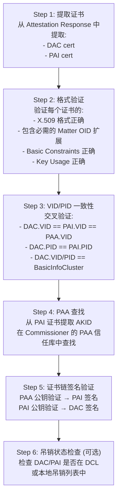

### SDK 中的证书链验证结果映射

```cpp
// SDK 中将证书链验证结果映射为 Attestation 错误码
AttestationVerificationResult MapError(
    CertificateChainValidationResult certificateChainValidationResult)
{
    switch (certificateChainValidationResult)
    {
    case kRootFormatInvalid:
        return kPaaFormatInvalid;    // PAA 格式错误
    case kICAFormatInvalid:
        return kPaiFormatInvalid;    // PAI 格式错误
    case kLeafFormatInvalid:
        return kDacFormatInvalid;    // DAC 格式错误
    case kChainInvalid:
        return kDacSignatureInvalid; // 证书链签名错误
    case kNoMemory:
        return kNoMemory;
    case kInternalFrameworkError:
        return kInternalError;
    default:
        return kInternalError;
    }
}
```

---

## 11. Attestation Elements 结构

### TLV 编码详解

Attestation Elements 使用 Matter TLV (Type-Length-Value) 编码：

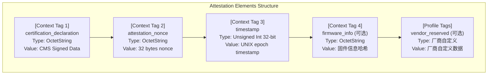

### SDK 中的 Attestation Elements 解析代码

```cpp
// SDK 路径: src/credentials/DeviceAttestationConstructor.cpp

CHIP_ERROR DeconstructAttestationElements(
    const ByteSpan & attestationElements,
    ByteSpan & certificationDeclaration,
    ByteSpan & attestationNonce,
    uint32_t & timestamp,
    ByteSpan & firmwareInfo,
    DeviceAttestationVendorReservedDeconstructor & vendorReserved)
{
    TLV::ContiguousBufferTLVReader tlvReader;
    TLV::TLVType containerType = TLV::kTLVType_Structure;

    tlvReader.Init(attestationElements);
    ReturnErrorOnFailure(tlvReader.Next(containerType, TLV::AnonymousTag()));
    ReturnErrorOnFailure(tlvReader.EnterContainer(containerType));

    // 按顺序解析 Context Tags
    while ((error = tlvReader.Next()) == CHIP_NO_ERROR)
    {
        TLV::Tag tag = tlvReader.GetTag();
        if (!TLV::IsContextTag(tag))
            break;

        uint32_t contextTagId = TLV::TagNumFromTag(tag);
        
        // 验证标签顺序
        VerifyOrReturnError(contextTagId > lastContextTagId, 
                           CHIP_ERROR_UNEXPECTED_TLV_ELEMENT);
        lastContextTagId = contextTagId;

        switch (contextTagId)
        {
        case kCertificationDeclarationTagId: // Tag 1
            ReturnErrorOnFailure(tlvReader.GetByteView(certificationDeclaration));
            break;
        case kAttestationNonceTagId:         // Tag 2
            ReturnErrorOnFailure(tlvReader.GetByteView(attestationNonce));
            break;
        case kTimestampTagId:                // Tag 3
            ReturnErrorOnFailure(tlvReader.Get(timestamp));
            break;
        case kFirmwareInfoTagId:             // Tag 4 (可选)
            ReturnErrorOnFailure(tlvReader.GetByteView(firmwareInfo));
            break;
        }
    }

    // 验证必需标签存在
    VerifyOrReturnError(certificationDeclarationExists && 
                        attestationNonceExists && timestampExists,
                        CHIP_ERROR_MISSING_TLV_ELEMENT);

    return CHIP_NO_ERROR;
}
```

---

## 12. Certification Declaration (CD)

### CD 的作用

Certification Declaration 证明设备已通过 CSA 认证：

1. **CMS 签名**: 使用 CSA 的 CD Signing Key 签名
2. **内容包含**:
   - Vendor ID
   - Product ID (数组)
   - 认证类型 (Development/Provisional/Official)
   - 允许的 PAA (可选)
   - 认证日期

### CD 数据结构 (protobuf 编码后 CMS 签名)

```
CertificationDeclaration:
{
    format_version: uint8,           // 格式版本 (当前为 1)
    vendor_id: uint16,               // 厂商 ID
    product_ids: array<uint16>,      // 产品 ID 列表
    device_type_id: uint32,          // 设备类型 ID
    certificate_id: string,          // 证书 ID (CSA 分配)
    security_level: uint8,           // 安全级别
    security_information: uint16,    // 安全信息位掩码
    version_number: uint16,          // CD 版本号
    certification_type: uint8,       // 0=Dev/Test, 1=Provisional, 2=Official
    csa_revision_number: uint8,      // CSA 规范版本号
    authorized_paa_list: array<      // (可选) 允许的 PAA 列表
        {
            authority_type: uint8,
            authority_id: octet_string
        }
    >
}
```

### CD 验证流程

```cpp
// Commissioner 端 CD 验证步骤

AttestationVerificationResult ValidateCertificationDeclaration(
    const ByteSpan & cmsEnvelopeBuffer,
    ByteSpan & certDeclBuffer,
    const DeviceInfoForAttestation & deviceInfo)
{
    // 1. 从 CMS Envelope 提取 Key ID
    CertificateKeyId kid;
    ExtractKeyIdFromCMS(cmsEnvelopeBuffer, kid);
    
    // 2. 根据 Key ID 查找 CSA 验证证书
    P256PublicKey cdVerifyKey;
    LookupCDVerifyKey(kid, cdVerifyKey);
    if (CHIP_ERROR_KEY_NOT_FOUND)
        return kCertificationDeclarationNoCertificateFound;
    
    // 3. 验证 CMS 签名
    CHIP_ERROR err = VerifyCMSSignature(
        cmsEnvelopeBuffer, certDeclBuffer, cdVerifyKey);
    if (err != CHIP_NO_ERROR)
        return kCertificationDeclarationInvalidSignature;
    
    // 4. 解析 CD 内容
    CertificationDeclaration cd;
    ParseCertificationDeclaration(certDeclBuffer, cd);
    
    // 5. 验证 VID 一致性
    if (cd.vendor_id != deviceInfo.dacVendorId)
        return kCertificationDeclarationInvalidVendorId;
    
    // 6. 验证 PID 在允许列表中
    if (!cd.product_ids.Contains(deviceInfo.dacProductId))
        return kCertificationDeclarationInvalidProductId;
    
    // 7. 如果 CD 指定了允许的 PAA，验证 PAA 匹配
    if (cd.authorized_paa_list.HasValue())
    {
        if (!IsPAAInAuthorizedList(deviceInfo.paaSKID, 
                                   cd.authorized_paa_list))
            return kCertificationDeclarationInvalidPAA;
    }
    
    return kSuccess;
}
```

### CSA CD Signing Keys (SDK 内置)

SDK 内置了多个 CSA 官方 CD 签名公钥用于验证：

```cpp
// SDK 路径: src/credentials/attestation_verifier/DefaultDeviceAttestationVerifier.cpp

// 测试用 CD 签名公钥 (仅开发/测试使用)
constexpr uint8_t gTestCdPubkeyBytes[] = { 0x04, 0x3c, 0x39, ... };
constexpr uint8_t gTestCdPubkeyKid[] = { 0x62, 0xfa, ... };

// 官方 CD Signing Key 001-005
constexpr uint8_t gCdSigningKey001PubkeyBytes[] = { ... };
constexpr uint8_t gCdSigningKey001Kid[] = { 0xFE, 0x34, ... };
// ... 更多官方密钥

// 生产环境应禁用测试密钥
void EnableCdTestKeySupport(bool enabled); // 默认 true，生产设为 false
```

---

## 13. Attestation Signature 验证

### 签名生成与验证

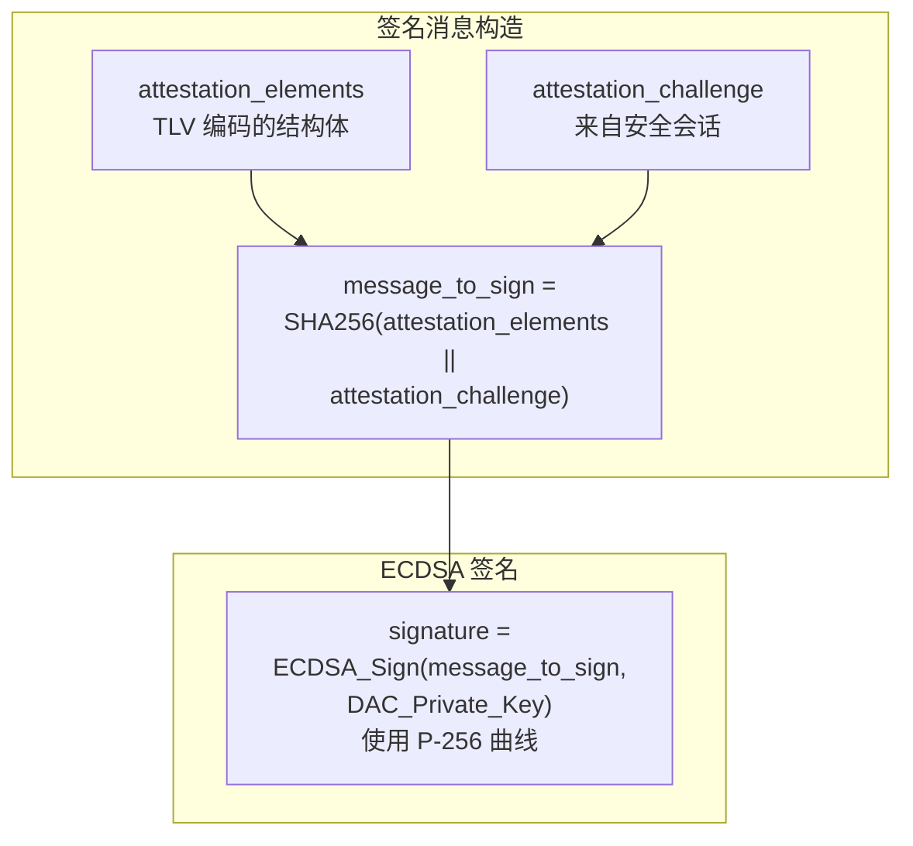

### SDK 中的签名验证实现

```cpp
// SDK 路径: src/credentials/attestation_verifier/DeviceAttestationVerifier.cpp

CHIP_ERROR DeviceAttestationVerifier::ValidateAttestationSignature(
    const P256PublicKey & pubkey,           // DAC 公钥 (从 DAC 证书提取)
    const ByteSpan & attestationElements,   // TLV 编码的 Attestation Elements
    const ByteSpan & attestationChallenge,  // 来自安全会话的挑战
    const P256ECDSASignature & signature)   // 设备返回的签名
{
    // 1. 计算消息哈希
    Hash_SHA256_stream hashStream;
    uint8_t md[kSHA256_Hash_Length];
    MutableByteSpan messageDigestSpan(md);

    ReturnErrorOnFailure(hashStream.Begin());
    ReturnErrorOnFailure(hashStream.AddData(attestationElements));
    ReturnErrorOnFailure(hashStream.AddData(attestationChallenge));
    ReturnErrorOnFailure(hashStream.Finish(messageDigestSpan));

    // 2. 使用公钥验证 ECDSA 签名
    ReturnErrorOnFailure(pubkey.ECDSA_validate_hash_signature(
        messageDigestSpan.data(), 
        messageDigestSpan.size(), 
        signature));

    return CHIP_NO_ERROR;
}
```

### 签名验证失败的可能原因

| 错误码 | 含义 | 可能原因 |
|--------|------|----------|
| `kAttestationSignatureInvalid` | 签名验证失败 | DAC 私钥不匹配、消息被篡改 |
| `kAttestationSignatureInvalidFormat` | 签名格式错误 | 签名算法不匹配、证书中密钥类型错误 |
| `kAttestationNonceMismatch` | Nonce 不匹配 | 设备使用了错误的 nonce |
| `kAttestationElementsMalformed` | Elements 格式错误 | TLV 编码错误 |

---

## 14. Nonce 机制与安全考量

### Nonce 的作用

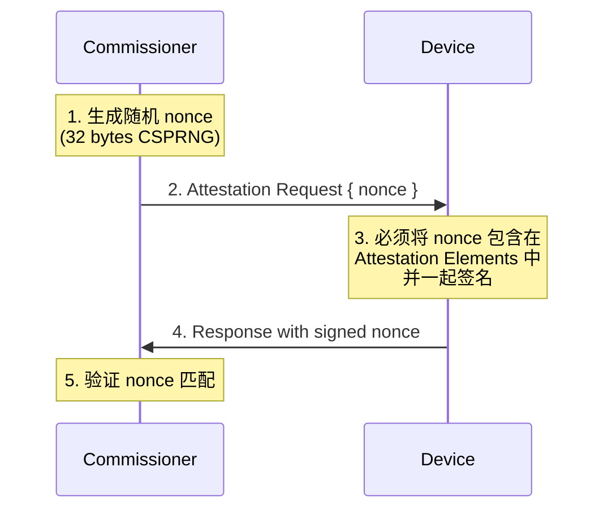

**Nonce 防止的攻击**:
- **重放攻击 (Replay Attack)**: 每次认证使用不同 nonce，旧的 Response 无法重放
- **预计算攻击 (Pre-computation Attack)**: 攻击者无法预先计算签名
- **中间人攻击 (MITM)**: Nonce 绑定到 attestation_challenge，防止替换

### Nonce 要求

```cpp
// Nonce 必须满足:
// 1. 长度: 32 bytes (kExpectedAttestationNonceSize)
// 2. 随机性: 使用密码学安全随机数生成器 (CSPRNG)
// 3. 唯一性: 每次认证请求使用新的 nonce

constexpr size_t kExpectedAttestationNonceSize = 32;

// Commissioner 端 nonce 生成示例
uint8_t attestation_nonce[kExpectedAttestationNonceSize];
CHIP_ERROR err = DRBG_get_bytes(attestation_nonce, sizeof(attestation_nonce));
VerifyOrReturnError(err == CHIP_NO_ERROR, err);
```

---

## 15. CASE 协议中的证书使用

### CASE (Certificate Authenticated Session Establishment)

CASE 协议用于建立设备与 Controller 之间的安全会话：

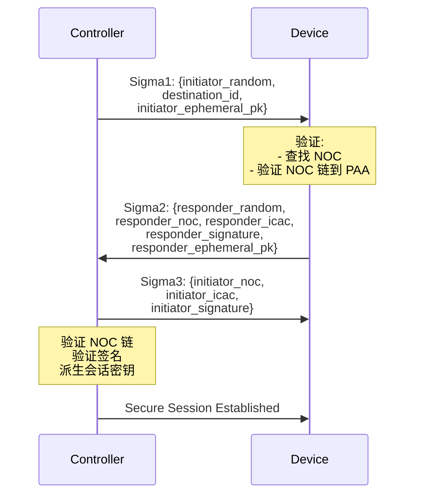

### CASE 中使用的证书类型

```c
CASE 交换的证书:
┌─────────────────────────────────────────────────────┐
│                                                     │
│  NOC (Node Operational Certificate)                 │
│  ├── 由 Fabric 的 CA (ICA) 签发                     │
│  ├── 包含 Node Operational ID (NOID)                │
│  ├── 包含 Fabric ID, CATs                           │
│  └── 用于 CASE 会话中的身份认证                       │
│                                                     │
│  ICAC (Intermediate Certificate Authority Cert)     │
│  ├── 由 PAA 签发                                     │
│  ├── 用于签发 NOC                                    │
│  └── 与 NOC 一起传输以形成完整链                      │
│                                                     │
│  注意:                                              │
│  - DAC/PAI 用于初始设备认证 (Commissioning)          │
│  - NOC/ICAC 用于运行时的 CASE 会话                   │
│  - NOC 链最终也信任 PAA                              │
└─────────────────────────────────────────────────────┘
```

---

## 16. NOC (Node Operational Certificate)

### NOC 生命周期

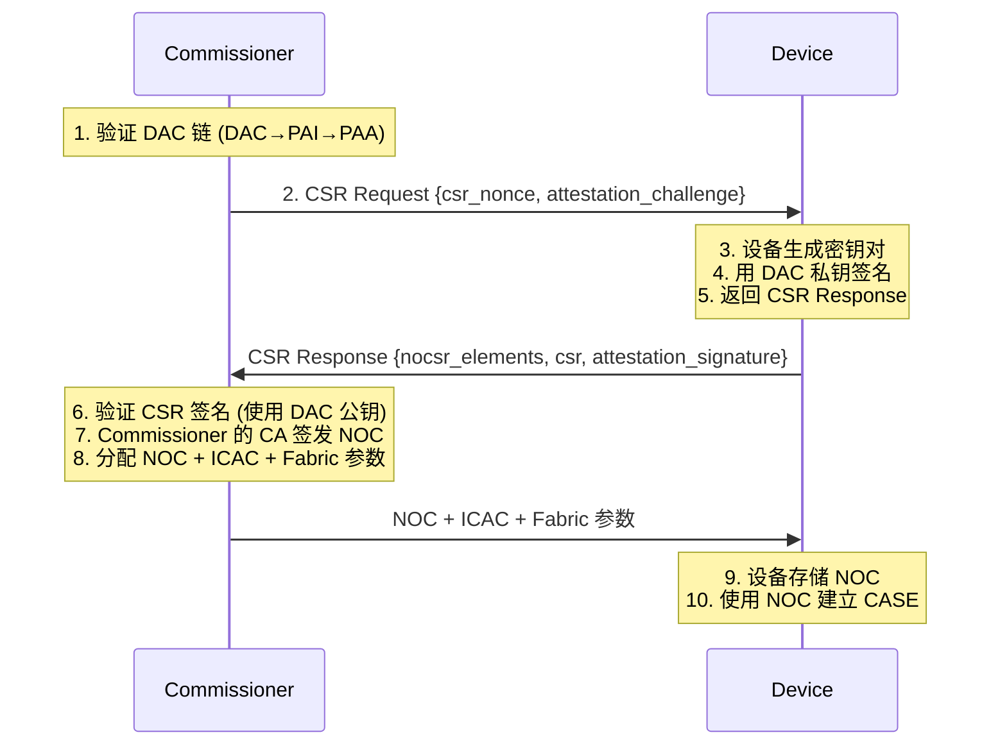

### NOC 证书结构

```
Node Operational Certificate:
    Subject: CN=Matter NOC, 
             fabric_id=<FabricID>,
             noc_cat=<CATs>,
             noc_nid=<NodeID>
    Issuer:  Fabric ICA ( Intermediate CA )
    
    Extensions:
        - Basic Constraints: CA:FALSE
        - Key Usage: digitalSignature, keyAgreement
        - Extended Key Usage: clientAuth, serverAuth
        - Matter Specific:
            OID.1.3.6.1.4.1.37244.2.1 = Fabric ID
            OID.1.3.6.1.4.1.37244.2.2 = Node ID
            OID.1.3.6.1.4.1.37244.2.3 = CASE Auth Tags (CATs)
```

---

## 17. SDK 实现：关键数据结构

### 证书验证结果枚举

```cpp
// SDK 路径: src/credentials/attestation_verifier/DeviceAttestationVerifier.h

enum class AttestationVerificationResult : uint16_t
{
    kSuccess = 0,

    // PAA 相关错误 (100-106)
    kPaaUntrusted        = 100,
    kPaaNotFound         = 101,
    kPaaExpired          = 102,
    kPaaSignatureInvalid = 103,
    kPaaRevoked          = 104,
    kPaaFormatInvalid    = 105,
    kPaaArgumentInvalid  = 106,

    // PAI 相关错误 (200-207)
    kPaiExpired           = 200,
    kPaiSignatureInvalid  = 201,
    kPaiRevoked           = 202,
    kPaiFormatInvalid     = 203,
    kPaiArgumentInvalid   = 204,
    kPaiVendorIdMismatch  = 205,
    kPaiAuthorityNotFound = 206,
    kPaiMissing           = 207,
    kPaiAndDacRevoked     = 208,

    // DAC 相关错误 (300-307)
    kDacExpired           = 300,
    kDacSignatureInvalid  = 301,
    kDacRevoked           = 302,
    kDacFormatInvalid     = 303,
    kDacArgumentInvalid   = 304,
    kDacVendorIdMismatch  = 305,
    kDacProductIdMismatch = 306,
    kDacAuthorityNotFound = 307,

    // 固件信息错误 (400-401)
    kFirmwareInformationMismatch = 400,
    kFirmwareInformationMissing  = 401,

    // Attestation 签名错误 (500-503)
    kAttestationSignatureInvalid       = 500,
    kAttestationElementsMalformed      = 501,
    kAttestationNonceMismatch          = 502,
    kAttestationSignatureInvalidFormat = 503,

    // CD 验证错误 (600-606)
    kCertificationDeclarationNoKeyId            = 600,
    kCertificationDeclarationNoCertificateFound = 601,
    kCertificationDeclarationInvalidSignature   = 602,
    kCertificationDeclarationInvalidFormat      = 603,
    kCertificationDeclarationInvalidVendorId    = 604,
    kCertificationDeclarationInvalidProductId   = 605,
    kCertificationDeclarationInvalidPAA         = 606,

    // 通用错误 (700-703)
    kNoMemory        = 700,
    kInvalidArgument = 701,
    kInternalError   = 702,
    kNotImplemented  = 703,
};
```

### 设备信息结构

```cpp
// 用于交叉验证的设备信息
struct DeviceInfoForAttestation
{
    // Basic Information Cluster 报告的值
    uint16_t vendorId = VendorId::NotSpecified;
    uint16_t productId = 0;
    
    // DAC 证书中的值
    uint16_t dacVendorId = VendorId::NotSpecified;
    uint16_t dacProductId = 0;
    
    // PAI 证书中的值
    uint16_t paiVendorId = VendorId::NotSpecified;
    uint16_t paiProductId = 0;
    
    // PAA 证书中的值
    uint16_t paaVendorId = VendorId::NotSpecified;
    uint8_t paaSKID[Crypto::kSubjectKeyIdentifierLength] = { 0 };
};
```

---

## 18. 错误码与调试

### 常见错误码排查

```c
┌──────────────────────────────────────────────────────────────┐
│                     错误排查指南                              │
├──────────────────────────────────────────────────────────────┤
│                                                              │
│  kPaiMissing (207)                                          │
│  ├─ 原因: Attestation Response 中未包含 PAI 证书             │
│  ├─ 排查: 检查设备端 GetProductAttestationIntermediateCert() │
│  └─ 解决: 确保设备固件包含有效的 PAI 证书                     │
│                                                              │
│  kDacVendorIdMismatch (305)                                 │
│  ├─ 原因: DAC.VID != PAI.VID 或不等于 BasicInfo 报告的值    │
│  ├─ 排查: 检查证书生成过程中 VID 是否正确设置                │
│  └─ 解决: 重新生成匹配的证书链                              │
│                                                              │
│  kDacProductIdMismatch (306)                                │
│  ├─ 原因: DAC.PID != PAI.PID (如果 PAI 包含 PID)            │
│  ├─ 排查: 检查证书中的 Product ID 扩展                      │
│  └─ 解决: 确保 DAC 和 PAI 的 PID 一致                       │
│                                                              │
│  kDacSignatureInvalid (301)                                 │
│  ├─ 原因: PAI 公钥无法验证 DAC 签名                         │
│  ├─ 排查: 检查 PAI→DAC 签名链                               │
│  └─ 解决: 使用正确的 PAI 私钥重新签名 DAC                    │
│                                                              │
│  kPaaNotFound (101)                                         │
│  ├─ 原因: Commissioner 信任库中找不到 PAI 引用的 PAA        │
│  ├─ 排查: 检查 PAI 的 AKID 和 Commissioner 的 PAA 信任库    │
│  └─ 解决: 安装正确的 PAA 到 Commissioner 信任库             │
│                                                              │
│  kAttestationSignatureInvalid (500)                         │
│  ├─ 原因: DAC 公钥无法验证 attestation 签名                 │
│  ├─ 排查: 检查设备端签名逻辑和 nonce 使用                    │
│  └─ 解决: 修复设备端签名实现                                 │
│                                                              │
│  kCertificationDeclarationInvalidSignature (602)            │
│  ├─ 原因: CD 的 CMS 签名验证失败                            │
│  ├─ 排查: 检查 CD 是否由 CSA 官方密钥签名                    │
│  └─ 解决: 获取正确的 CD (从 CSA 认证流程)                    │
│                                                              │
└──────────────────────────────────────────────────────────────┘
```

---

## 19. Log 分析示例

### 正常认证流程日志

```
[DL] BLE connection established
[IN] PASE session initiated
[DL] PASE session established successfully
[ZCL] Received Attestation Request
[DMG] Sending Attestation Response with DAC and PAI certs

// Commissioner 端验证日志
[NotSpecified] Device candidate DAC chain details:
[NotSpecified] --> DAC's VID: 0xFFF1, PID: 0x8000
[NotSpecified] ==== DAC certificate considered (XXX bytes) ====
[NotSpecified] -----BEGIN CERTIFICATE-----
[NotSpecified] MIIBszCCAVqgAwIBAgIIRdrzneR6oI8wCgYIKoZIzj0EAwIwKzEpMCcGA1UEAwwg
[NotSpecified] ... (certificate content) ...
[NotSpecified] -----END CERTIFICATE-----
[NotSpecified] --> DAC certificate SKID: 62:fa:82:33:59:ac:fa:a9:96:3e:1c:fa:14:0a:dd:f5:04:f3:71:60
[NotSpecified] --> DAC certificate AKID: XX:XX:XX:XX:XX:XX:XX:XX:XX:XX:XX:XX:XX:XX:XX:XX:XX:XX:XX:XX
[NotSpecified] ==== PAI certificate considered (XXX bytes) ====
[NotSpecified] -----BEGIN CERTIFICATE-----
[NotSpecified] ... (certificate content) ...
[NotSpecified] -----END CERTIFICATE-----
[NotSpecified] --> PAI certificate SKID: XX:XX:XX:XX:XX:XX:XX:XX:XX:XX:XX:XX:XX:XX:XX:XX:XX:XX:XX:XX
[NotSpecified] --> PAI certificate AKID: XX:XX:XX:XX:XX:XX:XX:XX:XX:XX:XX:XX:XX:XX:XX:XX:XX:XX:XX:XX

// PAA 查找
[NotSpecified] Looking up PAA with SKID from PAI's AKID...
[NotSpecified] Found matching PAA in trust store

// 证书链验证
[NotSpecified] Certificate chain validation:
[NotSpecified]   PAA → PAI: Valid
[NotSpecified]   PAI → DAC: Valid
[NotSpecified] VID/PID cross-reference: OK (0xFFF1 / 0x8000)

// CD 验证
[NotSpecified] CD verification:
[NotSpecation]   CMS signature: Valid
[NotSpecified]   VID match: OK
[NotSpecified]   PID in allowed list: OK

// Attestation 签名验证
[NotSpecified] Attestation signature: Valid
[NotSpecified] Nonce verification: Match

[ZCL] Device attestation: SUCCESS
[DMG] Sending AddNOC command...
```

### 失败认证流程日志 (示例：VID 不匹配)

```
[NotSpecified] Device candidate DAC chain details:
[NotSpecified] --> DAC's VID: 0xFFF1, PID: 0x8000
[NotSpecified] ==== DAC certificate considered (XXX bytes) ====
[NotSpecified] ==== PAI certificate considered (XXX bytes) ====

// 错误检测
[E] DeviceAttestation: DAC Vendor ID mismatch!
[E]   DAC VID: 0xFFF1
[E]   PAI VID: 0xFFF2  ← 不匹配!
[E]   BasicInfo VID: 0xFFF1

[NotSpecified] Attestation verification failed: kDacVendorIdMismatch (305)
[ZCL] Sending failure response to Attestation Request
```

### 启用详细日志

```cpp
// Commissioner 端启用详细日志
DefaultDACVerifier * dacVerifier = ...;
dacVerifier->EnableVerboseLogs(true);  // 输出证书 PEM、SKID/AKID 等
```

---

## 20. 生产环境注意事项

### 生产部署 Checklist

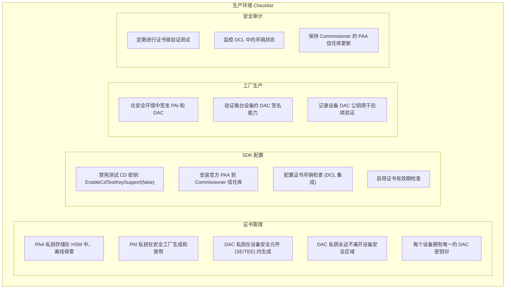

### 测试 vs 生产环境差异

| 项目 | 测试/开发 | 生产 |
|------|-----------|------|
| PAA | SDK 测试 PAA | CSA 官方 PAA 或私有 PAA |
| CD 签名 | SDK 测试密钥 | CSA 官方 CD 签名密钥 |
| EnableCdTestKeySupport | true | **false** |
| DAC 私钥 | 可导出 (方便调试) | 不可导出 (SE/TEE) |
| 证书有效期 | 较长 (方便测试) | 符合规范要求 |
| 吊销检查 | 可选 | 必须启用 |

---

## 21. 常见问题与排查

### FAQ

**Q1: 设备报告 "kPaiMissing" 错误**

A: 确保设备端的 `GetProductAttestationIntermediateCert()` 返回有效的 PAI 证书。检查：
- 固件中是否嵌入了 PAI 证书
- 证书编码是否为正确的 DER 格式
- 证书长度是否正确

**Q2: Commissioner 找不到 PAA**

A: 检查：
- PAI 证书中的 AKID (Authority Key Identifier)
- Commissioner 的 PAA 信任库是否包含匹配的 PAA
- PAA 证书的 SKID 是否与 PAI 的 AKID 一致

**Q3: VID/PID 不匹配**

A: 确保证书链中所有证书的 VID 一致：
- PAA 中的 VID
- PAI 中的 VID (必须 = PAA.VID)
- DAC 中的 VID (必须 = PAI.VID)
- Basic Information Cluster 报告的 VID (必须 = DAC.VID)

PID 也需要保持一致（如果证书中包含）。

**Q4: Attestation Signature 验证失败**

A: 检查设备端签名逻辑：
- 是否正确使用了 DAC 私钥
- 签名消息是否正确构造：`SHA256(attestation_elements || attestation_challenge)`
- Nonce 是否正确包含在 attestation_elements 中

**Q5: CD 验证失败**

A: 检查：
- CD 是否使用 CSA 官方密钥签名（非测试密钥）
- CD 中的 VID/PID 是否与 DAC 一致
- CD 是否在有效期内
- 如果 CD 指定了允许的 PAA，验证 PAA 是否匹配

### 调试工具

```bash
# 使用 Matter SDK 工具解析证书
./chip-cert dump-cert --input dac_cert.der --format pem

# 提取证书中的 VID/PID
./chip-cert dump-cert --input dac_cert.der --show-extensions

# 验证证书链
./chip-cert validate-chain --dac dac_cert.der --pai pai_cert.der --paa paa_cert.der
```

---

## 22. 总结

### 核心要点回顾

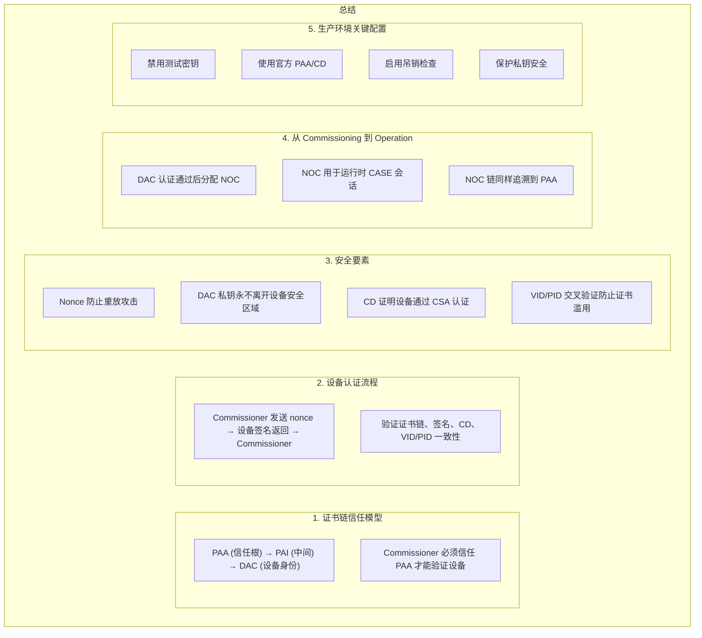

### Matter 安全认证的价值

- **互操作性**: 所有 Matter 设备遵循统一的安全标准
- **用户信任**: CSA 认证确保设备符合安全要求
- **防伪造**: 证书链机制使伪造设备无法通过认证
- **可吊销**: 问题设备可通过 DCL 吊销其证书

---

## 23. Q&A

### 常见问题讨论

1. **私有 PAA vs CSA PAA 的选择？**
   - 公开生态：使用 CSA PAA
   - 封闭生态：可使用私有 PAA（但设备只能在私有生态内互操作）

2. **DAC 私钥泄漏怎么办？**
   - 立即将该 DAC 加入吊销列表 (DCL)
   - 重新签发新的 DAC 证书（如果设备支持）

3. **证书过期如何处理？**
   - Matter 规范支持证书更新机制
   - 需要在证书过期前通过 Commissioner 更新

4. **性能影响？**
   - 证书链验证在 Commissioning 阶段执行一次
   - 运行时使用 NOC 进行 CASE 会话，无需重复 DAC 验证

---

## 24. 参考资料

### Spec 文档

- Matter Core Specification v1.5
  - Chapter 11: Security and Authentication
  - Section 11.22: Device Attestation
  - Section 11.22.5: Attestation Request/Response
  - Section 11.22.6: NOCSR Request/Response

- Matter Application Cluster Specification
  - Basic Information Cluster (VID/PID)

### CSA 文档

- CSA Certification Policy
- Distributed Compliance Ledger (DCL) 文档

### SDK 参考

```
Matter SDK 代码路径:
├── src/credentials/
│   ├── attestation_verifier/
│   │   ├── DeviceAttestationVerifier.h/cpp       # 验证器接口
│   │   ├── DefaultDeviceAttestationVerifier.cpp   # 默认实现
│   │   └── DeviceAttestationDelegate.h            # 委托接口
│   ├── DeviceAttestationCredsProvider.h/cpp       # Provider 接口
│   ├── DeviceAttestationConstructor.h/cpp         # TLV 构造/解析
│   ├── CHIPCert.h/cpp                             # 证书核心实现
│   ├── CertificationDeclaration.h/cpp             # CD 处理
│   └── FabricTable.h/cpp                          # Fabric 管理
│
├── src/protocols/secure_channel/
│   ├── CASESession.cpp                            # CASE 协议实现
│   └── PASESession.cpp                            # PASE 协议实现
│
└── src/controller/
    └── OperationalCredentialsDelegate.h           # Controller 端委托
```

### 在线资源

- Matter GitHub: https://github.com/project-chip/connectedhomeip
- Matter 规范文档 (CSA 成员可下载)
- CSA 开发者门户

---

## 25. 附录：关键 Spec 章节

### Spec 章节对应关系

| 主题 | Spec 章节 | 说明 |
|------|-----------|------|
| 设备认证概述 | 11.22 Device Attestation | 概述、要求、流程 |
| Attestation Request | 11.22.5.1 | 请求格式、nonce 要求 |
| Attestation Response | 11.22.5.2 | 响应格式、证书链 |
| Attestation Elements | 11.22.5.3 | TLV 结构、签名 |
| Certification Declaration | 11.22.5.4 | CD 格式、验证 |
| CSR Request/Response | 11.22.5.5-6 | NOCSR 流程 |
| 操作证书分配 | 11.22.6 | AddNOC 流程 |
| 证书格式要求 | 11.22.7 | X.509 扩展要求 |
| PAA 信任模型 | 11.22.8 | 信任根管理 |
| 安全考虑 | 11.22.9 | 攻击缓解措施 |
| Basic Information Cluster | Cluster Spec | VID/PID 报告 |

### 关键 OID 定义

```
Matter 特定 OID (1.3.6.1.4.1.37244.x):

1.3.6.1.4.1.37244.1.1  - Vendor ID (在证书中)
1.3.6.1.4.1.37244.1.2  - Product ID (在证书中)
1.3.6.1.4.1.37244.1.3  - Security Level
1.3.6.1.4.1.37244.1.4  - Product URL
1.3.6.1.4.1.37244.1.5  - Product Name
1.3.6.1.4.1.37244.1.6  - Product Label
1.3.6.1.4.1.37244.1.7  - Serial Number
1.3.6.1.4.1.37244.1.8  - Revision Number

1.3.6.1.4.1.37244.2.1  - Fabric ID (NOC 中)
1.3.6.1.4.1.37244.2.2  - Node ID (NOC 中)
1.3.6.1.4.1.37244.2.3  - CASE Auth Tags (NOC 中)
```

---

## 结束语

通过本次分享，希望大家对 Matter 的 PAI/DAC 安全认证机制有了深入理解：

1. **理解证书链模型**：PAA → PAI → DAC 的信任传递
2. **掌握认证流程**：从 Attestation Request/Response 到 NOC 分配
3. **熟悉 SDK 实现**：Provider/Verifier 架构与关键代码
4. **能够调试问题**：日志分析、错误码排查
5. **了解生产要求**：安全配置、密钥管理、吊销机制

**安全是 Matter 的核心基石，正确实现设备认证是构建可信物联网的基础。**

---

*文档版本: v1.0*  
*基于 Matter Core Specification v1.5*  
*SDK 版本: Matter SDK (connectedhomeip)*
