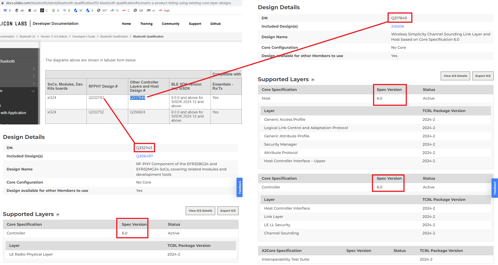

# How to check Bluetooth core specification version for Silabs Device
## Check Silabs custom version by SDK
```c
//SSv5, v10.1.1
Name: Simplicity SDK Suite v2025.6.2: Bluetooth 10.1.1, Bluetooth Mesh 9.0.2, Connect 4.1.2, EmberZNet 8.2.2.0, Micrium OS Kernel 5.18.01, OpenThread 2.7.2.0 (GitHub-fb0446f53), Platform 5.2.2.0, RAIL 2.19.2, Silicon Labs Matter 2.7.0-1.4, USB 1.5.1.0, Wi-SUN 2.8.0, Z-Wave SDK 7.24.2.0
Version: 2025.6.2
```
## Check  Silabs custom vesoin on log
### Code
```c
//third_party/matter_sdk/src/platform/silabs/efr32/BLEManagerImpl.cpp
void BLEManagerImpl::ParseEvent(volatile sl_bt_msg_t * evt)
{
    // As this is running in a separate thread, and we determined this is a matter related event,
    // we need to block CHIP from operating, until the events are handled.
    // Todo: Move inside the MatteroBLE channel once created and verify if lock is necessary for other channels
    // Ideally at this level we just want to pick the channel and the each channel can have its own switch case
    chip::DeviceLayer::PlatformMgr().LockChipStack();

    switch (SL_BT_MSG_ID(evt->header))
    {
    case sl_bt_evt_system_boot_id: {
        ChipLogProgress(DeviceLayer, "Bluetooth stack booted: v%d.%d.%d-b%d", evt->data.evt_system_boot.major,
                        evt->data.evt_system_boot.minor, evt->data.evt_system_boot.patch, evt->data.evt_system_boot.build);
        HandleBootEvent();

        RAIL_Version_t railVer;
        RAIL_GetVersion(&railVer, true);
        ChipLogProgress(DeviceLayer, "RAIL version:, v%d.%d.%d-b%d", railVer.major, railVer.minor, railVer.rev, railVer.build);
        sl_bt_connection_set_default_parameters(BLE_CONFIG_MIN_INTERVAL, BLE_CONFIG_MAX_INTERVAL, BLE_CONFIG_LATENCY,
                                                BLE_CONFIG_TIMEOUT, BLE_CONFIG_MIN_CE_LENGTH, BLE_CONFIG_MAX_CE_LENGTH);
    }
    break;
    //...
}
```
### Log
```c
//SSv6, v11.0.0
[00:00:00.067][info  ][DL] Starting scheduler
[00:00:00.067][info  ][DL] ==================================================
[00:00:00.067][info  ][DL]  starting
[00:00:00.067][info  ][DL] ==================================================
[00:00:00.068][info  ][DL] Init CHIP Stack
[00:00:00.069][info  ][DL] Provision mode disabled
[00:00:00.069][info  ][DL] Initializing OpenThread stack
[00:00:00.070][info  ][DL] OpenThread started: OK
[00:00:00.070][info  ][DL] Setting OpenThread device type to SLEEPY END DEVICE
[00:00:00.119][info  ][DL] Bluetooth stack booted: v11.0.0-b0
[00:00:00.119][info  ][DL] RAIL version:, v3.0.0-b0
```
## Check Core Spec Version frome Release Note
```c
https://docs.silabs.com/bluetooth/10.1.1/sisdk-bt-release-notes/

Bluetooth LE Version 10.1.1 (September 24, 2025) - Release Notes
Simplicity SDK Version 2025.6.2

Silicon Labs is a leading vendor in Bluetooth hardware and software technologies, used in products such as sports and fitness, consumer electronics, beacons, and smart home applications. The core SDK is an advanced Bluetooth 6.0-compliant stack that provides all of the core functionality along with multiple API to simplify development. The core functionality offers both standalone mode, allowing a developer to create and run their application directly on the SoC, or in NCP mode allowing for the use of an external host MCU.
```
```c
https://docs.silabs.com/bluetooth/11.0.0/sisdk-bt-release-notes/

Bluetooth LE Version 11.0.0 - Release Notes (Jan 22, 2026)
Simplicity SDK Version 2025.12.0

Silicon Labs is a leading vendor in Bluetooth hardware and software technologies, used in products such as sports and fitness, consumer electronics, beacons, and smart home applications. The core SDK is an advanced Bluetooth 6.1-compliant stack that provides all of the core functionality along with multiple API to simplify development. The core functionality offers both standalone mode, allowing a developer to create and run their application directly on the SoC, or NCP mode, allowing for the use of an external host MCU.
```
# BQB DN/QDID
Got information from [bluetooth-qualification](https://docs.silabs.com/bluetooth/latest/bluetooth-qualification/02-bluetooth-qualification#scenario-a-product-listing-using-existing-core-layer-designs)  

|Bluetooth SDK Version and Hardware Part (if any)|Core-Host Configuration Design or Core-Controller Configuration Design|DN|
| -- | -- | -- |
|V11.0.0 and above|Core-Host Configuration Design (Bluetooth 6.1)|Qualified Design details: [Q375690](https://qualification.bluetooth.com/ListingDetails/316168)|
|V9.0.0.0 and above with xG27 / xG29|Core-Controller Configuration Design (Bluetooth 6.0)|Qualified Design details: [Q375771](https://qualification.bluetooth.com/ListingDetails/316281)|

|SoCs, Modules, Dev. Kits boards	|RFPHY Design #	|Other Controller Layers and Host Design #	|BLE SDK version and SiSDK	|
| -- | -- | -- | -- |
|xG24	|[Q332743](https://qualification.bluetooth.com/ListingDetails/258839)	|[Q317849](https://qualification.bluetooth.com/ListingDetails/240988)	|9.0.0 and above for SiSDK 2024.12 and above|
|xG24	|[Q332752](https://qualification.bluetooth.com/ListingDetails/258859)	|[Q359924](https://qualification.bluetooth.com/ListingDetails/292660)	|9.0.0 and above for SiSDK 2024.12 and above|

## xg24 device DN and specification version
<div align="center">
  
</div>

