# 1 act
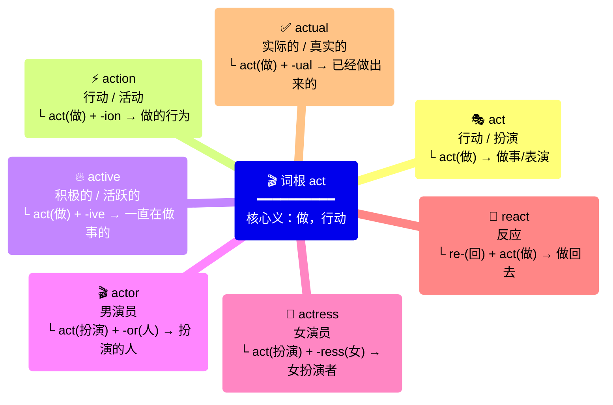
```mermaid
mindmap
  root("🎬 词根 act<br>━━━━━━━━━━<br>核心义：做，行动")
    act("🎭 act<br>行动 / 扮演<br>└ act(做) → 做事/表演")
    action("⚡ action<br>行动 / 活动<br>└ act(做) + -ion → 做的行为")
    active("🔥 active<br>积极的 / 活跃的<br>└ act(做) + -ive → 一直在做事的")
    actor("🎬 actor<br>男演员<br>└ act(扮演) + -or(人) → 扮演的人")
    actress("👩 actress<br>女演员<br>└ act(扮演) + -ress(女) → 女扮演者")
    react("🔄 react<br>反应<br>└ re-(回) + act(做) → 做回去")
    actual("✅ actual<br>实际的 / 真实的<br>└ act(做) + -ual → 已经做出来的")
```    
# 2 vid/vis
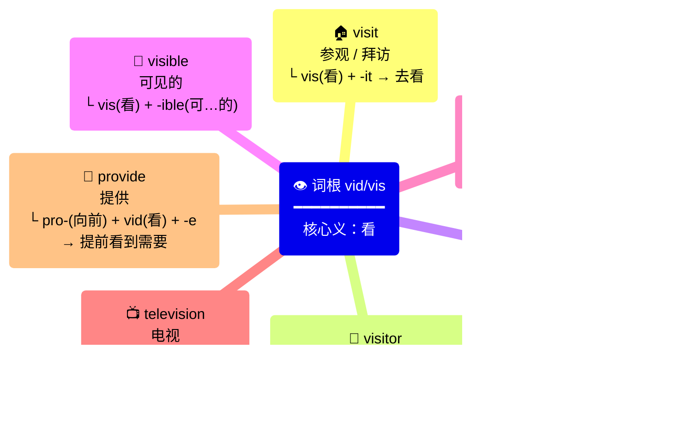
```mermaid
mindmap
  root("👁️ 词根 vid/vis<br>━━━━━━━━━━<br>核心义：看")
    visit("🏠 visit<br>参观 / 拜访<br>└ vis(看) + -it → 去看")
    visitor("🚶 visitor<br>访客 / 参观者<br>└ visit + -or(人) → 来参观的人")
    vision("👀 vision<br>视力 / 视野<br>└ vis(看) + -ion → 看的能力")
    visible("🔆 visible<br>可见的<br>└ vis(看) + -ible(可…的)")
    invisible("👻 invisible<br>看不见的<br>└ in-(不) + visible")
    television("📺 television<br>电视<br>└ tele(远) + vision(看)")
    provide("🎁 provide<br>提供<br>└ pro-(向前) + vid(看) + -e → 提前看到需要")
```
# 3 dict
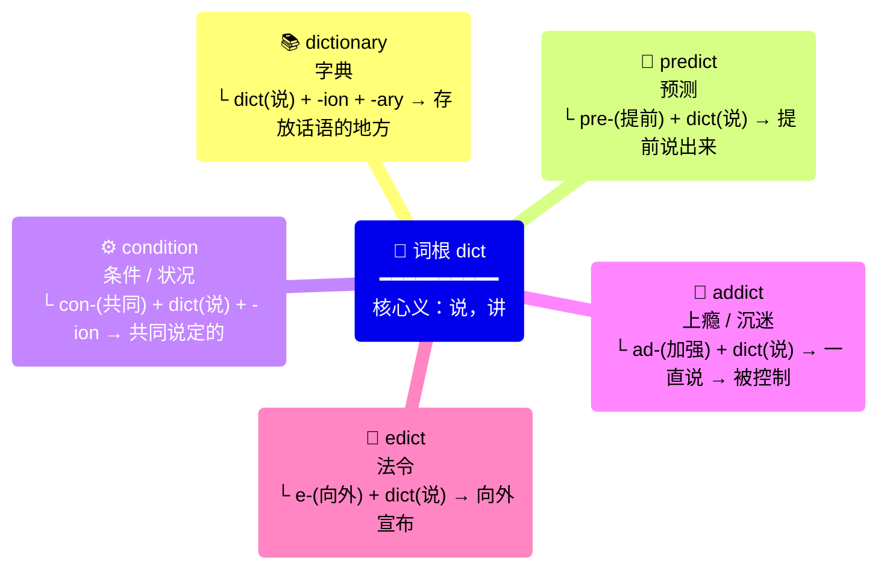
```mermaid
mindmap
  root("📖 词根 dict<br>━━━━━━━━━━<br>核心义：说，讲")
    dictionary("📚 dictionary<br>字典<br>└ dict(说) + -ion + -ary → 存放话语的地方")
    predict("🔮 predict<br>预测<br>└ pre-(提前) + dict(说) → 提前说出来")
    condition("⚙️ condition<br>条件 / 状况<br>└ con-(共同) + dict(说) + -ion → 共同说定的")
    addict("💉 addict<br>上瘾 / 沉迷<br>└ ad-(加强) + dict(说) → 一直说 → 被控制")
    edict("📜 edict<br>法令<br>└ e-(向外) + dict(说) → 向外宣布")
```
# 4 port
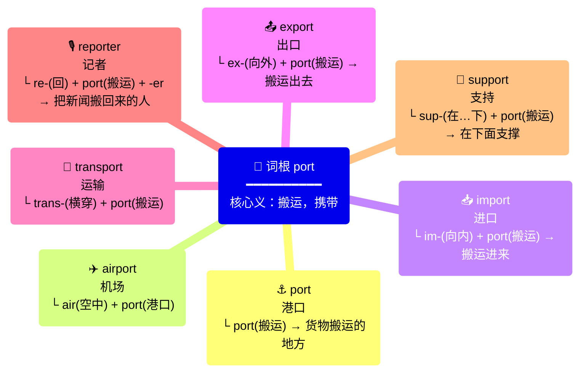
```mermaid
mindmap
  root("🚢 词根 port<br>━━━━━━━━━━<br>核心义：搬运，携带")
    port("⚓ port<br>港口<br>└ port(搬运) → 货物搬运的地方")
    airport("✈️ airport<br>机场<br>└ air(空中) + port(港口)")
    import("📥 import<br>进口<br>└ im-(向内) + port(搬运) → 搬运进来")
    export("📤 export<br>出口<br>└ ex-(向外) + port(搬运) → 搬运出去")
    transport("🚚 transport<br>运输<br>└ trans-(横穿) + port(搬运)")
    reporter("🎙️ reporter<br>记者<br>└ re-(回) + port(搬运) + -er → 把新闻搬回来的人")
    support("🤝 support<br>支持<br>└ sup-(在…下) + port(搬运) → 在下面支撑")
```    
# 5 spect
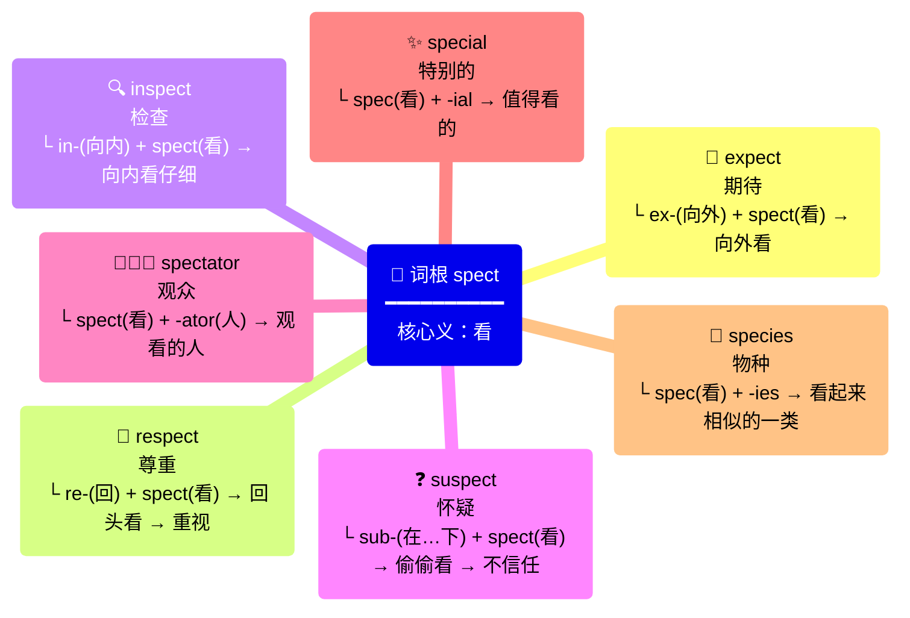
```mermaid 
mindmap
  root("🔭 词根 spect<br>━━━━━━━━━━<br>核心义：看")
    expect("🤔 expect<br>期待<br>└ ex-(向外) + spect(看) → 向外看")
    respect("🙏 respect<br>尊重<br>└ re-(回) + spect(看) → 回头看 → 重视")
    inspect("🔍 inspect<br>检查<br>└ in-(向内) + spect(看) → 向内看仔细")
    suspect("❓ suspect<br>怀疑<br>└ sub-(在…下) + spect(看) → 偷偷看 → 不信任")
    spectator("👨‍👩‍👧 spectator<br>观众<br>└ spect(看) + -ator(人) → 观看的人")
    special("✨ special<br>特别的<br>└ spec(看) + -ial → 值得看的")
    species("🐾 species<br>物种<br>└ spec(看) + -ies → 看起来相似的一类")
```
# 6 fer

```mermaid
mindmap
  root("🎁 词根 fer<br>━━━━━━━━━━<br>核心义：携带，拿取")
    offer("🤲 offer<br>提供<br>└ of-(向) + fer(携带) → 带到面前")
    transfer("🔄 transfer<br>转移<br>└ trans-(横穿) + fer(携带) → 携带过去")
    prefer("❤️ prefer<br>更喜欢<br>└ pre-(向前) + fer(拿取) → 往前拿 → 优先选择")
    different("🌈 different<br>不同的<br>└ dif-(分开) + fer(携带) + -ent → 分开携带的")
    refer("📖 refer<br>提及 / 参考<br>└ re-(回) + fer(携带) → 带回去 → 查阅")
    ferry("⛴️ ferry<br>渡船<br>└ fer(携带) + -y → 把人/车带过河的船")
```
# 7 gress
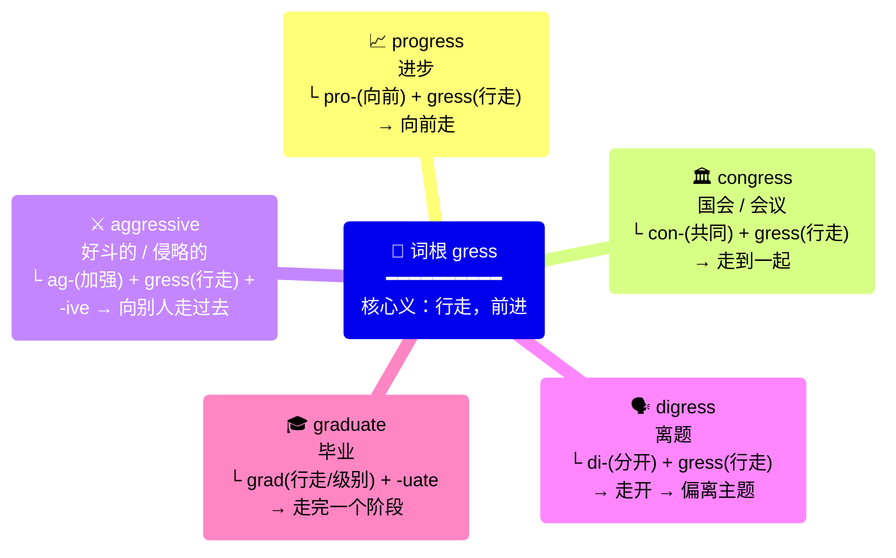
```mermaid
mindmap
  root("🚶 词根 gress<br>━━━━━━━━━━<br>核心义：行走，前进")
    progress("📈 progress<br>进步<br>└ pro-(向前) + gress(行走) → 向前走")
    congress("🏛️ congress<br>国会 / 会议<br>└ con-(共同) + gress(行走) → 走到一起")
    aggressive("⚔️ aggressive<br>好斗的 / 侵略的<br>└ ag-(加强) + gress(行走) + -ive → 向别人走过去")
    digress("🗣️ digress<br>离题<br>└ di-(分开) + gress(行走) → 走开 → 偏离主题")
    graduate("🎓 graduate<br>毕业<br>└ grad(行走/级别) + -uate → 走完一个阶段")
```
# 8 ject
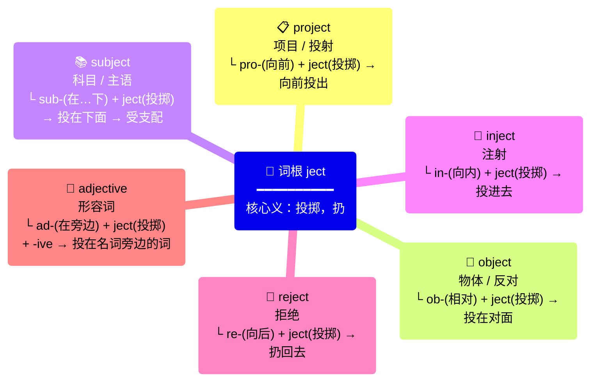
```mermaid
mindmap
  root("🎯 词根 ject<br>━━━━━━━━━━<br>核心义：投掷，扔")
    project("📋 project<br>项目 / 投射<br>└ pro-(向前) + ject(投掷) → 向前投出")
    object("🎯 object<br>物体 / 反对<br>└ ob-(相对) + ject(投掷) → 投在对面")
    subject("📚 subject<br>科目 / 主语<br>└ sub-(在…下) + ject(投掷) → 投在下面 → 受支配")
    inject("💉 inject<br>注射<br>└ in-(向内) + ject(投掷) → 投进去")
    reject("🚫 reject<br>拒绝<br>└ re-(向后) + ject(投掷) → 扔回去")
    adjective("📝 adjective<br>形容词<br>└ ad-(在旁边) + ject(投掷) + -ive → 投在名词旁边的词")
```
# 9 scrib/script
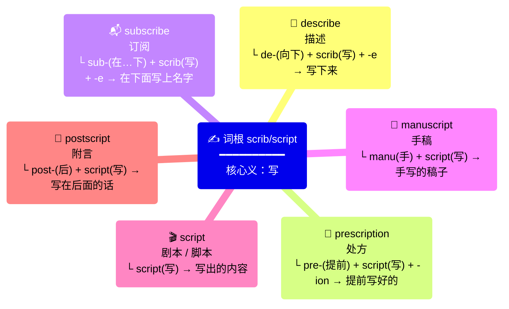
```mermaid
mindmap
  root("✍️ 词根 scrib/script<br>━━━━━━━━━━<br>核心义：写")
    describe("📝 describe<br>描述<br>└ de-(向下) + scrib(写) + -e → 写下来")
    prescription("💊 prescription<br>处方<br>└ pre-(提前) + script(写) + -ion → 提前写好的")
    subscribe("📬 subscribe<br>订阅<br>└ sub-(在…下) + scrib(写) + -e → 在下面写上名字")
    manuscript("📜 manuscript<br>手稿<br>└ manu(手) + script(写) → 手写的稿子")
    script("🎬 script<br>剧本 / 脚本<br>└ script(写) → 写出的内容")
    postscript("📎 postscript<br>附言<br>└ post-(后) + script(写) → 写在后面的话")
```
# 10 duc/duct

```mermaid
mindmap
  root("🧭 词根 duc/duct<br>━━━━━━━━━━<br>核心义：引导，带领")
    introduce("👋 introduce<br>介绍<br>└ intro-(向内) + duc(引导) + -e → 引进")
    produce("🏭 produce<br>生产<br>└ pro-(向前) + duc(引导) + -e → 向前引导出")
    reduce("📉 reduce<br>减少<br>└ re-(向后) + duc(引导) + -e → 向后引")
    conduct("🎼 conduct<br>进行 / 指挥<br>└ con-(一起) + duct(引导) → 引导大家一起做")
    education("📚 education<br>教育<br>└ e-(向外) + duc(引导) + -ation → 把潜能引导出来")
    product("📦 product<br>产品<br>└ pro-(向前) + duct(引导) → 被引导出来的东西")
```
# 11 pos
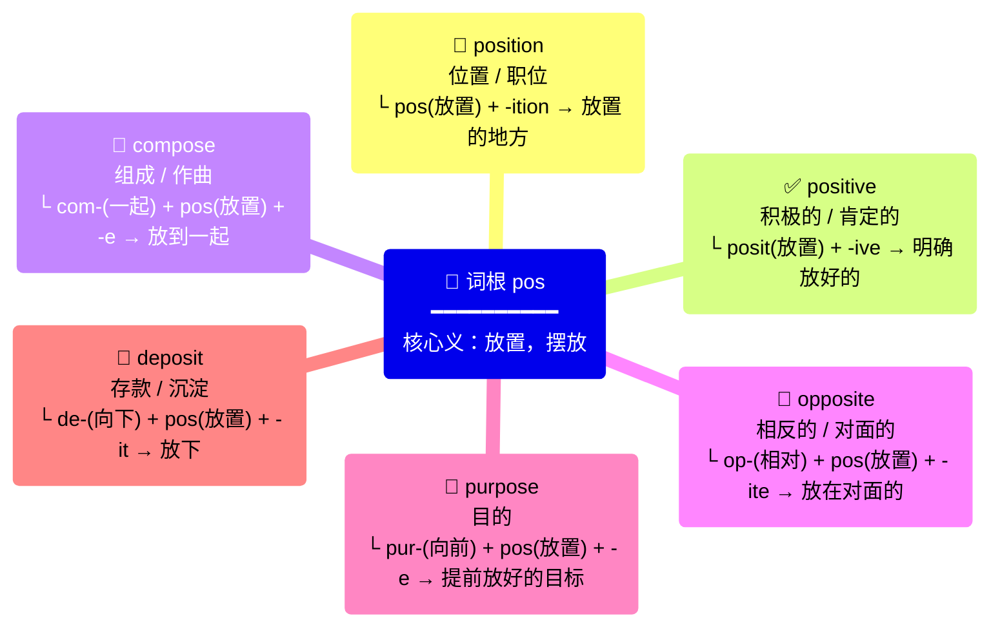
```mermaid
mindmap
  root("📍 词根 pos<br>━━━━━━━━━━<br>核心义：放置，摆放")
    position("💺 position<br>位置 / 职位<br>└ pos(放置) + -ition → 放置的地方")
    positive("✅ positive<br>积极的 / 肯定的<br>└ posit(放置) + -ive → 明确放好的")
    compose("🎵 compose<br>组成 / 作曲<br>└ com-(一起) + pos(放置) + -e → 放到一起")
    opposite("🔄 opposite<br>相反的 / 对面的<br>└ op-(相对) + pos(放置) + -ite → 放在对面的")
    purpose("🎯 purpose<br>目的<br>└ pur-(向前) + pos(放置) + -e → 提前放好的目标")
    deposit("🏦 deposit<br>存款 / 沉淀<br>└ de-(向下) + pos(放置) + -it → 放下")
```
# 12 sens/sent
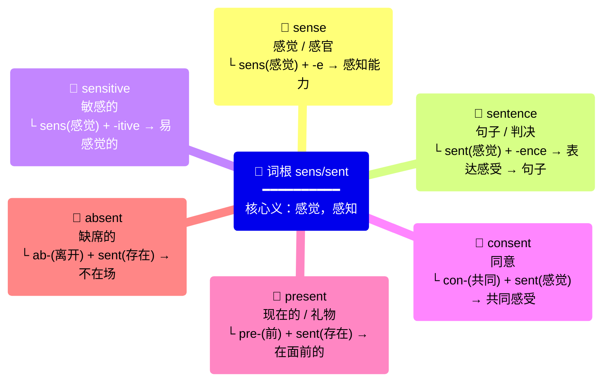
```mermaid
mindmap
  root("💭 词根 sens/sent<br>━━━━━━━━━━<br>核心义：感觉，感知")
    sense("🧠 sense<br>感觉 / 感官<br>└ sens(感觉) + -e → 感知能力")
    sentence("📝 sentence<br>句子 / 判决<br>└ sent(感觉) + -ence → 表达感受 → 句子")
    sensitive("🌸 sensitive<br>敏感的<br>└ sens(感觉) + -itive → 易感觉的")
    consent("🤝 consent<br>同意<br>└ con-(共同) + sent(感觉) → 共同感受")
    present("🎁 present<br>现在的 / 礼物<br>└ pre-(前) + sent(存在) → 在面前的")
    absent("🏃 absent<br>缺席的<br>└ ab-(离开) + sent(存在) → 不在场")
```
# 13 ven
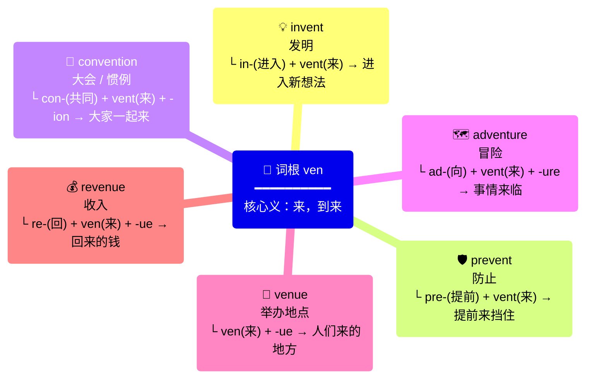
```mermaid
mindmap
  root("🚪 词根 ven<br>━━━━━━━━━━<br>核心义：来，到来")
    invent("💡 invent<br>发明<br>└ in-(进入) + vent(来) → 进入新想法")
    prevent("🛡️ prevent<br>防止<br>└ pre-(提前) + vent(来) → 提前来挡住")
    convention("🏢 convention<br>大会 / 惯例<br>└ con-(共同) + vent(来) + -ion → 大家一起来")
    adventure("🗺️ adventure<br>冒险<br>└ ad-(向) + vent(来) + -ure → 事情来临")
    venue("📍 venue<br>举办地点<br>└ ven(来) + -ue → 人们来的地方")
    revenue("💰 revenue<br>收入<br>└ re-(回) + ven(来) + -ue → 回来的钱")
```
# 14 vert/vers
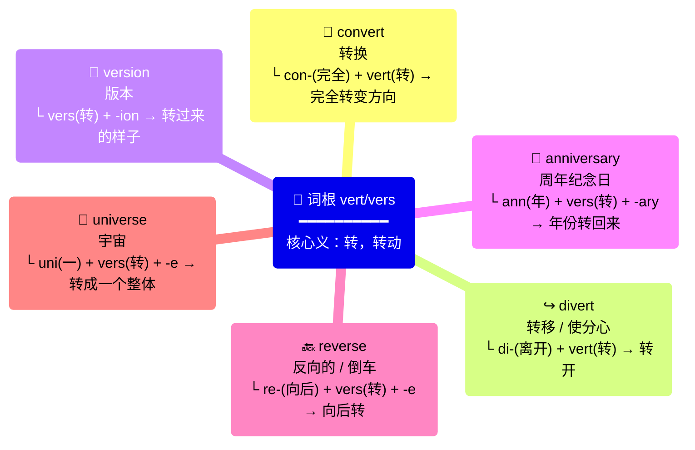
```mermaid
mindmap
  root("🔄 词根 vert/vers<br>━━━━━━━━━━<br>核心义：转，转动")
    convert("🔄 convert<br>转换<br>└ con-(完全) + vert(转) → 完全转变方向")
    divert("↪️ divert<br>转移 / 使分心<br>└ di-(离开) + vert(转) → 转开")
    version("📄 version<br>版本<br>└ vers(转) + -ion → 转过来的样子")
    anniversary("🎉 anniversary<br>周年纪念日<br>└ ann(年) + vers(转) + -ary → 年份转回来")
    reverse("🔙 reverse<br>反向的 / 倒车<br>└ re-(向后) + vers(转) + -e → 向后转")
    universe("🌌 universe<br>宇宙<br>└ uni(一) + vers(转) + -e → 转成一个整体")
```
# 15 tend/tens
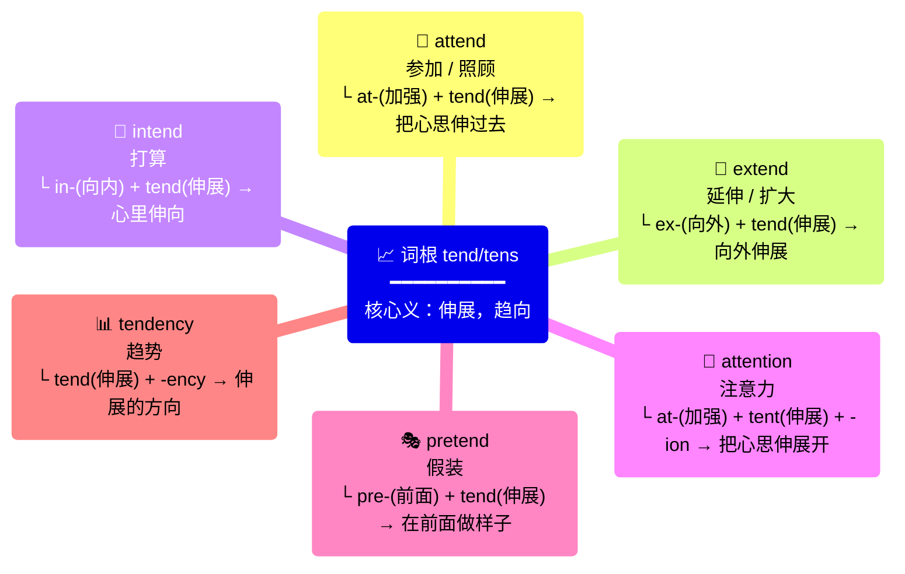
```mermaid
mindmap
  root("📈 词根 tend/tens<br>━━━━━━━━━━<br>核心义：伸展，趋向")
    attend("👥 attend<br>参加 / 照顾<br>└ at-(加强) + tend(伸展) → 把心思伸过去")
    extend("📏 extend<br>延伸 / 扩大<br>└ ex-(向外) + tend(伸展) → 向外伸展")
    intend("🎯 intend<br>打算<br>└ in-(向内) + tend(伸展) → 心里伸向")
    attention("👀 attention<br>注意力<br>└ at-(加强) + tent(伸展) + -ion → 把心思伸展开")
    pretend("🎭 pretend<br>假装<br>└ pre-(前面) + tend(伸展) → 在前面做样子")
    tendency("📊 tendency<br>趋势<br>└ tend(伸展) + -ency → 伸展的方向")
```
# 16 ceed/cess
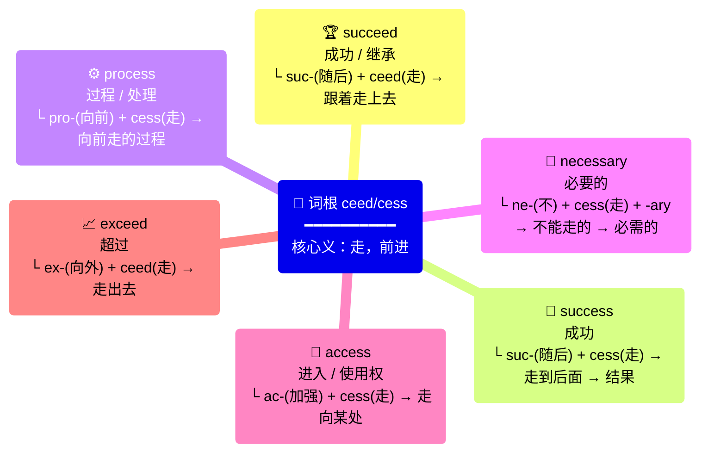
```mermaid
mindmap
  root("🚀 词根 ceed/cess<br>━━━━━━━━━━<br>核心义：走，前进")
    succeed("🏆 succeed<br>成功 / 继承<br>└ suc-(随后) + ceed(走) → 跟着走上去")
    success("🎉 success<br>成功<br>└ suc-(随后) + cess(走) → 走到后面 → 结果")
    process("⚙️ process<br>过程 / 处理<br>└ pro-(向前) + cess(走) → 向前走的过程")
    necessary("🔑 necessary<br>必要的<br>└ ne-(不) + cess(走) + -ary → 不能走的 → 必需的")
    access("🚪 access<br>进入 / 使用权<br>└ ac-(加强) + cess(走) → 走向某处")
    exceed("📈 exceed<br>超过<br>└ ex-(向外) + ceed(走) → 走出去")
```
# 17 mit/miss
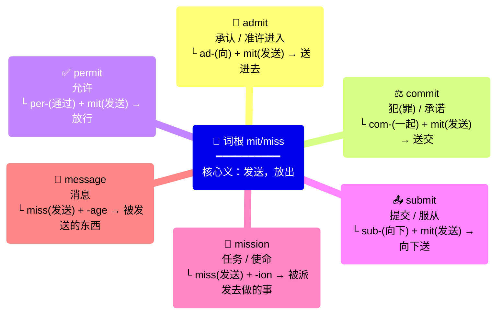
```mermaid
mindmap
  root("📨 词根 mit/miss<br>━━━━━━━━━━<br>核心义：发送，放出")
    admit("🚪 admit<br>承认 / 准许进入<br>└ ad-(向) + mit(发送) → 送进去")
    commit("⚖️ commit<br>犯(罪) / 承诺<br>└ com-(一起) + mit(发送) → 送交")
    permit("✅ permit<br>允许<br>└ per-(通过) + mit(发送) → 放行")
    submit("📤 submit<br>提交 / 服从<br>└ sub-(向下) + mit(发送) → 向下送")
    mission("🎯 mission<br>任务 / 使命<br>└ miss(发送) + -ion → 被派发去做的事")
    message("💬 message<br>消息<br>└ miss(发送) + -age → 被发送的东西")
```
# 18 sta/stit
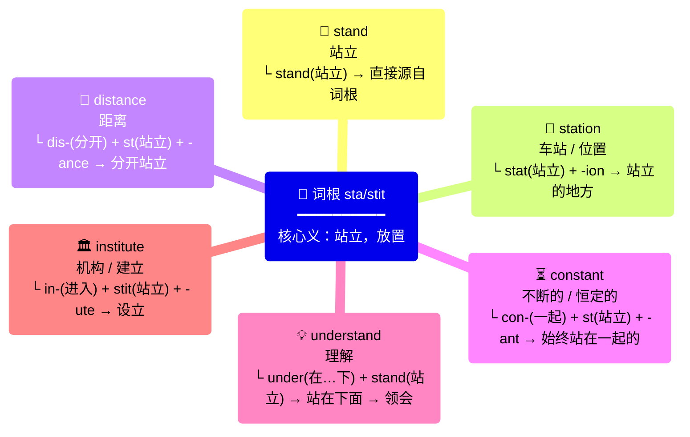
```mermaid
mindmap
  root("🧍 词根 sta/stit<br>━━━━━━━━━━<br>核心义：站立，放置")
    stand("🧍 stand<br>站立<br>└ stand(站立) → 直接源自词根")
    station("🚉 station<br>车站 / 位置<br>└ stat(站立) + -ion → 站立的地方")
    distance("📏 distance<br>距离<br>└ dis-(分开) + st(站立) + -ance → 分开站立")
    constant("⏳ constant<br>不断的 / 恒定的<br>└ con-(一起) + st(站立) + -ant → 始终站在一起的")
    understand("💡 understand<br>理解<br>└ under(在…下) + stand(站立) → 站在下面 → 领会")
    institute("🏛️ institute<br>机构 / 建立<br>└ in-(进入) + stit(站立) + -ute → 设立")
```
# 19 pel
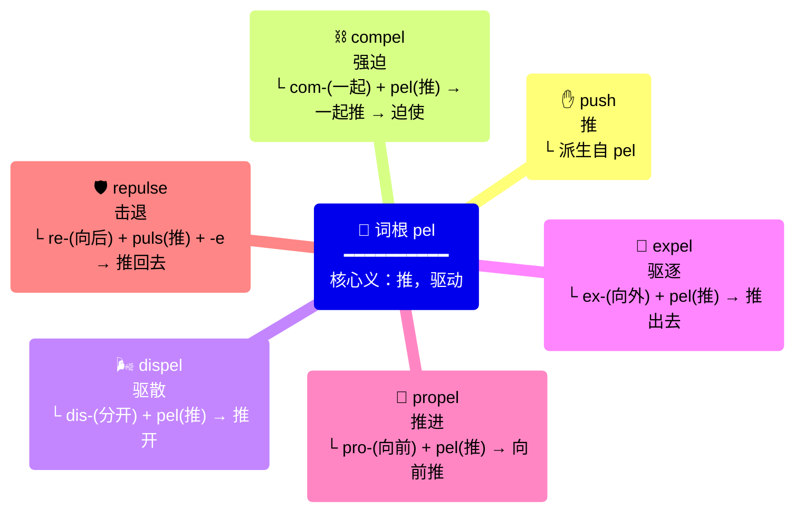
```mermaid
mindmap
  root("👊 词根 pel<br>━━━━━━━━━━<br>核心义：推，驱动")
    push("✋ push<br>推<br>└ 派生自 pel")
    compel("⛓️ compel<br>强迫<br>└ com-(一起) + pel(推) → 一起推 → 迫使")
    dispel("🌬️ dispel<br>驱散<br>└ dis-(分开) + pel(推) → 推开")
    expel("🚪 expel<br>驱逐<br>└ ex-(向外) + pel(推) → 推出去")
    propel("🚀 propel<br>推进<br>└ pro-(向前) + pel(推) → 向前推")
    repulse("🛡️ repulse<br>击退<br>└ re-(向后) + puls(推) + -e → 推回去")
```
# 20 viv/vit
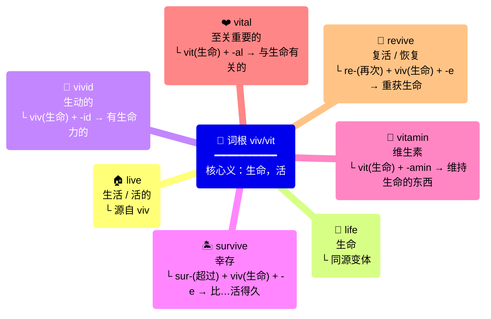
```mermaid
mindmap
  root("🌱 词根 viv/vit<br>━━━━━━━━━━<br>核心义：生命，活")
    live("🏠 live<br>生活 / 活的<br>└ 源自 viv")
    life("🌿 life<br>生命<br>└ 同源变体")
    vivid("🎨 vivid<br>生动的<br>└ viv(生命) + -id → 有生命力的")
    survive("🏝️ survive<br>幸存<br>└ sur-(超过) + viv(生命) + -e → 比…活得久")
    vitamin("💊 vitamin<br>维生素<br>└ vit(生命) + -amin → 维持生命的东西")
    vital("❤️ vital<br>至关重要的<br>└ vit(生命) + -al → 与生命有关的")
    revive("🔄 revive<br>复活 / 恢复<br>└ re-(再次) + viv(生命) + -e → 重获生命")
```
# 21 cur / curs
```mermaid
mindmap
  root("🏃 词根 cur/curs<br>━━━━━━━━━━<br>核心义：跑，流动")
    current("⚡ current<br>当前的 / 电流<br>└ cur(跑) + -ent → 正在跑的")
    course("🗺️ course<br>课程 / 路线<br>└ curs(跑) + -e → 跑的路")
    occur("💥 occur<br>发生<br>└ oc-(加强) + cur(跑) → 跑出来 → 出现")
    currency("💰 currency<br>货币<br>└ cur(跑) + -ency → 流通的东西")
    cursor("🖱️ cursor<br>光标<br>└ curs(跑) + -or → 跑来跑去的指示器")
```
# 22 fac/fact
```mermaid
mindmap
  root("🏭 词根 fac/fact<br>━━━━━━━━━━<br>核心义：做，制造")
    fact("📊 fact<br>事实<br>└ fact(做) → 做出来的事情")
    factory("🏭 factory<br>工厂<br>└ fact(做) + -ory(场所) → 制造东西的地方")
    affect("💔 affect<br>影响<br>└ af-(向) + fect(做) → 对…起作用")
    effect("✨ effect<br>效果<br>└ ef-(向外) + fect(做) → 做出来的结果")
    perfect("⭐ perfect<br>完美的<br>└ per-(完全) + fect(做) → 完全做好的")
    difficult("🤯 difficult<br>困难的<br>└ dif-(不) + fic(做) + -ult → 不容易做的")
```
# 23 log/logue
```mermaid
mindmap
  root("💬 词根 log/logue<br>━━━━━━━━━━<br>核心义：说，言，科学")
    dialogue("🗣️ dialogue<br>对话<br>└ dia-(相互) + logue(说) → 互相说")
    apology("🙇 apology<br>道歉<br>└ apo-(离开) + log(说) + -y → 为离开而说")
    catalog("📑 catalog<br>目录<br>└ cata-(向下) + log(说) → 向下说清 → 列举")
    logic("🧠 logic<br>逻辑<br>└ log(说/理性) + -ic → 说话的条理性")
    biology("🔬 biology<br>生物学<br>└ bio(生命) + logy(科学) → 研究生命的科学")
    technology("💻 technology<br>技术<br>└ techno(技艺) + logy(科学) → 技艺的科学")
```
# 24 path
```mermaid
mindmap
  root("💖 词根 path<br>━━━━━━━━━━<br>核心义：感情，感觉，病")
    sympathy("🤝 sympathy<br>同情<br>└ sym-(共同) + path(感情) + -y → 有相同感情")
    patient("🏥 patient<br>病人 / 耐心的<br>└ path(忍受/病) + -ent → 忍受痛苦的人")
    passion("🔥 passion<br>激情<br>└ pass(感情) + -ion → 强烈的情感")
    pathetic("😢 pathetic<br>可怜的 / 可悲的<br>└ path(感情) + -etic → 引发怜悯感情的")
    pathology("🔬 pathology<br>病理学<br>└ path(病) + -ology(科学) → 研究疾病的科学")
```
# 25 ped
```mermaid
mindmap
  root("🦶 词根 ped<br>━━━━━━━━━━<br>核心义：脚，孩子")
    pedal("🚴 pedal<br>踏板<br>└ ped(脚) + -al → 脚踩的东西")
    pedestrian("🚶 pedestrian<br>行人<br>└ ped(脚) + -estrian → 用脚走路的人")
    expedition("🗺️ expedition<br>远征 / 探险<br>└ ex-(向外) + ped(脚) + -ition → 向外迈脚")
    impede("🚧 impede<br>阻碍<br>└ im-(向内) + ped(脚) + -e → 把脚伸进去 → 挡住")
    centipede("🐛 centipede<br>蜈蚣<br>└ centi(一百) + ped(脚) → 很多脚的虫")
```
# 26 press
```mermaid
mindmap
  root("👇 词根 press<br>━━━━━━━━━━<br>核心义：压，按")
    press("📰 press<br>压 / 按 / 新闻界<br>└ press(压) → 印刷机压制 → 新闻界")
    pressure("💨 pressure<br>压力<br>└ press(压) + -ure → 压迫的状态")
    express("💬 express<br>表达 / 快递<br>└ ex-(向外) + press(压) → 把想法压出来")
    impress("🌟 impress<br>给…留下印象<br>└ im-(向内) + press(压) → 压进心里")
    compress("🗜️ compress<br>压缩<br>└ com-(一起) + press(压) → 压到一起")
    depress("😔 depress<br>使沮丧 / 压低<br>└ de-(向下) + press(压) → 向下压")
    suppress("🚫 suppress<br>镇压 / 压制<br>└ sup-(向下) + press(压) → 压下去")
```
# 27 form
```mermaid
mindmap
  root("📐 词根 form<br>━━━━━━━━━━<br>核心义：形状，形成")
    form("📋 form<br>形式 / 表格<br>└ form(形状) → 形成的样子")
    formal("👔 formal<br>正式的<br>└ form(形式) + -al → 讲究形式的")
    informal("👕 informal<br>非正式的<br>└ in-(不) + formal")
    reform("🔄 reform<br>改革<br>└ re-(再次) + form(形成) → 重新形成")
    information("ℹ️ information<br>信息<br>└ in-(向内) + form(形成) + -ation → 形成内在认识")
    uniform("👖 uniform<br>制服<br>└ uni(单一) + form(形状) → 同一形状")
    platform("🎤 platform<br>平台<br>└ plat(平) + form(形状) → 平的形状")
```
# 28 pend/pens
```mermaid
mindmap
  root("⏳ 词根 pend/pens<br>━━━━━━━━━━<br>核心义：悬挂，称量，花费")
    depend("🔗 depend<br>依靠<br>└ de-(向下) + pend(悬挂) → 挂在下面")
    independent("🦅 independent<br>独立的<br>└ in-(不) + depend + -ent → 不依靠别人的")
    expensive("💰 expensive<br>昂贵的<br>└ ex-(向外) + pens(花费) + -ive → 需要向外花钱的")
    pension("🏦 pension<br>养老金<br>└ pens(称量/支付) + -ion → 定期支付的款项")
    spend("💸 spend<br>花费<br>└ s-(加强) + pend(花费) → 把钱花出去")
    suspense("🎬 suspense<br>悬念<br>└ sus-(在…下) + pens(悬挂) + -e → 悬而未决")
```
# 29 tract
```mermaid 
mindmap
  root("🪢 词根 tract<br>━━━━━━━━━━<br>核心义：拉，抽")
    attract("🧲 attract<br>吸引<br>└ at-(加强) + tract(拉) → 拉过来")
    tractor("🚜 tractor<br>拖拉机<br>└ tract(拉) + -or(工具) → 拉东西的工具")
    extract("📤 extract<br>提取<br>└ ex-(向外) + tract(拉) → 向外拉")
    distract("😵 distract<br>分散注意力<br>└ dis-(分开) + tract(拉) → 把注意力拉开")
    tractable("🐑 tractable<br>易驾驭 / 温顺<br>└ tract(拉) + -able → 可牵引的")
    contract("📄 contract<br>压缩 / 合同<br>└ con-(共同) + tract(拉) → 往一起拉")
    abstract("🧠 abstract<br>抽象的<br>└ abs-(离开) + tract(拉) → 从具体中拉出本质")
    subtract("➖ subtract<br>减去<br>└ sub-(向下) + tract(拉) → 向下拉走")
```
# 30 trans
```mermaid
mindmap
  root("🌉 词根 trans<br>━━━━━━━━━━<br>核心义：横穿，转移")
    transport("🚚 transport<br>运输<br>└ trans-(横穿) + port(搬运)")
    transfer("🔄 transfer<br>转移<br>└ trans-(横穿) + fer(携带)")
    translate("🌐 translate<br>翻译<br>└ trans-(横穿) + lat(携带) + -e")
    transform("🦋 transform<br>改变<br>└ trans-(横穿) + form(形状)")
    transmit("📡 transmit<br>传输<br>└ trans-(横穿) + mit(发送)")
    transparent("🔍 transparent<br>透明的<br>└ trans-(穿过) + par(出现) + -ent")
    transcribe("✍️ transcribe<br>抄写<br>└ trans-(横穿) + scribe(写)")
    transatlantic("🌊 transatlantic<br>跨大西洋的<br>└ trans-(横穿) + Atlantic")
    transplant("🌱 transplant<br>移植<br>└ trans-(转移) + plant(种植)")
    transfuse("💉 transfuse<br>输血<br>└ trans-(横穿) + fuse(注入)")
    transship("🚢 transship<br>转运<br>└ trans-(转移) + ship(船运)")
    transaction("💼 transaction<br>交易<br>└ trans-(横穿) + act(做) + -ion")
    transgenic("🧬 transgenic<br>转基因的<br>└ trans-(转移) + gen(基因) + -ic")
```
# 31 fus
```mermaid
mindmap
  root("💧 词根 fus<br>━━━━━━━━━━<br>核心义：流，注入")
    fuse("🔌 fuse<br>融合 / 保险丝<br>└ fus(流) + -e → 使熔化成一体")
    confuse("😵 confuse<br>使迷惑<br>└ con-(共同) + fus(流) + -e → 各种思绪流到一起")
    diffuse("🌫️ diffuse<br>扩散 / 散开<br>└ dis-(分开) + fus(流) + -e → 分流而散开")
    infuse("🍵 infuse<br>注入 / 灌输<br>└ in-(向内) + fus(流) + -e → 向内流入")
    profuse("💦 profuse<br>丰富的 / 充沛的<br>└ pro-(向前) + fus(流) + -e → 向前大量流出")
    refuse("🚫 refuse<br>拒绝<br>└ re-(向后) + fus(流) + -e → 流回，不接纳")
    suffuse("🌅 suffuse<br>弥漫 / 充满<br>└ sub-(在…下) + fus(流) + -e → 从下往上流遍")
    transfuse("🩸 transfuse<br>输血 / 灌注<br>└ trans-(横穿) + fus(流) + -e → 把血液从一处流到另一处")
```
