# act
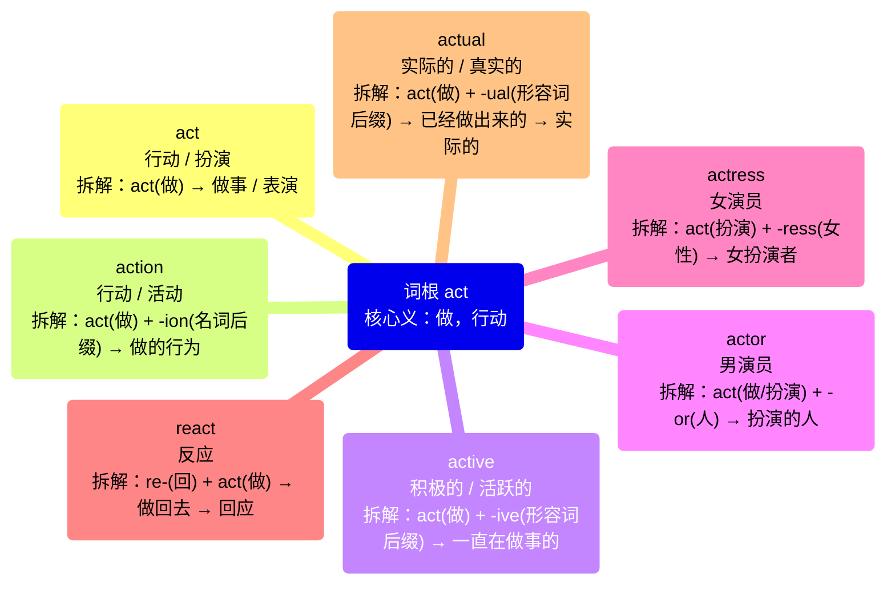
```mermaid
mindmap
  root("词根 act<br>核心义：做，行动")
    act("act<br>行动 / 扮演<br>拆解：act(做) → 做事 / 表演")
    action("action<br>行动 / 活动<br>拆解：act(做) + -ion(名词后缀) → 做的行为")
    active("active<br>积极的 / 活跃的<br>拆解：act(做) + -ive(形容词后缀) → 一直在做事的")
    actor("actor<br>男演员<br>拆解：act(做/扮演) + -or(人) → 扮演的人")
    actress("actress<br>女演员<br>拆解：act(扮演) + -ress(女性) → 女扮演者")
    react("react<br>反应<br>拆解：re-(回) + act(做) → 做回去 → 回应")
    actual("actual<br>实际的 / 真实的<br>拆解：act(做) + -ual(形容词后缀) → 已经做出来的 → 实际的")
```    
# vid/vis
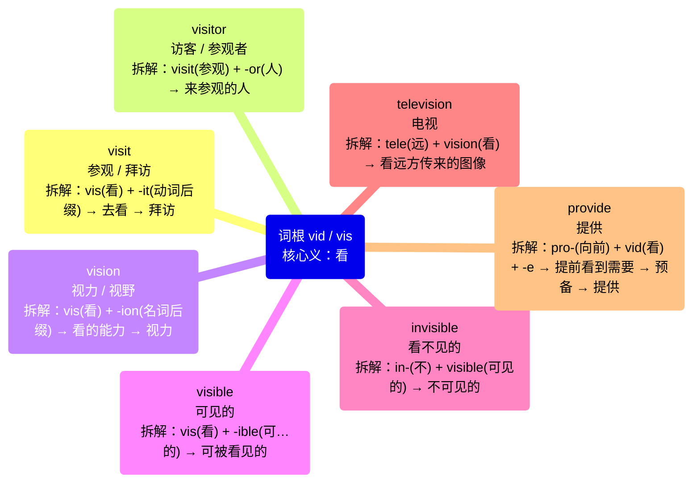
```mermaid
mindmap
  root("词根 vid / vis<br>核心义：看")
    visit("visit<br>参观 / 拜访<br>拆解：vis(看) + -it(动词后缀) → 去看 → 拜访")
    visitor("visitor<br>访客 / 参观者<br>拆解：visit(参观) + -or(人) → 来参观的人")
    vision("vision<br>视力 / 视野<br>拆解：vis(看) + -ion(名词后缀) → 看的能力 → 视力")
    visible("visible<br>可见的<br>拆解：vis(看) + -ible(可…的) → 可被看见的")
    invisible("invisible<br>看不见的<br>拆解：in-(不) + visible(可见的) → 不可见的")
    television("television<br>电视<br>拆解：tele(远) + vision(看) → 看远方传来的图像")
    provide("provide<br>提供<br>拆解：pro-(向前) + vid(看) + -e → 提前看到需要 → 预备 → 提供")
```
# dict
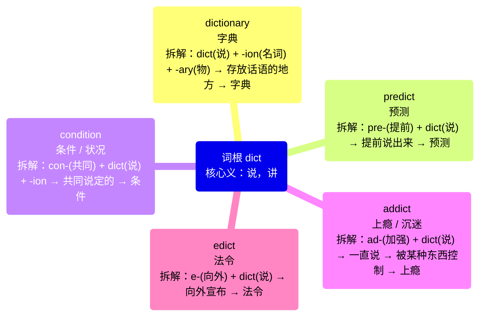
```mermaid
mindmap
  root("词根 dict<br>核心义：说，讲")
    dictionary("dictionary<br>字典<br>拆解：dict(说) + -ion(名词) + -ary(物) → 存放话语的地方 → 字典")
    predict("predict<br>预测<br>拆解：pre-(提前) + dict(说) → 提前说出来 → 预测")
    condition("condition<br>条件 / 状况<br>拆解：con-(共同) + dict(说) + -ion → 共同说定的 → 条件")
    addict("addict<br>上瘾 / 沉迷<br>拆解：ad-(加强) + dict(说) → 一直说 → 被某种东西控制 → 上瘾")
    edict("edict<br>法令<br>拆解：e-(向外) + dict(说) → 向外宣布 → 法令")
```
# port
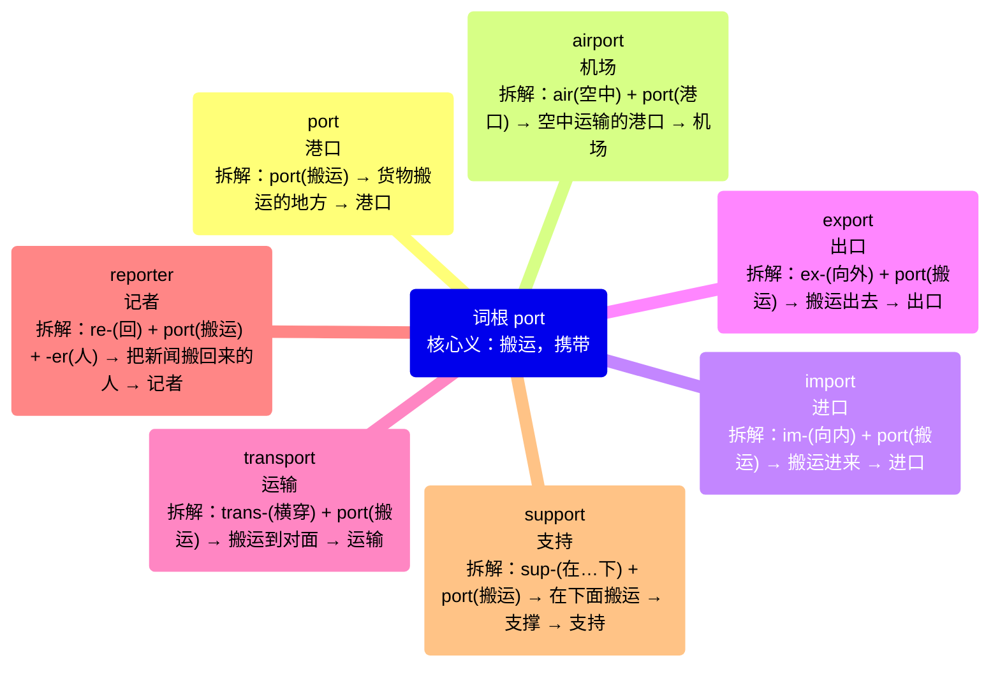
```mermaid
mindmap
  root("词根 port<br>核心义：搬运，携带")
    port("port<br>港口<br>拆解：port(搬运) → 货物搬运的地方 → 港口")
    airport("airport<br>机场<br>拆解：air(空中) + port(港口) → 空中运输的港口 → 机场")
    import("import<br>进口<br>拆解：im-(向内) + port(搬运) → 搬运进来 → 进口")
    export("export<br>出口<br>拆解：ex-(向外) + port(搬运) → 搬运出去 → 出口")
    transport("transport<br>运输<br>拆解：trans-(横穿) + port(搬运) → 搬运到对面 → 运输")
    reporter("reporter<br>记者<br>拆解：re-(回) + port(搬运) + -er(人) → 把新闻搬回来的人 → 记者")
    support("support<br>支持<br>拆解：sup-(在…下) + port(搬运) → 在下面搬运 → 支撑 → 支持")
```
# spect
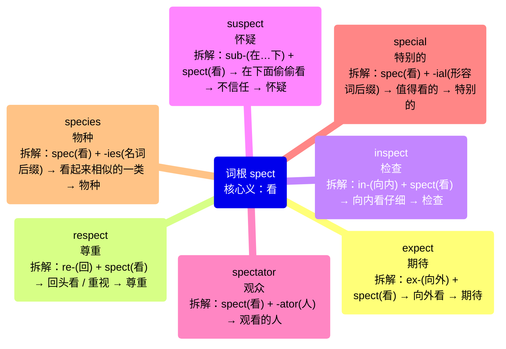
```mermaid 
mindmap
  root("词根 spect<br>核心义：看")
    expect("expect<br>期待<br>拆解：ex-(向外) + spect(看) → 向外看 → 期待")
    respect("respect<br>尊重<br>拆解：re-(回) + spect(看) → 回头看 / 重视 → 尊重")
    inspect("inspect<br>检查<br>拆解：in-(向内) + spect(看) → 向内看仔细 → 检查")
    suspect("suspect<br>怀疑<br>拆解：sub-(在…下) + spect(看) → 在下面偷偷看 → 不信任 → 怀疑")
    spectator("spectator<br>观众<br>拆解：spect(看) + -ator(人) → 观看的人")
    special("special<br>特别的<br>拆解：spec(看) + -ial(形容词后缀) → 值得看的 → 特别的")
    species("species<br>物种<br>拆解：spec(看) + -ies(名词后缀) → 看起来相似的一类 → 物种")
```
# fer
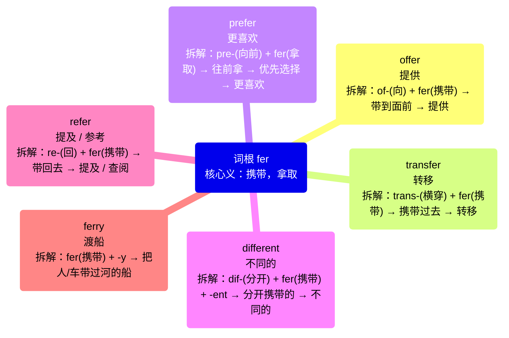
```mermaid
mindmap
  root("词根 fer<br>核心义：携带，拿取")
    offer("offer<br>提供<br>拆解：of-(向) + fer(携带) → 带到面前 → 提供")
    transfer("transfer<br>转移<br>拆解：trans-(横穿) + fer(携带) → 携带过去 → 转移")
    prefer("prefer<br>更喜欢<br>拆解：pre-(向前) + fer(拿取) → 往前拿 → 优先选择 → 更喜欢")
    different("different<br>不同的<br>拆解：dif-(分开) + fer(携带) + -ent → 分开携带的 → 不同的")
    refer("refer<br>提及 / 参考<br>拆解：re-(回) + fer(携带) → 带回去 → 提及 / 查阅")
    ferry("ferry<br>渡船<br>拆解：fer(携带) + -y → 把人/车带过河的船")
```
# gress
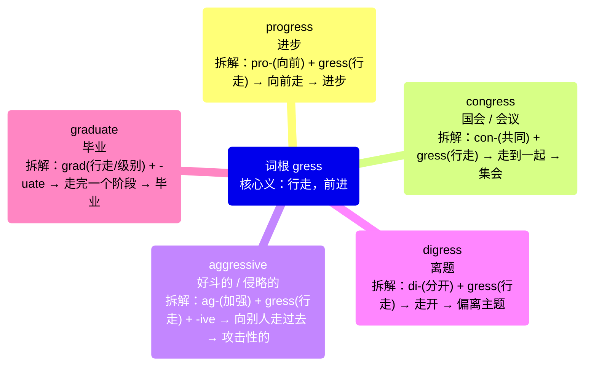
```mermaid
mindmap
  root("词根 gress<br>核心义：行走，前进")
    progress("progress<br>进步<br>拆解：pro-(向前) + gress(行走) → 向前走 → 进步")
    congress("congress<br>国会 / 会议<br>拆解：con-(共同) + gress(行走) → 走到一起 → 集会")
    aggressive("aggressive<br>好斗的 / 侵略的<br>拆解：ag-(加强) + gress(行走) + -ive → 向别人走过去 → 攻击性的")
    digress("digress<br>离题<br>拆解：di-(分开) + gress(行走) → 走开 → 偏离主题")
    graduate("graduate<br>毕业<br>拆解：grad(行走/级别) + -uate → 走完一个阶段 → 毕业")
```
# ject
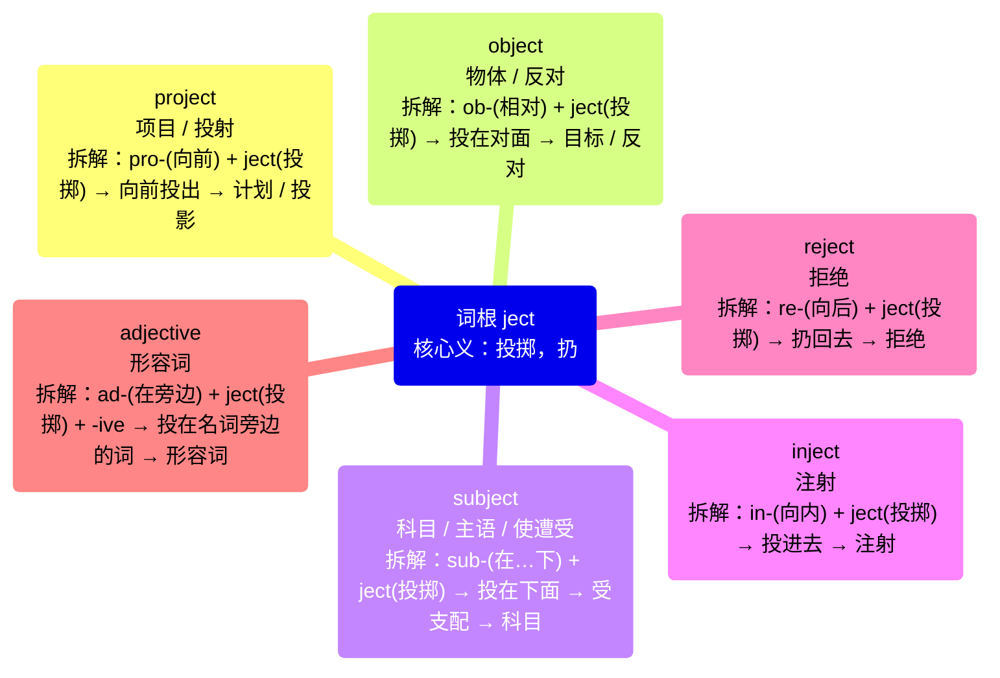
```mermaid
mindmap
  root("词根 ject<br>核心义：投掷，扔")
    project("project<br>项目 / 投射<br>拆解：pro-(向前) + ject(投掷) → 向前投出 → 计划 / 投影")
    object("object<br>物体 / 反对<br>拆解：ob-(相对) + ject(投掷) → 投在对面 → 目标 / 反对")
    subject("subject<br>科目 / 主语 / 使遭受<br>拆解：sub-(在…下) + ject(投掷) → 投在下面 → 受支配 → 科目")
    inject("inject<br>注射<br>拆解：in-(向内) + ject(投掷) → 投进去 → 注射")
    reject("reject<br>拒绝<br>拆解：re-(向后) + ject(投掷) → 扔回去 → 拒绝")
    adjective("adjective<br>形容词<br>拆解：ad-(在旁边) + ject(投掷) + -ive → 投在名词旁边的词 → 形容词")
```
# scrib/script
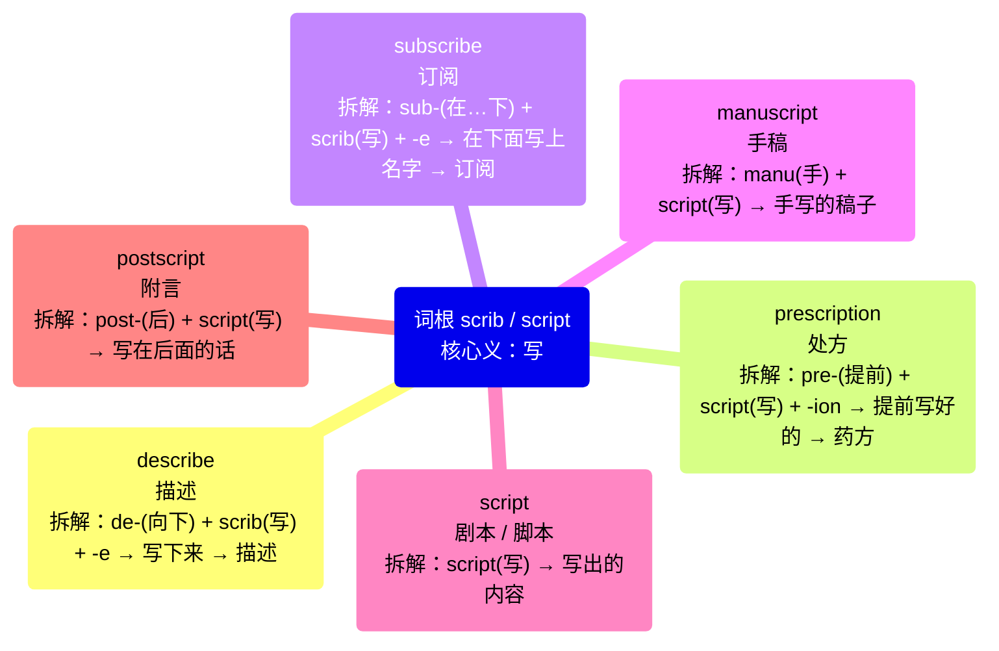
```mermaid
mindmap
  root("词根 scrib / script<br>核心义：写")
    describe("describe<br>描述<br>拆解：de-(向下) + scrib(写) + -e → 写下来 → 描述")
    prescription("prescription<br>处方<br>拆解：pre-(提前) + script(写) + -ion → 提前写好的 → 药方")
    subscribe("subscribe<br>订阅<br>拆解：sub-(在…下) + scrib(写) + -e → 在下面写上名字 → 订阅")
    manuscript("manuscript<br>手稿<br>拆解：manu(手) + script(写) → 手写的稿子")
    script("script<br>剧本 / 脚本<br>拆解：script(写) → 写出的内容")
    postscript("postscript<br>附言<br>拆解：post-(后) + script(写) → 写在后面的话")
```
# duc/duct
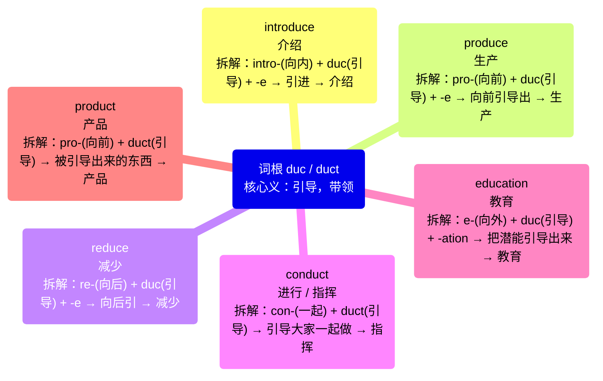
```mermaid
mindmap
  root("词根 duc / duct<br>核心义：引导，带领")
    introduce("introduce<br>介绍<br>拆解：intro-(向内) + duc(引导) + -e → 引进 → 介绍")
    produce("produce<br>生产<br>拆解：pro-(向前) + duc(引导) + -e → 向前引导出 → 生产")
    reduce("reduce<br>减少<br>拆解：re-(向后) + duc(引导) + -e → 向后引 → 减少")
    conduct("conduct<br>进行 / 指挥<br>拆解：con-(一起) + duct(引导) → 引导大家一起做 → 指挥")
    education("education<br>教育<br>拆解：e-(向外) + duc(引导) + -ation → 把潜能引导出来 → 教育")
    product("product<br>产品<br>拆解：pro-(向前) + duct(引导) → 被引导出来的东西 → 产品")
```
# pos
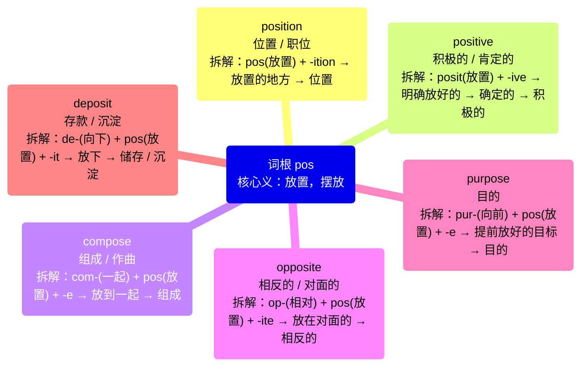
```mermaid
mindmap
  root("词根 pos<br>核心义：放置，摆放")
    position("position<br>位置 / 职位<br>拆解：pos(放置) + -ition → 放置的地方 → 位置")
    positive("positive<br>积极的 / 肯定的<br>拆解：posit(放置) + -ive → 明确放好的 → 确定的 → 积极的")
    compose("compose<br>组成 / 作曲<br>拆解：com-(一起) + pos(放置) + -e → 放到一起 → 组成")
    opposite("opposite<br>相反的 / 对面的<br>拆解：op-(相对) + pos(放置) + -ite → 放在对面的 → 相反的")
    purpose("purpose<br>目的<br>拆解：pur-(向前) + pos(放置) + -e → 提前放好的目标 → 目的")
    deposit("deposit<br>存款 / 沉淀<br>拆解：de-(向下) + pos(放置) + -it → 放下 → 储存 / 沉淀")
```
# sens/sent
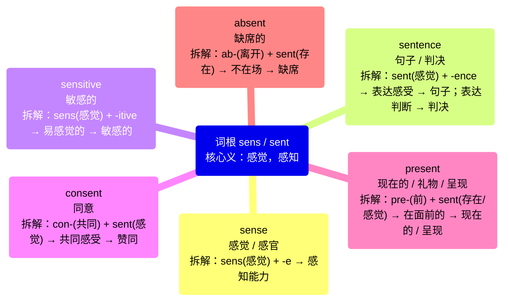
```mermaid
mindmap
  root("词根 sens / sent<br>核心义：感觉，感知")
    sense("sense<br>感觉 / 感官<br>拆解：sens(感觉) + -e → 感知能力")
    sentence("sentence<br>句子 / 判决<br>拆解：sent(感觉) + -ence → 表达感受 → 句子；表达判断 → 判决")
    sensitive("sensitive<br>敏感的<br>拆解：sens(感觉) + -itive → 易感觉的 → 敏感的")
    consent("consent<br>同意<br>拆解：con-(共同) + sent(感觉) → 共同感受 → 赞同")
    present("present<br>现在的 / 礼物 / 呈现<br>拆解：pre-(前) + sent(存在/感觉) → 在面前的 → 现在的 / 呈现")
    absent("absent<br>缺席的<br>拆解：ab-(离开) + sent(存在) → 不在场 → 缺席")
```
# ven
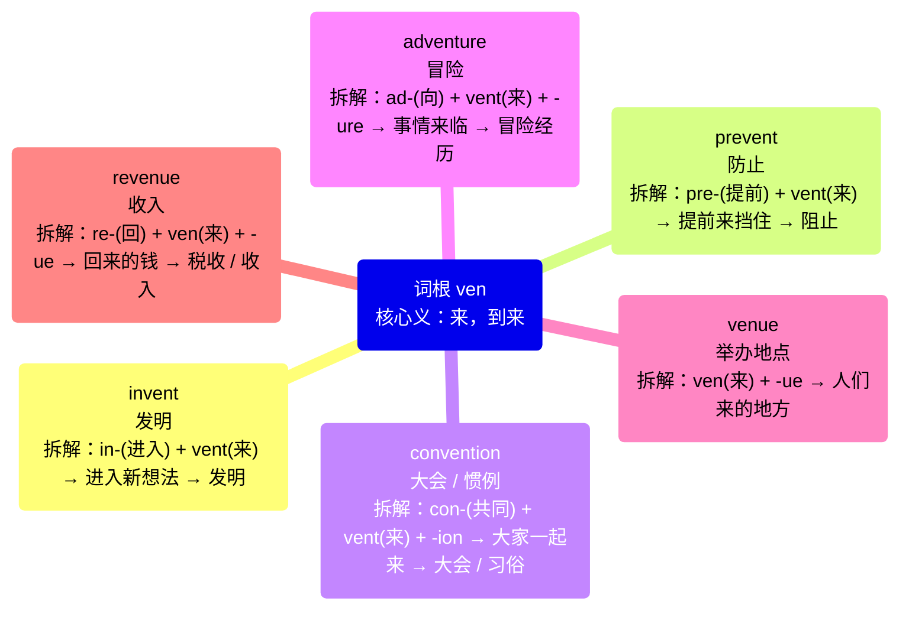
```mermaid
mindmap
  root("词根 ven<br>核心义：来，到来")
    invent("invent<br>发明<br>拆解：in-(进入) + vent(来) → 进入新想法 → 发明")
    prevent("prevent<br>防止<br>拆解：pre-(提前) + vent(来) → 提前来挡住 → 阻止")
    convention("convention<br>大会 / 惯例<br>拆解：con-(共同) + vent(来) + -ion → 大家一起来 → 大会 / 习俗")
    adventure("adventure<br>冒险<br>拆解：ad-(向) + vent(来) + -ure → 事情来临 → 冒险经历")
    venue("venue<br>举办地点<br>拆解：ven(来) + -ue → 人们来的地方")
    revenue("revenue<br>收入<br>拆解：re-(回) + ven(来) + -ue → 回来的钱 → 税收 / 收入")
```
# vert/vers
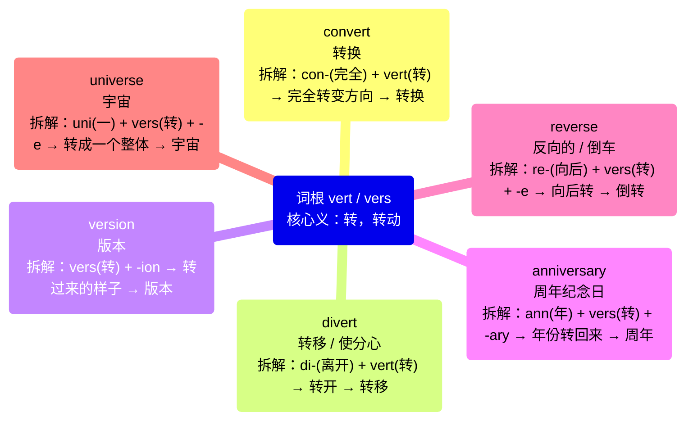
```mermaid
mindmap
  root("词根 vert / vers<br>核心义：转，转动")
    convert("convert<br>转换<br>拆解：con-(完全) + vert(转) → 完全转变方向 → 转换")
    divert("divert<br>转移 / 使分心<br>拆解：di-(离开) + vert(转) → 转开 → 转移")
    version("version<br>版本<br>拆解：vers(转) + -ion → 转过来的样子 → 版本")
    anniversary("anniversary<br>周年纪念日<br>拆解：ann(年) + vers(转) + -ary → 年份转回来 → 周年")
    reverse("reverse<br>反向的 / 倒车<br>拆解：re-(向后) + vers(转) + -e → 向后转 → 倒转")
    universe("universe<br>宇宙<br>拆解：uni(一) + vers(转) + -e → 转成一个整体 → 宇宙")
```
# tend/tens
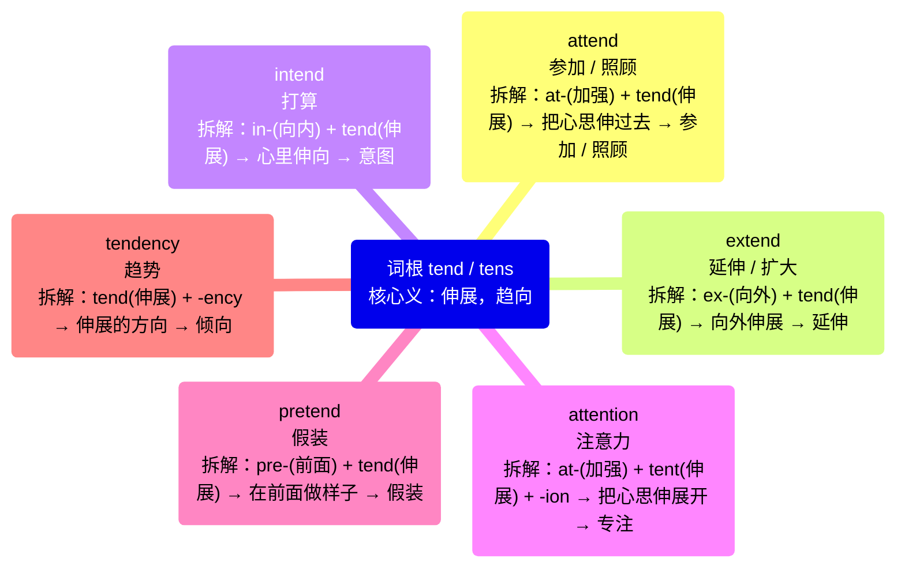
```mermaid
mindmap
  root("词根 tend / tens<br>核心义：伸展，趋向")
    attend("attend<br>参加 / 照顾<br>拆解：at-(加强) + tend(伸展) → 把心思伸过去 → 参加 / 照顾")
    extend("extend<br>延伸 / 扩大<br>拆解：ex-(向外) + tend(伸展) → 向外伸展 → 延伸")
    intend("intend<br>打算<br>拆解：in-(向内) + tend(伸展) → 心里伸向 → 意图")
    attention("attention<br>注意力<br>拆解：at-(加强) + tent(伸展) + -ion → 把心思伸展开 → 专注")
    pretend("pretend<br>假装<br>拆解：pre-(前面) + tend(伸展) → 在前面做样子 → 假装")
    tendency("tendency<br>趋势<br>拆解：tend(伸展) + -ency → 伸展的方向 → 倾向")
```
# ceed/cess
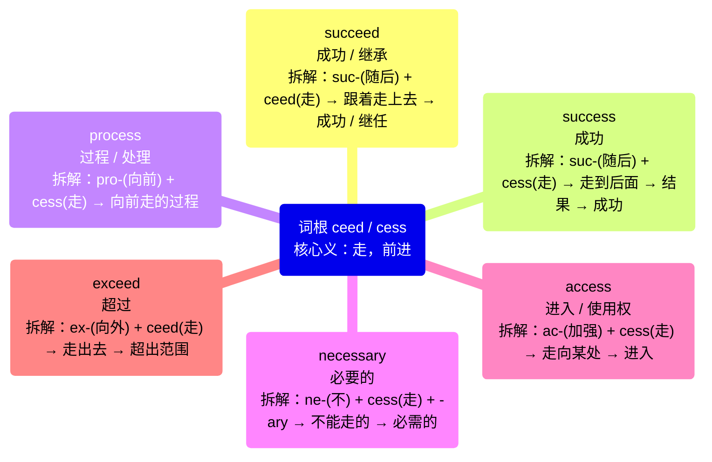
```mermaid
mindmap
  root("词根 ceed / cess<br>核心义：走，前进")
    succeed("succeed<br>成功 / 继承<br>拆解：suc-(随后) + ceed(走) → 跟着走上去 → 成功 / 继任")
    success("success<br>成功<br>拆解：suc-(随后) + cess(走) → 走到后面 → 结果 → 成功")
    process("process<br>过程 / 处理<br>拆解：pro-(向前) + cess(走) → 向前走的过程")
    necessary("necessary<br>必要的<br>拆解：ne-(不) + cess(走) + -ary → 不能走的 → 必需的")
    access("access<br>进入 / 使用权<br>拆解：ac-(加强) + cess(走) → 走向某处 → 进入")
    exceed("exceed<br>超过<br>拆解：ex-(向外) + ceed(走) → 走出去 → 超出范围")
```
# mit/miss
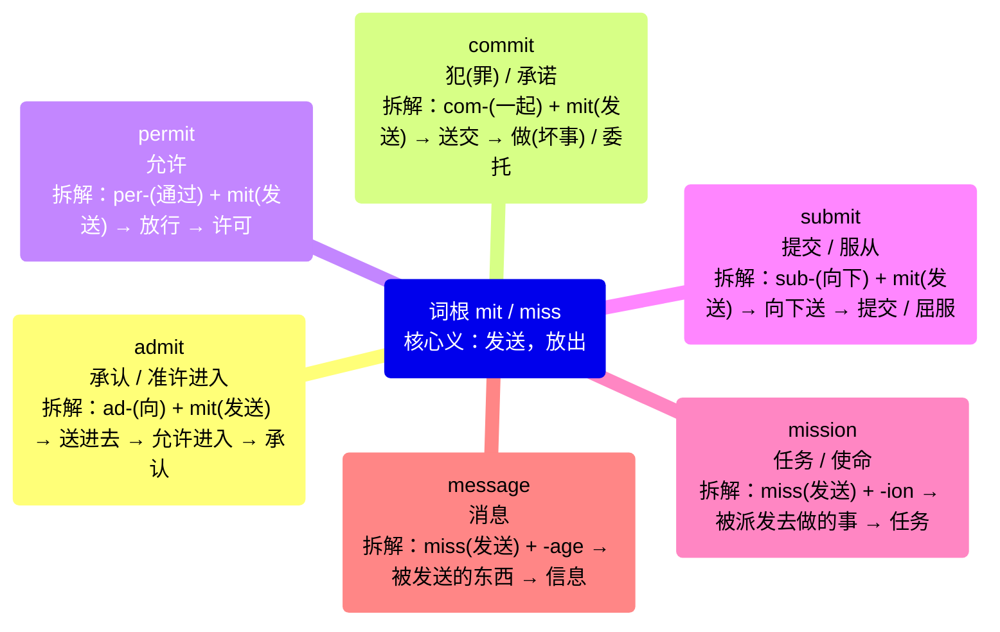
```mermaid
mindmap
  root("词根 mit / miss<br>核心义：发送，放出")
    admit("admit<br>承认 / 准许进入<br>拆解：ad-(向) + mit(发送) → 送进去 → 允许进入 → 承认")
    commit("commit<br>犯(罪) / 承诺<br>拆解：com-(一起) + mit(发送) → 送交 → 做(坏事) / 委托")
    permit("permit<br>允许<br>拆解：per-(通过) + mit(发送) → 放行 → 许可")
    submit("submit<br>提交 / 服从<br>拆解：sub-(向下) + mit(发送) → 向下送 → 提交 / 屈服")
    mission("mission<br>任务 / 使命<br>拆解：miss(发送) + -ion → 被派发去做的事 → 任务")
    message("message<br>消息<br>拆解：miss(发送) + -age → 被发送的东西 → 信息")
```
# sta/stit
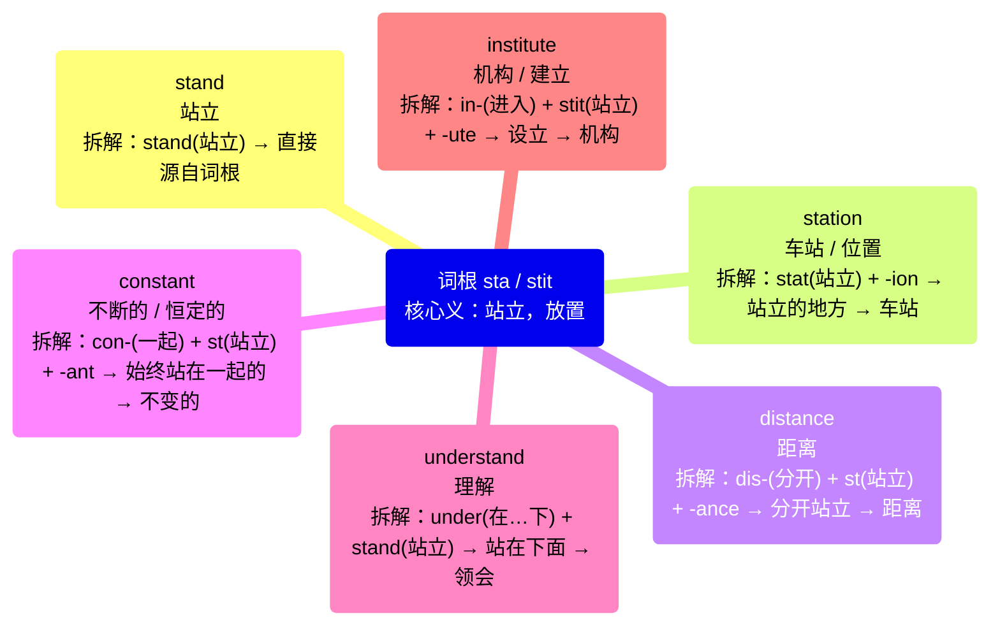
```mermaid
mindmap
  root("词根 sta / stit<br>核心义：站立，放置")
    stand("stand<br>站立<br>拆解：stand(站立) → 直接源自词根")
    station("station<br>车站 / 位置<br>拆解：stat(站立) + -ion → 站立的地方 → 车站")
    distance("distance<br>距离<br>拆解：dis-(分开) + st(站立) + -ance → 分开站立 → 距离")
    constant("constant<br>不断的 / 恒定的<br>拆解：con-(一起) + st(站立) + -ant → 始终站在一起的 → 不变的")
    understand("understand<br>理解<br>拆解：under(在…下) + stand(站立) → 站在下面 → 领会")
    institute("institute<br>机构 / 建立<br>拆解：in-(进入) + stit(站立) + -ute → 设立 → 机构")
```
# pel
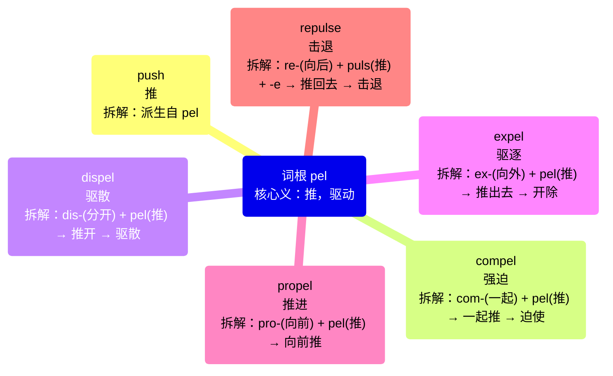
```mermaid
mindmap
  root("词根 pel<br>核心义：推，驱动")
    push("push<br>推<br>拆解：派生自 pel")
    compel("compel<br>强迫<br>拆解：com-(一起) + pel(推) → 一起推 → 迫使")
    dispel("dispel<br>驱散<br>拆解：dis-(分开) + pel(推) → 推开 → 驱散")
    expel("expel<br>驱逐<br>拆解：ex-(向外) + pel(推) → 推出去 → 开除")
    propel("propel<br>推进<br>拆解：pro-(向前) + pel(推) → 向前推")
    repulse("repulse<br>击退<br>拆解：re-(向后) + puls(推) + -e → 推回去 → 击退")
```
# viv/vit
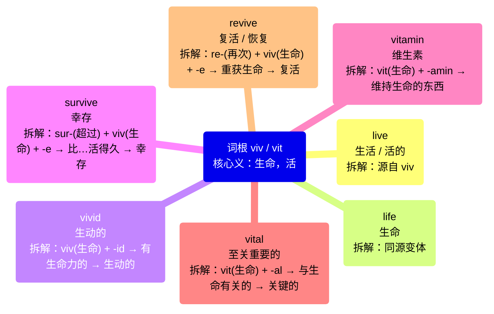
```mermaid
mindmap
  root("词根 viv / vit<br>核心义：生命，活")
    live("live<br>生活 / 活的<br>拆解：源自 viv")
    life("life<br>生命<br>拆解：同源变体")
    vivid("vivid<br>生动的<br>拆解：viv(生命) + -id → 有生命力的 → 生动的")
    survive("survive<br>幸存<br>拆解：sur-(超过) + viv(生命) + -e → 比…活得久 → 幸存")
    vitamin("vitamin<br>维生素<br>拆解：vit(生命) + -amin → 维持生命的东西")
    vital("vital<br>至关重要的<br>拆解：vit(生命) + -al → 与生命有关的 → 关键的")
    revive("revive<br>复活 / 恢复<br>拆解：re-(再次) + viv(生命) + -e → 重获生命 → 复活")
```
# cur / curs
```mermaid
mindmap
  root("词根 cur / curs<br>核心义：跑，流动")
    current("current<br>当前的 / 电流<br>拆解：cur(跑) + -ent → 正在跑的 → 当前的")
    course("course<br>课程 / 路线<br>拆解：curs(跑) + -e → 跑的路 → 路线 / 过程")
    occur("occur<br>发生<br>拆解：oc-(加强) + cur(跑) → 跑出来 → 出现 → 发生")
    excuse("excuse<br>原谅 / 借口<br>拆解：ex-(向外) + curs(跑) + -e → 跑出去 → 离开责任 → 借口")
    currency("currency<br>货币<br>拆解：cur(跑) + -ency → 流通的东西 → 货币")
    cursor("cursor<br>光标<br>拆解：curs(跑) + -or → 跑来跑去的指示器 → 光标")
```
# fac / fact
```mermaid
mindmap
  root("词根 fac / fact<br>核心义：做，制造")
    fact("fact<br>事实<br>拆解：fact(做) → 做出来的事情 → 事实")
    factory("factory<br>工厂<br>拆解：fact(做) + -ory(场所) → 制造东西的地方")
    affect("affect<br>影响<br>拆解：af-(向) + fect(做) → 对…起作用 → 影响")
    effect("effect<br>效果<br>拆解：ef-(向外) + fect(做) → 做出来的结果 → 效果")
    perfect("perfect<br>完美的<br>拆解：per-(完全) + fect(做) → 完全做好的 → 完美的")
    difficult("difficult<br>困难的<br>拆解：dif-(不) + fic(做) + -ult → 不容易做的 → 困难的")
```
# log / logue
```mermaid
mindmap
  root("词根 log / logue<br>核心义：说，言，科学")
    dialogue("dialogue<br>对话<br>拆解：dia-(相互) + logue(说) → 互相说 → 对话")
    apology("apology<br>道歉<br>拆解：apo-(离开) + log(说) + -y → 为离开而说 → 道歉")
    catalog("catalog<br>目录<br>拆解：cata-(向下) + log(说) → 向下说清 → 列举 → 目录")
    logic("logic<br>逻辑<br>拆解：log(说/理性) + -ic → 说话的条理性 → 逻辑")
    biology("biology<br>生物学<br>拆解：bio(生命) + logy(科学) → 研究生命的科学")
    technology("technology<br>技术<br>拆解：techno(技艺) + logy(科学) → 技艺的科学")
```
# path
```mermaid
mindmap
  root("词根 path<br>核心义：感情，感觉，病")
    sympathy("sympathy<br>同情<br>拆解：sym-(共同) + path(感情) + -y → 有相同感情 → 同情")
    patient("patient<br>病人 / 耐心的<br>拆解：path(忍受/病) + -ent → 忍受痛苦的人 → 病人；能忍受的 → 耐心的")
    passion("passion<br>激情<br>拆解：pass(感情) + -ion → 强烈的情感")
    pathetic("pathetic<br>可怜的 / 可悲的<br>拆解：path(感情) + -etic → 引发怜悯感情的")
    hospital("hospital<br>医院<br>拆解：hospit(客人) + -al → 接待客人的地方 → 收容所 → 医院")
    pathology("pathology<br>病理学<br>拆解：path(病) + -ology(科学) → 研究疾病的科学")
```
# 
```mermaid
mindmap
  root("词根 ped<br>核心义：脚，孩子")
    pedal("pedal<br>踏板<br>拆解：ped(脚) + -al → 脚踩的东西")
    pedestrian("pedestrian<br>行人<br>拆解：ped(脚) + -estrian → 用脚走路的人")
    expedition("expedition<br>远征 / 探险<br>拆解：ex-(向外) + ped(脚) + -ition → 向外迈脚 → 远征")
    impede("impede<br>阻碍<br>拆解：im-(向内) + ped(脚) + -e → 把脚伸进去 → 挡住 → 阻碍")
    centipede("centipede<br>蜈蚣<br>拆解：centi(一百) + ped(脚) → 很多脚的虫")
    encyclopedia("encyclopedia<br>百科全书<br>拆解：en-(在内) + cycl(圆) + ped(教育/孩子) + -ia → 全方位的儿童教育 → 百科全书")
```
```mermaid

```
# tract
```mermaid 
mindmap
  root("词根 tract<br>核心义：拉，抽")
        attract("attract<br>吸引<br>拆解：at-(加强) + tract(拉) → 拉过来")
        tractor("tractor<br>拖拉机<br>拆解：tract(拉) + -or(工具) → 拉东西的工具")
        extract("extract<br>提取<br>拆解：ex-(向外) + tract(拉) → 向外拉")
        distract("distract<br>分散注意力<br>拆解：dis-(分开) + tract(拉) → 把注意力拉开")
        tractable("tractable<br>易驾驭 / 温顺<br>拆解：tract(拉) + -able(可…的) → 可牵引的")
        contract("contract<br>压缩 / 合同<br>拆解：con-(共同) + tract(拉) → 往一起拉")
        abstract("abstract<br>抽象的<br>拆解：abs-(离开) + tract(拉) → 从具体中拉出本质")
        subtract("subtract<br>减去<br>拆解：sub-(向下) + tract(拉) → 向下拉走")
```
# trans
```mermaid
mindmap
  root("词根 trans<br>核心义：横穿，转移")
    transport("transport<br>运输<br>拆解：trans-(横穿) + port(搬运) → 搬运到对面")
    transfer("transfer<br>转移<br>拆解：trans-(横穿) + fer(携带) → 携带过去")
    translate("translate<br>翻译<br>拆解：trans-(横穿) + lat(携带) + -e → 把意思带过去")
    transform("transform<br>改变<br>拆解：trans-(横穿) + form(形状) → 改变形状")
    transmit("transmit<br>传输<br>拆解：trans-(横穿) + mit(发送) → 发送过去")
    transparent("transparent<br>透明的<br>拆解：trans-(穿过) + par(出现) + -ent → 光线穿过而显现")
    transcribe("transcribe<br>抄写<br>拆解：trans-(横穿) + scribe(写) → 把文字转写过去")
    transatlantic("transatlantic<br>跨大西洋的<br>拆解：trans-(横穿) + Atlantic(大西洋)")
    transplant("transplant<br>移植<br>拆解：trans-(转移) + plant(种植) → 移种到别处")
    transfuse("transfuse<br>输血<br>拆解：trans-(横穿) + fuse(注入) → 注入过去")
    transship("transship<br>转运<br>拆解：trans-(转移) + ship(船运) → 换船转运")
    transaction("transaction<br>交易<br>拆解：trans-(横穿) + act(做) + -ion → 互相做事")
    transgenic("transgenic<br>转基因的<br>拆解：trans-(转移) + gen(基因) + -ic → 基因被转移的")
```
# fus
```mermaid
mindmap
  root("词根 fus<br>核心义：流，注入")
    fuse("fuse<br>融合 / 保险丝<br>拆解：fus(流) + -e → 使熔化成一体")
    confuse("confuse<br>使迷惑<br>拆解：con-(共同) + fus(流) + -e → 各种思绪流到一起")
    diffuse("diffuse<br>扩散 / 散开<br>拆解：dis-(分开) + fus(流) + -e → 分流而散开")
    infuse("infuse<br>注入 / 灌输<br>拆解：in-(向内) + fus(流) + -e → 向内流入")
    profuse("profuse<br>丰富的 / 充沛的<br>拆解：pro-(向前) + fus(流) + -e → 向前大量流出")
    refuse("refuse<br>拒绝<br>拆解：re-(向后) + fus(流) + -e → 流回，不接纳")
    suffuse("suffuse<br>弥漫 / 充满<br>拆解：sub-(在…下) + fus(流) + -e → 从下往上流遍")
    transfuse("transfuse<br>输血 / 灌注<br>拆解：trans-(横穿) + fus(流) + -e → 把血液从一处流到另一处")
```
