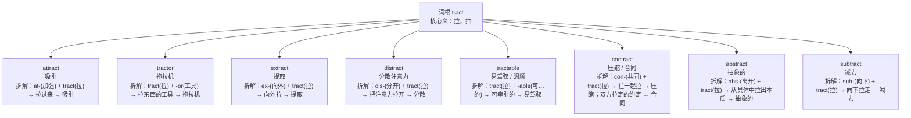

```mermaid
flowchart TD
    root["词根 tract<br>核心义：拉，抽"]

    attract["attract<br>吸引<br>拆解：at-(加强) + tract(拉) → 拉过来 → 吸引"]
    tractor["tractor<br>拖拉机<br>拆解：tract(拉) + -or(工具) → 拉东西的工具 → 拖拉机"]
    extract["extract<br>提取<br>拆解：ex-(向外) + tract(拉) → 向外拉 → 提取"]
    distract["distract<br>分散注意力<br>拆解：dis-(分开) + tract(拉) → 把注意力拉开 → 分散"]
    tractable["tractable<br>易驾驭 / 温顺<br>拆解：tract(拉) + -able(可…的) → 可牵引的 → 易驾驭"]
    contract["contract<br>压缩 / 合同<br>拆解：con-(共同) + tract(拉) → 往一起拉 → 压缩；双方拉定的约定 → 合同"]
    abstract["abstract<br>抽象的<br>拆解：abs-(离开) + tract(拉) → 从具体中拉出本质 → 抽象的"]
    subtract["subtract<br>减去<br>拆解：sub-(向下) + tract(拉) → 向下拉走 → 减去"]

    root --> attract
    root --> tractor
    root --> extract
    root --> distract
    root --> tractable
    root --> contract
    root --> abstract
    root --> subtract
```

```mermaid
flowchart TD
    root["词根 trans<br>核心义：横穿，转移"]

    transport["transport<br>运输<br>拆解：trans-(横穿) + port(搬运) → 搬运到对面 → 运输"]
    transfer["transfer<br>转移<br>拆解：trans-(横穿) + fer(携带) → 携带过去 → 转移"]
    translate["translate<br>翻译<br>拆解：trans-(横穿) + lat(携带) + -e → 把意思带过去 → 翻译"]
    transform["transform<br>改变<br>拆解：trans-(横穿) + form(形状) → 改变形状 → 转变"]
    transmit["transmit<br>传输<br>拆解：trans-(横穿) + mit(发送) → 发送过去 → 传输"]
    transparent["transparent<br>透明的<br>拆解：trans-(穿过) + par(出现) + -ent → 光线穿过而显现 → 透明"]
    transcribe["transcribe<br>抄写<br>拆解：trans-(横穿) + scribe(写) → 把文字转写过去 → 抄写"]
    transatlantic["transatlantic<br>跨大西洋的<br>拆解：trans-(横穿) + Atlantic(大西洋) → 横穿大西洋的"]

    transplant["transplant<br>移植<br>拆解：trans-(转移) + plant(种植) → 移种到别处 → 移植"]
    transfuse["transfuse<br>输血<br>拆解：trans-(横穿) + fuse(注入) → 注入过去 → 输血"]
    transship["transship<br>转运<br>拆解：trans-(转移) + ship(船运) → 换船转运 → 转运"]
    transaction["transaction<br>交易<br>拆解：trans-(横穿) + act(做) + -ion → 互相做事 → 交易"]
    transgenic["transgenic<br>转基因的<br>拆解：trans-(转移) + gen(基因) + -ic → 基因被转移的 → 转基因的"]

    root --> transport
    root --> transfer
    root --> translate
    root --> transform
    root --> transmit
    root --> transparent
    root --> transcribe
    root --> transatlantic
    root --> transplant
    root --> transfuse
    root --> transship
    root --> transaction
    root --> transgenic
```
