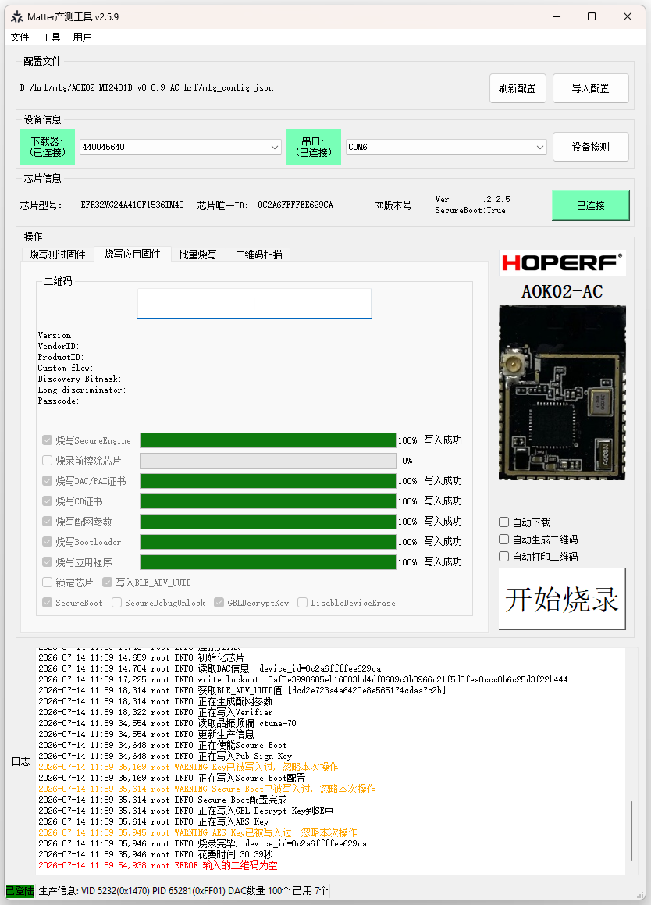
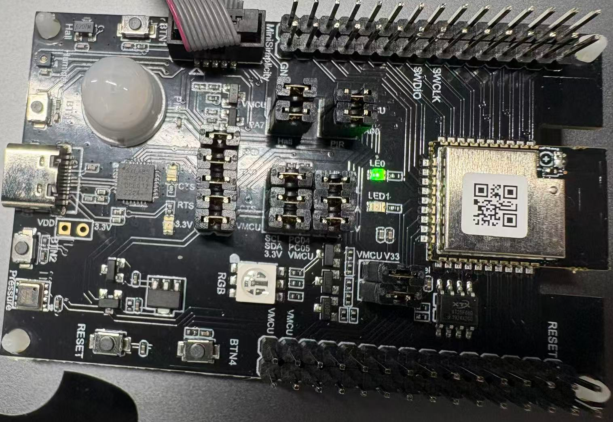

```c
username: suhuide
password: +mTvwceVZk
```c
//AOK
vendor id: 5274
product_id: 12821
product code: 9323718166
```
```c
//HRF
vendor id: 5232
product_id: 0xFF01
product code: 4420141878
```
```c
matter_mfg_tool_2.5.9\mfg_tool.exe
//Load config
AOK02-MT2401B-v0.1.7-DC\mfg_config.json
```
## Prepare
```c
//Move your target .s37 file into AOK02-MT2401B-v0.1.7-DC\firmware\
Administrator@eric-pc MINGW64 /c/hrf/mfg/AOK02-MT2401B-v0.1.7-DC/firmware
$ ls -1
aok02_bootloader-v3-signed-fa98105c.s37
aok02_matter_dc-v0.1.7-signed-f5f6cb9e.s37
rail_soc_railtest_mt2401b.s37
s2c4_se_fw_upgrade_app_2v2p5.hex
```
```c
//Config mfg_config.json&debug.json accordingly
            "bootloader": "aok02_bootloader-v3-signed-fa98105c.s37",
            "application": "aok02_matter_dc-v0.1.7-signed-f5f6cb9e.s37",
```
### Tip
matter_mfg_tool_2.5.9\firmware  
mfg_tool will load "gfw_efr32_v2_mg24a.s37" first, make sure use the correct .s37 file,focus on signed/unsigned one.  
Bank Chip you can use unsigned one, after secure boot enable, you have to use signed one.  
For changing it, just rename "gfw_efr32_v2_mg24a-signed.s37" or "gfw_efr32_v2_mg24a-unsigned.s37" to "gfw_efr32_v2_mg24a.s37".  
gfw_efr32_v2_mg24a.s37 for chip that is middle secure-vault type, such as HM-MT2401A,HM-MT2401B  
gfw_efr32_v2_mg24b.s37 for chip that is high secure-vault type   
```c
Administrator@eric-pc MINGW64 /c/hrf/mfg/matter_mfg_tool_2.5.9/firmware
$ ls -1
gfw_efr32_v1.s37
gfw_efr32_v2_mg24a-signed.s37
gfw_efr32_v2_mg24a-unsigned.s37
gfw_efr32_v2_mg24a.s37
gfw_efr32_v2_mg24b.s37
```
## MFG Exe
<div align="center">
  
</div>

# Module

<div align="center">
  
</div>