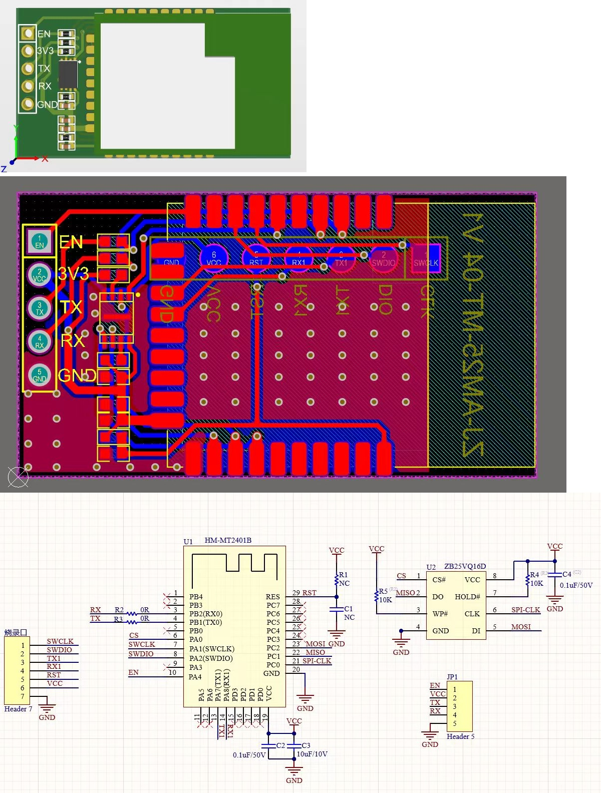

## PartNo.
```c
EFR32MG24A410F1536IM40
```
<div align="center">
  
</div>

| Pin | Name | Definition | Function |
| ---- | ---- | ---- | ---- |
|PB1|UART0_TX|UART0_TX|Serial Tx|
|PB2|UART0_RX|UART0_RX|Serial Rx|
|PA0|SPI_CS|SPI_CS|SPI Flash|
|PC0|SPI_CLK|SPI_CLK|SPI Flash|
|PC1|SPI_MISO|SPI_MISO|SPI Flash|
|PC2|SPI_MOSI|SPI_MOSI|SPI Flash|
|PA1|SWCLK|SWCLK||
|PA2|SWDIO|SWDIO||
|PA7|UART1_TX|UART1_TX||
|PA8|UART1_RX|UART1_RX||
|RST|Reset|Reset||
|VCC|VCC|VCC||
|GND|GND|GND||