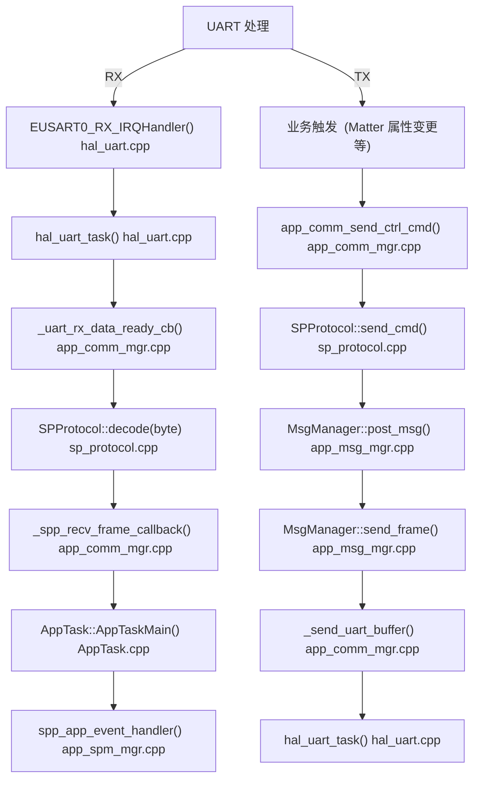
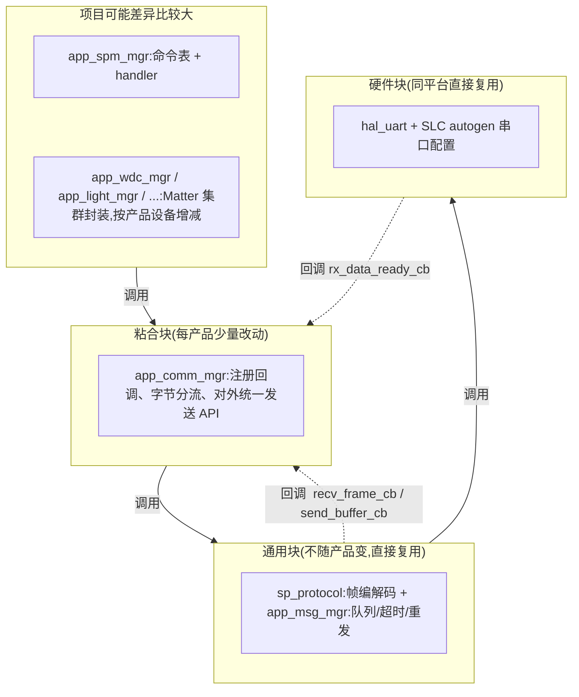

# Matter 模块 ↔ MCU 串口协议 Porting user guide

> 硬件平台:EFR32MG24,Silabs Matter SDK + FreeRTOS。
> 结论先行:**HAL 层同平台直接复用; 协议层原样拷贝; 真正的工作量在应用层命令表。**

---

## 1. 总览:三层

| 层 | 文件 | 职责 | Porting 时 |
|---|---|---|---|
| **HAL 层** | `src/hal/hal_uart.cpp/.h` | UART 外设、DMA、中断、缓冲、唤醒时序 | **同平台(MG24)直接复用**,只改 3 处配置(见 §4) |
| **协议层** | `src/misc/sp_protocol.cpp/.h` + `src/app/app_msg_mgr.cpp/.h` | 帧编解码、状态机、SN、校验、重发队列 | **原样拷贝**,只换 2 处平台依赖(见 §5) |
| **应用层** | `src/app/app_spm_mgr.cpp/.h` + `src/app/app_comm_mgr.cpp/.h` | 命令表分发、业务处理、Matter 集群对接 | **主要工作量**:按产品加减指令、对接集群(见 §6) |

数据流(RX 从中断到应用共 7 步,TX 反向):



---

## 2. 模块化分析

### 2.1 功能块与对接点

整个协议栈模块边界清晰,靠的是**层与层之间只有 5 个对接点,且依赖严格单向向下**:



实线 = 向下调用;虚线 = 仅上层事先注册的回调(**下层从不 include 上层头文件,也不知道上层是谁**)。

**5 个对接点(全部有固定接口,复用就是对接这 5 个口):**

| # | 对接点 | 接口 | 谁连谁 |
|---|---|---|---|
| 1 | HAL 收据回调 | `hal_uart_init(void (*rx_data_func)(void))` | comm_mgr 把喂字节函数交给 HAL |
| 2 | HAL 发送 API | `hal_uart_buf_write(const uint8_t*, uint16_t)` | MsgManager 的 `send_buffer_cb` 落到这里 |
| 3 | 协议收帧回调 | `SPProtocol sp_recv_frame_callback(sp_frame_t*)` | comm_mgr 构造 `spp_instance` 时传入 |
| 4 | 协议发送 API | `send_cmd(type, payload, size)` / `send_ack(type, sn)` | 各业务 mgr 调 |
| 5 | 事件投递 | `AppEvent{Type=kEventType_DataSpp, spp_frame, Handler}` → `AppTask::PostEvent` | 协议回调 → APP 任务 |

### 2.2 模块化的四个机制

1. **依赖单向**:app → comm_mgr → sp_protocol → hal_uart。  下层头文件不 include 上层;  `sp_protocol.cpp` 里没有一个硬件 include,`hal_uart` 不知道协议的存在。 **反向全靠对接点里的函数指针/回调**,没有一处上层向下调用被写死。  
2. **表驱动插槽**:加功能不改框架,改的只是表——应用层 `CMDList[]`(cmd→handler)、协议的 DP 表 `g_func_list`(dp→handler)。框架代码(分发器、解析器)一次写好,永远不动。
3. **队列解耦**:HAL 任务与 APP 任务只通过 `AppEvent` 队列通信,无共享状态;TX 侧 MsgManager 队列把"业务想发"和"串口在发"解耦。**任何一块慢都不会阻塞别的块**。
4. **常量集中**:帧格式常量全在 `sp_protocol.h/cpp` 顶部,串口参数全在 SLC config,产品容量全在 `device_config.h`。**没有一个魔数散落在业务代码里**。

通用块升级只改一处,所有产品受益。

---

## 3. 帧格式定制指南

当前帧形态(变长帧模板):

```
偏移  0     1     2     3    4     5    6      7...7+len-1   7+len
     [0x55][0xAA][0x01][SN_H][SN_L][CMD][LEN]  [PAYLOAD...]  [SUM]
      SOF1  SOF2  VER   序号(大端) 类型  长度u8                校验
```

帧格式常量全部集中在 `sp_protocol.h:16-18` 与 `sp_protocol.cpp:20-29`,**改帧只动协议层;应用层只跟随 `sp_frame_t` 的字段名**(sp_protocol.h:115)。

### 3.1 改帧头(SOF / 版本 / SN / 字段增减)

| 改什么 | 必改位置 |
|---|---|
| SOF 字节值 | ① `FRAME_SOF1/SOF2`(sp_protocol.cpp:20);② `decode()` idx=0/1 的判断(sp_protocol.cpp:33);③ `app_comm_mgr` `_uart_rx_data_ready_cb` 的首字节门控(等 0x55 才喂解析器)——**三处必须一致** |
| 版本号 VER | ① `VERSION_NUM`(sp_protocol.cpp:22);② `decode()` idx=2 的判断 |
| SN 位宽/回绕值 | ① `encode()` 写 SN 两字节(sp_protocol.cpp:169);② `get_increase_sn()`(sp_protocol.cpp:183);③ `sp_frame_t.sn`;④ `decode()` idx=3..4 分支 |
| 帧头增删字段 | ① `SP_HEAD_SIZE`(sp_protocol.h:17);② `encode()` 头部组装序列(sp_protocol.cpp:166-172,一行一字段);③ `decode()` 每字段一个 idx 分支;④ `MAX_PAYLOAD_LENGTH` 随 `RX_BUFFER_SIZE - SP_HEAD_SIZE` 自动变化 |

### 3.2 改帧结构(长度字段 / payload 上限 / 变长↔定长)

| 改什么 | 必改位置 |
|---|---|
| 长度字段 8→16 位 | ① `SP_HEAD_SIZE` +1;② `encode()` 写 LEN 处拆两字节大端;③ `decode()` 长度分支读两字节,上限检查对齐新 `MAX_PAYLOAD_LENGTH` |
| payload 上限 | ① `RX_BUFFER_SIZE`(sp_protocol.h:16,协议层收/编缓冲);② 联动 `hal_uart.h:UART_TX_MAX_BUF_LEN`(发送上限,§4.1)与 MCU 侧接收能力——**三处 ≥ 最大帧总长** |
| 变长 → 定长 | ① `decode()` 删长度分支,校验位置改固定下标(帧长-1);② `encode()` 删 LEN 字段,`SP_HEAD_SIZE` 同步;③ `sp_frame_t.payload_size` 改为常量 |
| 帧字段增删 | `sp_frame_t`(sp_protocol.h:115)——它按值装进 `AppEvent`(AppEvent.h:80),`spp_app_event_handler` 取字段处跟着改 |

### 3.3 改帧校验(累加和 / XOR / CRC,按对端要求实现)

校验**只有一个算法点**,encode 写校验(sp_protocol.cpp:177)与 decode 校验分支(sp_protocol.cpp:88 附近)都调它,换算法不动这两处调用:

```c
// sp_protocol.cpp:135 —— 唯一算法点
uint8_t SPProtocol::check_sum_buffer(const uint8_t * buf, uint16_t size)
{
    uint8_t temp = 0;                                        // 原代码未初始化,顺手修
    for (uint16_t i = 0; i < size; ++i) {
        // 累加和(当前):  temp += buf[i];
        // 换 XOR:         temp ^= buf[i];
        // 换 CRC8(poly=0x07): 先 temp ^= buf[i]; 再 for (uint8_t j = 0; j < 8; ++j) temp = (temp & 0x80) ? (temp << 1) ^ 0x07 : (temp << 1);
    }
    return temp;
}
```

换算法/位宽的联动清单:

1. **同位宽算法**(累加和 / XOR / CRC8 互换):只改上面函数内部一行,其余零改动;
2. **位宽变宽**(如 CRC16):返回类型改 `uint16_t`;`encode()` 校验写两字节大端,帧总长 +1;`decode()` 校验分支读两字节合并;`RX_BUFFER_SIZE`、`UART_TX_MAX_BUF_LEN` 各 +1;
3. **覆盖范围**:当前约定为 SOF..payload 全部字节、不含校验自身(encode 传 `buf, idx`,decode 传 `rx_buffer, cur_idx-1`)——改覆盖范围时两处同步;
4. **两边一致 + 冒烟向量**:和 MCU 侧约定同一条样本帧(如 `55 AA 01 00 01 09 01 28` → 校验 = X)写死在测试里,防"各自实现了但覆盖范围差一字节"。

---

## 4. HAL 层 porting(`hal_uart.cpp/.h`)——同平台基本零修改

**前提:新项目同样是 EFR32MG24。** 对比现有参考工程的 `hal_uart` 源码:整个 `.cpp` 仅差异在唤醒 GPIO 宏和唤醒延时(2 行),`.h` 仅 1 个常量。所以 HAL 不是"重写",是"拷贝 + 按下表改 3 处"。

### 4.1 改动点 1:帧 size → `hal_uart.h:UART_TX_MAX_BUF_LEN`

**这是帧 size 变化时 HAL 唯一必改的地方**,对比两个参考工程直接印证:

```c
// 大帧配置(最大 payload 255):hal_uart.h:16
#define UART_TX_MAX_BUF_LEN (255)      // 注释里留着 "//64" —— 就是从小帧配置抄来后改大的痕迹
// 小帧配置(最大 payload 24):
#define UART_TX_MAX_BUF_LEN (64)       // 最大帧 8+24+1=33 ≤ 64,留了余量
```

TX 队列元素就是 `hal_uart_tx_struct_t`(该数组 + 2 字节 length),队列 10 条,所以**这个宏同时决定 TX 队列总内存**:大帧配置约 2.5KB,小帧配置约 660B。取值口诀:

> `UART_TX_MAX_BUF_LEN ≥ 最大帧总长`,再留 20% 余量;三处联动一起核对本节末尾。

**RX 侧与帧 size 无关**:128B 软件 FIFO 是流式缓冲,解析器边收边消费,帧比 FIFO 长也能收(263B 的大帧跑在 128B FIFO 上没问题),不用改。

### 4.2 改动点 2:唤醒握手宏(按硬件有没有唤醒线选)

两个参考工程在 `hal_uart.cpp` 顶部的差异:

```c
// 参考配置一:单向唤醒——模块发帧前唤醒 MCU(启用)
#define GPIO_WAKEUP_MCU_UART_PRESENT       // PA05 推挽,发前拉低 vTaskDelay(3)(注释:At least 2ms),发完拉高

// 参考配置二:双向唤醒——PA04(RTS,唤醒MCU)/PA08(CTS,被MCU唤醒),默认整体注释(不启用)
// #define GPIO_WAKEUP_UART_PRESENT         ... 延时用 vTaskDelay(2)
```

新项目按硬件原理图二选一:有唤醒线→启用对应宏并核对引脚号;没有→保持注释(对端 MCU 常供电收听时可行,省 2 个 GPIO)。

### 4.3 改动点 3:SLC autogen 配置(引脚/波特率/功耗模式)

`config/sl_uartdrv_eusart_serial_config.h` + `autogen/sl_uartdrv_init.c`:实例(都用 EUSART0)、9600-8-N-1 无流控、引脚按本项目原理图(参考工程存在 TX=PB02/RX=PB01 与 TX=PB01/RX=PB02 两种排布)、`LF_MODE` 按功耗需求配置(参考工程 false/true 都有)。改配置文件即可,代码零改动。

### 4.4 如果要动 HAL 内部实现,守住 6 条行为契约

换芯片平台、或深度改造时,以下契约必须复刻(同平台复用则不用看这节):

1. **ISR 只置位**:RXFL 中断置事件位后立即自关(one-shot),由专门任务(HAL_UART,512 字,prio 30)唤醒搬运。
2. **上层回调在任务上下文**,不在 ISR——协议解析器会被连续调几百次。
3. **DMA 缓冲 → FIFO 在临界区内拷贝**,用 `UARTDRV_GetReceiveStatus` 清点活跃缓冲积压字节数,不清点必丢字节。这是最容易 port 错的一步。
4. **TX 前唤醒线拉低 ≥2ms**(参考实现用 3ms 保险),发完拉高;无唤醒线的硬件跳过。
5. **TX 完成判定用 TXC(发送完成)**,不能用发送寄存器空,否则帧尾被截断。
6. 缓冲满时**丢新数据并打日志**;`hal_uart.h` 四个 API 签名一个不改,上层零感知。

---

## 5. 协议层 porting(`sp_protocol` + `app_msg_mgr`)——原样拷贝

### 5.1 可原样复制的部分

`sp_protocol.cpp/.h`:逐字节解析状态机(隐式 cur_idx:0→0x55,1→0xAA,2→VER,3-5→SN/CMD,6→LEN,7..→payload,末→校验;任何一步不符即复位重同步)、`encode`/`send_cmd`/`send_ack`/SN 自增。零硬件依赖。
`app_msg_mgr.cpp/.h`:MsgManager 发送状态机——SPQueue(8 节点)、ACK 超时 500ms(可配 200..2000)、重发 2 次、帧间隔 100ms、MCU 可经 `kResend`/`CID_RESEND_CFG` 动态启停重发。

### 5.2 需要替换的依赖(仅两处)

1. `CORE_ENTER_ATOMIC/CORE_EXIT_ATOMIC`(em_core.h 临界区,SPQueue 与 pending 管理)——同平台不用换;
2. `pvPortMalloc/vPortFree`(msg_node_t 堆分配,app_msg_mgr.cpp:157)——同平台不用换;
3. `ev_*` 软定时器(`src/event_queue/`)随 Matter SDK 平台层走,不动。

**跨芯片才需要**抽象这两个宏;同平台(本项目常态)什么都不用做。

### 5.3 porting 决策点

1. **帧格式**(§3):与 MCU 侧对齐后,按 §3 的定制指南调整帧头/结构/校验;同构项目可整目录抄 `sp_protocol.*`。
2. **payload 上限** `RX_BUFFER_SIZE`:需过 MCU OTA 大数据用大 payload(255);小指令集用小 payload(24)省约 700B 内存。
3. **帧 size 联动三处一起核**:`RX_BUFFER_SIZE`(协议层收/编缓冲)= `UART_TX_MAX_BUF_LEN`(HAL 发送上限)≥ 对端约定的最大帧。现状是 262/255/263 三数不一致,新项目建议统一为 `RX_BUFFER_SIZE = SP_HEAD_SIZE + MAX_PAYLOAD + 1`,`UART_TX_MAX_BUF_LEN ≥ 同值`。

---

## 6. 应用层 porting:怎么加减串口指令(核心实操)

### 6.1 新增一条指令(示例:新增 `kDevTempReport`)

假设 MCU 要上报设备温度,模块收到后写 Matter 属性。**五步,全在应用层,框架零改动:**

**① 定命令号**(`sp_protocol.h` 的 `msg_type_t` 枚举插一行,选空闲值):

```c
typedef enum {
    kGetProductInfo = 0x01,
    ...
    kBatteryStatus,          // 0x08
    kDevTempReport = 0x09,   // ← 新增:排在 kError(0x0F)之前的空闲号即可
    kError = 0x0F,
    ...
} msg_type_t;
```

> 注意:MCU 侧协议文档同步改,**两边 enum 值必须一致**;已量产指令号永不复用。

**② 写 handler**(app_spm_mgr.cpp,签名必须是 `command_t` 规定的 `(uint16_t sn, uint8_t *d, uint8_t len)`):

```c
static void spp_app_event_DevTempReport(uint16_t sn, uint8_t *d, uint8_t len)
{
    // 1. 信任边界:先验长度(payload 契约 1 字节)
    if (len < 1) { SP_LOG("temp report bad len %u", len); MsgManager::remove_pending_msg(); return; }

    // 2. 业务处理:写 Matter 属性,锁序四步不能乱
    PlatformMgr().LockChipStack();
    matter_attr_lock();
    Temperature::Attributes::MeasuredValue::Set(1, d[0]);   // 换成你的集群/属性
    matter_attr_unlock();
    PlatformMgr().UnlockChipStack();

    // 3. 兼作链路确认:释放 TX 队列中待确认帧(全项目统一惯例)
    MsgManager::remove_pending_msg();
    // 若 MCU 侧要求显式 ACK 帧:spp_instance.send_ack(kDevTempReport, sn);
}
```

**③ 插命令表**(`CMDList[]`,app_spm_mgr.cpp:774——这就是命令表插槽):

```c
const command_t CMDList[] = {
    ...
    {kBatteryStatus,       spp_app_event_BatteryStatus},
    {kDevTempReport,       spp_app_event_DevTempReport},   // ← 新增一行
    {kError,               spp_app_event_Error},
    END_COMMAND
};
```

**④ 反向指令(模块→MCU)**:在业务触发点调现成发送 API,一行:

```c
app_comm_send_ctrl_cmd(kDevTempReport, &value, 1);   // app_comm_mgr.cpp:118,自动走编码/队列/重发
```

**⑤ 冒烟**:串口助手模拟 MCU 发 `55 AA 01 <SN> 09 01 28 <SUM>`(cmd=0x09,len=1,payload=0x28),看 `LOG_API_HEX("MATTER RX")` 打印与 Matter 属性变化。

### 6.2 删除/下线一条指令

1. **CMDList 删行**(最干净,分发器自动报 `unknown msg_type`,可观测);
2. handler 与前向声明删除;
3. enum 里的数值**保留并注释下线**(`kOldCmd = 0x0A, // 已下线,号保留`),防止未来复用撞上 MCU 侧残留代码;
4. MCU 侧同步停止发送。

### 6.3 修改一条指令的 payload

动的是 handler 里的 len 校验和解析 + 两边协议文档;若新 payload 更大,核 §5.3 的三处 size 联动(`RX_BUFFER_SIZE` / `UART_TX_MAX_BUF_LEN` / 对端接收能力)。当前帧配置下 TX 单帧 payload 上限 247。

### 6.4 payload 紧张的帧配置:优先加 DP,而不是加 cmd

payload 上限小(如 24 字节)时,加新功能的标准做法是**复用 `kStatusActiveReport`/`kSendCtrlCmd` 通道,扩 DP 表**:

```c
// sp_protocol.h 加功能号
fMotorSensitivity = 0x13,   // dp_id_type 新增

// app_spm_mgr 的 g_func_list 插一项 {dp_id, 解析回调},process_dev_report 自动分发
// 数据格式:payload = {fMotorSensitivity, data_type, len_H, len_L, 数据...}
```

**选择口诀:帧头有独立 CMD 且 payload 充裕 → 加 cmd;payload 上限小 → 加 DP;超过对端承载再谈扩协议。**

### 6.5 应用层其余 porting 事项

1. **Matter 集群封装块按产品增减**:现有参考实现含窗帘(wdc)、灯(light/colorlight)、插座(plugin)等 mgr 块。新产品 = 抄最接近的 mgr 改属性映射。
2. **端点创建时机**:固定产品编译期建(`device_config.h` 容量宏);能力由 MCU 决定的产品运行时建(参考工程收 `fDevTypeInfo` 上报后 `dev_info_report_process` 动态建)。
3. **glue 层**:`app_comm_mgr` 负责三个回调注册(对接点 1/2/3)与上电握手(循环发 `kGetProductInfo` 直到 MCU 应答,app_comm_mgr.cpp:133,`app_spm_is_init_done()` 依赖它,**必须保留**);同一条 UART 跑多协议时在 `_uart_rx_data_ready_cb` 按首字节分流(如 0x55→本协议,0x9A→手机 BLE 协议)。
4. **反向降噪**:开机时 Matter 属性回放会瞬间触发多条串口帧,参考实现用 2s 合并定时器攒一拍再发(app_wdc_mgr.cpp:337)——9600 低波特率下建议保留此模式。
