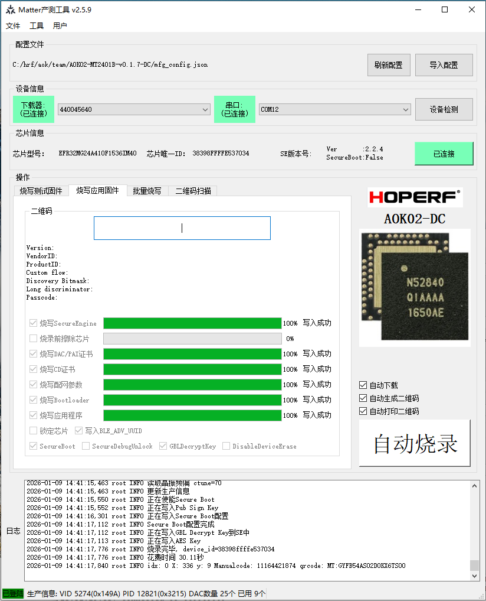

# Link
| 1 | 2 | 3 | 4 | 5 | 6 |
| ---- | ---- | ---- | ---- | ---- | ---- |
| [memo](../../l/l/memo.md) |[silabs](./files/silabs/silabs.md)| [w](w.md) |[other](other.md) |

# project
| 1 | 2 | 3 | 4 | 5 | 6 |
| ---- | ---- | ---- | ---- | ---- | ---- |
|[aok](aok.md)|[ez](ez.md)|[pte9](pte9.md)|

# Info
```c
Shenzhen Hope Microelectronics Co., Ltd.
Add:30th floor of 8th Building, C Zone, Vanke Cloud City, Xili Sub-district, Nanshan, Shenzhen, GD, P.R. China
Email: sales@hoperf.com
Post Code: 518052
Tel: +86-755-82973805 / 4001-189-180
Fax: +86-755-82973550
```
# Working Time
```c
http://ai.hoperf.cn
HP1239
Er..1
```

# Tool
[WCH-BLEAnalyzer](https://www.wch.cn/downloads/WCH_BLEAnalyzer_zip.html)

# Compare Filter
```c
*.cpp;*.c;*.h;-.git\;-.pdm\;-.settings\;-.uceditor\;-.vscode\;-GNU ARM v12.2.1 - Default\
```
# git
```c
$ git config --global user.name "suhuide"
$ git config --global user.email suhuide@hoperf.com
```
```c
git config --global alias.diffx 'diff -- ":!.project" ":!.cproject" ":!*.slps" ":!*.pintool" ":!*.html" ":!*.pdm*" ":!*.zap"'
git diff ':!.cproject' ':!*.slps' ':!*.pintool' ':!*.html'
```
```c
git tag
git fetch --tags
git checkout tags/v2.8.0 -f
```
```c
git reset --hard HEAD   # Remove all uncommitted changes
git switch -            # Return to the previous branch
git checkout -          # Return to the previous branch
git branch -r           # Check remote branches
git branch -a           # Check all branches (local + remote)
git remote -v           # Show all remote repositories' names and URLs
```
## git account
```c
suhuide@hoperf.com
HoefL89736*
```

# Board
```c
WSTK Mainboard (ID: 000440045640)
```
# matter repo
```c
https://hoperf-matter/gitlab/matter
```
```c
git remote add origin https://github.com/user/repo.git
```
# samba
```c
samba: \\hoperf-matter
username: suhuide
password: HA39838M*12
```
## Commander CLI
```c
C:\SiliconLabs\SimplicityStudio\v5>commander security unlock --command-key command_key.pem --unlock-param 1111 --device EFR32MG24A410F1536IM40 -s 602712820
Unlocking with unlock payload:
C:/Users/Administrator/AppData/Local/SiliconLabs/commander/SecurityStore/device_0000000000000000d44867fffe8997ee/challenge_e4e3184d31be0e7428a6d0367269b5f7/unlock_payload_0000000000111110.bin
Secure debug successfully unlocked
DONE
```
```c
commander flash ez01_matter-signed--v0.0.13-2d274330.s37 --device efr32mg24 --no-reset
```
```c
C:\Si\ws\ez01_matter\release-fw\signfw\v0.0.13>commander security status --device efr32mg24
WARNING: DP write failed
DCI communication failed, retrying after reset and 10 ms delay...
Resetting device...
SE Firmware version   : 2.2.5
Serial number         : 0000000000000000d44867fffe8b63ab
Debug lock            : Enabled
Device erase          : Enabled
Secure debug unlock   : Enabled
Tamper status         : OK
Secure boot           : Enabled
Boot status           : 0x20 - OK
Command key installed : True
Sign key installed    : True
DONE
```
```c
//Lunch Console -> Admin
serial vcom config
serial vcom config speed 9600
serial vcom config speed 115200
serial vcom config speed 921600
```


# Debug lock
```c
commander device lock --device EFR32MG24B020F1536IM40
```

# NFC
NFC AES Flash tool
```c
"\\hoperf-matter\MatterShare\AE Team\Projects\PTE9\Release\01-wireless\pte9_wireless_nfc_key_writer.zip"
```
NFC AES Flash method
```c
python3 nfc_key_writer.py --kvn 17 --key_enc "404142434445464748494A4B4C4D4E4F505152535455565758595A5B5C5D5E5F" --key_mac "404142434445464748494A4B4C4D4E4F505152535455565758595A5B5C5D5E5F" --key_dek "404142434445464748494A4B4C4D4E4F505152535455565758595A5B5C5D5E5F"
```

# MFG
```c
username: suhuide
password: +mTvwceVZk
product code: 9323718166
```
```c
matter_mfg_tool_2.5.9\mfg_tool.exe
//Load config
AOK02-MT2401B-v0.1.7-DC\mfg_config.json
```
<div align="center">
  
</div>
