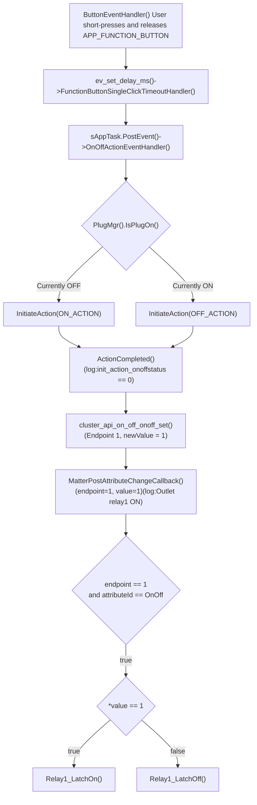

[hrf](hrf.md)  


# PartNo.
```c
HM-MT2401
EFR32MG24A420F1536IM40
```
# QR code
[MT:6FCJ1E.N16LA0648G00](https://project-chip.github.io/connectedhomeip/qrcode.html?data=MT%3A6FCJ1E.N16LA0648G00)  
[MT:4CT9142C00KA0648G](https://project-chip.github.io/connectedhomeip/qrcode.html?data=MT%3A4CT9142C00KA0648G)
# Pin Map
**二位开关**

| 名称 | GPIO   | 功能           |
|------------|--------|----------------|
| SW4        | PA3    | 继电器开关,btn1     |
|            |        |                |
| SW6        | PB0    | 继电器开关,btn3     |
| SW1        | PA4    | 情景开关,btn2       |
|            |        |                |
| SW3        | PA6    | 情景开关,btn4       |
| RELAY1     | PD3    | 磁保持继电器   |
| RELAY2     | PD4    | 磁保持继电器   |
|            |        | 磁保持继电器   |
| RELAY2-EN  | PD1    | 磁保持继电器   |
| ZCD        | PC5    | 过零检测       |
| RD_IN      | PB1    | 雷达检测 IO,btn0    |
| LED_REST   | PC2    | LED 芯片复位   |
| SDA        | PC0    | I2C            |
| SCL        | PC1    | I2C            |

# LED
```c
#define HI3316_ON_LEVEL                  40 //0 to 255
```
```c
S KEY 1 LED bsp_led_onoff(0,1);
S KEY 2 LED bsp_led_onoff(2,1);
```
```c
R KEY 1 LED bsp_led_onoff(3,1);
R KEY 2 LED bsp_led_onoff(5,1);
```
# Bug Fix Request(@20260409)
 - 1, R KEY LED 1, pair status   
 - 2, R KEY LEDs 依relay   
 - 3, LED flash 300ms   
 - 4, PIR 无人检测要延迟30s   

# Relay Control
