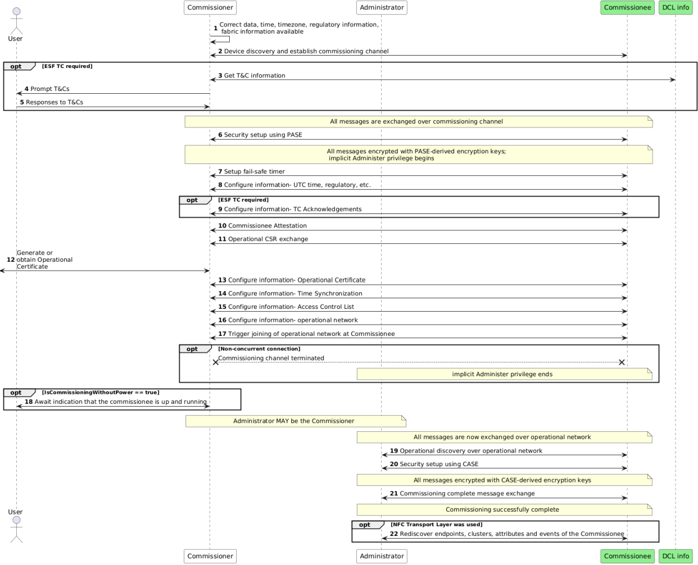

# [DAC](./files/matter/dac.md)  
# Commissioning
## 1. 概述：什么是 Matter 配网？

在Matter协议中，**配网（Commissioning）** 是将一个新的智能设备（如灯泡、插座、传感器）添加到用户智能家居网络（Fabric）中的全过程。它的核心价值在于提供了一种**标准化、安全且跨平台**的设备添加体验。

简单来说，无论用户使用苹果、谷歌、亚马逊还是小米的生态，添加任何经过Matter认证的设备，其核心流程和用户体验都是一致的。用户只需一次配置，新设备就能被家中所有支持Matter的控制器和APP发现和控制。

## 2. 配网第一步：获取设备身份凭证 (Onboarding Payload)

在开始配网之前，控制端（如手机APP）需要先获取设备的“身份证+开锁密码”，这个信息载体被称为**配网载荷（Onboarding Payload）**。

### 2.1 载荷的三种形式

为了让用户在不同场景下都能方便地开始配网，Matter定义了三种常见的载荷形式：

| 形式 | 描述 | 使用场景 |
| :--- | :--- | :--- |
| **二维码 (QR Code)** | 最常用的形式，以 `MT:` 开头，包含加密的设备信息。 | 手机扫码，自动读取信息，快速开始配网。 |
| **手动配对码 (Manual Pairing Code)** | 一串11位或21位的数字，作为二维码的备选方案。 | 设备二维码磨损或位于难以扫码的角落时，手动输入数字。 |
| **NFC 标签** | 设备内置或外贴NFC标签。 | 将支持NFC的手机贴近设备，碰一碰即可读取信息，无需手动操作。 |

### 2.2 载荷中包含的关键信息

无论哪种形式，配网载荷都包含了以下核心信息，它们是后续安全配网的基础：

| 信息 | 说明 | 作用 |
| :--- | :--- | :--- |
| **厂商ID (Vendor ID)** | 标识设备的生产商，如“小米”、“飞利浦”。 | 告诉控制端设备的品牌信息。 |
| **产品ID (Product ID)** | 标识具体的产品型号，如“智能灯泡二代”。 | 帮助控制端识别设备类型和能力。 |
| **鉴别码 (Discriminator)** | 一个用于设备发现的短码。 | 当家中同时有多个新设备待配网时，用于精确匹配目标设备，防止配错。 |
| **密码 (Passcode)** | 一个8位数字的“入网密码”。 | **核心安全凭证**，用于后续的PASE阶段，验证用户对设备的所有权。Matter协议禁止使用如`00000000`、`12345678`等弱密码。 |
| **支持连接方式** | 指示设备支持哪些通信协议进行配网（如BLE、Wi-Fi）。 | 让控制端选择最快、最合适的通信方式与设备建立连接。 |

## 3. 用户视角的四种配网场景

Matter设计了灵活的配网方式，以适应不同用户的使用习惯和物理环境：

1. **扫码/输码入网（最常见）**
   - **场景**：购买新设备，包装或设备本体上有清晰的二维码/配对码。
   - **操作**：在支持Matter的APP中选择“添加设备” -> 扫描二维码或输入手动配对码 -> APP自动发现并完成后续流程。

2. **自动发现入网（无码可用）**
   - **场景**：设备已安装（如天花板内的传感器），二维码无法获取；或二维码已损坏。
   - **操作**：在APP中选择“发现新设备” -> APP扫描周围待配网设备并列出 -> 用户选择自己的设备 -> 根据APP提示，在设备上找到并输入配对码。

3. **已联网设备二次入网（设备重置后）**
   - **场景**：设备之前已入网，但恢复出厂设置后需要重新添加。
   - **操作**：APP搜索已在本地网络但未配置的设备 -> 按照提示让设备再次进入“配网模式”（如长按按钮3秒） -> 输入配对码完成配置。

4. **设备主动寻找控制器（带屏设备专用）**
   - **场景**：设备本身有屏幕和交互界面，如智能电视、带屏智能音箱。
   - **操作**：在设备上进入“网络设置” -> 选择“连接智能家居” -> 设备自动搜索周围的Matter控制器 -> 在设备上选择要连接的控制器并显示配对码 -> 在控制器APP上输入该配对码，完成连接。

## 4. 底层核心技术揭秘

Matter配网流程的标准化和安全性，依赖于一系列精确定义的底层协议和机制。其中，**PASE、ArmFailSafe和CASE**构成了配网的“安全三角”。

### 4.1 PASE_Pake 阶段：建立临时安全通道

- **所处阶段**：配网初期，设备发现和通信连接建立之后。
- **协议定义**：4.14.1 Passcode-Authenticated Session Establishment (PASE)
- **核心目标**：通过**预共享的Passcode**（来自配网载荷）验证控制器对设备的所有权，并建立一个**临时的、加密的**安全通道，用于保护后续的敏感信息交换（如Wi-Fi密码、设备证书）。
- **核心机制**：基于 **Spake2+** 协议（一种Password-Authenticated Key Exchange, PAKE 算法）。
- **关键流程与细节**：
  1. **触发**：控制器与设备建立底层通信（如BLE）后，立即发起PASE握手。
  2. **三步交互**：
     | 步骤 | 消息方向 | 消息内容 | 作用 |
     | :--- | :--- | :--- | :--- |
     | **1** | 控制器 -> 设备 | `PBKDFParamRequest` | 请求安全参数（盐值、迭代次数）。 |
     | | 设备 -> 控制器 | `PBKDFParamResponse` | 返回安全参数，确保密钥派生规则一致。 |
     | **2** | 控制器 -> 设备 | `PASE_Pake1` | 发送Spake2+协议的第一阶段参数（如公钥）。 |
     | | 设备 -> 控制器 | `PASE_Pake2` | 验证请求并返回第二阶段参数。 |
     | **3** | 控制器 -> 设备 | `PASE_Pake3` | 发送最终确认消息，计算会话密钥。 |
     | | 设备 -> 控制器 | `StatusReport` | 验证成功，返回成功状态，**安全通道激活**。 |
  3. **关键约束**：
     - Passcode必须是高强度的随机数，**禁用弱口令**。
     - 整个PASE握手必须在**60秒内**完成，否则会话终止。
  4. **后续衔接**：PASE通道建立后，控制器会立即激活故障安全机制（`ArmFailSafe`），所有后续消息均通过此通道加密传输。

### 4.2 ArmFailSafe 阶段：保障配置过程的可靠性

- **所处阶段**：PASE通道建立后，贯穿整个网络配置和设备认证过程。
- **协议定义**：11.10.7.2 ArmFailSafe (General Commissioning Cluster)
- **核心目标**：充当“事务回滚”机制，确保如果在配网过程中发生任何错误（如网络中断、断电），设备能自动恢复到配网前的初始状态，避免成为“半配置”的不可用设备。
- **关键流程与细节**：
  1. **触发**：
     - PASE通道建立后，设备会自动启动一个 **60秒的默认故障安全计时器**。
     - 控制器必须在此超时前发送 `ArmFailSafe` 命令，将计时器延长至一个更合理的值（如164秒），以完成后续耗时操作（如扫描Wi-Fi网络、连接路由器）。
  2. **核心作用**：
     - **成功**：当控制器最终发送 `CommissioningComplete` 命令时，故障安全计时器被解除，设备**永久保存**所有配置。
     - **失败/超时**：如果计时器超时或配网流程中途失败，设备将**自动擦除**所有临时配置（如Wi-Fi密码、证书），并退回到待配网模式。
  3. **关键约束**：
     - 在网络配置等关键步骤前，必须重新激活`ArmFailSafe`，确保操作的可回滚性。

### 4.3 CASE_Sigma 阶段：建立长期运行安全通道

- **所处阶段**：设备成功加入操作网络（如Wi-Fi）之后，配网流程的尾声。
- **协议定义**：4.14.2 Certificate-Authenticated Session Establishment (CASE)
- **核心目标**：基于**X.509数字证书**实现控制器与设备的双向身份认证，建立一个**长期的、安全的**通信通道。这个通道将取代临时的PASE通道，用于设备日常运行时的所有通信（如发送控制指令、上报状态）。
- **核心机制**：基于 **证书链（Node Operational Certificate, NOC）** 和 **ECDH** 密钥交换算法。
- **关键流程与细节**：
  1. **触发**：设备成功加入操作网络并获得IP地址后，控制器通过“操作发现”机制（如DNS-SD）找到设备，并发起CASE握手。
  2. **三步交互**：
     | 步骤 | 消息方向 | 消息内容 | 作用 |
     | :--- | :--- | :--- | :--- |
     | **1** | 控制器 -> 设备 | `CASE_Sigma1` | 发送自身的Fabric信息和证书片段，请求建立会话。 |
     | | 设备 -> 控制器 | `CASE_Sigma2` | 验证控制器身份合法性，并返回自身的完整NOC证书链。 |
     | **2** | 控制器 -> 设备 | `CASE_Sigma3` | 验证设备证书链（通过信任的根证书），发送最终确认。 |
     | | 设备 -> 控制器 | `StatusReport` | 验证成功，**长期安全通道激活**。 |
  3. **与PASE的核心区别**：
     | 维度 | **PASE_Pake 阶段** | **CASE_Sigma 阶段** |
     | :--- | :--- | :--- |
     | **认证依据** | 预共享 Passcode（你知道什么） | X.509 证书链（你是什么） |
     | **适用阶段** | 配网初始化（设备未入网） | 运行阶段（设备已入网） |
     | **密钥有效期** | 临时（仅配网流程中有效） | 长期（设备在网期间持续有效） |
     | **依赖条件** | Onboarding Payload 中的 Passcode | NOC证书、Fabric信息、操作网络地址 |
     | **核心目标** | 验证所有权，保障配网安全 | 验证身份，保障运行安全 |

## 5. 总结：Matter配网流程全景图

一个完整的Matter配网流程，是上述概念和协议的有机结合：

1. **获取身份**：用户通过**二维码、手动码或NFC**获取设备的 **配网载荷**。
2. **建立连接**：APP（控制器）通过BLE等方式与设备建立初步通信。
3. **PASE阶段**：利用载荷中的**Passcode**，通过 **PASE_Pake** 握手，建立一个临时的、加密的安全通道。同时激活 **ArmFailSafe** 故障安全机制。
4. **网络配置**：通过加密的PASE通道，将用户的Wi-Fi密码等网络凭证安全地发送给设备。此过程受`ArmFailSafe`保护。
5. **身份配置**：控制器为设备颁发**操作证书（NOC）**，设备加入用户的Fabric。
6. **CASE阶段**：设备成功连接网络后，控制器通过 **CASE_Sigma** 握手，基于证书建立长期的、安全的运行通道。
7. **配网完成**：发送 `CommissioningComplete` 命令，解除`ArmFailSafe`，设备正式进入运行状态。

这一套精密的流程设计，确保了Matter设备从开箱到日常使用的整个过程，既对用户友好易用，又在底层拥有银行级的安全性。

# 5 Flowchart on Spec

  

  

# 6 [Flowchart](./files/matter/flowchart.md)  
## [commissioning-mcu](./files/matter/commissioning-mcu.md)
## [commissioning-raspi](./files/matter/commissioning-raspi.md)
## [commissioning-log-parse](./files/matter/commissioning-log-parse.md)
