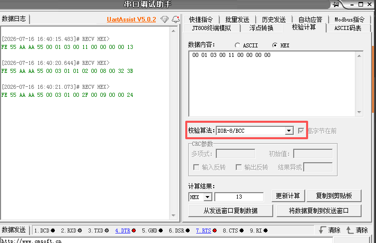

# [Protocol](./files/zh/protocol.md)

# QR code

[MT:K2CA0WSC00E5BZ4L410](https://project-chip.github.io/connectedhomeip/qrcode.html?data=MT%3AK2CA0WSC00E5BZ4L410)  
[MT:K2CA0WSC00ICQ32W020](https://project-chip.github.io/connectedhomeip/qrcode.html?data=MT%3AK2CA0WSC00ICQ32W020)  
[MT:K2CA0AFT02ECLI5SX00](https://project-chip.github.io/connectedhomeip/qrcode.html?data=MT%3AK2CA0AFT02ECLI5SX00)  
[MT:K2CA023L016YV.33U10](https://project-chip.github.io/connectedhomeip/qrcode.html?data=MT%3AK2CA023L016YV.33U10)  
[MT:K2CA0IR.03P6D106M00](https://project-chip.github.io/connectedhomeip/qrcode.html?data=MT%3AK2CA0IR.03P6D106M00)  
[MT:K2CA0C0X17WPIP5-P10](https://project-chip.github.io/connectedhomeip/qrcode.html?data=MT%3AK2CA0C0X17WPIP5-P10)  

# RGBCW 配置
|通道 |引脚(ZH Demo) |引脚(2401B) |定时器 |组件|
|---|---|---|---|---|
|Red   | PC04 | PA04 |TIMER0 CC0 |simple_rgb_pwm_led instance rgb|
|Green | PC05 | PD02 |TIMER0 CC1 |↑|
|Blue  | PC03 | PB00 |TIMER0 CC2 |↑|
|Cold  | PC06 | PA08 |TIMER1 CC0 |无组件，hal_light.c 直驱|
|Warm  | PC07 | PD03 |TIMER1 CC1 |↑|

```c
    // --- Hardware diagnostic: toggle PA08 & PD03 to verify LED connections ---
    // If CW LEDs blink 3 times during boot, hardware wiring is OK.
    // Remove this block after confirmation.
    {
        volatile uint32_t d;
        for (int i = 0; i < 3; i++) {
            GPIO_PinOutSet(HAL_LIGHT_CW_COLD_PORT, HAL_LIGHT_CW_COLD_PIN);
            GPIO_PinOutSet(HAL_LIGHT_CW_WARM_PORT, HAL_LIGHT_CW_WARM_PIN);
            for (d = 0; d < 8000000; d++) { __asm volatile("nop"); }
            GPIO_PinOutClear(HAL_LIGHT_CW_COLD_PORT, HAL_LIGHT_CW_COLD_PIN);
            GPIO_PinOutClear(HAL_LIGHT_CW_WARM_PORT, HAL_LIGHT_CW_WARM_PIN);
            for (d = 0; d < 8000000; d++) { __asm volatile("nop"); }
        }
    }
```    
```c
   // Init CW manually on TIMER1
    cw_pwm_init();

    // --- PWM diagnostic: blink CW LEDs 3 times via PWM ---
    // If CW LEDs blink 3 times with visible fade, full PWM path is OK.
    // Remove this block after confirmation.
    {
        volatile uint32_t d;
        hal_light_start_cw();
        for (int i = 0; i < 3; i++) {
            hal_light_set_cw(HAL_LIGHT_CW_RESOLUTION / 2, HAL_LIGHT_CW_RESOLUTION / 2);
            for (d = 0; d < 8000000; d++) { __asm volatile("nop"); }
            hal_light_set_cw(0, 0);
            for (d = 0; d < 8000000; d++) { __asm volatile("nop"); }
        }
        hal_light_stop_cw();
    }
```    

## LED 亮度 Level 恢复

SDK 内置 `temporaryCurrentLevelCache` 在 OFF→ON 时自动恢复上次亮度，前提是 `OnLevel` 为 Null。

**三处关键代码**（`app_colorlight_mgr.cpp`）：

```cpp
// 1. 回调空函数 — 不写 OnLevel，避免 subscription report 覆盖 NVM
void level_control_on_level_changed(endpoint_id, new_level) {
    (void)endpoint_id; (void)new_level;
}

// 2. Init() 中清 NVM 残留 OnLevel
LevelControl::Attributes::OnLevel::Set(m_ep, app::DataModel::Nullable<uint8_t>());

// 3. ON handler 读 CurrentLevel — SDK OnOff handler 先恢复 Level 再触发回调
LevelControl::Attributes::CurrentLevel::Get(m_ep, curLevel);
```

## 渐变引擎 (`src/app/app_light_transition.*`)

5ms 定时器驱动的插值引擎。文件清单：

- `app_light_transition.h/c` — 引擎核心（`lt_init/start/stop/tick`，5通道，自动停旧开新）
- `app_light_transition_ease.h` — 缓动函数（linear, quad-in/out/in-out）
- `app_light_transition_color.h/c` — 色彩插值（XY/CT/Hue锥形渐变/Level）

**Key behavior**: `lt_start()` 自动 `lt_stop()` 停旧渐变再开新，确保滑块连续响应不丢帧。
**UART策略**: 渐变过程中只写 PWM 不发 UART，渐变完成后 `_transition_flush_uart()` 一次性发送。
**模式切换**: CT↔RGB 走 `hal_light_stop_old + lt_stop + lt_clear_current + lt_set_current`，不走渐变。

## RGB 缓存

`m_cached_r/g/b` 记录最近调色的 RGB。开灯优先用缓存，避免 HSV→XY→RGB 往返在高饱和色上的色度丢失。

# Checksum

<div align="center">
  
</div>

```c
uint8_t SPProtocol::check_sum_buffer(const uint8_t * buf, uint16_t size)
{
    uint8_t temp = 0;
    for (uint16_t i = 0; i < size; ++i) {
        #if 1
        temp ^= buf[i];
        #else
        temp += buf[i];
        #endif
    }

    return temp;
}
```
```c
    //...
    } else if (cur_idx == (rx_payload_size + SP_HEAD_SIZE)) { // checksum
        rx_buffer[cur_idx++] = data;

        #if 1
        {
            uint8_t buf1[] = {0x55, 0xAA, 0xAA, 0x55, 0x00, 0x01, 0x03, 0x00, 0x11, 0x00, 0x00, 0x00, 0x00};
            uint8_t sum = 0;
            for (size_t i = 0; i < sizeof(buf1); i++) sum ^= buf1[i];
            SP_LOG("eric,xor sum1 =0x%02X", sum);
            sum = check_sum_buffer(buf1, sizeof(buf1));
            SP_LOG("eric,xor sum1 =0x%02X", sum);
        }
        {
            uint8_t buf2[] = {0x55, 0xAA, 0xAA, 0x55, 0x00, 0x03, 0x01, 0x01, 0x02, 0x00, 0x08, 0x00, 0x32};
            uint8_t sum = 0;
            for (size_t i = 0; i < sizeof(buf2); i++) sum ^= buf2[i];
            SP_LOG("eric,xor sum2 =0x%02X", sum);
            sum = check_sum_buffer(buf2, sizeof(buf2));
            SP_LOG("eric,xor sum2 =0x%02X", sum);
        }
        {
            uint8_t buf3[] = {0x55, 0xAA, 0xAA, 0x55, 0x00, 0x03, 0x01, 0x00, 0x2F, 0x00, 0x09, 0x00, 0x00};
            uint8_t sum = 0;
            for (size_t i = 0; i < sizeof(buf3); i++) sum ^= buf3[i];
            SP_LOG("eric,xor sum3 =0x%02X", sum);
            sum = check_sum_buffer(buf3, sizeof(buf3));
            SP_LOG("eric,xor sum3 =0x%02X", sum);
        }
        #endif

        // checksum
        uint8_t checksum_value = check_sum_buffer(rx_buffer, cur_idx - 1);
        // Debug
        #if 1
        if (checksum_value != rx_buffer[cur_idx - 1]) {
            // checksum error
            SP_LOG("Error: checksum 0x%x != 0x%x\n", checksum_value, rx_buffer[cur_idx - 1]);
            cur_idx = 0;
            return FRAME_STATUS_ERR;
        }
        #endif
        sp_frame_t frame;
        memset(frame.payload, 0, sizeof(frame.payload));
        frame.sn           = get_uint16_from_network(&rx_buffer[5]);
        frame.type         = static_cast<msg_type_t>(rx_buffer[7]);
        frame.payload_size = rx_payload_size;
        if (frame.payload_size) {
            memcpy(frame.payload, &rx_buffer[SP_HEAD_SIZE], frame.payload_size);
        }

        LOG_API_HEX("MATTER RX", rx_buffer, cur_idx);
        recv_frame_cb(&frame);

        cur_idx = 0;
        return FRAME_STATUS_READY;
    } else {
        rx_buffer[cur_idx++] = data;
    }
    //...
```
```c
[10:42:41.690]  [00:00:12.115][silabs ]eric,xor sum1 =0x13
[10:42:41.690]  [00:00:12.116][silabs ]eric,xor sum1 =0x13
[10:42:41.690]  [00:00:12.116][silabs ]eric,xor sum2 =0x3B
[10:42:41.692]  [00:00:12.116][silabs ]eric,xor sum2 =0x3B
[10:42:41.692]  [00:00:12.116][silabs ]eric,xor sum3 =0x24
```